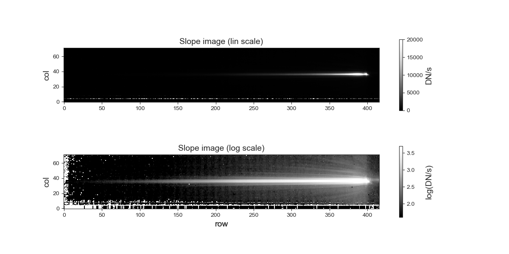
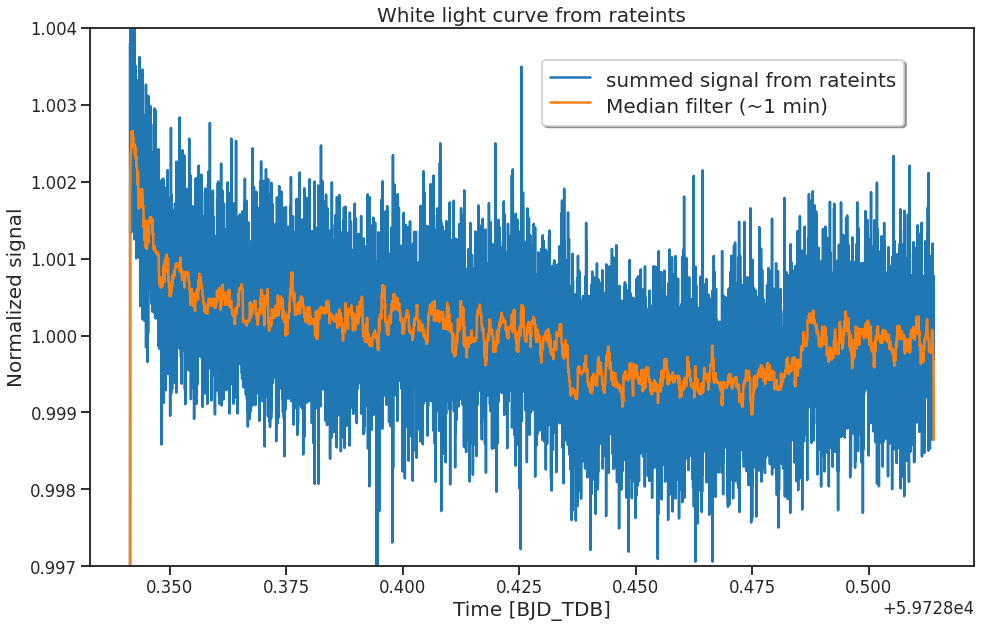
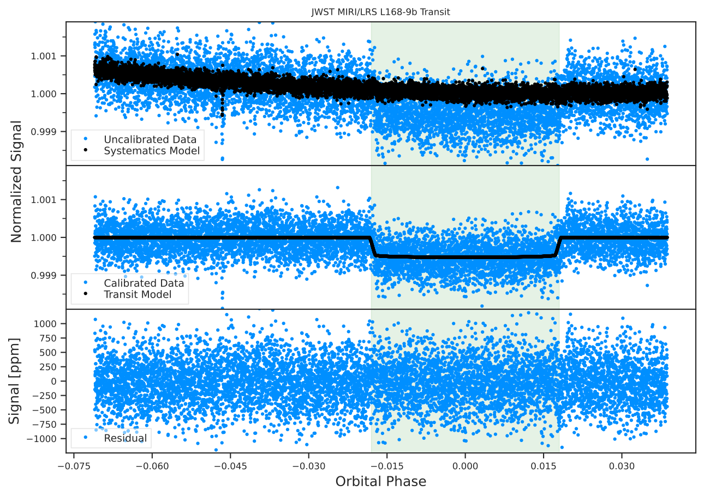
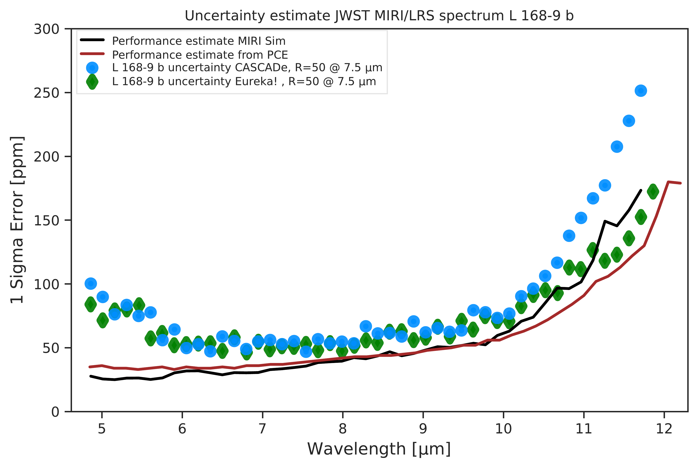

$\newcommand{\ensuremath}{}$
$\newcommand{\xspace}{}$
$\newcommand{\object}[1]{\texttt{#1}}$
$\newcommand{\farcs}{{.}''}$
$\newcommand{\farcm}{{.}'}$
$\newcommand{\arcsec}{''}$
$\newcommand{\arcmin}{'}$
$\newcommand{\ion}[2]{#1#2}$
$\newcommand{\textsc}[1]{\textrm{#1}}$
$\newcommand{\hl}[1]{\textrm{#1}}$
$\newcommand{\vdag}{(v)^\dagger}$
$\newcommand$
$\newcommand$
$\newcommand$
$\newcommand$

$\newcommand{$\ensuremath$}{}$
$\newcommand{$\xspace$}{}$
$\newcommand{$\object$}[1]{\texttt{#1}}$
$\newcommand{$\farcs$}{{.}''}$
$\newcommand{$\farcm$}{{.}'}$
$\newcommand{$\arcsec$}{''}$
$\newcommand{$\arcmin$}{'}$
$\newcommand{$\ion$}[2]{#1#2}$
$\newcommand{$\textsc$}[1]{\textrm{#1}}$
$\newcommand{$\hl$}[1]{\textrm{#1}}$
$\newcommand{$\vdag$}{(v)^\dagger}$
$\newcommand$
$\newcommand$
$\newcommand$
$\newcommand$

# Spectroscopic time series performance of the Mid-Infrared Instrument on the JWST

<mark>Appeared on: 2022-11-30</mark> - _Submitted for review to PASP_

<mark>Jeroen Bouwman</mark>, et al. -- incl., <mark>Thomas P. Greene</mark>, <mark>J\"{u}rgen Schreiber</mark>, <mark>Silvia Scheithauer</mark>, <mark>Michael Mueller</mark>

**Abstract:** We present here the first ever mid-infrared spectroscopic time series observation of the transiting exoplanet$\object${L 168-9 b}with the Mid-Infrared Instrument (MIRI) on the James Webb Space Telescope. The data were obtained as part of the MIRI commissioning activities, to characterize the performance of the Low Resolution Spectroscopy (LRS) mode for these challenging observations. To assess the MIRI LRS performance, we performed two independent analyses of the data. We find that with a single transit observation we reached a spectro-photometric precision of$\sim$50 ppm in the 7-8\micronrange at R=50, consistent with$\sim$25 ppm systematic noise. The derived band averaged transit depth is 524$\pm$15 ppm and 547$\pm$13 ppm for the two applied analysis methods, respectively, recovering the known transit depth to within 1$\sigma$. The measured noise in the planet's transmission spectrum is approximately 15-20\%higher than random noise simulations over wavelengths$6.8 \lesssim \lambda \lesssim 11$$\mu$m. We observed an excess noise at shorter wavelengths, for which possible causes are discussed. This performance was achieved with limited in-flight calibration data, demonstrating the future potential of MIRI for the characterization of exoplanet atmospheres.

**Figure 2. -** Level 2a calibrated spectral images and band averaged light curve of the $\object${L 168-9} system. The images are rotated by 90 degrees for display purposes and the spectra are shown in the full SLITLESSPRISM subarray, which measures 416 rows $\times$ 72 columns on the detector. In this orientation, the wavelength increases from right to left. The images were generated from the seg-002 \texttt{rateints} file, which is one of 5 segments that make up the exposure. Both images show the same spectral image: (top) with a linear scaling; and (bottom) with a log scaling and limits adjusted to bring out the complex diffraction patterns and scattered light seen at the short wavelengths. The normalized lightcurve is obtained by summing the signal seen in the spectral images between detector rows 230 to 380 and detector columns 20 to 51 and dividing the total signal per integration by the averages signal in time. Even in this very basic calibrated data the planetary transit can be clearly observed. (*fig:rateints_ims*)

**Figure 4. -** \texttt{CASCADe}'s white-light (4.85--11.85 $\mu$m) light curve analysis.  The top panel shows the uncalibrated white light curve (blue data points) together with the fitted band averaged systematics model (black data points). The middle panel show the calibrated data together with the fitted light curve model. The lower panel shows the residuals from subtracting the lightcurve model from the calibrated time series data.  In the analysis the first 30 minutes of the observations have been omitted as they sow the strongest response drifts (which can be seen in Figure \ref{fig:rateints_ims}).
\label{fig:fig_LC} (*fig:fig_LC*)

**Figure 9. -** Noise estimates of the transit spectrum of L 168-9 b. The blue dots show \texttt{CASCADe}'s noise estimate while the green routs show \texttt{Eureka!}'s 1 $\sigma$ uncertainty estimate. The red curve shows the expected noise limit for this observations using a scaled photon conversion efficiency \citep[][see paragraph \ref{sec:analysis}]{2015ApJ...805...23C}. The black curve shows the estimated noise limit using MIRISim \citep{mirisim} and the in orbit determined \texttt{PHOTOM} and wavelength calibrating files (see also section \ref{sec:analysis}).
\label{fig:fig_error_analysis} (*fig:fig_error_analysis*)

