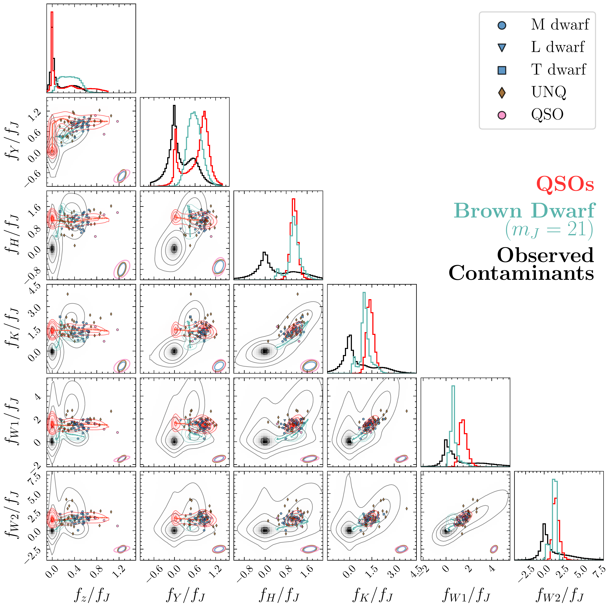
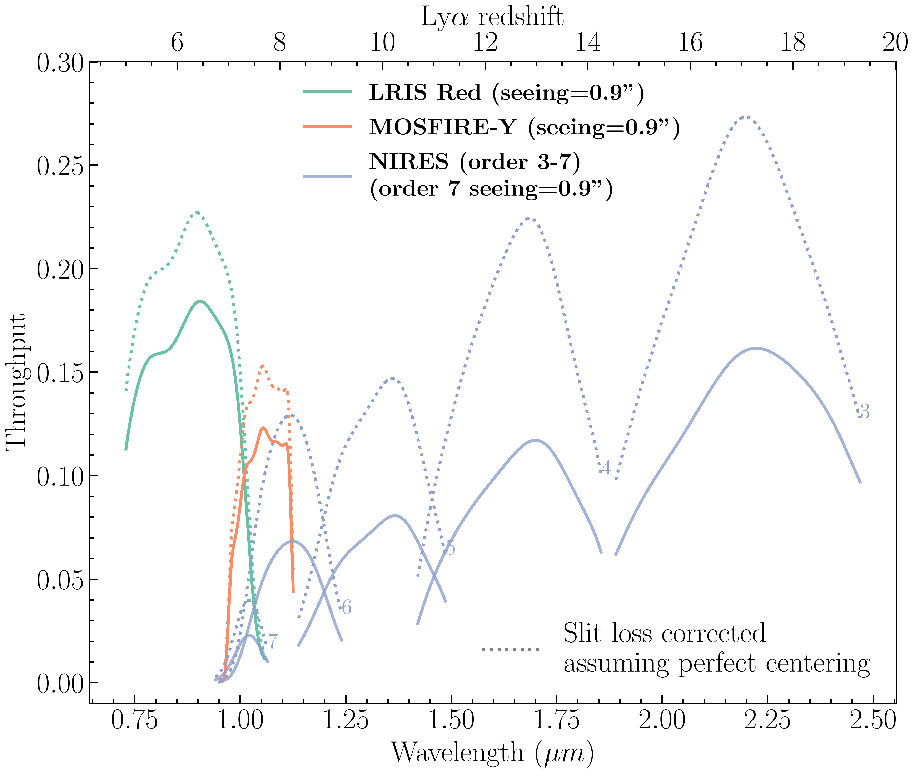
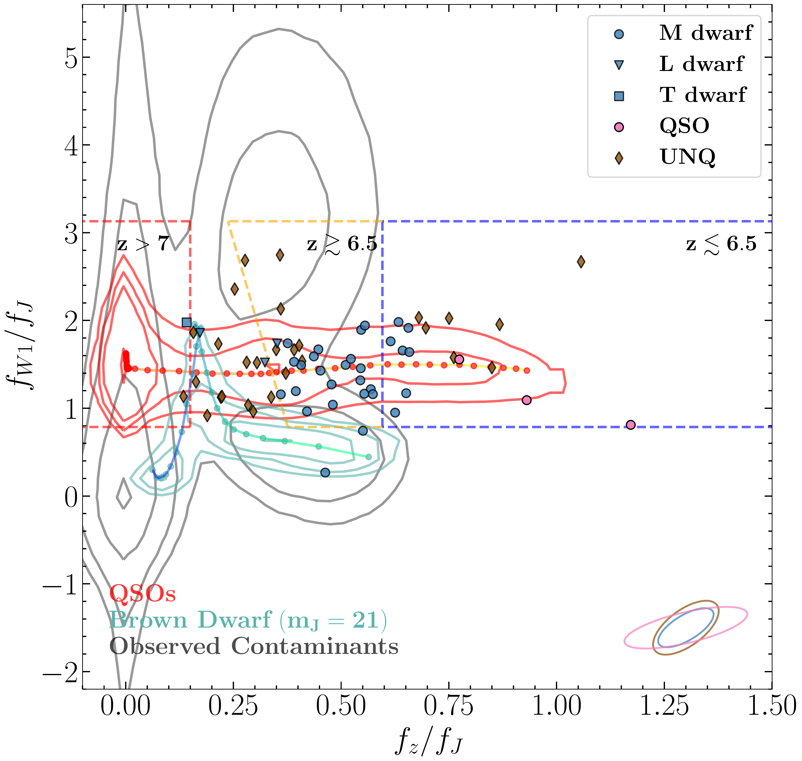
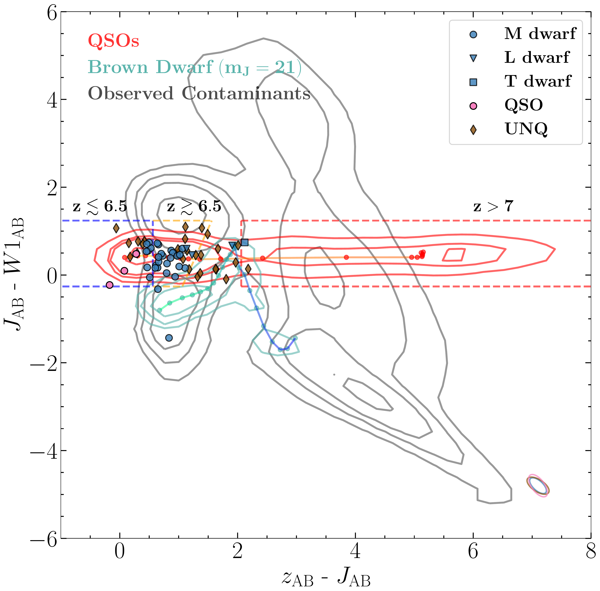
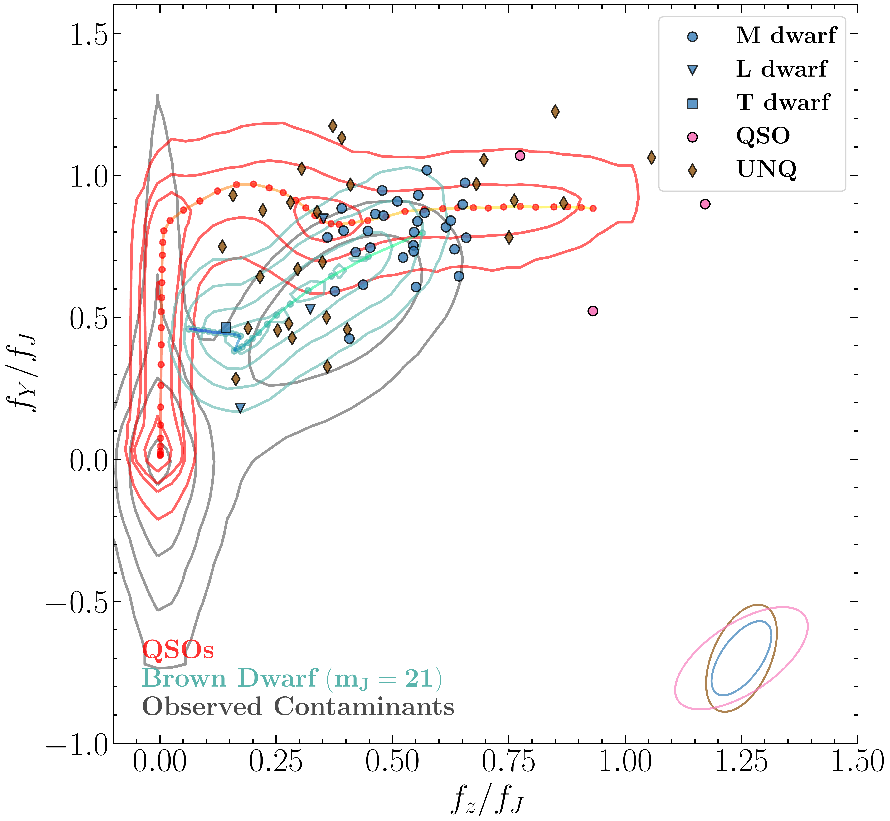
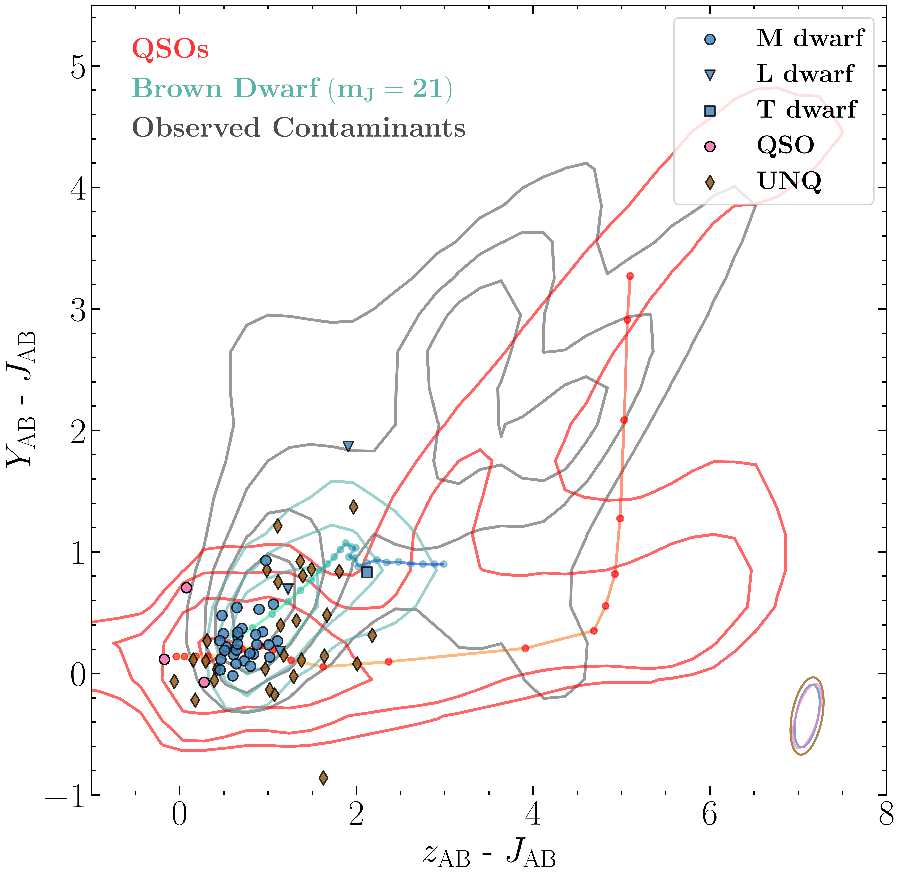
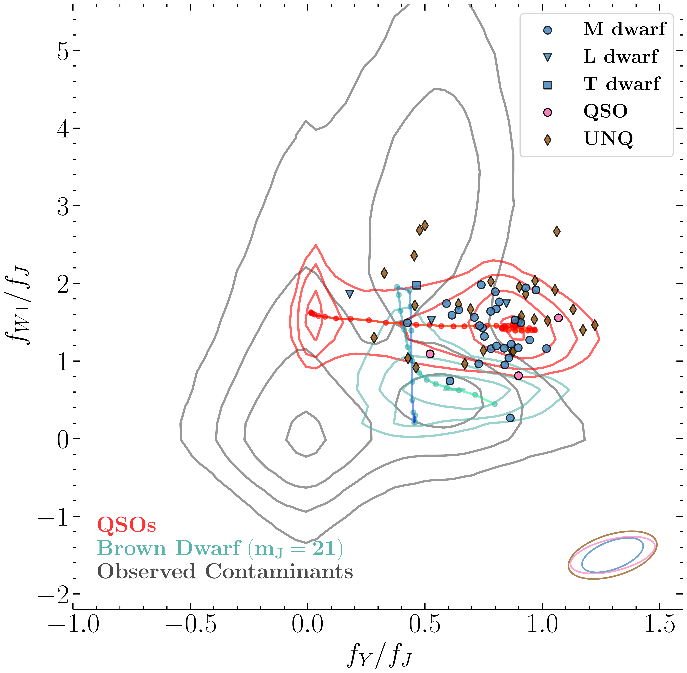
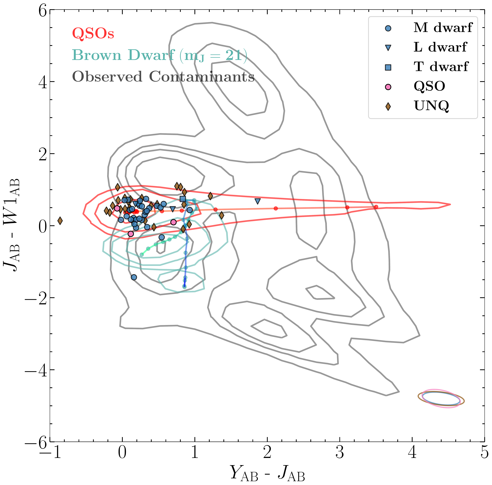

$\newcommand{\ensuremath}{}$
$\newcommand{\xspace}{}$
$\newcommand{\object}[1]{\texttt{#1}}$
$\newcommand{\farcs}{{.}''}$
$\newcommand{\farcm}{{.}'}$
$\newcommand{\arcsec}{''}$
$\newcommand{\arcmin}{'}$
$\newcommand{\ion}[2]{#1#2}$
$\newcommand{\textsc}[1]{\textrm{#1}}$
$\newcommand{\hl}[1]{\textrm{#1}}$
$\newcommand{\angstrom}{\textup{\AA}}$
$\newcommand{\thebibliography}{\DeclareRobustCommand{\VAN}[3]{##3}\VANthebibliography}$

$\newcommand{$\ensuremath$}{}$
$\newcommand{$\xspace$}{}$
$\newcommand{$\object$}[1]{\texttt{#1}}$
$\newcommand{$\farcs$}{{.}''}$
$\newcommand{$\farcm$}{{.}'}$
$\newcommand{$\arcsec$}{''}$
$\newcommand{$\arcmin$}{'}$
$\newcommand{$\ion$}[2]{#1#2}$
$\newcommand{$\textsc$}[1]{\textrm{#1}}$
$\newcommand{$\hl$}[1]{\textrm{#1}}$
$\newcommand{$\angstrom$}{\textup{\AA}}$
$\newcommand{$\thebibliography$}{\DeclareRobustCommand{\VAN}[3]{##3}\VANthebibliography}$

#  Quasar Candidate Archive: A Spectroscopic Catalog of Quasars and Contaminants in Various Quasar Searches

<mark>Appeared on: 2022-12-01</mark> - _28 pages, 26 figures, 4 tables_

Da-Ming Yang, et al. -- incl., <mark><mark>Joseph F. Hennawi</mark></mark>

**Abstract:** We present the high-$z$quasar candidate archive (HzQCA), summarizing the spectroscopic observations of 174$z\gtrsim5$quasar candidates using Keck/LRIS, Keck/MOSFIRE, and Keck/NIRES. We identify 7 candidates as$z\sim 6$quasars 3 of them newly reported here, and 51 candidates as brown dwarfs. In the remaining sources, 74 candidates are unlikely to be quasars; 2 sources are inconclusive; the others could not be fully reduced or extracted. Based on the classifications we investigate the distributions of quasars and contaminants in color space with photometry measurements from DELS ($z$), VIKING/UKIDSS ($YJHK_s$/$YJHK$), and un\textit{WISE}($W1W2$). We find that the identified brown dwarfs are not fully consistent with the empirical brown dwarf model that is commonly used in quasar candidate selection methods. To refine spectroscopic confirmation strategies, we simulate synthetic spectroscopy of high-$z$quasars and contaminants for all three instruments. The simulations utilize the spectroscopic data in HzQCA. We predict the required exposure times for quasar confirmation and propose and optimal strategy for spectroscopic follow-up observations. For example, we demonstrate that we can identify a$m_J=21.5$at$z=7.6$or a$m_J=23.0$at$z=7.0$within 15 min of exposure time with LRIS. With the publication of the HzQCA we aim to provide guidance for future quasar surveys and candidate classification.

**Figure 9. -** The complete relative flux diagrams. The filled symbols are the sources in the archive, including QSO (pink), STAR (blue) and UNQ (brown) types objects. The red contour is the density of 440,000 simulated $6\leq z\leq 8$ quasars generated with \texttt{simqso}. The cyan contour is the density of 100,000 synthetic brown dwarfs, generated from convolving the empirical brown dwarf colors in \protect\cite{Skrzypek2015} and the measurement errors, following the noise modeling procedures described in \protect\cite{Nanni2022}. The grey contour is the density of the contaminants used to train the contaminant model in XDHZQSO searches (see Section \ref{sec:VIK+UKI}). The levels of the contours are 11.75\%, 39.35\%, 67.53\%, and 86.47\%. (*fig:flux_ratio_corner*)

**Figure 1. -** The solid lines are throughput curves of the three spectrometers, corresponding to an 0$\farcs$9 seeing for LRIS, MOSFIRE, and order 7 of NIRES. The throughput of LRIS was originally measured with an 1$\arcsec$ slit width in LRIS-2203 run, with a seeing of 0$\farcs$74. The MOSFIRE Y-band throughput was obtained with a 1$\arcsec$ slit width and a 0$\farcs$76 seeing in MOSFIRE-2201 run. The NIRES throughput here was measured with a 0$\farcs$55 slit width in NIRES-1905 run with a seeing of 0$\farcs$9 in the order 7. The LRIS and MOSFIRE throughput curves are then scaled to a seeing of 0$\farcs$9. The dotted lines are throughput curves corrected for the slit loss, assuming a perfect centering of the star on the slit. The upper axis shows the corresponding Ly$\alpha$($1216$$\angstrom$) redshift of high-$z$ quasars that they can reach. For all instruments the throughput curves are determined from observation of the standard star GD153. (*fig:throughput*)

**Figure 8. -** (Left panels) The relative flux diagrams. The filled symbols are the sources in the HzQCA, including QSO (pink), STAR (blue) and UNQ (brown) types objects. The red contour is the density of 440,000 simulated $6\leq z\leq 8$ quasars generated with \texttt{simqso}. The cyan contour is the density of 100,000 synthetic brown dwarfs, generated from convolving the empirical brown dwarf colors in \protect\cite{Skrzypek2015} and the measurement errors, following the noise modeling procedures described in \protect\cite{Nanni2022}. The cyan line in it indicates different spectral types. The green end of this track is M5 type, while the blue end is the T8 type. The grey contour is the density of the contaminants used to train the contaminant model in XDHZQSO searches (see Section \ref{sec:VIK+UKI}). The dashed lines in the upper panels are the color selection cuts from \protect\cite{Wang2017}. (Right panels) Corresponding color-color diagrams. The levels of the contours are 11.75\%, 39.35\%, 67.53\%, and 86.47\%. (*fig:flux_ratio*)

