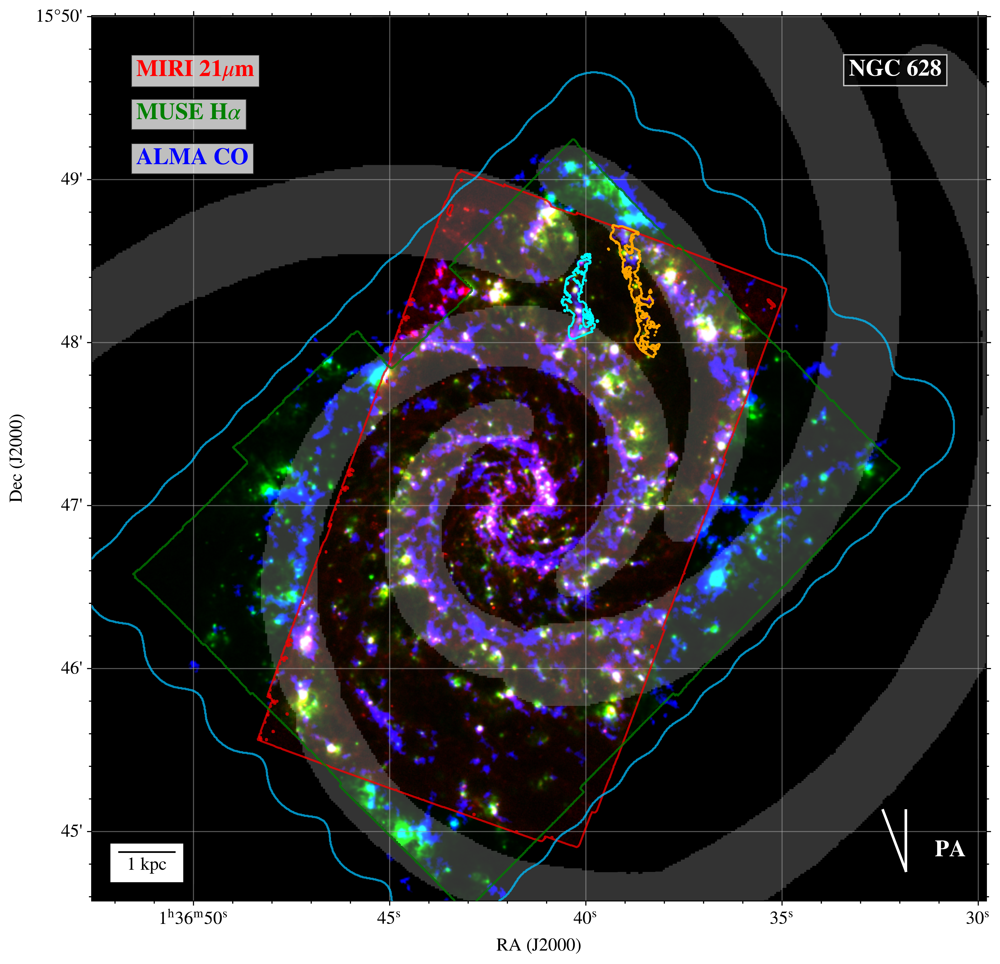
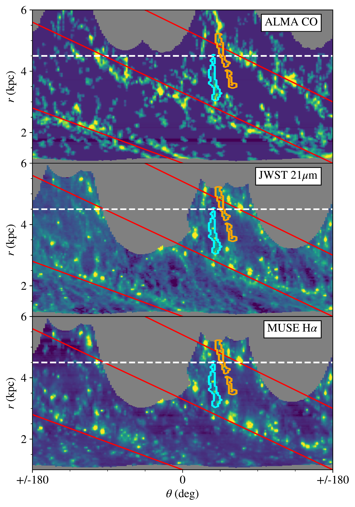
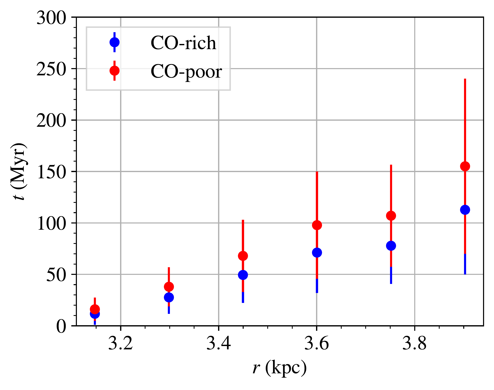

$\newcommand{\ensuremath}{}$
$\newcommand{\xspace}{}$
$\newcommand{\object}[1]{\texttt{#1}}$
$\newcommand{\farcs}{{.}''}$
$\newcommand{\farcm}{{.}'}$
$\newcommand{\arcsec}{''}$
$\newcommand{\arcmin}{'}$
$\newcommand{\ion}[2]{#1#2}$
$\newcommand{\textsc}[1]{\textrm{#1}}$
$\newcommand{\hl}[1]{\textrm{#1}}$
$\newcommand{\vdag}{(v)^\dagger}$
$\newcommand$
$\newcommand$
$\newcommand{\mpia}{Max-Planck-Institut f\"{u}r Astronomie, K\"{o}nigstuhl 17, D-69117, Heidelberg, Germany}$
$\newcommand{\oxford}{Sub-department of Astrophysics, Department of Physics, University of Oxford, Keble Road, Oxford OX1 3RH, UK}$
$\newcommand{\mcmaster}{Department of Physics and Astronomy, McMaster University, Hamilton, ON L8S 4M1, Canada}$
$\newcommand{\cita}{Canadian Institute for Theoretical Astrophysics (CITA), University of Toronto, 60 St George Street, Toronto, ON M5S 3H8, Canada}$
$\newcommand{\ghent}{Sterrenkundig Observatorium, Universiteit Gent, Krijgslaan 281 S9, B-9000 Gent, Belgium}$
$\newcommand{\oan}{Observatorio Astronómico Nacional (IGN), C/Alfonso XII, 3, E-28014 Madrid, Spain}$
$\newcommand{\ari}{Astronomisches Rechen-Institut, Zentrum f\"{u}r Astronomie der Universit\"{a}t Heidelberg, M\"{o}nchhofstra\ss e 12-14, D-69120 Heidelberg, Germany}$
$\newcommand{\anu}{Research School of Astronomy and Astrophysics, Australian National University, Canberra, ACT 2611, Australia}$
$\newcommand{\ita}{Universit\"{a}t Heidelberg, Zentrum f\"{u}r Astronomie, Institut f\"{u}r theoretische Astrophysik, Albert-Ueberle-Str. 2, 69120 Heidelberg, Germany}$
$\newcommand{\mpe}{Max-Planck-Institut f\"{u}r extraterrestrische Physik, Giessenbachstra{\ss}e 1, D-85748 Garching, Germany}$
$\newcommand{\cool}{Cosmic Origins Of Life (COOL) Research DAO, coolresearch.io}$
$\newcommand{\manch}{Jodrell Bank Centre for Astrophysics, Department of Physics and Astronomy, University of Manchester, Oxford Road, Manchester M13 9PL, UK}$
$\newcommand{\eso}{European Southern Observatory, Karl-Schwarzschild-Stra{\ss}e 2, 85748 Garching, Germany}$
$\newcommand{\cral}{Univ Lyon, Univ Lyon1, ENS de Lyon, CNRS, Centre de Recherche Astrophysique de Lyon UMR5574, F-69230 Saint-Genis-Laval France}$
$\newcommand{\cfa}{Center for Astrophysics, Harvard \& Smithsonian, 60 Garden St, Cambridge, MA, United States}$
$\newcommand{\CCAPP}{Center for Cosmology and Astroparticle Physics, 191 West Woodruff Avenue, Columbus, OH 43210, USA}$
$\newcommand{\OSU}{Department of Astronomy, The Ohio State University, 140 West 18th Avenue, Columbus, Ohio 43210, USA}$
$\newcommand{\iwr}{Universit\"{a}t Heidelberg, Interdisziplin\"{a}res Zentrum f\"{u}r Wissenschaftliches Rechnen, Im Neuenheimer Feld 205, D-69120 Heidelberg, Germany}$
$\newcommand{\UBonn}{Argelander-Institut f\"{u}r Astronomie, Universit\"{a}t Bonn, Auf dem H\"{u}gel 71, 53121, Bonn, Germany}$
$\newcommand{\stsci}{Space Telescope Science Institute, 3700 San Martin Drive, Baltimore, MD, USA}$

$\newcommand{$\ensuremath$}{}$
$\newcommand{$\xspace$}{}$
$\newcommand{$\object$}[1]{\texttt{#1}}$
$\newcommand{$\farcs$}{{.}''}$
$\newcommand{$\farcm$}{{.}'}$
$\newcommand{$\arcsec$}{''}$
$\newcommand{$\arcmin$}{'}$
$\newcommand{$\ion$}[2]{#1#2}$
$\newcommand{$\textsc$}[1]{\textrm{#1}}$
$\newcommand{$\hl$}[1]{\textrm{#1}}$
$\newcommand{$\vdag$}{(v)^\dagger}$
$\newcommand$
$\newcommand$
$\newcommand{$\mpia$}{Max-Planck-Institut f\"{u}r Astronomie, K\"{o}nigstuhl 17, D-69117, Heidelberg, Germany}$
$\newcommand{$\oxford$}{Sub-department of Astrophysics, Department of Physics, University of Oxford, Keble Road, Oxford OX1 3RH, UK}$
$\newcommand{$\mcmaster$}{Department of Physics and Astronomy, McMaster University, Hamilton, ON L8S 4M1, Canada}$
$\newcommand{$\cita$}{Canadian Institute for Theoretical Astrophysics (CITA), University of Toronto, 60 St George Street, Toronto, ON M5S 3H8, Canada}$
$\newcommand{$\ghent$}{Sterrenkundig Observatorium, Universiteit Gent, Krijgslaan 281 S9, B-9000 Gent, Belgium}$
$\newcommand{$\oan$}{Observatorio Astronómico Nacional (IGN), C/Alfonso XII, 3, E-28014 Madrid, Spain}$
$\newcommand{$\ari$}{Astronomisches Rechen-Institut, Zentrum f\"{u}r Astronomie der Universit\"{a}t Heidelberg, M\"{o}nchhofstra\ss e 12-14, D-69120 Heidelberg, Germany}$
$\newcommand{$\anu$}{Research School of Astronomy and Astrophysics, Australian National University, Canberra, ACT 2611, Australia}$
$\newcommand{$\ita$}{Universit\"{a}t Heidelberg, Zentrum f\"{u}r Astronomie, Institut f\"{u}r theoretische Astrophysik, Albert-Ueberle-Str. 2, 69120 Heidelberg, Germany}$
$\newcommand{$\mpe$}{Max-Planck-Institut f\"{u}r extraterrestrische Physik, Giessenbachstra{\ss}e 1, D-85748 Garching, Germany}$
$\newcommand{$\cool$}{Cosmic Origins Of Life (COOL) Research DAO, coolresearch.io}$
$\newcommand{$\manch$}{Jodrell Bank Centre for Astrophysics, Department of Physics and Astronomy, University of Manchester, Oxford Road, Manchester M13 9PL, UK}$
$\newcommand{$\eso$}{European Southern Observatory, Karl-Schwarzschild-Stra{\ss}e 2, 85748 Garching, Germany}$
$\newcommand{$\cral$}{Univ Lyon, Univ Lyon1, ENS de Lyon, CNRS, Centre de Recherche Astrophysique de Lyon UMR5574, F-69230 Saint-Genis-Laval France}$
$\newcommand{$\cfa$}{Center for Astrophysics, Harvard \& Smithsonian, 60 Garden St, Cambridge, MA, United States}$
$\newcommand{$\CCAPP$}{Center for Cosmology and Astroparticle Physics, 191 West Woodruff Avenue, Columbus, OH 43210, USA}$
$\newcommand{$\OSU$}{Department of Astronomy, The Ohio State University, 140 West 18th Avenue, Columbus, Ohio 43210, USA}$
$\newcommand{$\iwr$}{Universit\"{a}t Heidelberg, Interdisziplin\"{a}res Zentrum f\"{u}r Wissenschaftliches Rechnen, Im Neuenheimer Feld 205, D-69120 Heidelberg, Germany}$
$\newcommand{$\UBonn$}{Argelander-Institut f\"{u}r Astronomie, Universit\"{a}t Bonn, Auf dem H\"{u}gel 71, 53121, Bonn, Germany}$
$\newcommand{$\stsci$}{Space Telescope Science Institute, 3700 San Martin Drive, Baltimore, MD, USA}$

#  Reveals Localised Star Formation in a Spiral Arm Spur of NGC 628

<mark>Appeared on: 2022-12-02</mark> - _11 pages, 5 Figures, accepted as part of a PHANGS-JWST Focus Issue to appear in ApJ_

Thomas G. Williams, et al. -- incl., <mark>Eva Schinnerer</mark>, <mark>Jonathan D. Henshaw</mark>, <mark>Frank Bigiel</mark>, <mark>Kathryn Kreckel</mark>, <mark>Daizhong Liu</mark>, <mark>Francesca Pinna</mark>, <mark>Rowan Smith</mark>, <mark>Sophia Stuber</mark>

**Abstract:** We combine\textit{JWST}observations with ALMA CO and VLT-MUSE H$\alpha$data to examine off-spiral arm star formation in the face-on, grand-design spiral galaxy NGC 628. We focus on the northern spiral arm, around a galactocentric radius of 3--4 kpc, and study two spurs. These form an interesting contrast, as one is CO-rich and one CO-poor, and they have a maximum azimuthal offset in MIRI 21$\mu$m and MUSE H$\alpha$of around 40$^\circ$(CO-rich) and 55$^\circ$(CO-poor) from the spiral arm. The star formation rate is higher in the regions of the spurs near to spiral arms, but the star formation efficiency appears relatively constant. Given the spiral pattern speed and rotation curve of this galaxy and assuming material exiting the arms undergoes purely circular motion, these offsets would be reached in 100 -- 150 Myr, significantly longer than the 21$\mu$m and H$\alpha$star formation timescales (both\textless10 Myr). The invariance of the star formation efficiency in the spurs versus the spiral arms indicates massive star formation is not only triggered in spiral arms, and cannot simply occur in the arms and then drift away from the wave pattern. These early{\it JWST}results show that in-situ star formation likely occurs in the spurs, and that the observed young stars are not simply the `leftovers' of stellar birth in the spiral arms. The excellent physical resolution and sensitivity that{\it JWST}can attain in nearby galaxies will well resolve individual star-forming regions and help us to better understand the earliest phases of star formation.

**Figure 2. -** Three-colour image of NGC 628, with ALMA CO in blue, MUSE H$\alpha$ in green, and {\it JWST} 21$\mu$m in red. The blue, red, and green boxes show the extent of each corresponding observation. The two spurs we focus on are shown as cyan (CO-rich), and orange (CO-poor) contours (see \S\ref{sec:spur_offset_timescale}). Also shown are the spiral arms from the environmental mask, in gray. The position angle (21$^\circ$; corresponding to $\theta = 0^\circ$ in Figure \ref{fig:polar_unwrap}) is indicated in the lower-right, and a 1 kpc scalebar is shown in the lower-left. (*fig:jwst_muse_alma*)

**Figure 4. -** Polar deprojection of NGC 628 in CO (top), 21$\mu$m (middle), and MUSE H$\alpha$(bottom). $0^\circ$ is defined as the position angle (see Fig. \ref{fig:jwst_muse_alma}), and $\theta$ increases from left to right. The nominal co-rotation radius from \cite{2021Williams} is shown as a horizontal dashed white line. We show the approximate ridge of three spiral arms as red lines (determined from the CO). We note there is a clear offset between this CO ridge and the 21$\mu$m/H$\alpha$ ridges \citep[see also, e.g.][]{2018Kreckel} The cyan contour indicates the `CO-rich' spur, and the orange the `CO-poor' spur. (*fig:polar_unwrap*)

**Figure 1. -** Offset timescale (see Eq. \ref{eq:timescale}) as a function of galactocentric radius for the CO-rich (blue) and CO-poor (red) spurs, calculated between a galactocentric radius of 3 and 4 kpc. (*fig:timescales*)

