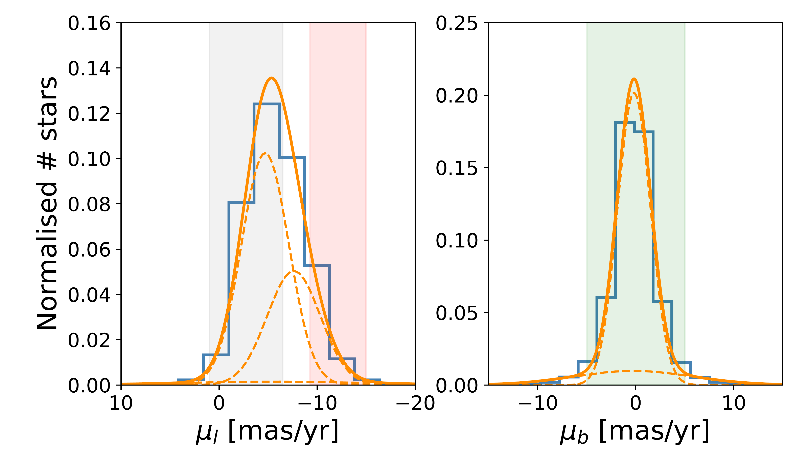
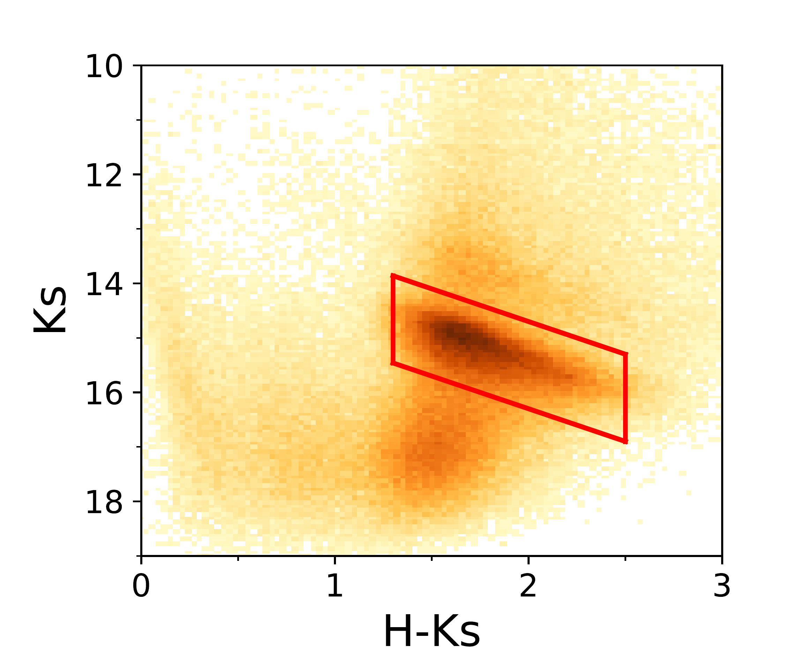

$\newcommand{\ensuremath}{}$
$\newcommand{\xspace}{}$
$\newcommand{\object}[1]{\texttt{#1}}$
$\newcommand{\farcs}{{.}''}$
$\newcommand{\farcm}{{.}'}$
$\newcommand{\arcsec}{''}$
$\newcommand{\arcmin}{'}$
$\newcommand{\ion}[2]{#1#2}$
$\newcommand{\textsc}[1]{\textrm{#1}}$
$\newcommand{\hl}[1]{\textrm{#1}}$
$\newcommand{\arraystretch}{1.3}$
$\newcommand{\arraystretch}{1.3}$

$\newcommand{$\ensuremath$}{}$
$\newcommand{$\xspace$}{}$
$\newcommand{$\object$}[1]{\texttt{#1}}$
$\newcommand{$\farcs$}{{.}''}$
$\newcommand{$\farcm$}{{.}'}$
$\newcommand{$\arcsec$}{''}$
$\newcommand{$\arcmin$}{'}$
$\newcommand{$\ion$}[2]{#1#2}$
$\newcommand{$\textsc$}[1]{\textrm{#1}}$
$\newcommand{$\hl$}[1]{\textrm{#1}}$
$\newcommand{$\arraystretch$}{1.3}$
$\newcommand{$\arraystretch$}{1.3}$

# A first glimpse at the nuclear stellar disc line-of-sight structure

<mark>Appeared on: 2022-12-02</mark> - _Accepted for publication in A&A. 7 pages, 6 figures_

<mark>F. Nogueras-Lara</mark>

**Abstract:** The nuclear stellar disc (NSD) is a dense stellar structure at the centre of our Galaxy. Given its proximity, it constitutes a unique laboratory to understand other galactic nuclei. Nevertheless, the high crowding and extinction hamper its study, and even its morphology and kinematics are not yet totally clear.In this work we use NSD red clump stars, whose intrinsic properties are well known, to trace the kinematics of the NSD and to compute the distance and extinction towards the edges of the NSD.We used publicly available proper motion and photometric catalogues of the NSD to distinguish red clump stars by using a colour-magnitude diagram. We then applied a Gaussian mixture model to obtain the proper motion distribution, and computed the extinction and distance towards stars with different kinematics.We obtained that the proper motion distributions contain NSD stars rotating eastwards and westwards, plus some contamination from Galactic bulge/bar stars, in agreement with previous work. We computed the distance and extinction towards the eastward- and westward-moving stars and concluded that the latter are$\sim300$pc beyond, indicating a similar structure along and across the line of sight, and  consistent with an axisymmetric structure of the NSD. Moreover, we found that the extinction within the NSD is relatively low and  accounts for less than 10\%of the total extinction of the stars belonging to the farthest edge of the NSD.

**Figure 5. -** GALACTICNUCLEUS false colour image of the central region of the NSD. The white rectangles indicate the regions covered by the proper motion catalogue. The white dashed circle shows the effective radius of the nuclear star cluster \citep[$\sim 5$ pc, e.g.][]{gallego-cano2019} with Sagittarius A* at its centre. The white dashed lines indicate the four regions used for the distance and extinction analysis in Sect. \ref{struct}. (*GNS*)

**Figure 2. -** GMM analysis of the proper motion distributions for all the RC stars in the analysed region. The left and right panels show the distribution of the proper motion components parallel ($\mu_l$) and perpendicular ($\mu_b$) to the Galactic plane, respectively. The blue histograms correspond to the data, whereas the orange lines are the total models (solid lines), and each of their Gaussian components (dashed lines). The grey and red shaded areas in the left panel, and the green shaded area in the right panel correspond to the regions analysed in Sect. \ref{struct}. (*proper*)

**Figure 1. -** CMD $K_s$ vs $H-K_s$ for common stars between the proper motion catalogue and the GALACTINUCLEUS survey. The red parallelogram shows the selection of RC stars. (*CMD*)

