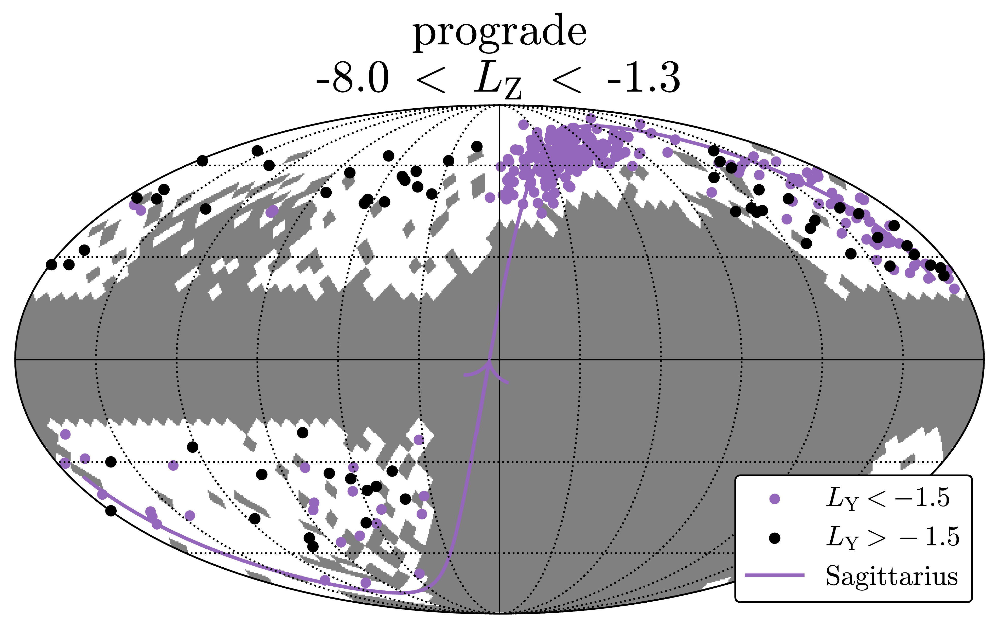
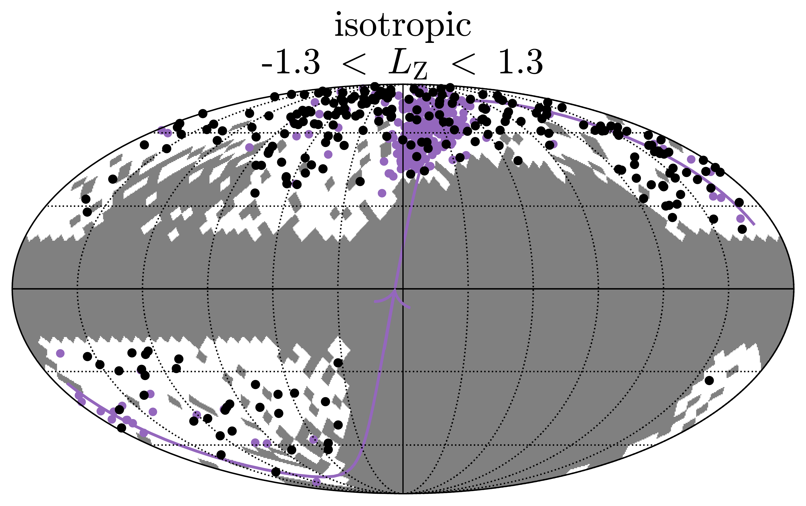
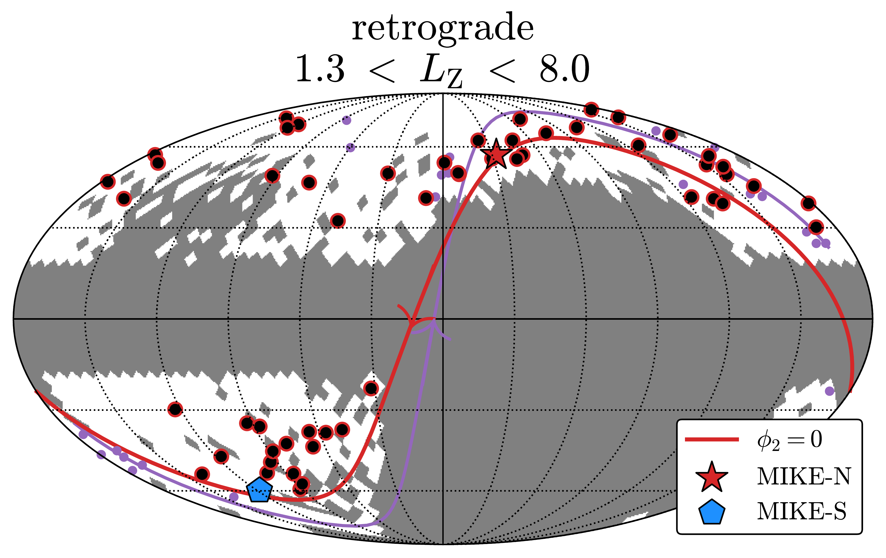
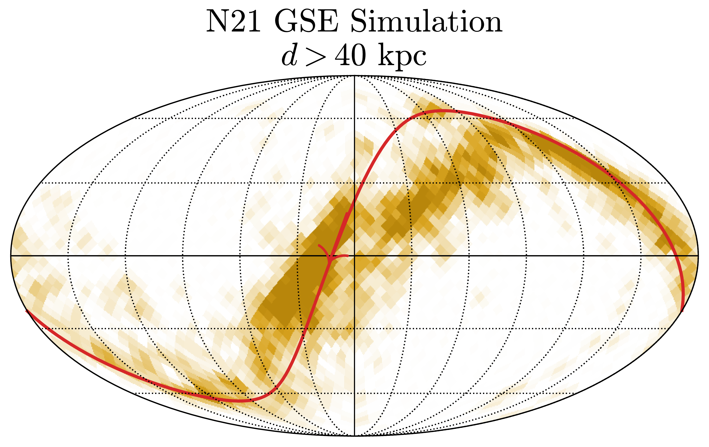
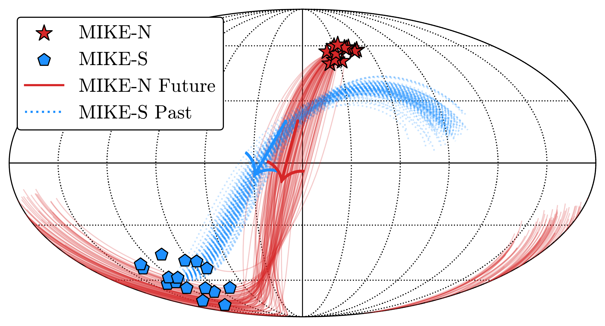
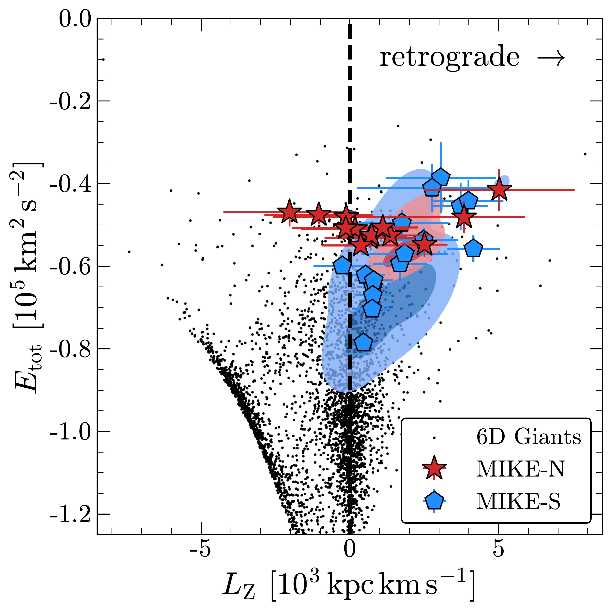
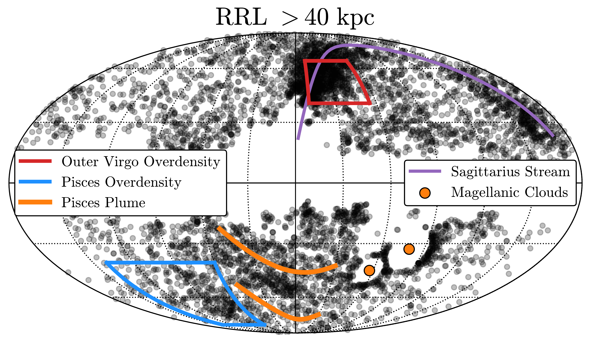
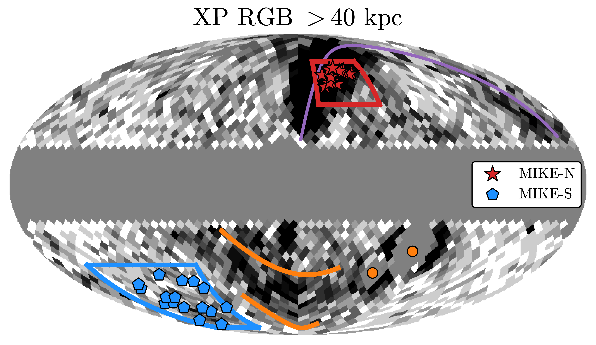

$\newcommand{\ensuremath}{}$
$\newcommand{\xspace}{}$
$\newcommand{\object}[1]{\texttt{#1}}$
$\newcommand{\farcs}{{.}''}$
$\newcommand{\farcm}{{.}'}$
$\newcommand{\arcsec}{''}$
$\newcommand{\arcmin}{'}$
$\newcommand{\ion}[2]{#1#2}$
$\newcommand{\textsc}[1]{\textrm{#1}}$
$\newcommand{\hl}[1]{\textrm{#1}}$
$\newcommand{\vdag}{(v)^\dagger}$
$\newcommand$
$\newcommand$
$\newcommand{\kms}{km s^{-1}}$
$\newcommand$
$\newcommand$

$\newcommand{$\ensuremath$}{}$
$\newcommand{$\xspace$}{}$
$\newcommand{$\object$}[1]{\texttt{#1}}$
$\newcommand{$\farcs$}{{.}''}$
$\newcommand{$\farcm$}{{.}'}$
$\newcommand{$\arcsec$}{''}$
$\newcommand{$\arcmin$}{'}$
$\newcommand{$\ion$}[2]{#1#2}$
$\newcommand{$\textsc$}[1]{\textrm{#1}}$
$\newcommand{$\hl$}[1]{\textrm{#1}}$
$\newcommand{$\vdag$}{(v)^\dagger}$
$\newcommand$
$\newcommand$
$\newcommand{$\kms$}{km s^{-1}}$
$\newcommand$
$\newcommand$

# Distant Echoes of the Milky Way's Last Major Merger

<mark>Appeared on: 2022-12-05</mark> - _19 pages, 10 figures. Submitted to ApJ_

Vedant Chandra, et al. -- incl., <mark>Hans-Walter Rix</mark>, <mark>Dennis~Zaritsky</mark>

**Abstract:** \noindentThe majority of the Milky Way's stellar halo consists of debris from our Galaxy's last major merger, the\textit{Gaia}-Sausage-Enceladus (GSE).In the past few years, stars from GSE have been kinematically and chemically studied in the inner$30$kpc of our Galaxy.However, simulations predict that accreted debris could lie at greater distances, forming substructures in the outer halo.Here we derive metallicities and distances using\textit{Gaia}DR3 XP spectra for an all-sky sample of luminous red giant stars, and map the outer halo with kinematics and metallicities out to$100$kpc.We obtain follow-up spectra of stars in two strong overdensities --- including the previously identified Outer Virgo Overdensity --- and find them to be relatively metal-rich and on predominantly retrograde orbits, matching predictions from simulations of the GSE merger.We argue that these are apocentric shells of GSE debris, forming$60-90$kpc counterparts to the$15-20$kpc shells that are known to dominate the inner stellar halo.Extending our search across the sky with literature radial velocities, we find evidence for a coherent stream of retrograde stars encircling the Milky Way from$50-100$kpc, in the same plane as the Sagittarius Stream but moving in the opposite direction.These are the first discoveries of distant and structured imprints from the GSE merger, cementing the picture of an inclined and retrograde collision that built up our Galaxy's stellar halo.

**Figure 7. -** On-sky distribution of distant 6D giant stars, split into three subsets of azimuthal angular momentum $L_{\mathrm{Z}}$ in units of $10^3 \text{kpc km s}^{-1}$: stars on prograde orbits, stars on isotropic orbits, and stars with retrograde orbits (see Figure \ref{fig:lz_selection}). The selection function of the underlying spectroscopic surveys, and our Galactic latitude cut to mask out the MW disk, is shaded in grey. Sagittarius stream stars selected via $L_\mathrm{Y}$ are shown in purple. Whereas the stars with prograde and isotropic orbits are uniformly distributed across the survey footprints --- apart from Sagittarius, which dominates these panels --- the retrograde stars show a suggestive track on the sky, to which we fit the great circle shown in red. This track coincides with the MIKE-N (Outer Virgo Overdensity) and MIKE-S (Pisces Overdensity) stars, whose median positions are overlaid. A red (purple) arrow indicates the on-sky orbital motion of the retrograde (Sagittarius) stars, emphasizing that the spatially overlapping debris moves in opposite directions. In the bottom right panel we show GSE-only particles from the merger simulation of \citetalias{Naidu2021}, selected to lie beyond 40 kpc. (*fig:lz_maps*)

**Figure 2. -** Top: Future (past) orbits for the MIKE-N (MIKE-S) stars targeted in the Outer Virgo Overdensity (Pisces Overdensity), integrated over 1 Gyr with arrows denoting the general direction of these orbits on-sky. Bottom: MIKE targets in $L_\mathrm{Z}$-$E_{\mathrm{tot}}$ space, with the \textit{Gaia} XP 6D giant sample shown for comparison (black dots). The density distribution for \citetalias{Naidu2021} GSE simulation particles selected from analogous sky regions are shown using contours with corresponding colors. The MIKE stars in both hemispheres are overwhelmingly retrograde. Note that that the MIKE-S stars had a proper motion selection criterion that boosts the likelihood of being retrograde, whereas the MIKE-N stars were blindly targeted within the Outer Virgo Overdensity ($\S$\ref{sec:analysis:ovo:specfollow}). (*fig:mike_iom*)

**Figure 6. -** The spatial distribution of outer halo substructure as seen by RRL and RGB stars. Top: All-sky distribution of \textit{Gaia} DR3 RRL beyond 40 kpc, with the overdensities studied in this work highlighted by red and blue boxes.
    Bottom: Density distribution of our all-sky \textit{Gaia} XP sample of RGB stars beyond 40 kpc. We overlay our spectroscopic targets in the MIKE-North (Outer Virgo Overdensity) and MIKE-South (Pisces Overdensity) regions. There are observed overdensities of RRL and RGB stars in both these locations, albeit weaker and more extended in the south. (*fig:allsky*)

