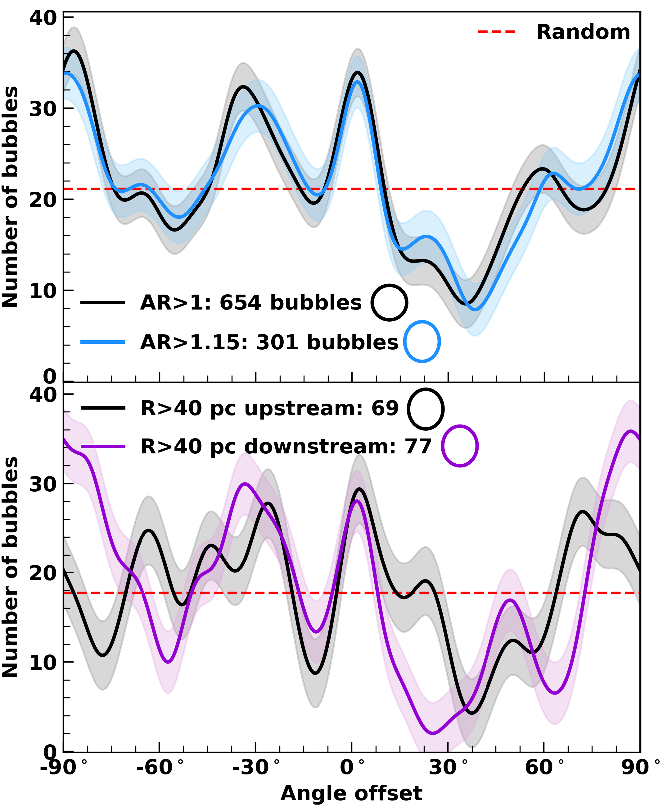

. Solid circle markers on arm spines indicate the start position of the arm. White boxes labeled _a_ and _b_ indicate locations of close-up panels on right side of this figure. **Right**: Same RGB as Figure \ref{fig:bub_rgb} but focused on the regions indicated on the left panel. Bars at bottom left indicates the physical size scale.  (*fig:bub_loc*)

**Figure 6. -** ** Multi-scale bubble population in NGC 628 revealed with $\JWST$ observations**. RGB illustration towards the center of NGC 628 highlighting bubble features and the bands used in their identification. Red traces MIRI F770W observations, green traces MUSE H$\alpha$ observations and blue traces _B_-band $\HST$ observations. White scalebar indicates physical size equal to 1 kpc. (*fig:bub_rgb*)

**Figure 2. -** **Offset angles between elliptical bubbles and the spiral arm tangent angle.****Top**: Solid black and blue lines with apertures show offset angles for bubbles with aspect ratios $>1$ and $>1.15$, respectively, for bubbles with an uncertainty in measured angle of $\pm\ang{5;;}$, resulting in a KDE-like distribution. The blue line has been re-normalized to match the area of the black line (i.e., from 301 bubbles to 654 bubbles) to make comparisons easier. Translucent regions indicate the uncertainty. Dashed red line shows the distribution of offset angles if bubbles have random PAs. **Bottom**: Same as blue line in top panel (i.e., AR$>$1.15) but for bubbles $>40$ pc upstream (black) and downstream (purple) from an arm. (*fig:ang_off*)

