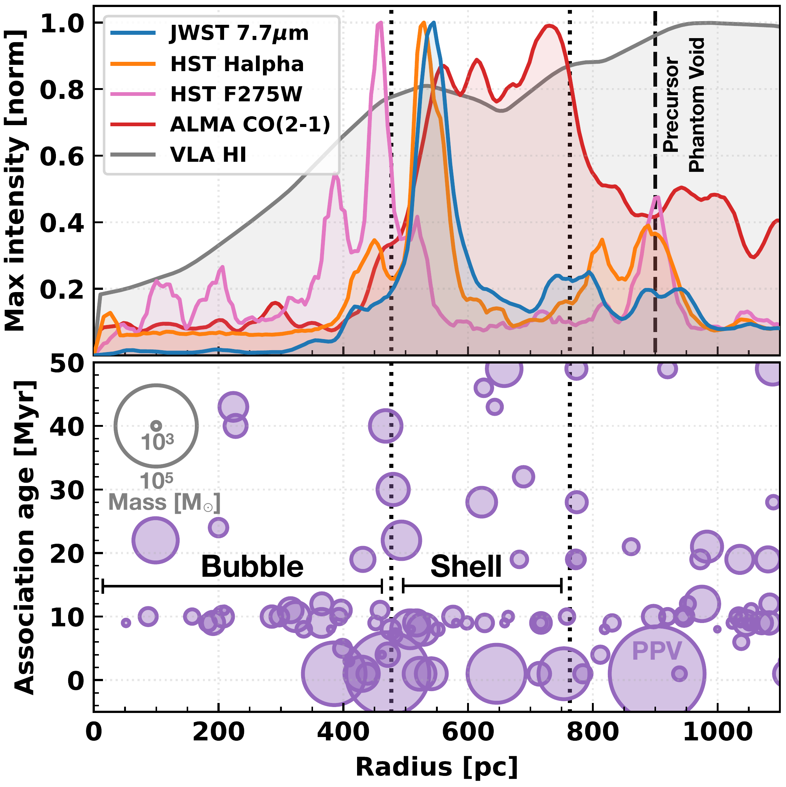

$\newcommand{\ensuremath}{}$
$\newcommand{\xspace}{}$
$\newcommand{\object}[1]{\texttt{#1}}$
$\newcommand{\farcs}{{.}''}$
$\newcommand{\farcm}{{.}'}$
$\newcommand{\arcsec}{''}$
$\newcommand{\arcmin}{'}$
$\newcommand{\ion}[2]{#1#2}$
$\newcommand{\textsc}[1]{\textrm{#1}}$
$\newcommand{\hl}[1]{\textrm{#1}}$
$\newcommand{\HII}{\ion{H}{II}}$
$\newcommand{\HI}{\ion{H}{I}}$
$\newcommand{\Ha}{H{\alpha}}$
$\newcommand{\kms}{\rm km s^{-1}}$
$\newcommand{\JWST}{\rm{\it JWST}}$
$\newcommand{\HST}{\rm{\it HST}}$
$\newcommand{\Astrosat}{\rm{\it Astrosat}}$
$\newcommand{\ch}[1]{\textcolor{black}{ #1}}$
$\newcommand{\namea}{\rm The Phantom Void}$
$\newcommand{\nameb}{\rm The Precursor Phantom Void}$
$\newcommand{\}{kms}$
$\newcommand{\}{Kkms}$
$\newcommand{\}{msun}$
$\newcommand{\}{lsun}$
$\newcommand{\}{solyr}$
$\newcommand{\}{dyncm}$
$\newcommand{\}{ergs}$
$\newcommand{\}{cmsq}$
$\newcommand{\}{cmcb}$
$\newcommand{\}{gcmsq}$
$\newcommand{\}{gcmcb}$
$\newcommand{\}{Kcmcb}$
$\newcommand{\}{ntdp}$

$\newcommand{\ensuremath}{}$
$\newcommand{\xspace}{}$
$\newcommand{\object}[1]{\texttt{#1}}$
$\newcommand{\farcs}{{.}''}$
$\newcommand{\farcm}{{.}'}$
$\newcommand{\arcsec}{''}$
$\newcommand{\arcmin}{'}$
$\newcommand{\ion}[2]{#1#2}$
$\newcommand{\textsc}[1]{\textrm{#1}}$
$\newcommand{\hl}[1]{\textrm{#1}}$
$\newcommand{\HII}{\ion{H}{II}}$
$\newcommand{\HI}{\ion{H}{I}}$
$\newcommand{\Ha}{H{\alpha}}$
$\newcommand{\kms}{\rm km s^{-1}}$
$\newcommand{\JWST}{\rm{\it JWST}}$
$\newcommand{\HST}{\rm{\it HST}}$
$\newcommand{\Astrosat}{\rm{\it Astrosat}}$
$\newcommand{\ch}[1]{\textcolor{black}{ #1}}$
$\newcommand{\namea}{\rm The Phantom Void}$
$\newcommand{\nameb}{\rm The Precursor Phantom Void}$
$\newcommand{\}{kms}$
$\newcommand{\}{Kkms}$
$\newcommand{\}{msun}$
$\newcommand{\}{lsun}$
$\newcommand{\}{solyr}$
$\newcommand{\}{dyncm}$
$\newcommand{\}{ergs}$
$\newcommand{\}{cmsq}$
$\newcommand{\}{cmcb}$
$\newcommand{\}{gcmsq}$
$\newcommand{\}{gcmcb}$
$\newcommand{\}{Kcmcb}$
$\newcommand{\}{ntdp}$

# PHANGS-JWST First Results: Multi-wavelength view of feedback-driven bubbles (The Phantom Voids) across NGC 628

<mark>Appeared on: 2022-12-01</mark> - _12 pages total, 8 figures, and 1 table. Accepted as part of a PHANGS-JWST Focus Issue to appear in ApJ_

Ashley.~T.~Barnes, et al. -- incl., <mark>Kathryn~Kreckel</mark>, <mark>Frank Bigiel</mark>, <mark>Janice C. Lee</mark>, <mark>Eva Schinnerer</mark>, <mark>Jing~Li</mark>, <mark>Lukas Neumann</mark>, <mark>Francesca Pinna</mark>, <mark>Rowan J. Smith</mark>, <mark>Sophia K. Stuber</mark>

**Abstract:** We present a high-resolution view of bubbles within The Phantom Galaxy (NGC 628); a nearby ( $\sim$ 10 Mpc), star-forming ( $\sim$ 2 \msun yr $^{-1}$ ), face-on ( $i$ $\sim$ 9 $^{\circ}$ ) grand-design spiral galaxy.With new data obtained as part of the PHANGS- \JWST treasury program, we perform a detailed case-study of two regions of interest, one of which contains the largest and most prominent bubble in the galaxy  ( \namea ; over 1 kpc in diameter), and the other being a smaller region that may be the precursor to such a large bubble ( \nameb ).When comparing to matched resolution \Ha observations from the Hubble Space Telescope ( \HST ), we see that the ionized gas is brightest in the shells of both bubbles, and is coincident with the youngest ( $\sim$ 1 Myr) and most massive ( $\sim$ 10 $^{5}$ \msun ) stellar associations.We also find an older generation ( $\sim$ 20 Myr) of stellar associations is present within the bubble of \namea .From our kinematic analysis of the HI, H $_2$ (CO) and HII gas across \namea , we infer a high expansion speed of around 15 to 50 \kms .The large size and high expansion speed of \namea suggest that the driving mechanism is sustained stellar feedback due to multiple mechanisms, where early feedback first cleared a bubble (as we observe now in \nameb ), and since then SNe have been exploding within the cavity, and have accelerated the shell.Finally, comparison to simulations shows a striking resemblance to our \JWST observations, and suggests that such large-scale stellar feedback-driven bubbles should be common within other galaxies.

**Figure 7. -** ** Comparison of a feedback-driven bubble, and its host stellar population for the Phantom Void and the Precursor Phantom Void (also shown in Fig. \ref{fig2**).} From left to right in upper panels, we show the $\JWST$ 7.7 \micron, $\HST$$\Ha$ and the near-UV (F275W) filters. Overlaid as colored contours on the upper right panel is the age of the stellar associations (at a scale of 32 pc; see \citealp{Deger2020}). From left to right in center panels are the _ Spitzer 8 \micron_\citep{Dale2009}, MUSE $\Ha$\citep{Emsellem2022}, and Astrosat NUV (Hassani et al. in prep) observations. In the bottom panels are the ALMA CO \citep{leroy_phangs-alma_2021}, VLA HI \citep{Walter2008}, and HST broadband \citep{Lee2021} observations.
    The white dashed line on all panels denotes the bubble and shell of each region (see Fig. \ref{fig5}). We find that young and high-mass stellar associations ($<$ 20 Myr; $>$10$^{5}$\msun) exist within the bubble (particularly towards the boundaries), highlighting these as good candidates for driving the bubble expansion. (*fig3*)

**Figure 4. -** ** Distribution of intensity and stellar population in the Phantom Void (see Fig. \ref{fig3**).} The upper panel shows the intensity distribution of the $\JWST$ 7.7 \micron,  continuum subtracted $\Ha$ emission, $\HST$ NUV, ALMA CO, and VLA HI emission, as measured radially from the center of the bubble (see Fig. \ref{fig3}). We show the 99$^{\rm th}$ percentile of the intensity in each radial bin, normalized to the value of the maximum bin (this percentile is chosen instead e.g. the mean value to better highlight where the emission distributions peak). The bottom panel shows the radial age distribution of the stellar association catalog. The size of the points indicate the mass of the stellar associations.  In both panels we highlight the position of the $\nameb$. We find evidence that younger and more higher-mass clusters are preferentially located within the shell, with respect to inside the bubble. (*fig5*)

**Figure 6. -** ** The prominent bubble structures across The Phantom Galaxy (Messier 74 or NGC 628).** In all panels, we show an image produced from the 770W (blue), 1000W (green), and 1130W (red) band filters from the $\JWST$(Lee et al. in prep), and overlaid in orange is the continuum subtracted $\HST$-$\Ha$. The faded circles and ellipses show the positions of the bubbles from \cite{WATKINS_PHANGSJWST}. (*fig2*)

