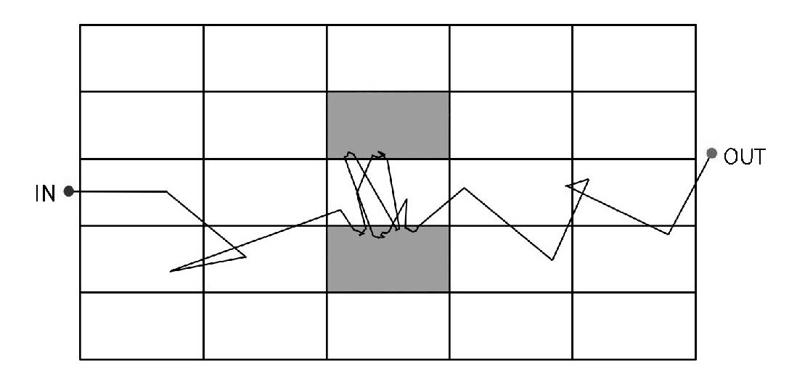
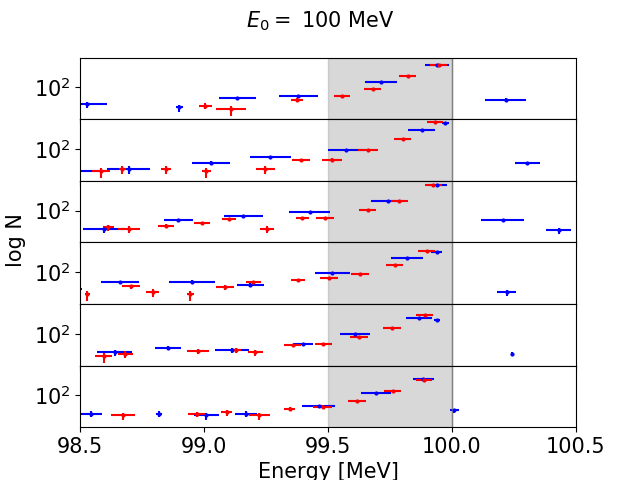
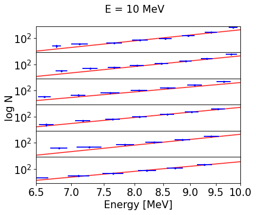

$\newcommand{\ensuremath}{}$
$\newcommand{\xspace}{}$
$\newcommand{\object}[1]{\texttt{#1}}$
$\newcommand{\farcs}{{.}''}$
$\newcommand{\farcm}{{.}'}$
$\newcommand{\arcsec}{''}$
$\newcommand{\arcmin}{'}$
$\newcommand{\ion}[2]{#1#2}$
$\newcommand{\textsc}[1]{\textrm{#1}}$
$\newcommand{\hl}[1]{\textrm{#1}}$
$\newcommand{\footnote}[1]{}$

$\newcommand{\ensuremath}{}$
$\newcommand{\xspace}{}$
$\newcommand{\object}[1]{\texttt{#1}}$
$\newcommand{\farcs}{{.}''}$
$\newcommand{\farcm}{{.}'}$
$\newcommand{\arcsec}{''}$
$\newcommand{\arcmin}{'}$
$\newcommand{\ion}[2]{#1#2}$
$\newcommand{\textsc}[1]{\textrm{#1}}$
$\newcommand{\hl}[1]{\textrm{#1}}$
$\newcommand{\footnote}[1]{}$

# A semiempirical approach to low-energy cosmic ray propagation$\in the diffuse interstellar medium$

<mark>Appeared on: 2022-12-02</mark> - _8 pages, 13 figures_

<mark>Riccardo Franceschi</mark>, and
        Steven N. Shore

**Abstract:** We investigate the ionization of the diffuse interstellar medium by cosmic rays by modeling their propagation along the wandering magnetic fields using a Monte Carlo method. We explore how particle trapping and second-order Fermi processes affect the ionization of the medium. We study how low-energy cosmic rays propagate in turbulent, translucent molecular clouds, and how they regulate the ionization and both lose and gain energy from the medium. As a test case, we use high spatial resolution (0.03 pc) CO maps of a well-studied high latitude translucent cloud, MBM 3, to model turbulence.  The propagation problem is solved with a modified Monte Carlo procedure that includes trapping, energization, and ionization losses. In the homogeneous medium, trapping and re-energization do not produce a significant effect. In the nonuniform medium, particles can be trapped for a long time inside the cloud. This modifies the cosmic ray distribution due to stochastic acceleration at the highest energies ( $\sim$ 100 MeV). At lower energies, the re-energization is too weak to produce an appreciable effect. The change in the energy distribution does not significantly affect the ionization losses, so ionization changes are due to trapping effects. Our Monte Carlo approach to cosmic ray propagation is an alternative method for solving the transport equation. This approach can be benchmarked to gas observations of molecular clouds. Using this approach, we demonstrate that stochastic Fermi acceleration and particle trapping occurs in inhomogeneous clouds, significantly enhancing their ionization.

**Figure 6. -** Configuration of the medium used to investigate the effects of inhomogeneities, represented by the gray regions. (*fig:dishomo*)

**Figure 7. -** Histogram of 100 MeV protons propagating in an inhomogeneous medium. The top plot represents the particles on the injection face reflected by the medium. The middle plots are at increasing depth, and the bottom represents transmission. The third and fourth plots from the top represent the interfaces with the inhomogeneous region. For comparison, the gray area shows the particle energy range in a homogeneous medium. The blue and red points do and do not include the effects of re-energization, respectively. The flat distribution in the lower energy range is the signature of trapping-enhanced ionization losses and small re-energization. (*fig:100_trapping*)

**Figure 3. -** Histogram of 10 MeV protons propagating in a uniform medium. The top plot represents the particles on the injection face reflected by the medium. The middle plots are at increasing depth, and the bottom represents transmission. The red lines show a power-law fit of the particle distributions. (*fig:10mev_homo*)

