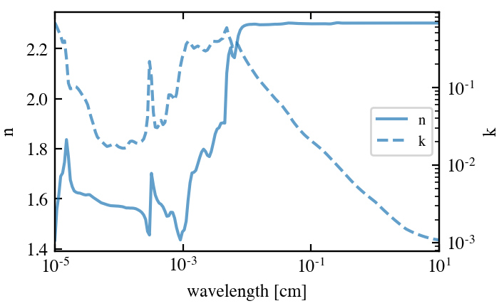
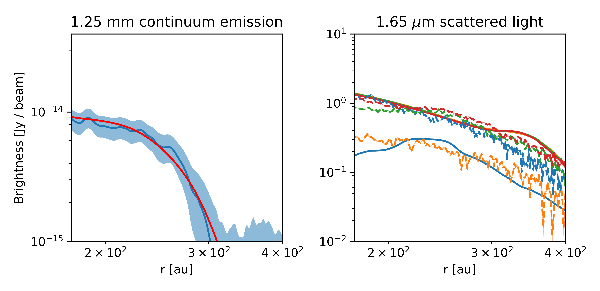
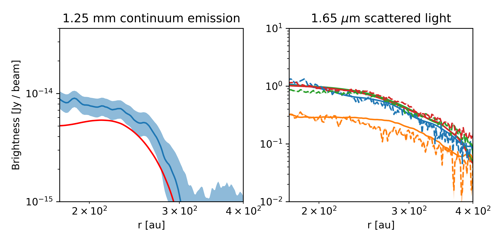

$\newcommand{\ensuremath}{}$
$\newcommand{\xspace}{}$
$\newcommand{\object}[1]{\texttt{#1}}$
$\newcommand{\farcs}{{.}''}$
$\newcommand{\farcm}{{.}'}$
$\newcommand{\arcsec}{''}$
$\newcommand{\arcmin}{'}$
$\newcommand{\ion}[2]{#1#2}$
$\newcommand{\textsc}[1]{\textrm{#1}}$
$\newcommand{\hl}[1]{\textrm{#1}}$

$\newcommand{$\ensuremath$}{}$
$\newcommand{$\xspace$}{}$
$\newcommand{$\object$}[1]{\texttt{#1}}$
$\newcommand{$\farcs$}{{.}''}$
$\newcommand{$\farcm$}{{.}'}$
$\newcommand{$\arcsec$}{''}$
$\newcommand{$\arcmin$}{'}$
$\newcommand{$\ion$}[2]{#1#2}$
$\newcommand{$\textsc$}[1]{\textrm{#1}}$
$\newcommand{$\hl$}[1]{\textrm{#1}}$

# Constraining the turbulence and the dust disk in IM Lup: onset of planetesimal formation

<mark>Appeared on: 2022-12-05</mark> - _15 pages, 16 figures, accepted by Astronomy & Astrophysics_

<mark>Riccardo Franceschi</mark>, Tilman Birnstiel, <mark>Thomas Henning</mark>, <mark>Anirudh Sharma</mark>

**Abstract:** Observations of protoplanetary disks provide information on planet formation and the reasons for the diversity of planetary systems. The key to understanding planet formation is the study of dust evolution from small grains to pebbles. Smaller grains ($\sim 1 \;\mu m$) are well-coupled to the gas dynamics, and their distribution is significantly extended above the disk midplane. Larger grains settle much faster and are efficiently formed only in the midplane. By combining near-infrared polarized light and millimeter observations, it is possible to constrain the spatial distribution of both the small and large grains.We aim to construct detailed models of the size distribution and vertical/radial structure of the dust particles in protoplanetary disks based on observational data. In particular, we are interested in recovering the dust distribution in the IM Lup protoplanetary disk.We create a physical model for the dust distribution of protoplanetary disks. We then simulate the radiative transfer of the millimeter continuum and the near-infrared polarized radiation. Using a Markov chain Monte Carlo method, we compare the derived images to the observations available for the IM Lup disk to constrain the best physical model for IM Lup and to recover the vertical grain size distribution.The millimeter and near-infrared emission tightly constrain the dust mass and grain size distribution of our model. We find size segregation in the dust distribution, with millimeter-sized grains in the disk midplane. These grains are efficiently formed in the disk, possibly by sedimentation-driven coagulation, in accord with the short settling timescales predicted by our model. This also suggests a high dust-to-gas ratio at smaller radii in the midplane, possibly triggering streaming instabilities and planetesimal formation in the inner disk. We obtain a turbulent$\alpha$parameter of$3 \times 10^{-3}.$

**Figure 1. -** Medium optical constant for the dust composition in     Tab.\ref{table:dust_composition}\citep{Birnstiel18} (*fig:optical_constants*)

**Figure 2. -** The model without a truncation in the dust distribution best reproducing the continuum data. This model does not include enough small grains to reproduce the scattered light observations. (*fig:model opac 1*)

**Figure 3. -** The model without a truncation in the dust distribution best reproducing the scattered light data. This model does not have enough millimeter grains to match the observed continuum emission. (*fig:model opac 2*)

