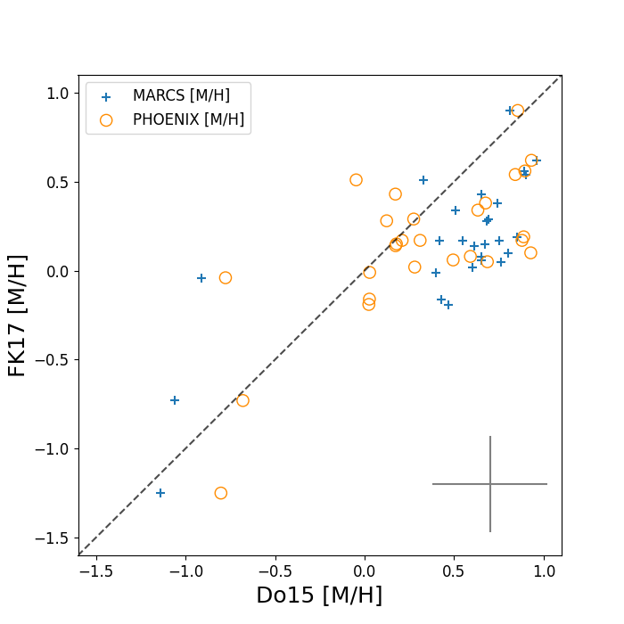
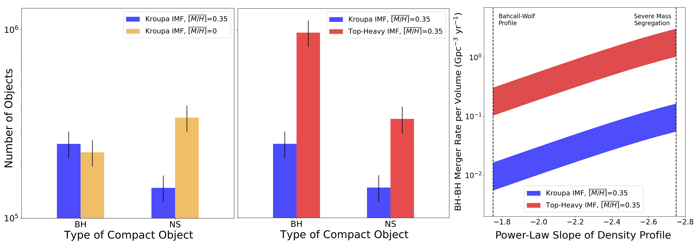
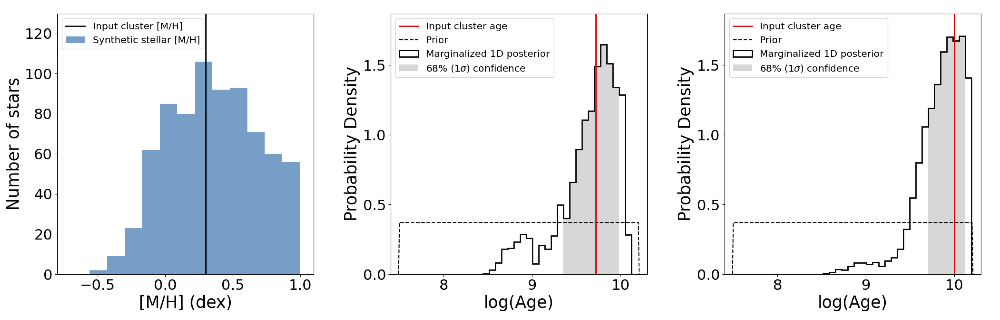

$\newcommand{\ensuremath}{}$
$\newcommand{\xspace}{}$
$\newcommand{\object}[1]{\texttt{#1}}$
$\newcommand{\farcs}{{.}''}$
$\newcommand{\farcm}{{.}'}$
$\newcommand{\arcsec}{''}$
$\newcommand{\arcmin}{'}$
$\newcommand{\ion}[2]{#1#2}$
$\newcommand{\textsc}[1]{\textrm{#1}}$
$\newcommand{\hl}[1]{\textrm{#1}}$
$\newcommand{\footnote}[1]{}$
$\newcommand{\vdag}{(v)^\dagger}$
$\newcommand$
$\newcommand$

$\newcommand{\ensuremath}{}$
$\newcommand{\xspace}{}$
$\newcommand{\object}[1]{\texttt{#1}}$
$\newcommand{\farcs}{{.}''}$
$\newcommand{\farcm}{{.}'}$
$\newcommand{\arcsec}{''}$
$\newcommand{\arcmin}{'}$
$\newcommand{\ion}[2]{#1#2}$
$\newcommand{\textsc}[1]{\textrm{#1}}$
$\newcommand{\hl}[1]{\textrm{#1}}$
$\newcommand{\footnote}[1]{}$
$\newcommand{\vdag}{(v)^\dagger}$
$\newcommand$
$\newcommand$

# THE STAR FORMATION HISTORY OF THE MILKY WAY'S NUCLEAR STAR CLUSTER

<mark>Appeared on: 2022-12-02</mark> - _37 pages, 23 figures, Accepted to ApJ_

Zhuo Chen, et al. -- incl., <mark>Anja Feldmeier-Krause</mark>

**Abstract:** We report the first star formation history study of the Milky Way’s nuclear star cluster (NSC) that includes observational constraints from a large sample of stellar metallicity measurements. These metallicity measurements were obtained from recent surveys from Gemini and VLT of 770 late-type stars within the central 1.5 pc. These metallicity measurements, along with photometry and spectroscopically derived temperatures, are forward modeled with a Bayesian inference approach.  Including metallicity measurements improves the overall fit quality, as the low-temperature red giants that were previously difficult to constrain are now accounted for, and the best fit favors a two-component model. The dominant component contains 93 \% $\pm$ 3 \% of the mass, is metal-rich ( $\overline{[M/H]}\sim$ 0.45), and has an age of 5 $^{+3}_{-2}$ Gyr, which is $\sim$ 3 Gyr younger than earlier studies with fixed (solar) metallicity; this younger age challenges co-evolutionary models in which the NSC and supermassive black holes formed simultaneously at early times. The minor population component has low metallicity ( $\overline{[M/H]}\sim$ -1.1) and contains $\sim$ 7 \% of the stellar mass. The age of the minor component is uncertain (0.1 - 5 Gyr old). Using the estimated parameters, we infer the following NSC stellar remnant population (with $\sim$ 18 \% uncertainty): 1.5 $\times$ 10 $^5$ neutron stars, 2.5 $\times$ 10 $^5$ stellar mass black holes (BHs) and 2.2 $\times$ 10 $^4$ BH-BH binaries. These predictions result in 2-4 times fewer neutron stars compared to earlier predictions that assume solar metallicity, introducing a possible new path to understand the so-called "missing pulsar problem”.  Finally, we present updated predictions for the BH-BH merger rates (0.01-3 Gpc $^{-3}$ yr $^{-1}$ ).

**Figure 7. -** Comparison of the metallicity measurements for the 27 common stars from both datasets. Blue crosses show the metallicities as measured from the AO spectra using MARCS grid \citep{Do et al. 2015}, compared to those as measured from the seeing-limited spectra using PHOENIX grid \citep{Feldmeier-Krause et al. 2017}. We investigated the effects of spectral resolution and grids on the measurements by re-fitting the AO spectra using the PHOENIX grid (see orange open circles with updated x-axis values). The grey error bar on the lower right shows average uncertainties.  (*fig:mh_grids_comp*)

**Figure 13. -** IMF and metallicity are crucial properties for predicting the number of compact objects and their merger rates at the Galactic center. **Left panel**: The high metallicity of the main population of the NSC ($\overline{[M/H]}$ = 0.35, blue bar) predicts 2 - 4 times fewer neutron stars than those assuming a solar metallicity ($\overline{[M/H]}$ = 0, yellow bar). **Middle panel**: A cluster with a top-heavy IMF ($\alpha$ = -1.7 $\pm$ 0.2, red) produces 3 - 6 times more black holes and 2 - 3 times more neutron stars than a cluster with a Kroupa IMF. **Right panel**: Comparison of the predicted BH-BH merger rate per volume assuming different IMFs, as calculated from a range of possible 3-d radial density profile of BHs with a power-law indice range of 7/4 $<$$\beta$$<$ 11/4 \citep{Alexander et al. 2009} covering both severe and weak (Buhcall-Wolf profile) mass segregation scenarios. The width in the band corresponds to the assumption of ellipticity of the NSC from 0.1 to 1. The top-heavy IMF predicts the BH-BH mergers with a rate of up to 19 times higher than that with a Kroupa IMF.  (*fig:comp_merger*)

**Figure 18. -** **Left:** Stellar metallicity distribution from a synthetic cluster. The input cluster metallicity is shown as a vertical line. Uncertainty is added for each star as a Gaussian distribution. A random bias to $[M/H]$ is artificially introduced to simulate an apparent tail in the measured metallicity distribution out to $[M/H]$$\sim$ +1 dex. **Middle:** Test-cluster's marginalized 1D posterior probability density function for a simulated cluster with an age of 5 Gyr (log(Age) = 9.7). We find that the best fit cluster age of 5.7 $^{+3.8}_{-3.5}$ Gyr is consistent with the input age (red line). **Right:** Example for a simulated cluster with an age of 10 Gyr (log(Age) = 10). The best fit cluster age of 8.9 $^{+4.0}_{-3.6}$ Gyr is consistent with the input age (red line). Our methodology is able to recover the cluster age with no substantial systematic biases.
 (*fig:mhfittertest*)

