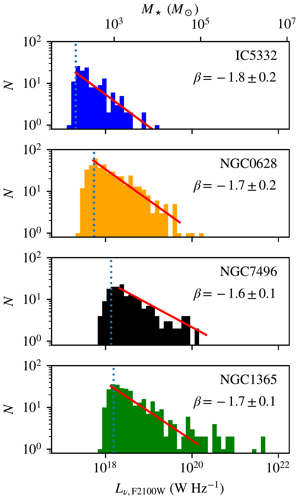
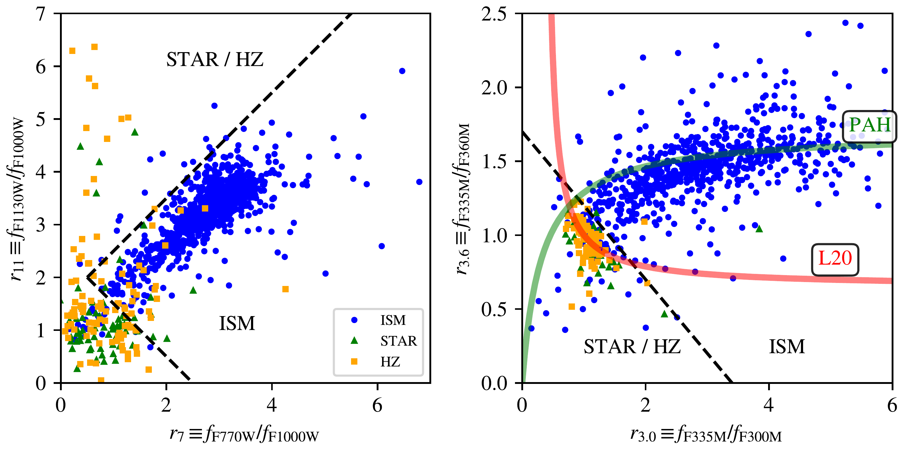
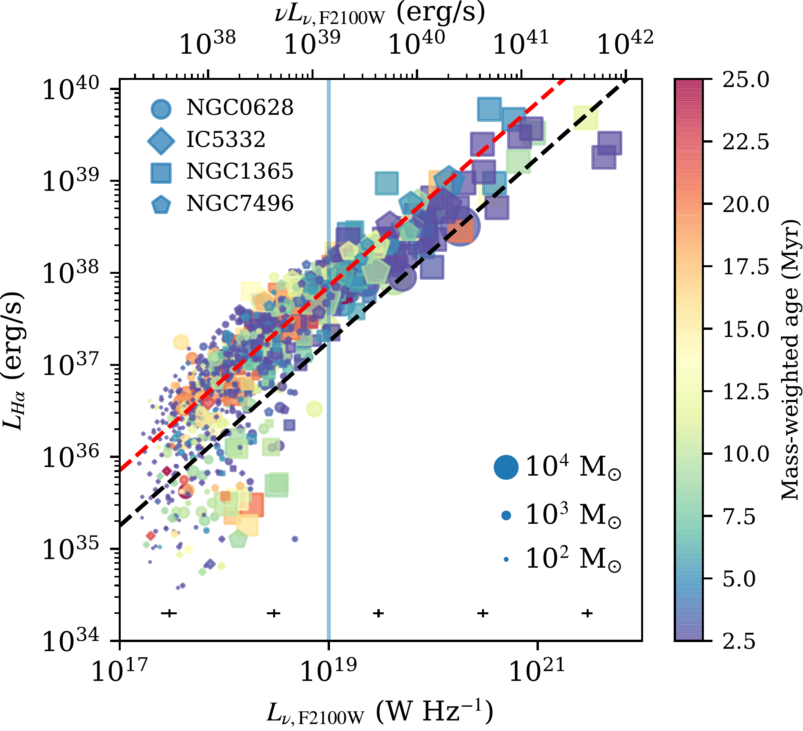

$\newcommand{\ensuremath}{}$
$\newcommand{\xspace}{}$
$\newcommand{\object}[1]{\texttt{#1}}$
$\newcommand{\farcs}{{.}''}$
$\newcommand{\farcm}{{.}'}$
$\newcommand{\arcsec}{''}$
$\newcommand{\arcmin}{'}$
$\newcommand{\ion}[2]{#1#2}$
$\newcommand{\textsc}[1]{\textrm{#1}}$
$\newcommand{\hl}[1]{\textrm{#1}}$
$\newcommand{\footnote}[1]{}$
$\newcommand{\vdag}{(v)^\dagger}$
$\newcommand$
$\newcommand$
$\newcommand$
$\newcommand{\STScI}{\affiliation{Space Telescope Science Institute, 3700 San Martin Drive, Baltimore, MD 21218, USA}}$

$\newcommand{\ensuremath}{}$
$\newcommand{\xspace}{}$
$\newcommand{\object}[1]{\texttt{#1}}$
$\newcommand{\farcs}{{.}''}$
$\newcommand{\farcm}{{.}'}$
$\newcommand{\arcsec}{''}$
$\newcommand{\arcmin}{'}$
$\newcommand{\ion}[2]{#1#2}$
$\newcommand{\textsc}[1]{\textrm{#1}}$
$\newcommand{\hl}[1]{\textrm{#1}}$
$\newcommand{\footnote}[1]{}$
$\newcommand{\vdag}{(v)^\dagger}$
$\newcommand$
$\newcommand$
$\newcommand$
$\newcommand{\STScI}{\affiliation{Space Telescope Science Institute, 3700 San Martin Drive, Baltimore, MD 21218, USA}}$

# PHANGS-JWST First Results: The 21 $\um$ Compact Source Population

<mark>Appeared on: 2022-12-03</mark> - _15 pages, 5 figures, Accepted as part of a PHANGS-JWST Focus Issue to appear in ApJ_

Hamid Hassani, et al. -- incl., <mark>Janice C. Lee</mark>, <mark>Kathryn Kreckel</mark>, <mark>Eva Schinnerer</mark>

**Abstract:** We use PHANGS-JWST data to identify and classify 1271 compact 21 $\um$ sources in four nearby galaxies using MIRI F2100W data. We identify sources using a dendrogram-based algorithm, and we measure the background-subtracted flux densities for JWST bands from 2 $\um$ to 21 $\um$ . Using the SED in JWST as well as HST bands, plus ALMA and MUSE/VLT observations, we classify the sources by eye. Then we use this classification to define regions in color-color space, and so establish a quantitative framework for classifying sources. We identify 1085 sources as belonging to the ISM of the target galaxies with the remainder being dusty stars or background galaxies.  These 21 $\um$ sources are strongly spatially associated with $\ion{H}{2}$ regions ( $>92\%$ of sources), while 74 \% of sources are coincident with a stellar association defined in the HST data. Using SED fitting, we find that the stellar masses of the 21 $\um$ sources span a range of 10 $^{2}$ to 10 $^{4} M_\odot$ with mass-weighted ages down to 2 Myr. There is a tight correlation between attenuation-corrected H $\alpha$ and 21 $\um$ luminosity for $L_{\nu,\mathrm{F2100W}}>10^{19} \mathrm{W Hz}^{-1}$ . Young embedded source candidates selected at 21 $\um$ are found below this threshold and have $M_\star < 10^{3} M_\odot$ .

**Figure 1. -** Luminosity distribution of 21 \um sources classified as ISM sources in the JWST MIRI data.  The distributions are grouped by host galaxy in order of increasing distance (top to bottom). The blue dotted line indicates the mean $5\sigma$ error in source luminosity. The red lines indicate a fit to the power-law distribution with $dN/dL_\nu \propto L_\nu^{\beta}$ over two orders of magnitude. The value of $\beta$ is labeled in each panel.  The mass scale on the top axis translates the luminosity measurements to equivalent masses using the median ratio we determine from SED fitting (Section \ref{sec:sedfit}). (*fig:lumdist*)

**Figure 4. -** Color-color plots of the 21 \um selected sources in the MIRI (left) and NIRCam (right) bands constructed from band ratios that highlight significant PAH emission for $z=0$ sources.  Dashed lines indicate loci that partition the color-color space into sources with bright ISM emission \edit1{(ISM)} vs. background galaxies \edit1{(HZ)} and extreme AGB stars that lack a PAH feature \edit1{(STAR)}.  Classifications are made by eye in examining the full SED and morphology of sources in the full PHANGS data set. The L20 line indicates the proposed line for stellar colors from  ([Lai, et. al (2020)]()) . (*fig:colors*)

**Figure 5. -** Correlation between luminosity in the extinction corrected H$\alpha$ line as a function of 21 \um luminosity density. The color bar shows age of the sources and the total stellar mass of each region is represented by its size. Both age and mass are estimated via SED fitting using cigale(Section \ref{sec:sedfit}). Most regions show an excellent correlation between 21 \um and H$\alpha$ luminosity.  The black dashed line indicates the threshold below which we regard a 21 \um source as being H$\alpha$-faint \edit1{($L_\mathrm{H\alpha} / \nu L_{\nu, \mathrm{F2100W}}=0.05<1/80$)}, and the red line indicates the mean $L_\mathrm{H\alpha} / \nu L_{\nu, \mathrm{F2100W}}=0.05$.  The vertical line at $L_\nu = 10^{19} \mathrm{W Hz^{-1}}$ is the threshold below which we search for embedded sources. \edit1{We plot representative fractional error bars in the bottom of the plot in five different $L_{\nu, \mathrm{F2100W}}$ ranges.} (*fig:hacorr*)

