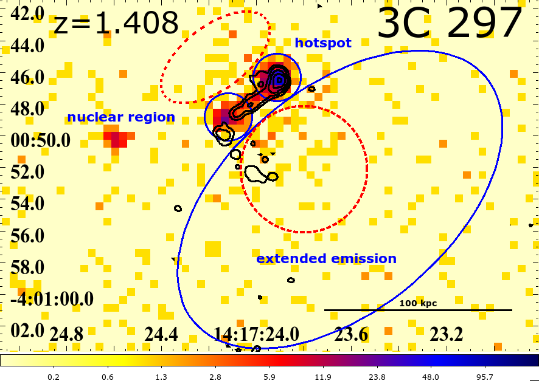
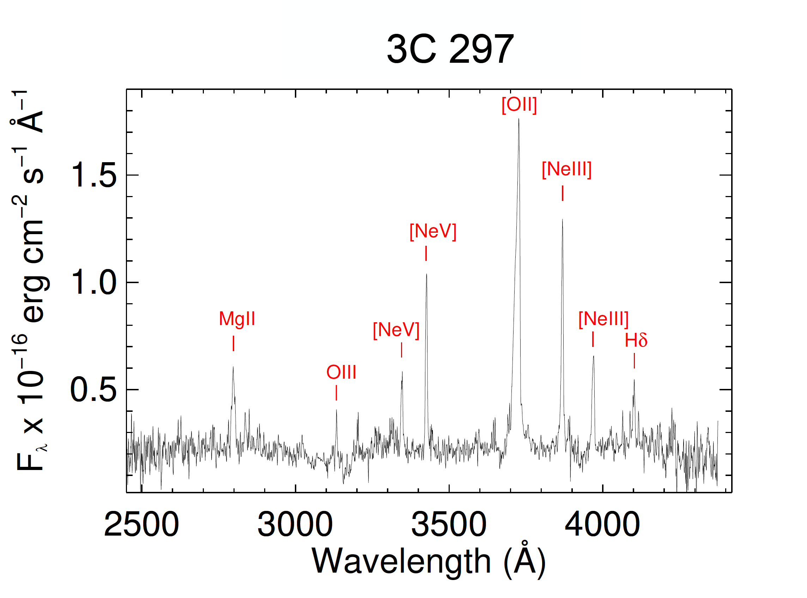
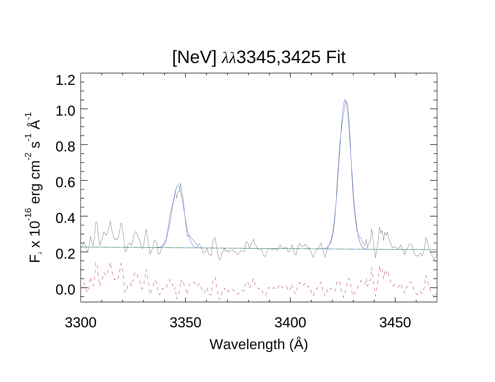
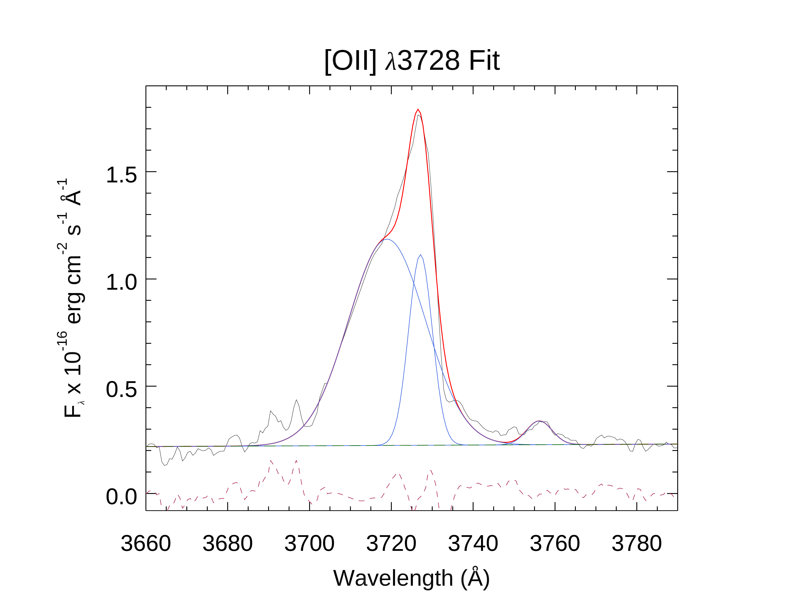

$\newcommand{\ensuremath}{}$
$\newcommand{\xspace}{}$
$\newcommand{\object}[1]{\texttt{#1}}$
$\newcommand{\farcs}{{.}''}$
$\newcommand{\farcm}{{.}'}$
$\newcommand{\arcsec}{''}$
$\newcommand{\arcmin}{'}$
$\newcommand{\ion}[2]{#1#2}$
$\newcommand{\textsc}[1]{\textrm{#1}}$
$\newcommand{\hl}[1]{\textrm{#1}}$
$\newcommand{\vdag}{(v)^\dagger}$
$\newcommand$
$\newcommand$
$\newcommand{\chn}{{\it Chandra}}$

$\newcommand{\ensuremath}{}$
$\newcommand{\xspace}{}$
$\newcommand{\object}[1]{\texttt{#1}}$
$\newcommand{\farcs}{{.}''}$
$\newcommand{\farcm}{{.}'}$
$\newcommand{\arcsec}{''}$
$\newcommand{\arcmin}{'}$
$\newcommand{\ion}[2]{#1#2}$
$\newcommand{\textsc}[1]{\textrm{#1}}$
$\newcommand{\hl}[1]{\textrm{#1}}$
$\newcommand{\vdag}{(v)^\dagger}$
$\newcommand$
$\newcommand$
$\newcommand{\chn}{{\it Chandra}}$

# Powerful yet lonely: Is 3C 297 a high-redshift fossil group$?$

<mark>Appeared on: 2022-12-03</mark> - _The Astrophysical Journal Supplement Series, in press_

Valentina Missaglia, et al. -- incl., <mark>Mischa Schirmer</mark>

**Abstract:** The environment of the high-redshift ( $z=1.408$ ), powerful radio-loud galaxy 3C 297 has several distinctive features of a galaxy cluster. Among them, a characteristic halo of hot gas revealed by Chandra X-ray observations. In addition, a radio mapobtained with the Very Large Array (VLA) shows a bright hotspot in the northwestern direction, created by the interaction of the AGN jet arising from 3C 297 with its environment. In the X-ray images, emission cospatial with the northwestern radio lobe is detected, and peaks at the position of the radio hotspot. The extended, complex X-ray emission observed with our new Chandra data is largely unrelated to its radio structure. Despite having attributes of a galaxy cluster, no companion galaxies have been identified from 39 new spectra of neighboring targets of 3C 297 obtained with the Gemini Multi-Object Spectrograph. None of the 19 galaxies for which a redshift was determined lies at the same distance as 3C 297. The optical spectral analysis of the new Gemini spectrum of 3C 297 reveals an isolated Type-II radio-loud AGN. We also detected line broadening in [ O {\sc ii} ]  $\lambda$ 3728 with a FWHM about 1700 km s $^{-1}$ and possible line shifts of up to 500-600 km s $^{-1}$ . We postulate that the host galaxy of 3C 297 is a fossil group, in which most of the stellar mass has merged into a single object, leaving behind an X-ray halo.

**Figure 2. -** Unbinned, unsmoothed $\chn$ merged image of 3C 297 in the energy band 0.3-7 keV. The three regions in which spectral analyses have been performed are highlighted in the blue regions (two circles and one ellipse). We detected 159 net counts in the extended emission region, 115 net counts in the nuclear region and 315 net counts in the hotspot region. The red dashed circle and ellipse mark the regions in which we observe an X-ray counts excess, due to the outflow (see Section \ref{outflow} for more details). \ (*regions*)

**Figure 5. -** New GMOS spectrum of 3C 297. The spectrum is displayed with a redshift correction of $z$=1.408.
 (*spec3c297*)

**Figure 6. -** Example of the Gaussian decomposition applied to the observed emission line profiles.
_Left_: Fit to the coronal lines [Ne {\sc v}] $\lambda\lambda$ 3345, 3425. _Right_:
[O {\sc ii}] $\lambda\lambda$ 37286, 3729. For this latter line, a second blueshifted, broad component of
FWHM=1790 km s$^{-1}$ was necessary to reproduce the observed profile. In both panels, the
observed profile is in black, individual Gaussians are in blue, the total fit in red. The green
line is the continuum level and the dashed maroon line is the residual after subtraction of the fit.
 (*fig:gaussfit*)

