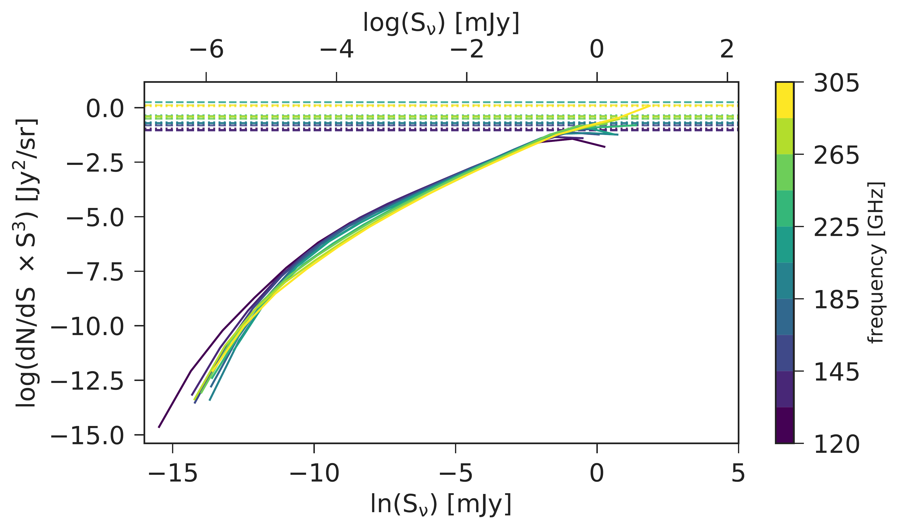
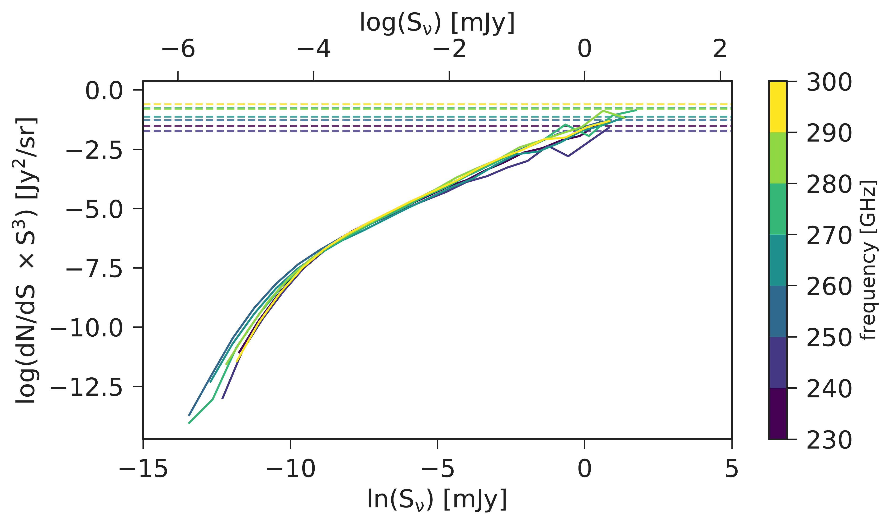

. We also include the upper limit offered by COLDz assuming that all the galaxies could be CO(2-1) emitters at high z. The black dashed line is the SIDES model without a luminosity cut and the black dotted line is the SIDES model with a luminosity cut at $\rm \sim 5 \times 10^{9}   K  km   s^{-1} pc^2$. The steps in both lines are caused by the selected redshift grid that the cosmological simulation snapshots were taken. The shaded gray areas correspond to the $\rm \rho_{H_2}$ field-to-field variance which has been computed for the same redshift ranges and sizes as the corresponding surveys. Right: Field-to-field variance in the molecular gas density in different redshift bins. The light-colored areas show the total field-to-field variance introduced in the molecular gas density estimates, while the dark-colored areas show the Poisson-only variance. The contribution of the latter to the total variance is given as a percentage on top of each rectangle. The different colors indicate the different surveys, hence different size and redshift slice. (*fig:rho_mol_vs_redshift*)

**Figure 13. -** Comparison of the CO LF resulting from the SIDES simulation with ASPECS observational data. Each LF is created using sources from 117 different $\rm 4.6   arcmin^2$-sized simulated subfields. This field size is chosen to match the size of ASPECS. The gray shaded areas with different transparencies correspond to the 16th-84th and 5th-95th percentile confidence intervals. The black solid line is the LF of the entire volume of the Uchuu simulation, and the dashed line is the median of the multiple LFs computed from all the subfields. The red line shows the resulting LF presented in B22 where the Bolshoi-Planck cosmological simulation was used, while the arrows show the last luminosity bin of the SIDES-Uchuu LFs that contains at least one source. The different colors stand for a different number of sources. (*fig:CO_LF*)

**Figure 8. -** Source flux contribution to the CO (top) and [CII](bottom) shot noise power spectrum (see Eq. \ref{eq:shot_noise}). The different color lines correspond to different frequency slices with the CONCERTO frequency resolution ($\rm1.5   GHz$) within the whole CONCERTO observing frequency range. The dashed lines are the expected shot noise level as computed by Eq. \ref{eq:shot_noise}. (*fig:number_counts*)

