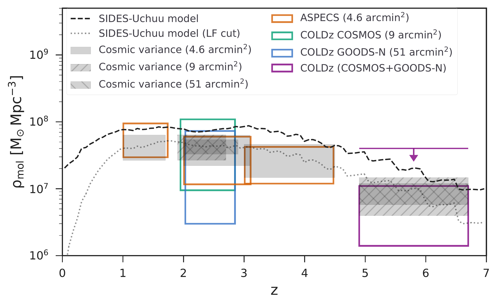
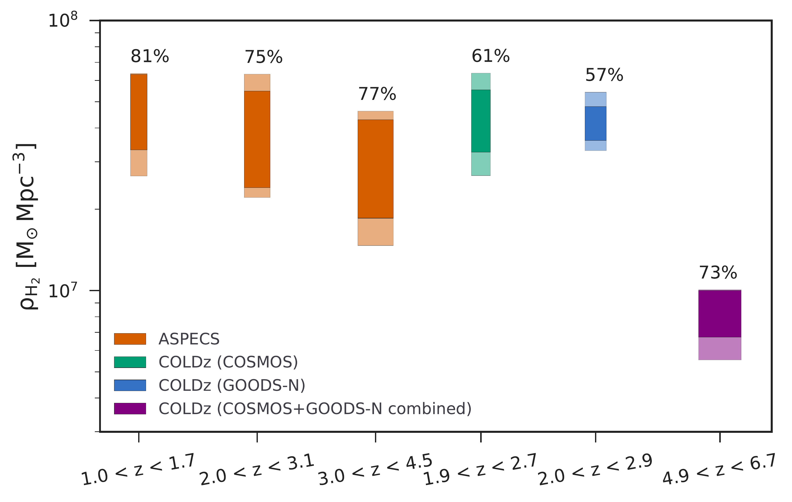

$\newcommand{\ensuremath}{}$
$\newcommand{\xspace}{}$
$\newcommand{\object}[1]{\texttt{#1}}$
$\newcommand{\farcs}{{.}''}$
$\newcommand{\farcm}{{.}'}$
$\newcommand{\arcsec}{''}$
$\newcommand{\arcmin}{'}$
$\newcommand{\ion}[2]{#1#2}$
$\newcommand{\textsc}[1]{\textrm{#1}}$
$\newcommand{\hl}[1]{\textrm{#1}}$

$\newcommand{\ensuremath}{}$
$\newcommand{\xspace}{}$
$\newcommand{\object}[1]{\texttt{#1}}$
$\newcommand{\farcs}{{.}''}$
$\newcommand{\farcm}{{.}'}$
$\newcommand{\arcsec}{''}$
$\newcommand{\arcmin}{'}$
$\newcommand{\ion}[2]{#1#2}$
$\newcommand{\textsc}[1]{\textrm{#1}}$
$\newcommand{\hl}[1]{\textrm{#1}}$

# CONCERTO: Simulating the CO, [CII], and [CI]  line emission of galaxies in a $\rm 117   deg^2$ field and the impact of field-to-field variance

<mark>Appeared on: 2022-12-05</mark> - __

A. Gkogkou, et al. -- incl., <mark>F. Walter</mark>

**Abstract:** In the submillimeter regime, spectral line scans and line intensity mapping (LIM) are new promising probes for the cold gas content and star formation rate of galaxies across cosmic time. However, both of these two measurements suffer from field-to-field variance. We study the effect of field-to-field variance on the predicted CO and [ CII ] power spectra from future LIM experiments such as CONCERTO, as well as on the line luminosity functions (LFs) and the cosmic molecular gas mass density that are currently derived from spectral line scans. We combined a $\rm 117   deg^2$ dark matter lightcone from the Uchuu cosmological simulation with the simulated infrared dusty extragalactic sky (SIDES) approach. The clustering of the dusty galaxies in the SIDES-Uchuu product is validated by reproducing the cosmic infrared background anisotropies measured by _Herschel_ and _Planck_ . We find that in order to constrain the CO LF with an uncertainty below 20 \% , we need survey sizes of at least $\rm 0.1   deg^2$ . Furthermore, accounting for the field-to-field variance using only the Poisson variance can underestimate the total variance by up to 80 \% . The lower the luminosity is and the larger the survey size is, the higher the level of underestimate. At $z<3$ , the impact of field-to-field variance on the cosmic molecular gas density can be as high as 40 \% for the 4.6 arcmin $^2$ field, but drops below 10 \% for areas larger than 0.2 deg $^2$ . However, at $z>3$ the variance decreases more slowly with survey size and for example drops below 10 \% for 1 deg $^2$ fields. Finally, we find that the CO and [ CII ] LIM power spectra can vary by up to 50 \% in $\rm 1   deg^2$ fields. This limits the accuracy of the constraints provided by the first 1 deg $^2$ surveys. In addition the level of the shot noise power is always dominated by the sources that are just below the detection thresholds, which limits its potential for deriving number densities of faint [ CII ] emitters. We provide an analytical formula to estimate the field-to-field variance of current or future LIM experiments given their observed frequency and survey size. The underlying code to derive the field-to-field variance and the full SIDES-Uchuu products (catalogs, cubes, and maps) are publicly available.

**Figure 14. -** Field-to-field variance of the molecular gas mass density, $\rm \rho_{H_2}$, at several redshift slices where observational data are available. Left: Evolution of $\rm \rho_{H_2}$ with redshift. The empty boxes are the observational data from ASPECS \citep{decarli2020} and COLDz \citep{riechers2019}. We also include the upper limit offered by COLDz assuming that all the galaxies could be CO(2-1) emitters at high z. The black dashed line is the SIDES model without a luminosity cut and the black dotted line is the SIDES model with a luminosity cut at $\rm \sim 5 \times 10^{9}   K  km   s^{-1} pc^2$. The steps in both lines are caused by the selected redshift grid that the cosmological simulation snapshots were taken. The shaded gray areas correspond to the $\rm \rho_{H_2}$ field-to-field variance which has been computed for the same redshift ranges and sizes as the corresponding surveys. Right: Field-to-field variance in the molecular gas density in different redshift bins. The light-colored areas show the total field-to-field variance introduced in the molecular gas density estimates, while the dark-colored areas show the Poisson-only variance. The contribution of the latter to the total variance is given as a percentage on top of each rectangle. The different colors indicate the different surveys, hence different size and redshift slice. (*fig:rho_mol_vs_redshift*)

**Figure 13. -** Comparison of the CO LF resulting from the SIDES simulation with ASPECS observational data. Each LF is created using sources from 117 different $\rm 4.6   arcmin^2$-sized simulated subfields. This field size is chosen to match the size of ASPECS. The gray shaded areas with different transparencies correspond to the 16th-84th and 5th-95th percentile confidence intervals. The black solid line is the LF of the entire volume of the Uchuu simulation, and the dashed line is the median of the multiple LFs computed from all the subfields. The red line shows the resulting LF presented in B22 where the Bolshoi-Planck cosmological simulation was used, while the arrows show the last luminosity bin of the SIDES-Uchuu LFs that contains at least one source. The different colors stand for a different number of sources. (*fig:CO_LF*)

**Figure 8. -** Source flux contribution to the CO (top) and [CII](bottom) shot noise power spectrum (see Eq. \ref{eq:shot_noise}). The different color lines correspond to different frequency slices with the CONCERTO frequency resolution ($\rm1.5   GHz$) within the whole CONCERTO observing frequency range. The dashed lines are the expected shot noise level as computed by Eq. \ref{eq:shot_noise}. (*fig:number_counts*)

