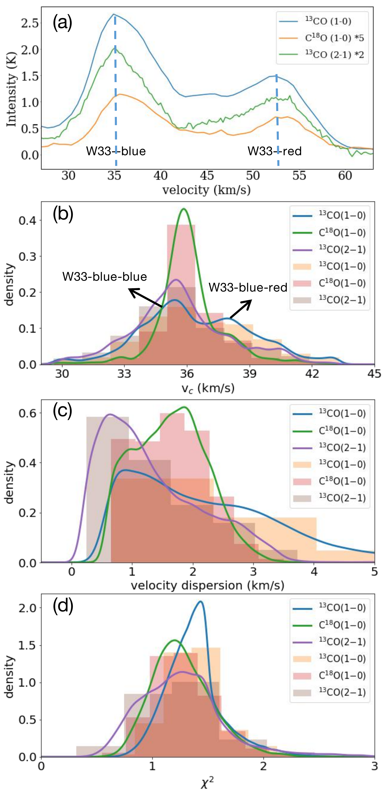

$\newcommand{\ensuremath}{}$
$\newcommand{\xspace}{}$
$\newcommand{\object}[1]{\texttt{#1}}$
$\newcommand{\farcs}{{.}''}$
$\newcommand{\farcm}{{.}'}$
$\newcommand{\arcsec}{''}$
$\newcommand{\arcmin}{'}$
$\newcommand{\ion}[2]{#1#2}$
$\newcommand{\textsc}[1]{\textrm{#1}}$
$\newcommand{\hl}[1]{\textrm{#1}}$
$\newcommand{\msun}{\mbox{M_\odot}}$
$\newcommand{\mean}[1]{\mbox{\langle#1\rangle}}$
$\newcommand{\dif}{\mathrm{d}}$
$\newcommand{\evs}{\color{olive} }$

$\newcommand{\ensuremath}{}$
$\newcommand{\xspace}{}$
$\newcommand{\object}[1]{\texttt{#1}}$
$\newcommand{\farcs}{{.}''}$
$\newcommand{\farcm}{{.}'}$
$\newcommand{\arcsec}{''}$
$\newcommand{\arcmin}{'}$
$\newcommand{\ion}[2]{#1#2}$
$\newcommand{\textsc}[1]{\textrm{#1}}$
$\newcommand{\hl}[1]{\textrm{#1}}$
$\newcommand{\msun}{\mbox{M_\odot}}$
$\newcommand{\mean}[1]{\mbox{\langle#1\rangle}}$
$\newcommand{\dif}{\mathrm{d}}$
$\newcommand{\evs}{\color{olive} }$

# Formation of hub-filament structure triggered by cloud-cloud collision in W33 complex

<mark>Appeared on: 2022-12-05</mark> - _18 pages_

Jian-Wen Zhou, et al. -- incl., <mark><mark>Shanghuo Li</mark></mark>, <mark><mark>Hong-Li Liu</mark></mark>, <mark><mark>Siju Zhang</mark></mark>, <mark><mark>Chao Zhang</mark></mark>, <mark><mark>Jin-Zeng Li</mark></mark>

**Abstract:** Hub-filament systems are suggested to be birth cradles of high-mass stars and clusters, but the formation of hub-filament structure is still unclear. Using the survey data FUGIN $^{13}$ CO (1-0), C $^{18}$ O (1-0), and SEDIGISM $^{13}$ CO (2-1), we investigate formation of hub-filament structure in W33 complex.W33 complex consists of two colliding clouds, called W33-blue and W33-red.We decompose the velocity structures in W33-blue by fitting multiple velocity components, and find a continuous and monotonic velocity field. Virial parameters of _ Dendrogram_ structures suggest the dominance of gravity in W33-blue. The strong positive correlation between velocity dispersion and column density indicates the non-thermal motions in W33-blue may originate from gravitationally driven collapse. These signatures suggest that the filamentary structures in W33-blue result from the gravitational collapse of the compressed layer. However, the large scale velocity gradient in W33-blue may mainly originate from the cloud-cloud collision and feedback of active star formation, instead of the filament-rooted longitudinal inflow. From the above observed results, we argue that the cloud-cloud collision triggers formation of hub-filament structures in W33 complex. Meanwhile, the appearance of multiple-scale hub-filament structures in W33-blue is likely an imprint of the transition from the compressed layer to a hub-filament system.

**Figure 4. -** (a) Moment-1 map of $^{13}$CO (1$-$0) for the entire W33 complex, made over the velocity range [29.6, 60.2] km s$^{-1}$. The contour is the *Herschel* H$_{2}$ column density with a level of 3.35$\times$10$^{22}$ cm$^{-2}$, dashed curve marks the bent compression structure due to cloud-cloud collision. Red “+” represents the position of W33-main, while black “+” marks the ATLASGAL clump. Dashed black box marks the bottom of collision crater, where has the most concentrated clump distribution;
(b) The colour images of *Spitzer* 8 $\mu$m emission, black “+” represents the position of W33-main, orange “+” marks the ATLASGAL clump. The red circle shows the IRDC, where the size of the circle reflects the radius of IRDC;
(c) Moment-1 map of $^{13}$CO (1$-$0) for W33-blue over the velocity range [29.6, 43.3] km s$^{-1}$. The contour is the *Herschel* dust temperature with a level of 18.6 K, black “+” marks the ATLASGAL clump. Dashed straight line roughly displays the boundary of two velocity components in W33-blue;
(d) The integrated intensity map of $^{13}$CO (1$-$0), velocity range [29.6, 43.3] km s$^{-1}$. Blue dashed lines display the filament skeletons identified by FILFINDER algorithm according to the integrated intensity map. Red contours show the peak emission of *Spitzer* 8 $\mu$m. Three orange “+” represent O4–7(super)-giant stars, red boxes mark several sub-regions from “1” to “6”, “0” represents the entire region.
(e) The velocity dispersion of W33-blue derived from the moment-2 map of $^{13}$CO (1$-$0) in the velocity range [29.6, 43.3] km s$^{-1}$, black “+” marks the ATLASGAL clump, blue dashed lines display the filament skeletons. Dashed black box marks the bottom of collision crater;
(f) The velocity dispersion of W33-blue derived from the moment-2 map of $^{13}$CO (2$-$1), gray contours show the peak emission of *Spitzer* 8 $\mu$m,  and the black “+” represents O4–7(super)-giant stars. Blue boxes in figures (b), (c) and (f) show the region investigated by \citet{Kohno2018-70S}.
 (*vf*)

**Figure 13. -** (a), (c) and (e): distributions of  normalized velocity and intensity extracted from the moment 0 and moment 1 maps of $^{13}$CO (1$-$0) emission along the filament skeletons marked in Fig.\ref{vf}; (b), (d) and (f): distributions of  normalized velocity and intensity extracted from the moment 0 and moment 1 maps of $^{13}$CO (2$-$1) emission along the filament skeletons. (*vg*)

**Figure 1. -** (a) Average spectra of $^{13}$CO (1-0), C$^{18}$O (1-0) and $^{13}$CO (2-1) for the entire W33 complex;
(b), (c) and (d) Statistical distributions of centroid velocity, velocity dispersion and $\chi^2\rm_c$ value of $^{13}$CO (1-0), C$^{18}$O (1-0) and $^{13}$CO (2-1) line emission fitted by BTS algorithm for W33-blue. (*bts*)

