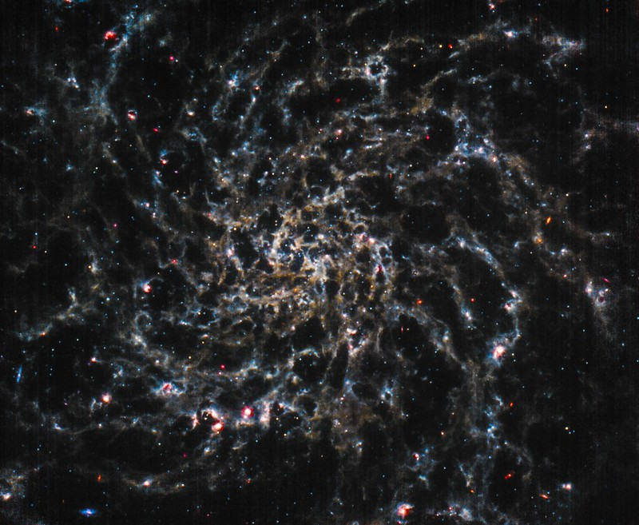
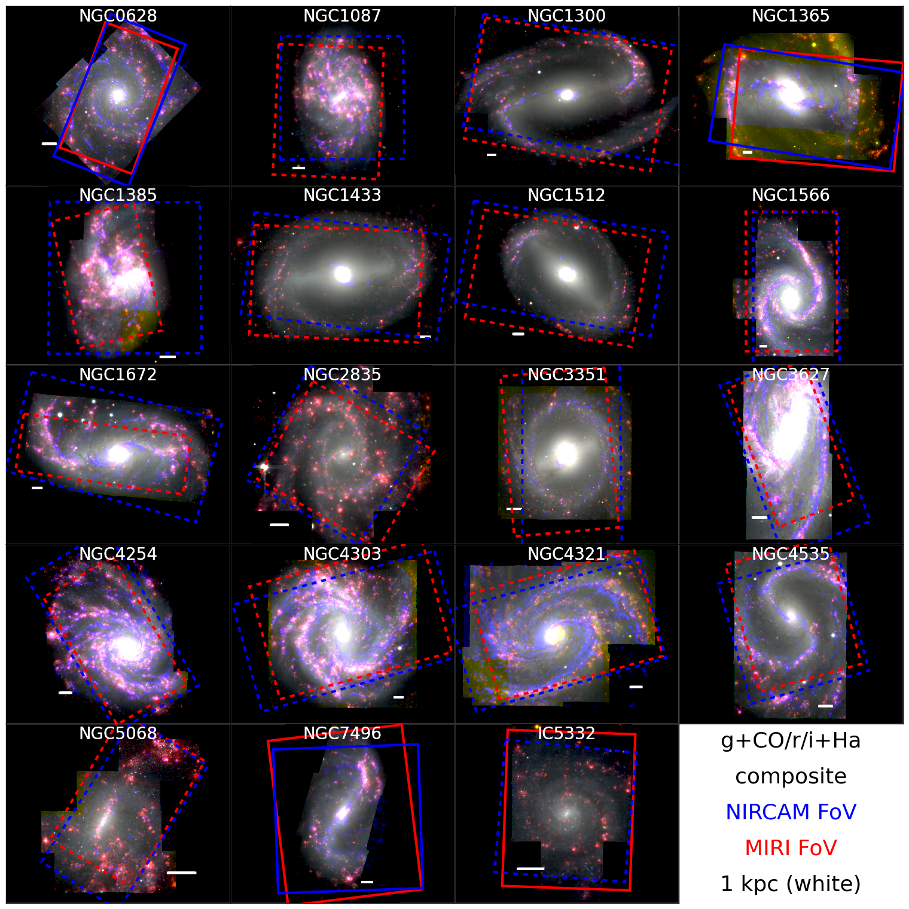

$\newcommand{\ensuremath}{}$
$\newcommand{\xspace}{}$
$\newcommand{\object}[1]{\texttt{#1}}$
$\newcommand{\farcs}{{.}''}$
$\newcommand{\farcm}{{.}'}$
$\newcommand{\arcsec}{''}$
$\newcommand{\arcmin}{'}$
$\newcommand{\ion}[2]{#1#2}$
$\newcommand{\textsc}[1]{\textrm{#1}}$
$\newcommand{\hl}[1]{\textrm{#1}}$
$\newcommand{\Caltech}{\affil{California Institute of Technology, 1200 E. California Blvd., MC 249-17, Pasadena, CA 91125, USA}}$
$\newcommand{\Tamkang}{\affil{Department of Physics, Tamkang University, No.151, Yingzhuan Rd., Tamsui Dist., New Taipei City 251301, Taiwan}}$
$\newcommand{\GEMINI}{\affil{Gemini Observatory/NSF’s NOIRLab, 950 N. Cherry Avenue, Tucson, AZ, 85719, USA$
$}}$
$\newcommand{\ASCL}{\affil{Astrophysics Source Code Librar$
$y, Michigan Technological University, 1400 Townsend Drive, Houghton, MI 49931}}$
$\newcommand{\OSU}{\affil{Department of Astronomy, The Ohio State University, 140 West 18th Avenue, Columbus, Ohio 43210, USA}}$
$\newcommand{\Alberta}{\affil{Department of Physics, University of Alberta, Edmonton, AB T6G 2E1, Canada}}$
$\newcommand{\ANU}{\affil{Research School of Astronomy and Astrophysics, Australian National University, Canberra, ACT 2611, Australia}}$
$\newcommand{\IPARCOS}{\affil{Instituto de F\'{\i}sica de Part\'{\i}culas y del Cosmos, Universidad Complutense de Madrid, E-28040 Madrid, Spain}}$
$\newcommand{\IPAC}{\affil{Caltech-IPAC, 1200 E. California Blvd. Pasadena, CA 91125, USA}}$
$\newcommand{\Carnegie}{\affil{Observatories of the Carnegie Institution for Science, 813 Santa Barbara Street, Pasadena, CA 91101, USA}}$
$\newcommand{\CCAPP}{\affil{Center for Cosmology and AstroParticle Physics, 191 West Woodruff Avenue, Columbus, OH 43210, USA}}$
$\newcommand{\CfA}{\affil{Center for Astrophysics \mid Harvard \& Smithsonian , 60 Garden Street, Cambridge, MA 02138, USA}}$
$\newcommand{\CITEVA}{\affil{Centro de Astronomía (CITEVA), Universidad de Antofagasta, Avenida Angamos 601, Antofagasta, Chile}}$
$\newcommand{\CNRS}{\affil{CNRS, IRAP, 9 Av. du Colonel Roche, BP 44346, F-31028 Toulouse cedex 4, France}}$
$\newcommand{\ESO}{\affil{European Southern Observatory, Karl-Schwarzschild Stra{\ss}e 2, D-85748 Garching bei M\"{u}nchen, Germany}}$
$\newcommand{\Heidelberg}{\affil{Astronomisches Rechen-Institut, Zentrum f\"{u}r Astronomie der Universit\"{a}t Heidelberg, M\"{o}nchhofstra\ss e 12-14, D-69120 Heidelberg, Germany}}$
$\newcommand{\COOL}{\affil{Cosmic Origins Of Life (COOL) Research DAO, coolresearch.io}}$
$\newcommand{\ICRAR}{\affil{International Centre for Radio Astronomy Research, University of Western Australia, 35 Stirling Highway, Crawley, WA 6009, Australia}}$
$\newcommand{\IRAM}{\affil{Institut de Radioastronomie Millimétrique (IRAM), 300 Rue de la Piscine, F-38406 Saint Martin d'Hères, France}}$
$\newcommand{\IRAP}{\affil{CNRS, IRAP, 9 Av. du Colonel Roche, BP 44346, F-31028 Toulouse cedex 4, France}}$
$\newcommand{\UPS}{\affil{Université de Toulouse, UPS-OMP, IRAP, F-31028 Toulouse cedex 4, France}}$
$\newcommand{\ITA}{\affil{Universit\"{a}t Heidelberg, Zentrum f\"{u}r Astronomie, Institut f\"{u}r Theoretische Astrophysik, Albert-Ueberle-Str 2, D-69120 Heidelberg, Germany}}$
$\newcommand{\IWR}{\affil{Universit\"{a}t Heidelberg, Interdisziplin\"{a}res Zentrum f\"{u}r Wissenschaftliches Rechnen, Im Neuenheimer Feld 205, D-69120 Heidelberg, Germany}}$
$\newcommand{\JHU}{\affil{Department of Physics and Astronomy, The Johns Hopkins University, Baltimore, MD 21218, USA}}$
$\newcommand{\Leiden}{\affil{Leiden Observatory, Leiden University, P.O. Box 9513, 2300 RA Leiden, The Netherlands}}$
$\newcommand{\Maryland}{\affil{Department of Astronomy, University of Maryland, College Park, MD 20742, USA}}$
$\newcommand{\MPE}{\affil{Max-Planck-Institut f\"{u}r extraterrestrische Physik, Giessenbachstra{\ss}e 1, D-85748 Garching, Germany}}$
$\newcommand{\MPIA}{\affil{Max-Planck-Institut f\"{u}r Astronomie, K\"{o}nigstuhl 17, D-69117, Heidelberg, Germany}}$
$\newcommand{\Nagoya}{\affil{Department of Physics, Nagoya University, Furo-cho, Chikusa-ku, Nagoya, Aichi 464-8602, Japan}}$
$\newcommand{\NRAO}{\affil{National Radio Astronomy Observatory, 520 Edgemont Road, Charlottesville, VA 22903-2475, USA}}$
$\newcommand{\OAN}{\affil{Observatorio Astronómico Nacional (IGN), C/Alfonso XII, 3, E-28014 Madrid, Spain}}$
$\newcommand{\ObsParis}{\affil{Sorbonne Université, Observatoire de Paris, Université PSL, CNRS, LERMA, F-75014, Paris, France}}$
$\newcommand{\Princeton}{\affil{Department of Astrophysical Sciences, Princeton University, Princeton, NJ 08544 USA}}$
$\newcommand{\UToledo}{\affil{University of Toledo, 2801 W. Bancroft St., Mail Stop 111, Toledo, OH, 43606}}$
$\newcommand{\Toulouse}{\affil{Université de Toulouse, UPS-OMP, IRAP, F-31028 Toulouse cedex 4, France}}$
$\newcommand{\UBonn}{\affil{Argelander-Institut f\"ur Astronomie, Universit\"at Bonn, Auf dem H\"ugel 71, 53121 Bonn, Germany}}$
$\newcommand{\UChile}{\affil{Departamento de Astronomía, Universidad de Chile, Camino del Observatorio 1515, Las Condes, Santiago, Chile}}$
$\newcommand{\UCM}{\affil{Departamento de F\'{\i}sica de la Tierra y Astrof\'{\i}sica, Universidad Complutense de Madrid, E-28040 Madrid, Spain}}$
$\newcommand{\UCSD}{\affil{Center for Astrophysics and Space Sciences, Department of Physics,  University of California,\San Diego, 9500 Gilman Drive, La Jolla, CA 92093, USA}}$
$\newcommand{\ULyon}{\affil{Univ Lyon, Univ Lyon 1, ENS de Lyon, CNRS, Centre de Recherche Astrophysique de Lyon UMR5574,\F-69230 Saint-Genis-Laval, France}}$
$\newcommand{\UMass}{\affil{University of Massachusetts—Amherst, 710 N. Pleasant Street, Amherst, MA 01003, USA}}$
$\newcommand{\UWyoming}{\affil{Department of Physics and Astronomy, University of Wyoming, Laramie, WY 82071, USA}}$
$\newcommand{\LAM}{\affil{$
$Aix Marseille Univ, CNRS, CNES, LAM (Laboratoire d’Astrophysique de Marseille),  F-13388 Marseille,$
$France}}$
$\newcommand{\UHawaii}{\affil{Institute for Astronomy, University of Hawaii, 2680 Woodlawn Drive, Honolulu, HI 96822, USA}}$
$\newcommand{\UGent}{\affil{Sterrenkundig Observatorium, Universiteit Gent, Krijgslaan 281 S9, B-9000 Gent, Belgium}}$
$\newcommand{\IPARC}{\affil{Instituto de F\'{\i}sica de Part\'{\i}culas y del Cosmos IPARCOS, Facultad de Ciencias F\'{\i}sicas, Universidad Complutense de Madrid, E-28040, Spain}}$
$\newcommand{\STScI}{\affil{Space Telescope Science Institute, 3700 San Martin Drive, Baltimore, MD 21218, USA}}$
$\newcommand{\STScIESA}{\affiliation{AURA for the European Space Agency (ESA), Space Telescope Science Institute, 3700 San Martin Drive, Baltimore, MD 21218, USA}}$
$\newcommand{\McMaster}{\affil{Department of Physics and Astronomy, McMaster University, Hamilton, ON L8S 4M1, Canada}}$
$\newcommand{\INAF}{\affil{INAF -- Osservatorio Astrofisico di Arcetri, Largo E. Fermi 5, I-50157, Firenze, Italy}}$
$\newcommand{\Sydney}{\affil{Sydney Institute for Astronomy, School of Physics A28, The University of Sydney, NSW 2006, Australia}}$
$\newcommand{\UA}{\affil{Centro de Astronomía (CITEVA), Universidad de Antofagasta, Avenida Angamos 601, Antofagasta, Chile}}$
$\newcommand{\LERMA}{\affil{Observatoire de Paris, PSL Research University, CNRS, Sorbonne Universit\'es, 75014 Paris}}$
$\newcommand{\SAIMSU}{\affil{Sternberg Astronomical Institute, Lomonosov Moscow State University, Universitetsky pr. 13, 119234 Moscow, Russia}}$
$\newcommand{\StockholmOKC}{\affil{The Oskar Klein Centre for Cosmoparticle Physics, Department of Physics, Stockholm University, AlbaNova, Stockholm, SE-106 91, Sweden}}$
$\newcommand{\msun}{M_{\odot}}$
$\newcommand{\sfr}{M_{\odot} yr^{-1}}$
$\newcommand{\obstime}{112.6}$

$\newcommand{$\ensuremath$}{}$
$\newcommand{$\xspace$}{}$
$\newcommand{$\object$}[1]{\texttt{#1}}$
$\newcommand{$\farcs$}{{.}''}$
$\newcommand{$\farcm$}{{.}'}$
$\newcommand{$\arcsec$}{''}$
$\newcommand{$\arcmin$}{'}$
$\newcommand{$\ion$}[2]{#1#2}$
$\newcommand{$\textsc$}[1]{\textrm{#1}}$
$\newcommand{$\hl$}[1]{\textrm{#1}}$
$\newcommand{$\Caltech$}{\affil{California Institute of Technology, 1200 E. California Blvd., MC 249-17, Pasadena, CA 91125, USA}}$
$\newcommand{$\Tamkang$}{\affil{Department of Physics, Tamkang University, No.151, Yingzhuan Rd., Tamsui Dist., New Taipei City 251301, Taiwan}}$
$\newcommand{\GEMINI}{\affil{Gemini Observatory/NSF’s NOIRLab, 950 N. Cherry Avenue, Tucson, AZ, 85719, USA$
$}}$
$\newcommand{\ASCL}{\affil{Astrophysics Source Code Librar$
$y, Michigan Technological University, 1400 Townsend Drive, Houghton, MI 49931}}$
$\newcommand{$\OSU$}{\affil{Department of Astronomy, The Ohio State University, 140 West 18th Avenue, Columbus, Ohio 43210, USA}}$
$\newcommand{$\Alberta$}{\affil{Department of Physics, University of Alberta, Edmonton, AB T6G 2E1, Canada}}$
$\newcommand{$\ANU$}{\affil{Research School of Astronomy and Astrophysics, Australian National University, Canberra, ACT 2611, Australia}}$
$\newcommand{$\IPARCOS$}{\affil{Instituto de F\'{\i}sica de Part\'{\i}culas y del Cosmos, Universidad Complutense de Madrid, E-28040 Madrid, Spain}}$
$\newcommand{$\IPAC$}{\affil{Caltech-IPAC, 1200 E. California Blvd. Pasadena, CA 91125, USA}}$
$\newcommand{$\Carnegie$}{\affil{Observatories of the Carnegie Institution for Science, 813 Santa Barbara Street, Pasadena, CA 91101, USA}}$
$\newcommand{$\CCAPP$}{\affil{Center for Cosmology and AstroParticle Physics, 191 West Woodruff Avenue, Columbus, OH 43210, USA}}$
$\newcommand{$\CfA$}{\affil{Center for Astrophysics \mid Harvard \& Smithsonian , 60 Garden Street, Cambridge, MA 02138, USA}}$
$\newcommand{$\CITEVA$}{\affil{Centro de Astronomía (CITEVA), Universidad de Antofagasta, Avenida Angamos 601, Antofagasta, Chile}}$
$\newcommand{$\CNRS$}{\affil{CNRS, IRAP, 9 Av. du Colonel Roche, BP 44346, F-31028 Toulouse cedex 4, France}}$
$\newcommand{$\ESO$}{\affil{European Southern Observatory, Karl-Schwarzschild Stra{\ss}e 2, D-85748 Garching bei M\"{u}nchen, Germany}}$
$\newcommand{$\Heidelberg$}{\affil{Astronomisches Rechen-Institut, Zentrum f\"{u}r Astronomie der Universit\"{a}t Heidelberg, M\"{o}nchhofstra\ss e 12-14, D-69120 Heidelberg, Germany}}$
$\newcommand{$\COOL$}{\affil{Cosmic Origins Of Life (COOL) Research DAO, coolresearch.io}}$
$\newcommand{$\ICRAR$}{\affil{International Centre for Radio Astronomy Research, University of Western Australia, 35 Stirling Highway, Crawley, WA 6009, Australia}}$
$\newcommand{$\IRAM$}{\affil{Institut de Radioastronomie Millimétrique (IRAM), 300 Rue de la Piscine, F-38406 Saint Martin d'Hères, France}}$
$\newcommand{$\IRAP$}{\affil{CNRS, IRAP, 9 Av. du Colonel Roche, BP 44346, F-31028 Toulouse cedex 4, France}}$
$\newcommand{$\UPS$}{\affil{Université de Toulouse, UPS-OMP, IRAP, F-31028 Toulouse cedex 4, France}}$
$\newcommand{$\ITA$}{\affil{Universit\"{a}t Heidelberg, Zentrum f\"{u}r Astronomie, Institut f\"{u}r Theoretische Astrophysik, Albert-Ueberle-Str 2, D-69120 Heidelberg, Germany}}$
$\newcommand{$\IWR$}{\affil{Universit\"{a}t Heidelberg, Interdisziplin\"{a}res Zentrum f\"{u}r Wissenschaftliches Rechnen, Im Neuenheimer Feld 205, D-69120 Heidelberg, Germany}}$
$\newcommand{$\JHU$}{\affil{Department of Physics and Astronomy, The Johns Hopkins University, Baltimore, MD 21218, USA}}$
$\newcommand{$\Leiden$}{\affil{Leiden Observatory, Leiden University, P.O. Box 9513, 2300 RA Leiden, The Netherlands}}$
$\newcommand{$\Maryland$}{\affil{Department of Astronomy, University of Maryland, College Park, MD 20742, USA}}$
$\newcommand{$\MPE$}{\affil{Max-Planck-Institut f\"{u}r extraterrestrische Physik, Giessenbachstra{\ss}e 1, D-85748 Garching, Germany}}$
$\newcommand{$\MPIA$}{\affil{Max-Planck-Institut f\"{u}r Astronomie, K\"{o}nigstuhl 17, D-69117, Heidelberg, Germany}}$
$\newcommand{$\Nagoya$}{\affil{Department of Physics, Nagoya University, Furo-cho, Chikusa-ku, Nagoya, Aichi 464-8602, Japan}}$
$\newcommand{$\NRAO$}{\affil{National Radio Astronomy Observatory, 520 Edgemont Road, Charlottesville, VA 22903-2475, USA}}$
$\newcommand{$\OAN$}{\affil{Observatorio Astronómico Nacional (IGN), C/Alfonso XII, 3, E-28014 Madrid, Spain}}$
$\newcommand{$\ObsParis$}{\affil{Sorbonne Université, Observatoire de Paris, Université PSL, CNRS, LERMA, F-75014, Paris, France}}$
$\newcommand{$\Princeton$}{\affil{Department of Astrophysical Sciences, Princeton University, Princeton, NJ 08544 USA}}$
$\newcommand{$\UToledo$}{\affil{University of Toledo, 2801 W. Bancroft St., Mail Stop 111, Toledo, OH, 43606}}$
$\newcommand{$\Toulouse$}{\affil{Université de Toulouse, UPS-OMP, IRAP, F-31028 Toulouse cedex 4, France}}$
$\newcommand{$\UBonn$}{\affil{Argelander-Institut f\"ur Astronomie, Universit\"at Bonn, Auf dem H\"ugel 71, 53121 Bonn, Germany}}$
$\newcommand{$\UChile$}{\affil{Departamento de Astronomía, Universidad de Chile, Camino del Observatorio 1515, Las Condes, Santiago, Chile}}$
$\newcommand{$\UCM$}{\affil{Departamento de F\'{\i}sica de la Tierra y Astrof\'{\i}sica, Universidad Complutense de Madrid, E-28040 Madrid, Spain}}$
$\newcommand{$\UCSD$}{\affil{Center for Astrophysics and Space Sciences, Department of Physics,  University of California,\San Diego, 9500 Gilman Drive, La Jolla, CA 92093, USA}}$
$\newcommand{$\ULyon$}{\affil{Univ Lyon, Univ Lyon 1, ENS de Lyon, CNRS, Centre de Recherche Astrophysique de Lyon UMR5574,\F-69230 Saint-Genis-Laval, France}}$
$\newcommand{$\UMass$}{\affil{University of Massachusetts—Amherst, 710 N. Pleasant Street, Amherst, MA 01003, USA}}$
$\newcommand{$\UWyoming$}{\affil{Department of Physics and Astronomy, University of Wyoming, Laramie, WY 82071, USA}}$
$\newcommand{\LAM}{\affil{$
$Aix Marseille Univ, CNRS, CNES, LAM (Laboratoire d’Astrophysique de Marseille),  F-13388 Marseille,$
$France}}$
$\newcommand{$\UHawaii$}{\affil{Institute for Astronomy, University of Hawaii, 2680 Woodlawn Drive, Honolulu, HI 96822, USA}}$
$\newcommand{$\UGent$}{\affil{Sterrenkundig Observatorium, Universiteit Gent, Krijgslaan 281 S9, B-9000 Gent, Belgium}}$
$\newcommand{$\IPARC$}{\affil{Instituto de F\'{\i}sica de Part\'{\i}culas y del Cosmos IPARCOS, Facultad de Ciencias F\'{\i}sicas, Universidad Complutense de Madrid, E-28040, Spain}}$
$\newcommand{$\STScI$}{\affil{Space Telescope Science Institute, 3700 San Martin Drive, Baltimore, MD 21218, USA}}$
$\newcommand{$\STScI$ESA}{\affiliation{AURA for the European Space Agency (ESA), Space Telescope Science Institute, 3700 San Martin Drive, Baltimore, MD 21218, USA}}$
$\newcommand{$\McMaster$}{\affil{Department of Physics and Astronomy, McMaster University, Hamilton, ON L8S 4M1, Canada}}$
$\newcommand{$\INAF$}{\affil{INAF -- Osservatorio Astrofisico di Arcetri, Largo E. Fermi 5, I-50157, Firenze, Italy}}$
$\newcommand{$\Sydney$}{\affil{Sydney Institute for Astronomy, School of Physics A28, The University of Sydney, NSW 2006, Australia}}$
$\newcommand{$\UA$}{\affil{Centro de Astronomía (CITEVA), Universidad de Antofagasta, Avenida Angamos 601, Antofagasta, Chile}}$
$\newcommand{$\LERMA$}{\affil{Observatoire de Paris, PSL Research University, CNRS, Sorbonne Universit\'es, 75014 Paris}}$
$\newcommand{$\SAIMSU$}{\affil{Sternberg Astronomical Institute, Lomonosov Moscow State University, Universitetsky pr. 13, 119234 Moscow, Russia}}$
$\newcommand{$\StockholmOKC$}{\affil{The Oskar Klein Centre for Cosmoparticle Physics, Department of Physics, Stockholm University, AlbaNova, Stockholm, SE-106 91, Sweden}}$
$\newcommand{$\msun$}{M_{\odot}}$
$\newcommand{$\sfr$}{M_{\odot} yr^{-1}}$
$\newcommand{$\obstime$}{112.6}$

# S

<mark>Appeared on: 2022-12-07</mark> - _Re-submitted after addressing minor comments from referee. To be published as part of PHANGS-JWST ApJL Focus Issue_

<mark><mark>Janice C. Lee</mark></mark>, et al. -- incl., <mark><mark>Eva Schinnerer</mark></mark>, <mark><mark>Frank Bigiel</mark></mark>, <mark><mark>Kiana F. Henny</mark></mark>, <mark><mark>Jonathan D. Henshaw</mark></mark>, <mark><mark>Annie Hughes</mark></mark>, <mark><mark>Kathryn Kreckel</mark></mark>, <mark><mark>Jing Li</mark></mark>, <mark><mark>Daizhong Liu</mark></mark>

**Abstract:** The PHANGS collaboration has been building a reference dataset for the multi-scale, multi-phase study of star formation and the interstellar medium in nearby galaxies.  With the successful launch and commissioning of JWST, we can now obtain high-resolution infrared imaging to probe the youngest stellar populations and dust emission on the scales of star clusters and molecular clouds ($\sim$5-50 pc).  In Cycle 1, PHANGS is conducting an 8-band imaging survey from 2-21$\mu$m of 19 nearby spiral galaxies.CO(2--1) mapping, optical integral field spectroscopy, and UV-optical imaging for all 19 galaxies have been obtained through large programs with ALMA, VLT/MUSE, and Hubble. PHANGS-JWST enables a full inventory of star formation, accurate measurement of the mass and age of star clusters, identification of the youngest embedded stellar populations, and characterization of the physical state of small dust grains.  When combined with Hubble catalogs of$\sim$10,000 star clusters, MUSE spectroscopic mapping of$\sim$20,000 HII regions, and$\sim$12,000 ALMA-identified molecular clouds, it becomes possible to measure the timescales and efficiencies of the earliest phases of star formation and feedback, build an empirical model of the dependence of small dust grain properties on local ISM conditions, and test our understanding of how dust-reprocessed starlight traces star formation activity, all across a diversity of galactic environments.  Here we describe the PHANGS-JWST Treasury survey, present the remarkable imaging obtained in the first few months of science operations, and provide context for the initial results presented in the first series of PHANGS-JWST publications.

**Figure 1. -** \textbf{top}: Model SEDs of dust-enshrouded young star clusters with filter coverage of the PHANGS-HST and JWST Treasury programs. Models are of a solar metallicity $10^4$ M$_\odot$ young star cluster at $d=10$ Mpc with varying ages and levels of extinction generated with CIGALE \citep[][]{boquien19,turner21}. Colored bands show the 8 JWST NIRCAM and MIRI filters, spanning from 2$-21\mu$m, selected to probe stellar photospheric emission, PAH features, and the dust continuum. The 5 UV-visible filters used by PHANGS-HST \citep{phangs-hst} appear in grey. \textbf{bottom}: Normalized throughput for each of the eight filters used in the PHANGS-JWST survey.  For comparison, the four Spitzer IRAC filters and MIPS 24 $\micron$ filter are also shown.  A model dust SED is overplotted to illustrated the features probed by each filter.  The three PAH features targeted by our survey are marked. (*fig:filters*)

**Figure 7. -** Color composite images produced by J. Schmidt from MIRI data of NGC 628 (top) and IC 5332 (bottom). Red: MIRI F2100W; orange: MIRI F1130W; cyan: MIRI F770W and extra overall brightness in grayscale: MIRI F1000W.  The images were used as the models for the first two ESA/JWST Pictures of the Month from the JWST Cycle 1 General Observers Program as featured at \url{https://esawebb.org/images/potm2208a/} and \url{https://esawebb.org/images/comparisons/potm2209a/}. (*fig:judy1*)

**Figure 2. -** Composite $gri$+H$\alpha$+CO images for the 19 galaxies in the PHANGS-JWST Treasury program. The $gri$+H$\alpha$ images are constructed from VLT MUSE full-field spectral mapping \citep{phangs-muse}, with H$\alpha$ line emission in red, and combined with ALMA CO(2--1) \citep{phangs-alma} maps, with CO(2--1) flux in blue. JWST NIRCam and MIRI footprints have been defined to overlap existing MUSE, ALMA, and HST data. Footprints shown with dashed lines represent observations that have not been executed at time of writing (October 2022), and may rotate slightly due to the range of allowed orient angles specified for the target. The JWST sample spans a factor of $\sim50$ in stellar mass and SFR, and a factor of $\sim100$ in CO surface density (Table \ref{tab:galaxysample2}). It includes galaxies with prominent dust lanes, a full range of stellar bar, bulge, spiral arm morphologies, as well as nuclear starbursts and AGN activity. (*fig:footprints*)

