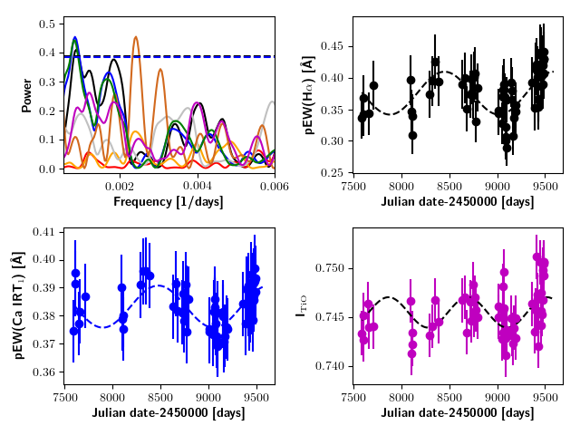
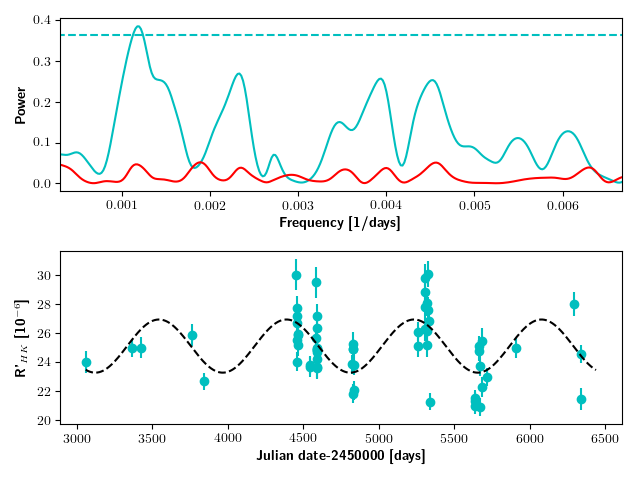
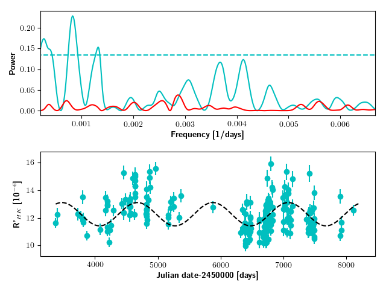
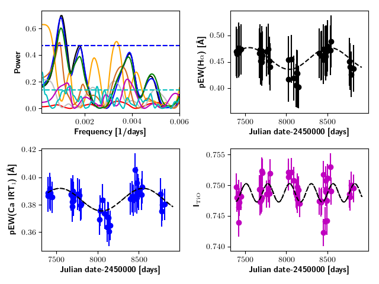

$\newcommand{\ensuremath}{}$
$\newcommand{\xspace}{}$
$\newcommand{\object}[1]{\texttt{#1}}$
$\newcommand{\farcs}{{.}''}$
$\newcommand{\farcm}{{.}'}$
$\newcommand{\arcsec}{''}$
$\newcommand{\arcmin}{'}$
$\newcommand{\ion}[2]{#1#2}$
$\newcommand{\textsc}[1]{\textrm{#1}}$
$\newcommand{\hl}[1]{\textrm{#1}}$
$\newcommand{\tbd}[1]{{[TBD: {\bfseries #1}]}}$
$\newcommand{\comm}[2]{\textit{#1} \textbf{#2}}$
$\newcommand{\vsini}{v \sin{i}}$
$\newcommand{\hei}[0]{\ion{He}{i}}$
$\newcommand{\heir}[0]{\hei IR}$
$\newcommand{\itio}[0]{I_{\mathrm{TiO}}}$
$\newcommand{\kirb}[0]{\ion{K}{i} IR_{\rm blue}}$
$\newcommand{\kirr}[0]{\ion{K}{i} IR_{\rm red}}$
$\newcommand{\kopt}[0]{\ion{K}{i}  VIS}$
$\newcommand{\koptb}[0]{\ion{K}{i} VIS_{\rm blue}}$
$\newcommand{\koptr}[0]{\ion{K}{i} VIS_{\rm red}}$
$\newcommand{\cairta}[0]{\ion{Ca}{ii} IRT_{\rm 1}}$
$\newcommand{\cairtb}[0]{\ion{Ca}{ii} IRT_{\rm 2}}$
$\newcommand{\cairt}[0]{\ion{Ca}{ii} IRT}$
$\newcommand{\cahk}[0]{\ion{Ca}{ii}~H \& K }$
$\newcommand{\rpr}[0]{R^{\prime}_{\rm HK} }$

$\newcommand{$\ensuremath$}{}$
$\newcommand{$\xspace$}{}$
$\newcommand{$\object$}[1]{\texttt{#1}}$
$\newcommand{$\farcs$}{{.}''}$
$\newcommand{$\farcm$}{{.}'}$
$\newcommand{$\arcsec$}{''}$
$\newcommand{$\arcmin$}{'}$
$\newcommand{$\ion$}[2]{#1#2}$
$\newcommand{$\textsc$}[1]{\textrm{#1}}$
$\newcommand{$\hl$}[1]{\textrm{#1}}$
$\newcommand{$\tbd$}[1]{{[TBD: {\bfseries #1}]}}$
$\newcommand{$\comm$}[2]{\textit{#1} \textbf{#2}}$
$\newcommand{$\vsini$}{v \sin{i}}$
$\newcommand{$\hei$}[0]{$\ion${He}{i}}$
$\newcommand{$\hei$r}[0]{$\hei$ IR}$
$\newcommand{$\itio$}[0]{I_{\mathrm{TiO}}}$
$\newcommand{$\kirb$}[0]{$\ion${K}{i} IR_{\rm blue}}$
$\newcommand{$\kirr$}[0]{$\ion${K}{i} IR_{\rm red}}$
$\newcommand{$\kopt$}[0]{$\ion${K}{i}  VIS}$
$\newcommand{$\kopt$b}[0]{$\ion${K}{i} VIS_{\rm blue}}$
$\newcommand{$\kopt$r}[0]{$\ion${K}{i} VIS_{\rm red}}$
$\newcommand{$\cairta$}[0]{$\ion${Ca}{ii} IRT_{\rm 1}}$
$\newcommand{$\cairtb$}[0]{$\ion${Ca}{ii} IRT_{\rm 2}}$
$\newcommand{$\cairt$}[0]{$\ion${Ca}{ii} IRT}$
$\newcommand{$\cahk$}[0]{$\ion${Ca}{ii}~H \& K }$
$\newcommand{$\rpr$}[0]{R^{\prime}_{\rm HK} }$

# The CARMENES search for exoplanets around M dwarfs: Variability on long timescales as seen in chromospheric indicators

<mark>Appeared on: 2022-12-08</mark> - _Accepted to A&A, 16 pages, 12 figures_

B. Fuhrmeister, et al. -- incl., <mark><mark>M. Kürster</mark></mark>

**Abstract:** It is clearly established that the Sun has an  11-year cycle that is caused by itsinternal magnetic field.  This cycle is also observed in a sample of M dwarfs. In the framework of exoplanet detection  or atmospheric characterisation of exoplanets, the activity status of the  host star plays a crucial role, and inactive states are preferable for such studies. This means that  it is important to know the activity cycles of these stars. We study systematic long-term variability  in a sample of 211 M dwarfs observed with CARMENES, the high-resolution optical and near-infrared  spectrograph at Calar Alto Observatory. In an automatic search using time series of different activity indicators, we  identified 26 stars with linear or quadratic trends or with potentially cyclic behaviour.   Additionally, we performed an independent search in archival$\rpr$data collected from different    instruments whose time    baselines were usually much longer. These data are available for a subset of 186 of our sample stars. Our search  revealed 22 cycle candidates in the data.  We found that  the percentage of stars showing long-term variations drops dramatically to the latest  M dwarfs.  Moreover, we found that the pseudo-equivalent width (pEW) of the  H$\alpha$and$\ion${Ca}{ii}infrared triplet   more often triggers automatic detections of long-term variations  than the TiO index,  differential line width,  chromatic index, or radial velocity. This is in line with  our comparison of the median relative amplitudes of the different indicators. For stars that trigger our automatic detection,  this leads to the highest amplitude variation in$\rpr$, followed by pEW(H$\alpha$), pEW($\cairt$), and the TiO index.

**Figure 5. -** \label{fig:J22330} GLS and time series of J22330+093 / BD+08 4887. We
         show the GLS (\emph{left, top}) with pEW(H$\alpha$) in black,
         pEW($\cairta$) in blue, pEW($\cairtb$) in green, the TiO index in magenta,
         RV in yellow, dLw in grey, CRX in orange, and the window function in red.
         The dashed blue line indicates FAP=0.01 for the pEW($\cairta$) data.
         Additionally, we show the time series for pEW(H$\alpha$) (\emph{right, top}),
         for pEW($\cairta$) (\emph{left, bottom}), and the TiO index (\emph{right, bottom}).
         The dashed black lines indicate the best sine fit for each indicator.
 (*fig:J22330*)

**Figure 11. -** \label{fig:rpalone1} GLS and time series of J10251$-$102 / BD$-$09 3070 (M1.0 V, \emph{left}) and
  J10289+008 / BD+01 2447 (M2.0 V, \emph{right}). In the GLS (\emph{top}), we show the power of the $\rpr$   data in cyan, the dashed cyan line marks the 0.0005 FAP level, and the red line
  is the power of the window function. In the time series (\emph{bottom}), we show the
  $\rpr$ values as cyan dots and the best-fit sine function as the dashed black line.
 (*fig:rpalone1*)

**Figure 8. -** \label{fig:J06105} Same as in Fig. \ref{fig:J22330}, but for J06105$-$218 / HD 42581 A.
         (*fig:J06105*)

