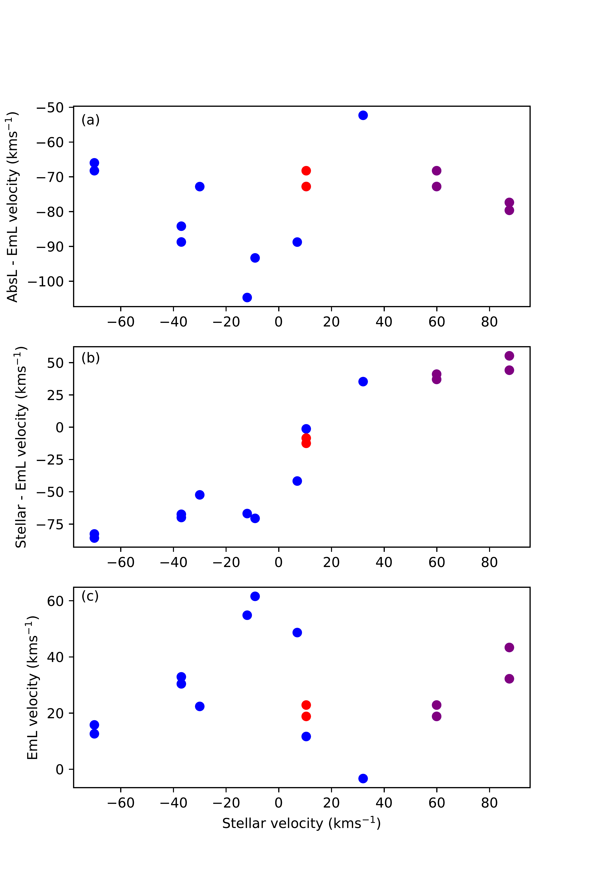
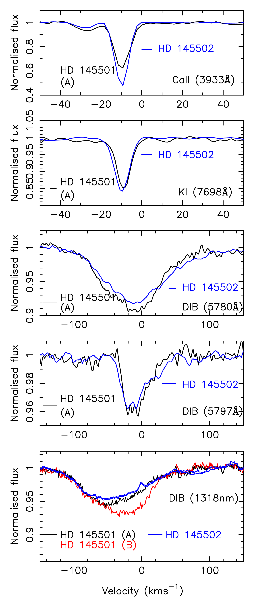
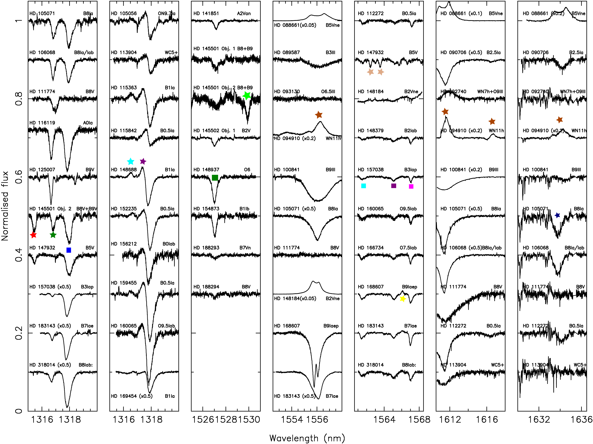

$\newcommand{\ensuremath}{}$
$\newcommand{\xspace}{}$
$\newcommand{\object}[1]{\texttt{#1}}$
$\newcommand{\farcs}{{.}''}$
$\newcommand{\farcm}{{.}'}$
$\newcommand{\arcsec}{''}$
$\newcommand{\arcmin}{'}$
$\newcommand{\ion}[2]{#1#2}$
$\newcommand{\textsc}[1]{\textrm{#1}}$
$\newcommand{\hl}[1]{\textrm{#1}}$
$\newcommand$
$\newcommand{\commentAna}[1]{\textcolor{olivegreen}{#1}}$
$\newcommand{\commentRosine}[1]{\textcolor{orange}{#1}}$
$\newcommand$
$\newcommand{\commentNick}[1]{\textcolor{blue}{#1}}$
$\newcommand{\csixty}{C_{60}\xspace}$
$\newcommand{\cseventy}{C_{70}\xspace}$
$\newcommand{\csixtyplus}{C_{60}^{+}\xspace}$
$\newcommand{\andres}[1]{\textcolor{purple}{{Andres: #1}}}$
$\newcommand{\anna}[1]{\textcolor{orange}{{Anna: #1}}}$
$\newcommand{\meriem}[1]{\textcolor{green}{{Meriem: #1}}}$
$\newcommand{\keith}[1]{\textcolor{red}{{Keith: #1}}}$
$\newcommand{\henri}[1]{\textcolor{brown}{{HB: #1}}}$
$\newcommand{\thefigure}{A\@arabic\c@figure}$

$\newcommand{\ensuremath}{}$
$\newcommand{\xspace}{}$
$\newcommand{\object}[1]{\texttt{#1}}$
$\newcommand{\farcs}{{.}''}$
$\newcommand{\farcm}{{.}'}$
$\newcommand{\arcsec}{''}$
$\newcommand{\arcmin}{'}$
$\newcommand{\ion}[2]{#1#2}$
$\newcommand{\textsc}[1]{\textrm{#1}}$
$\newcommand{\hl}[1]{\textrm{#1}}$
$\newcommand$
$\newcommand{\commentAna}[1]{\textcolor{olivegreen}{#1}}$
$\newcommand{\commentRosine}[1]{\textcolor{orange}{#1}}$
$\newcommand$
$\newcommand{\commentNick}[1]{\textcolor{blue}{#1}}$
$\newcommand{\csixty}{C_{60}\xspace}$
$\newcommand{\cseventy}{C_{70}\xspace}$
$\newcommand{\csixtyplus}{C_{60}^{+}\xspace}$
$\newcommand{\andres}[1]{\textcolor{purple}{{Andres: #1}}}$
$\newcommand{\anna}[1]{\textcolor{orange}{{Anna: #1}}}$
$\newcommand{\meriem}[1]{\textcolor{green}{{Meriem: #1}}}$
$\newcommand{\keith}[1]{\textcolor{red}{{Keith: #1}}}$
$\newcommand{\henri}[1]{\textcolor{brown}{{HB: #1}}}$
$\newcommand{\thefigure}{A\@arabic\c@figure}$

# A high resolution study of near-IR diffuse interstellar bands, search for small scale structure, time variability and stellar features

<mark>Appeared on: 2022-12-07</mark> - _Accepted for publicaion in the main journal of Astronomy and Astrophysics on 25th November 2022_

J. V. Smoker, et al. -- incl., <mark><mark>A. Müller</mark></mark>, <mark><mark>K. T. Smith</mark></mark>

**Abstract:** The diffuse interstellar bands (DIBs) are a set of hundreds of unidentified absorption features that appear near ubiquitously throughout the interstellar medium. Most DIBs appear at optical wavelengths, but some are in the near-infrared. We aim to characterise near-infrared DIBs at high spectral resolving power towards multiple targets. We observed 76 early-type stars at a resolving power of 50,000 (velocity resolution $\sim$ 6 kms $^{-1}$ ) and signal to noise ratios of several hundreds using the CRyogenic high-resolution InfraRed Echelle Spectrograph (CRIRES). These data allow us to investigate the DIBs around 1318.1, 1527.4, 1561.1, 1565.1, 1567.0, 1574.4 and/or 1624.2 nm. We detect a total of six DIB features and 17 likely stellar features assisted by comparisons with a model spectrum computed with {\sc cmfgen} .Additionally, we measured equivalent widths of the DIBs at 1318.1 and 1527.4 nm using observations with X-shooter towards ten very highly reddened (3.2 $< E(B-V) < $ 6.5) Cepheid variable stars, towards four stars observed at low values of precipitable water vapour and using other archive data. We measure correlations (correlation coefficient $r\sim$ 0.73--0.96, depending on the sub-sample used) between DIB equivalent width and reddening for the DIBs at1318.1, 1561.1, 1565.1 and 1567.0 nm. Comparing the near-infrared DIBs with 50 of the strongest optical DIBs, we find correlations $r$ > 0.8 between the 1318, 1527, 1561, 1565 or 1567 nmand optical DIBs 5705, 5780, 6203, 6283 and 6269 Å. The 5797 Å  DIB is less well correlated with the near-infrared DIBs. The DIB at 9632.1 Å, (likely C $_{60}^+$ ), is not well correlated with the 1318.1 nm DIB. Partial correlation coefficients using $E(B-V)$ as the covariate were also determined.For stars earlier than B2, the 1318.1 nm DIB is affected by an emission line on its blue wing that is likely stellar in nature, although we cannot rule out an interstellar or circumstellar origin for this line caused by for example a DIB in emission. The 1318.1 nm DIB also has an extended red wing. The line is reasonably well fitted by two gaussian components although neither the component ratios nor separation between them are obviously correlated with indicators of such as $\lambda\lambda$ 5780/5797 and reddening. EW(1318 nm) correlates with H {\sc i} with EW(1318 nm)/ $E(B-V)$ decreasing with f(H $_{2}$ ).Five pairs of stars within one arcmin of each other show very similar 1318.1 nm DIB profiles. Possible variation in the 1318.1 nm feature is seen between HD 145501 and HD 145502 (separated by 41 arcsec, equivalent to 7200 au) and HD 168607 and HD 168625 (separated by 67 arcsec, equivalent to 0.52 pc on the plane of the sky).Seventeen sightlines have repeat CRIRES observations separated by 6--14 months and two sightlines have repeat X-shooter observations separated by 9.9 years. No time-variability is detected in the 1318.1 nm DIB in the CRIRES data or the 5780.5, 5797.1 1318.1 and 1527.4 nm DIBs. Tentative time variation is observed in the "C $_{60}^+$ " DIBs at 9577 and 9632 Å   towards HD 183143 although very close to the noise level and with confirmation required. The NIRDIBs observed occur more in more UV-irradiated regions than the 5797 Å   DIB allowing the study of heavily reddened sightlines. Future searches for time variability in DIBs require higher quality data and/or larger intervals between epochs.

**Figure 2. -** (a) Difference in absorption and emission line peak velocity around 1318 nm plotted against the stellar velocity. (b) Ditto for stellar velocity minus emission line velocity. (c) Emission line velocity vs stellar velocity, assuming the emission line has a rest wavelength of 1317.37 nm. Results with the same stellar velocities are from repeat observations of a given star. Purple points are from Gaia DR2 with Red points from Gaia DR3 for HD 160065 (*Emission_minus_Stellar_Velocity*)

**Figure 8. -** Spectra of the HD 145501 / HD 144502 field in the Ca {\sc ii} and K {\sc i} lines and 5780, 5797 Å   and 1318.1 nm DIBs. We recall HD 145502 is a close binary. (*f_sss_HD_144501_HD_144502*)

**Figure 13. -** Normalised CRIRES spectra showing examples of all stellar and interstellar features observed. The ordinate is the normalised flux plus an offset with the abscissa being the wavelength in nm. Stellar lines: Red stars: 1315.4 nm, Green: 1316.8 nm, Cyan: 1316.5 nm (EmL), Purple: 1317.3 nm (EmL, uncertain), Light Green: 1529.9 nm, Yellow: 1566.1 nm (EmL), Gold: 1562.4, 1563.0, 1563.5 nm), Navy: 1633.8; Black: 1610.9 nm; Brown: 1555.7, 1616.7, 1625.3, 1626.1, 1634.2 nm (EmL). DIBs: Blue squares: 1318.1 nm, Green: 1527.1 nm, Cyan: 1561.1 nm, Purple: 1565.1 nm, Pink: 1567.0 nm. Not shown: broad and weak feature around 1564.4 nm. (*f_CRIRES_exaample_spectra_1*)

