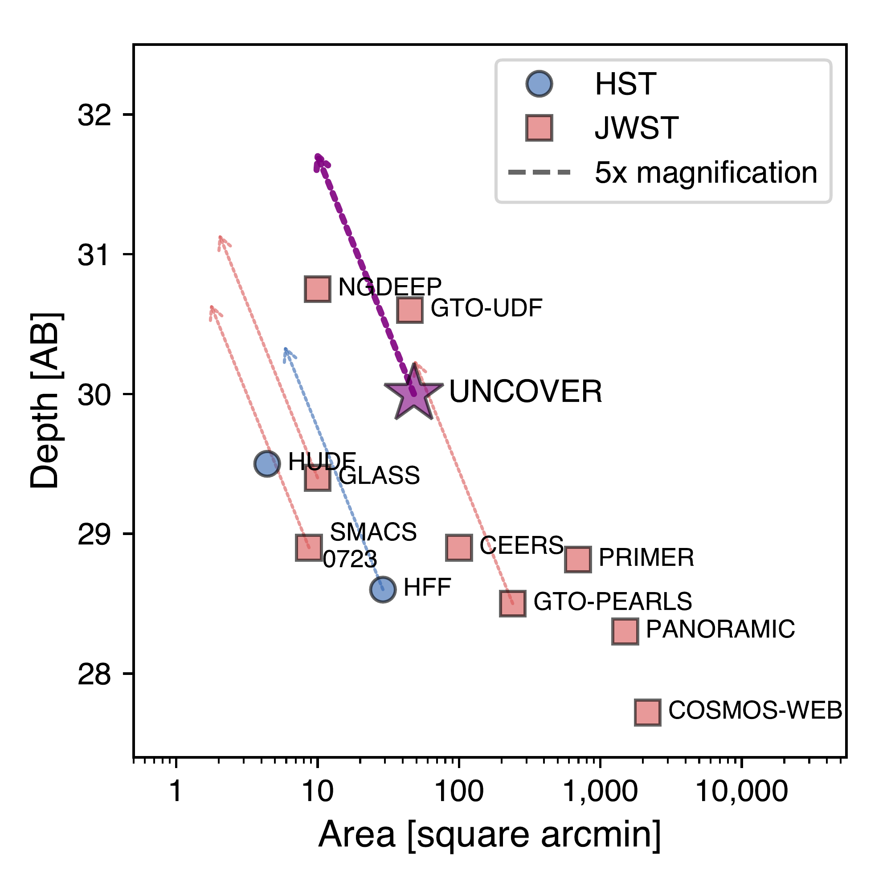

$\newcommand{\ensuremath}{}$
$\newcommand{\xspace}{}$
$\newcommand{\object}[1]{\texttt{#1}}$
$\newcommand{\farcs}{{.}''}$
$\newcommand{\farcm}{{.}'}$
$\newcommand{\arcsec}{''}$
$\newcommand{\arcmin}{'}$
$\newcommand{\ion}[2]{#1#2}$
$\newcommand{\textsc}[1]{\textrm{#1}}$
$\newcommand{\hl}[1]{\textrm{#1}}$
$\newcommand{\url}[1]{\href{#1}{#1}}$
$\newcommand{\dodoi}[1]{doi:~\href{http://doi.org/#1}{\nolinkurl{#1}}}$
$\newcommand{\doeprint}[1]{\href{http://ascl.net/#1}{\nolinkurl{http://ascl.net/#1}}}$
$\newcommand{\doarXiv}[1]{\href{https://arxiv.org/abs/#1}{\nolinkurl{https://arxiv.org/abs/#1}}}$
$\newcommand{\vdag}{(v)^\dagger}$
$\newcommand$
$\newcommand$
$\newcommand{\minus}{\scalebox{0.5}[1.0]{-}}$
$\newcommand{\}{natexlab}$

$\newcommand{\ensuremath}{}$
$\newcommand{\xspace}{}$
$\newcommand{\object}[1]{\texttt{#1}}$
$\newcommand{\farcs}{{.}''}$
$\newcommand{\farcm}{{.}'}$
$\newcommand{\arcsec}{''}$
$\newcommand{\arcmin}{'}$
$\newcommand{\ion}[2]{#1#2}$
$\newcommand{\textsc}[1]{\textrm{#1}}$
$\newcommand{\hl}[1]{\textrm{#1}}$
$\newcommand{\url}[1]{\href{#1}{#1}}$
$\newcommand{\dodoi}[1]{doi:~\href{http://doi.org/#1}{\nolinkurl{#1}}}$
$\newcommand{\doeprint}[1]{\href{http://ascl.net/#1}{\nolinkurl{http://ascl.net/#1}}}$
$\newcommand{\doarXiv}[1]{\href{https://arxiv.org/abs/#1}{\nolinkurl{https://arxiv.org/abs/#1}}}$
$\newcommand{\vdag}{(v)^\dagger}$
$\newcommand$
$\newcommand$
$\newcommand{\minus}{\scalebox{0.5}[1.0]{-}}$
$\newcommand{\}{natexlab}$

# The \JWST UNCOVER Treasury survey:\\Ultradeep NIRSpec and NIRCam ObserVations before the Epoch of Reionization

<mark>Appeared on: 2022-12-08</mark> - _17 pages, 8 figures, 4 tables, submitted to ApJ, comments welcome (v2 with full author list in metadata)_

Rachel Bezanson, et al. -- incl., <mark>Natascha Förster Schreiber</mark>, <mark>Anna de Graaff</mark>

**Abstract:** In this paper we describe the survey design for the Ultradeep NIRSpec and NIRCam ObserVations before the Epoch of Reionization (UNCOVER) Cycle 1 \JWST Treasury program, which executed its early imaging component in November 2022. The UNCOVER survey includes ultradeep ( $\sim29-30\mathrm{AB}$ ) imaging of $\sim$ 45 arcmin $^2$ on and around the well-studied Abell 2744 galaxy cluster at $z=0.308$ and will follow-up ${\sim}500$ galaxies with extremely deep low-resolution spectroscopy with the NIRSpec/PRISM during the summer of 2023. We describe the science goals, survey design, target selection, and planned data releases. We also present and characterize the depths of the first NIRCam imaging mosaic, highlighting previously unparalleled resolved and ultradeep 2-4 micron imaging of known objects in the field. The UNCOVER primary NIRCam mosaic spans 28.8 arcmin $^2$ in seven filters (F115W, F150W, F200W, F277W, F356W, F410M, F444W) and 16.8 arcmin $^2$ in our NIRISS parallel (F115W, F150W, F200W, F356W, and F444W).  To maximize early community use of the Treasury data set, we publicly release full reduced mosaics of public \JWST imaging including 45 arcmin $^2$ NIRCam and 17 arcmin $^2$ NIRISS mosaics on and around the Abell 2744 cluster, including the Hubble Frontier Field primary and parallel footprints.

**Figure 2. -** Gravitational lensing magnification contours in Abell 2744 are extremely extended, due to the complex structure of the multiple cluster cores. The above curves are taken from the CATS v4.1 \citet{jauzac:15} model, originally used for our proposal. The UNCOVER NIRCam mosaic (dark purple) spans the $\mu=2$ curve, which is significantly larger than the Hubble Frontier Field (black dashed outline). By extending to the northern subclumps and the UNCOVER mosaic will enable a more detailed mapping of that region. The UNCOVER-based lens model will be published soon (L. Furtak et al. in preparation).  (*fig:magnification*)

**Figure 1. -** The UNCOVER combined imaging (purple star) probes a unique regime in the context of \HST extragalactic ultradeep fields (blue circles) and \JWST Cycle 1 imaging surveys (red squares); without lensing it probes deeper than previous \HST surveys and wide field programs. Gravitational lensing (approximate lensing vectors indicated by dashed arrows) from the Abell 2744 allows UNCOVER imaging to probe the intrinsically faintest objects of any \JWST project in Cycle 1. We note that lensing vectors are approximate, as the UNCOVER survey includes lensed and unlensed areas of Abell 2744. (*fig:deptharea*)

**Figure 3. -** The Abell 2744 cluster has extensive deep optical/NIR (\HST and *VLT*/MUSE) and \JWST coverage. The \JWST/UNCOVER footprints (purple) along with \HST imaging (blue) and *VLT*/MUSE deep datacube (green, center) and \JWST Cycle 1 imaging and spectroscopy (red, right) against imaging from the Legacy Imaging survey \citep{dey:19}. In the left panel, we highlight the detailed layout of the UNCOVER dataset, differentiating between the first epoch (dark purple, NIRCam primary imaging and NIRISS parallel imaging) and second epoch (planned NIRSpec spectroscopy and NIRCam parallel imaging, light purple). The NIRCam mosaic is designed to match the $\mu=2$ magnification curve (see Fig.\ref{fig:magnification}). The footprints of the NIRSpec spectroscopy are provisional and subject to target selection. (*fig:footprints*)

