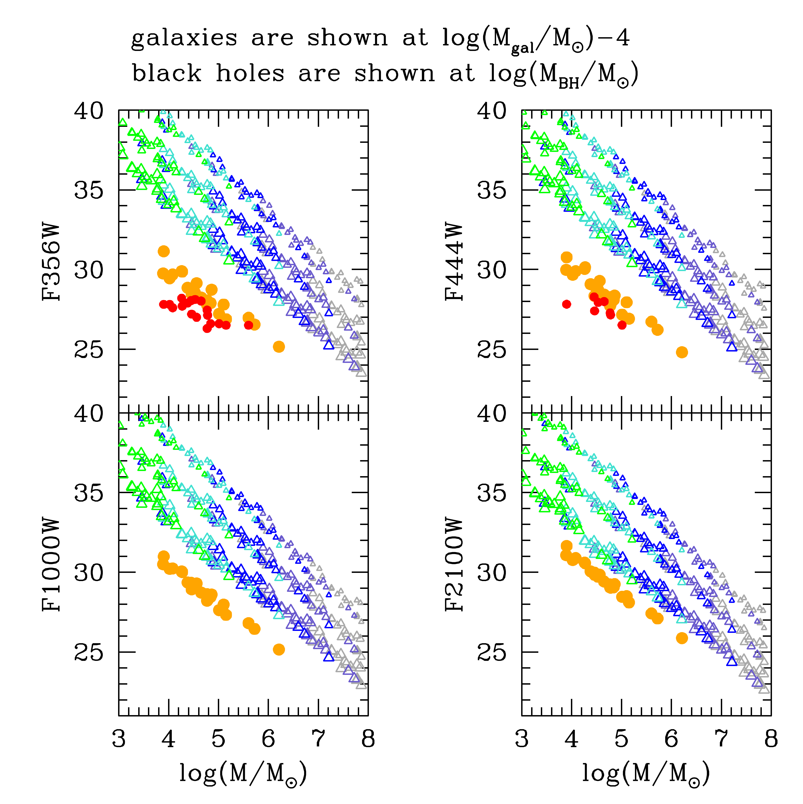
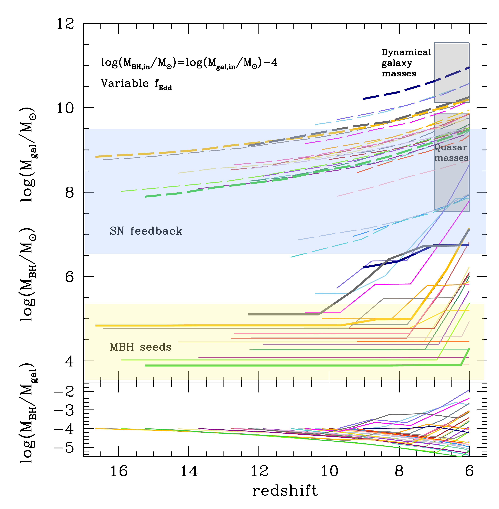
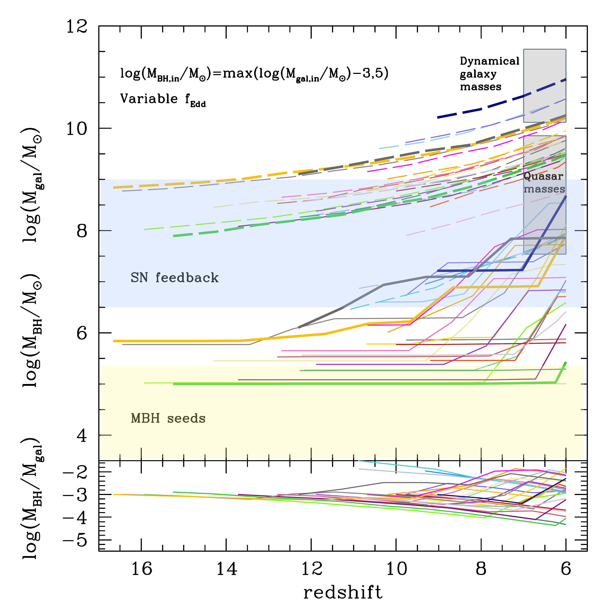
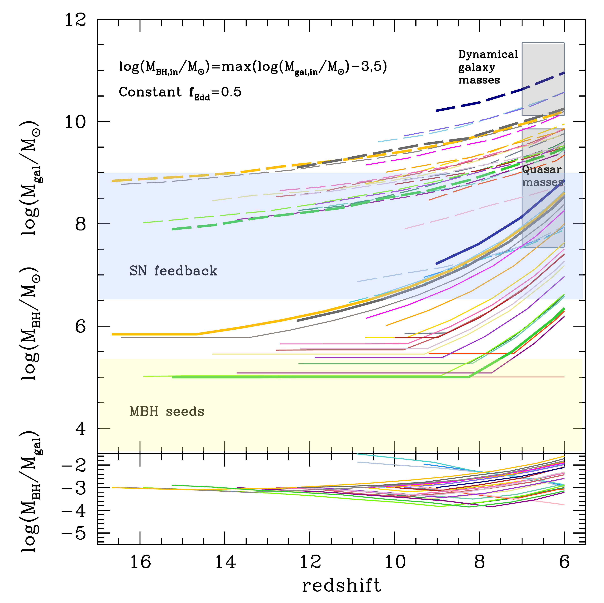

$\newcommand{\ensuremath}{}$
$\newcommand{\xspace}{}$
$\newcommand{\object}[1]{\texttt{#1}}$
$\newcommand{\farcs}{{.}''}$
$\newcommand{\farcm}{{.}'}$
$\newcommand{\arcsec}{''}$
$\newcommand{\arcmin}{'}$
$\newcommand{\ion}[2]{#1#2}$
$\newcommand{\textsc}[1]{\textrm{#1}}$
$\newcommand{\hl}[1]{\textrm{#1}}$
$\newcommand{\footnote}[1]{}$
$\newcommand{\aj}{AJ}$
$\newcommand{\actaa}{Acta Astron.}$
$\newcommand{\araa}{ARA\&A}$
$\newcommand{\apj}{ApJ}$
$\newcommand{\apjl}{ApJ}$
$\newcommand{\apjs}{ApJS}$
$\newcommand{\ao}{Appl.~Opt.}$
$\newcommand{\apss}{Ap\&SS}$
$\newcommand{\aap}{A\&A}$
$\newcommand{\aapr}{A\&AR}$
$\newcommand{\aaps}{A\&AS}$
$\newcommand{\azh}{AZh}$
$\newcommand{\baas}{BAAS}$
$\newcommand{\caa}{Chinese Astron. Astrophys.}$
$\newcommand{\cjaa}{Chinese J. Astron. Astrophys.}$
$\newcommand{\icarus}{Icarus}$
$\newcommand{\jcap}{J. Cosmology Astropart. Phys.}$
$\newcommand{\jrasc}{JRASC}$
$\newcommand{\memras}{MmRAS}$
$\newcommand{\mnras}{MNRAS}$
$\newcommand{\na}{New Astron.}$
$\newcommand{\nar}{New A Rev.}$
$\newcommand{\pra}{Phys.~Rev.~A}$
$\newcommand{\prb}{Phys.~Rev.~B}$
$\newcommand{\prc}{Phys.~Rev.~C}$
$\newcommand{\prd}{Phys.~Rev.~D}$
$\newcommand{\pre}{Phys.~Rev.~E}$
$\newcommand{\prl}{Phys.~Rev.~Lett.}$
$\newcommand{\pasa}{PASA}$
$\newcommand{\pasp}{PASP}$
$\newcommand{\pasj}{PASJ}$
$\newcommand{\qjras}{QJRAS}$
$\newcommand{\rmxaa}{Rev. Mexicana Astron. Astrofis.}$
$\newcommand{\skytel}{S\&T}$
$\newcommand{\solphys}{Sol.~Phys.}$
$\newcommand{\sovast}{Soviet~Ast.}$
$\newcommand{\ssr}{Space~Sci.~Rev.}$
$\newcommand{\zap}{ZAp}$
$\newcommand{\nat}{Nature}$
$\newcommand{\iaucirc}{IAU~Circ.}$
$\newcommand{\aplett}{Astrophys.~Lett.}$
$\newcommand{\apspr}{Astrophys.~Space~Phys.~Res.}$
$\newcommand{\bain}{Bull.~Astron.~Inst.~Netherlands}$
$\newcommand{\fcp}{Fund.~Cosmic~Phys.}$
$\newcommand{\gca}{Geochim.~Cosmochim.~Acta}$
$\newcommand{\grl}{Geophys.~Res.~Lett.}$
$\newcommand{\jcp}{J.~Chem.~Phys.}$
$\newcommand{\jgr}{J.~Geophys.~Res.}$
$\newcommand{\jqsrt}{J.~Quant.~Spec.~Radiat.~Transf.}$
$\newcommand{\memsai}{Mem.~Soc.~Astron.~Italiana}$
$\newcommand{\nphysa}{Nucl.~Phys.~A}$
$\newcommand{\physrep}{Phys.~Rep.}$
$\newcommand{\physscr}{Phys.~Scr}$
$\newcommand{\planss}{Planet.~Space~Sci.}$
$\newcommand{\procspie}{Proc.~SPIE}$
$\newcommand{\edd}{{\rm Edd}}$
$\newcommand{\beq}{\begin{equation}}$
$\newcommand{\eeq}{\end{equation}}$
$\newcommand{\msun}{ {\rm M_\odot}}$
$\newcommand{\mh}[1]{\textcolor{teal}{[Melanie: #1]}}$
$\newcommand{\mv}[1]{\textcolor{orange}{[Marta: #1]}}$
$\newcommand{\mc}[1]{\textcolor{red}{[Monica: #1]}}$
$\title[MBHs in z>9 JWST galaxies ]{What if young z>9 JWST galaxies hosted massive black holes?}$
$\author[Volonteri et al.]{Marta Volonteri,^{1}\thanks{E-mail: martav@iap.fr (MV)}$
$Mélanie Habouzit,^{2,3}$
$Monica Colpi^{4,5}$
$\^{1}Institut d'Astrophysique de Paris, Sorbonne Université, CNRS, UMR 7095, 98 bis bd Arago, 75014 Paris, France\^{2}Zentrum für Astronomie der Universität Heidelberg, ITA, Albert-Ueberle-Str. 2, D-69120 Heidelberg, Germany\^{3}Max-Planck-Institut für Astronomie, Königstuhl 17, D-69117 Heidelberg, Germany\^{4}Dipartimento di Fisica G. Occhialini, Universita di Milano-Bicocca, Piazza della Scienza 3, I-20126 Milano, Italy\^{5}INFN, Sezione di Milano-Bicocca, Piazza della Scienza 3, I-20126 Milano, Italy\}$
$\date{2022}$
$\begin{document}$
$\maketitle$
$\begin{abstract}$
$JWST is discovering star forming `candidate' galaxies with photometric redshifts z>9 and little attenuation. We model presumptive massive black holes (MBHs) in such galaxies and find that their unobscured emission is fainter than the galaxy starlight in JWST filters, and difficult to be detected via color-color selection, and X-ray and radio observations. Only MBHs  overmassive relative to expected galaxy scaling relations, accreting at high Eddington rates, would be detectable. Their discovery would point to the presence of heavy MBH seeds, but care is needed to exclude the existence of lighter seeds  as only overmassive MBHs are detectable in this type of galaxies.  Conversely, if no overmassive MBHs are hosted in these galaxies, either there are no heavy seeds or they are rare. The most massive/highest redshift candidate galaxies can attain stellar masses in excess of 5\times 10^{10}\msun by z\sim 6 if they grow along the SFR-mass sequence, and can nurse a MBH growing from \sim 10^5 \msun up to >3\times 10^7\msun by z\sim 6, to become hosts of some z > 6 quasars. Candidate galaxies of  \log( M_{\rm gal}/\msun)\sim 8 can not grow their putative seeds fast, unless seeds are \gtrsim 10^6\msun.  The number density of the JWST candidate galaxies far outnumbers that of the highest-z quasar hosts and this allows for about only 1 bright z\sim 6-7 quasar every 1000 of these galaxies.$
$\end{abstract}$
$\begin{keywords}$
$galaxies: high-redshift  - quasars: supermassive black holes -  galaxies: evolution - galaxies: active$
$\end{keywords}$
$\n\end{document}\end{equation}}$
$\newcommand{\eeq}{\end{equation}}$
$\newcommand{\msun}{ {\rm M_\odot}}$
$\newcommand{\mh}[1]{\textcolor{teal}{[Melanie: #1]}}$
$\newcommand{\mv}[1]{\textcolor{orange}{[Marta: #1]}}$
$\newcommand{\mc}[1]{\textcolor{red}{[Monica: #1]}}$

$\newcommand{\ensuremath}{}$
$\newcommand{\xspace}{}$
$\newcommand{\object}[1]{\texttt{#1}}$
$\newcommand{\farcs}{{.}''}$
$\newcommand{\farcm}{{.}'}$
$\newcommand{\arcsec}{''}$
$\newcommand{\arcmin}{'}$
$\newcommand{\ion}[2]{#1#2}$
$\newcommand{\textsc}[1]{\textrm{#1}}$
$\newcommand{\hl}[1]{\textrm{#1}}$
$\newcommand{\footnote}[1]{}$
$\newcommand{\aj}{AJ}$
$\newcommand{\actaa}{Acta Astron.}$
$\newcommand{\araa}{ARA\&A}$
$\newcommand{\apj}{ApJ}$
$\newcommand{\apjl}{ApJ}$
$\newcommand{\apjs}{ApJS}$
$\newcommand{\ao}{Appl.~Opt.}$
$\newcommand{\apss}{Ap\&SS}$
$\newcommand{\aap}{A\&A}$
$\newcommand{\aapr}{A\&AR}$
$\newcommand{\aaps}{A\&AS}$
$\newcommand{\azh}{AZh}$
$\newcommand{\baas}{BAAS}$
$\newcommand{\caa}{Chinese Astron. Astrophys.}$
$\newcommand{\cjaa}{Chinese J. Astron. Astrophys.}$
$\newcommand{\icarus}{Icarus}$
$\newcommand{\jcap}{J. Cosmology Astropart. Phys.}$
$\newcommand{\jrasc}{JRASC}$
$\newcommand{\memras}{MmRAS}$
$\newcommand{\mnras}{MNRAS}$
$\newcommand{\na}{New Astron.}$
$\newcommand{\nar}{New A Rev.}$
$\newcommand{\pra}{Phys.~Rev.~A}$
$\newcommand{\prb}{Phys.~Rev.~B}$
$\newcommand{\prc}{Phys.~Rev.~C}$
$\newcommand{\prd}{Phys.~Rev.~D}$
$\newcommand{\pre}{Phys.~Rev.~E}$
$\newcommand{\prl}{Phys.~Rev.~Lett.}$
$\newcommand{\pasa}{PASA}$
$\newcommand{\pasp}{PASP}$
$\newcommand{\pasj}{PASJ}$
$\newcommand{\qjras}{QJRAS}$
$\newcommand{\rmxaa}{Rev. Mexicana Astron. Astrofis.}$
$\newcommand{\skytel}{S\&T}$
$\newcommand{\solphys}{Sol.~Phys.}$
$\newcommand{\sovast}{Soviet~Ast.}$
$\newcommand{\ssr}{Space~Sci.~Rev.}$
$\newcommand{\zap}{ZAp}$
$\newcommand{\nat}{Nature}$
$\newcommand{\iaucirc}{IAU~Circ.}$
$\newcommand{\aplett}{Astrophys.~Lett.}$
$\newcommand{\apspr}{Astrophys.~Space~Phys.~Res.}$
$\newcommand{\bain}{Bull.~Astron.~Inst.~Netherlands}$
$\newcommand{\fcp}{Fund.~Cosmic~Phys.}$
$\newcommand{\gca}{Geochim.~Cosmochim.~Acta}$
$\newcommand{\grl}{Geophys.~Res.~Lett.}$
$\newcommand{\jcp}{J.~Chem.~Phys.}$
$\newcommand{\jgr}{J.~Geophys.~Res.}$
$\newcommand{\jqsrt}{J.~Quant.~Spec.~Radiat.~Transf.}$
$\newcommand{\memsai}{Mem.~Soc.~Astron.~Italiana}$
$\newcommand{\nphysa}{Nucl.~Phys.~A}$
$\newcommand{\physrep}{Phys.~Rep.}$
$\newcommand{\physscr}{Phys.~Scr}$
$\newcommand{\planss}{Planet.~Space~Sci.}$
$\newcommand{\procspie}{Proc.~SPIE}$
$\newcommand{\edd}{{\rm Edd}}$
$\newcommand{\beq}{\begin{equation}}$
$\newcommand{\eeq}{\end{equation}}$
$\newcommand{\msun}{ {\rm M_\odot}}$
$\newcommand{\mh}[1]{\textcolor{teal}{[Melanie: #1]}}$
$\newcommand{\mv}[1]{\textcolor{orange}{[Marta: #1]}}$
$\newcommand{\mc}[1]{\textcolor{red}{[Monica: #1]}}$
$\title[MBHs in z>9 JWST galaxies ]{What if young z>9 JWST galaxies hosted massive black holes?}$
$\author[Volonteri et al.]{Marta Volonteri,^{1}\thanks{E-mail: martav@iap.fr (MV)}$
$Mélanie Habouzit,^{2,3}$
$Monica Colpi^{4,5}$
$\^{1}Institut d'Astrophysique de Paris, Sorbonne Université, CNRS, UMR 7095, 98 bis bd Arago, 75014 Paris, France\^{2}Zentrum für Astronomie der Universität Heidelberg, ITA, Albert-Ueberle-Str. 2, D-69120 Heidelberg, Germany\^{3}Max-Planck-Institut für Astronomie, Königstuhl 17, D-69117 Heidelberg, Germany\^{4}Dipartimento di Fisica G. Occhialini, Universita di Milano-Bicocca, Piazza della Scienza 3, I-20126 Milano, Italy\^{5}INFN, Sezione di Milano-Bicocca, Piazza della Scienza 3, I-20126 Milano, Italy\}$
$\date{2022}$
$\begin{document}$
$\maketitle$
$\begin{abstract}$
$JWST is discovering star forming `candidate' galaxies with photometric redshifts z>9 and little attenuation. We model presumptive massive black holes (MBHs) in such galaxies and find that their unobscured emission is fainter than the galaxy starlight in JWST filters, and difficult to be detected via color-color selection, and X-ray and radio observations. Only MBHs  overmassive relative to expected galaxy scaling relations, accreting at high Eddington rates, would be detectable. Their discovery would point to the presence of heavy MBH seeds, but care is needed to exclude the existence of lighter seeds  as only overmassive MBHs are detectable in this type of galaxies.  Conversely, if no overmassive MBHs are hosted in these galaxies, either there are no heavy seeds or they are rare. The most massive/highest redshift candidate galaxies can attain stellar masses in excess of 5\times 10^{10}\msun by z\sim 6 if they grow along the SFR-mass sequence, and can nurse a MBH growing from \sim 10^5 \msun up to >3\times 10^7\msun by z\sim 6, to become hosts of some z > 6 quasars. Candidate galaxies of  \log( M_{\rm gal}/\msun)\sim 8 can not grow their putative seeds fast, unless seeds are \gtrsim 10^6\msun.  The number density of the JWST candidate galaxies far outnumbers that of the highest-z quasar hosts and this allows for about only 1 bright z\sim 6-7 quasar every 1000 of these galaxies.$
$\end{abstract}$
$\begin{keywords}$
$galaxies: high-redshift  - quasars: supermassive black holes -  galaxies: evolution - galaxies: active$
$\end{keywords}$
$\n\end{document}\end{equation}}$
$\newcommand{\eeq}{\end{equation}}$
$\newcommand{\msun}{ {\rm M_\odot}}$
$\newcommand{\mh}[1]{\textcolor{teal}{[Melanie: #1]}}$
$\newcommand{\mv}[1]{\textcolor{orange}{[Marta: #1]}}$
$\newcommand{\mc}[1]{\textcolor{red}{[Monica: #1]}}$

# What if young $z>9$ JWST galaxies hosted massive black holes?

<mark>Appeared on: 2022-12-09</mark> - _Published in MNRAS_

Marta Volonteri, <mark><mark>Melanie Habouzit</mark></mark>, Monica Colpi

**Abstract:** JWST is discovering star forming `candidate' galaxies with photometric redshifts $z>9$ and little attenuation. We model presumptive massive black holes (MBHs) in such galaxies and find that their unobscured emission is fainter than the galaxy starlight in JWST filters, and difficult to be detected via color-color selection, and X-ray and radio observations. Only MBHs  overmassive relative to expected galaxy scaling relations, accreting at high Eddington rates, would be detectable. Their discovery would point to the presence of heavy MBH seeds, but care is needed to exclude the existence of lighter seeds  as only overmassive MBHs are detectable in this type of galaxies.  Conversely, if no overmassive MBHs are hosted in these galaxies, either there are no heavy seeds or they are rare. The most massive/highest redshift candidate galaxies can attain stellar masses in excess of $5\times 10^{10}\msun$ by $z\sim 6$ if they grow along the SFR-mass sequence, and can nurse a MBH growing from $\sim 10^5 \msun$ up to $>3\times 10^7\msun$ by $z\sim 6$ , to become hosts of some $z > 6$ quasars. Candidate galaxies of $\log( M_{\rm gal}/\msun)\sim 8$ can not grow their putative seeds fast, unless seeds are $\gtrsim 10^6\msun$ .  The number density of the JWST candidate galaxies far outnumbers that of the highest- $z$ quasar hosts and this allows for about only 1 bright $z\sim 6-7$ quasar every 1000 of these galaxies.

**Figure 7. -** Comparison of AGN and galaxy luminosity using our models: apparent magnitude of AGN and galaxies.
    Triangles show the AGN magnitudes corresponding to MBHs following different scaling relations with the host galaxies, and accreting at fractions of the Eddington limit. Green: MBHs with mass $\log(M_{\rm gal}/$\msun$)-5$; turquoise: MBHs with mass $\log(M_{\rm gal}/$\msun$)-4$; blue: MBHs with mass $\log(M_{\rm gal}/$\msun$)-3$; slate grey: MBHs with mass $\log(M_{\rm gal}/$\msun$)-2$; grey: MBHs with mass $\log(M_{\rm gal}/$\msun$)-1$. The size of the symbol scales with the Eddington ratio: small for $\log(f_{\rm Edd})=-2$, medium for $\log(f_{\rm Edd})=-1$, large for $\log(f_{\rm Edd})=0$.
    Red dots: F356W or F444W  from observational references (only a fraction of the candidates have published photometry, therefore some of the sources are not shown). Photometric errors are not shown for clarity but they are less than 10 per cent. Orange dots: galaxy apparent magnitude from our models. Galaxies are shown at the mass corresponding to $\log(M_{\rm gal}/$\msun$)-4$. The simple galaxy model we use produces reasonable results. When comparing AGN and galaxy magnitudes we see that AGN can be brighter than the host only when they are overmassive with respect to the nominal relation and they have high Eddington ratios. (*fig:compareL*)

**Figure 8. -** Examples of MBH (solid curves) and galaxy (dashed curves) evolution, taking as initial conditions the galaxies in Table 1 and making different assumptions for the MBHs they host (top: $\log(M_{\rm BH}/$\msun$)=\log(M_{\rm gal}/$\msun$)-4$; bottom:  $\log(M_{\rm BH}/$\msun$)=\max(5,\log(M_{\rm gal}/$\msun$)-3)$), effect of SNae (top-left and bottom: $M_{\rm SN}=10^9 $\msun$$; top-right: $M_{\rm SN}=3\times10^9 $\msun$$), and their growth rate (top, bottom-left: scaling with SFR; bottom-right: $f_{\rm Edd}=0.5$). Galaxies are always assumed to grow along the SFR-galaxy mass sequence. The thicker curves highlight some example galaxies: SMACS\_z10b, SMACS\_z16b, S5-z17-1, GL-z12. In all panels the bottom region shows the ratio of MBH to galaxy mass, without highlighting specific galaxies. (*fig:growth*)

**Figure 1. -** Difference between the AGN and galaxy magnitude (shown only for magnitude differences less than $\pm2$). Colors as in Fig. \ref{fig:compareL} and the symbol size also scales with Eddington ratio as described in that Figure. The grey shaded area shows the region where the AGN is fainter than the stellar component.
At most JWST wavelengths only MBHs with mass larger than $\log(M_{\rm gal}/$\msun$)-2$ can outshine their host galaxy, whereas MBHs with mass $\log(M_{\rm gal}/$\msun$)-2$ and $\log(f_{\rm Edd})=0$ can outshine the galaxy at the longest JWST wavelengths. MBHs on the nominal relation are always fainter than their host galaxy.  (*fig:compareLzoom*)

