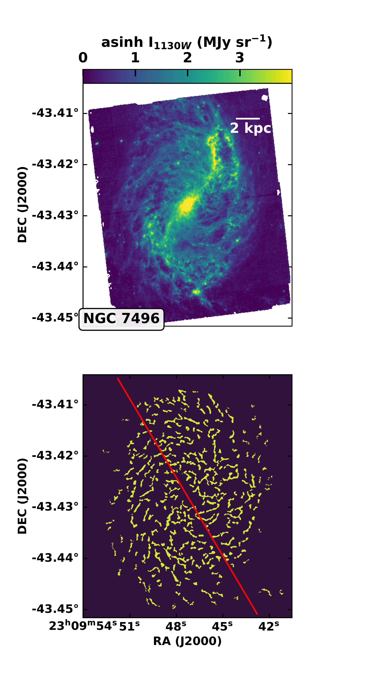
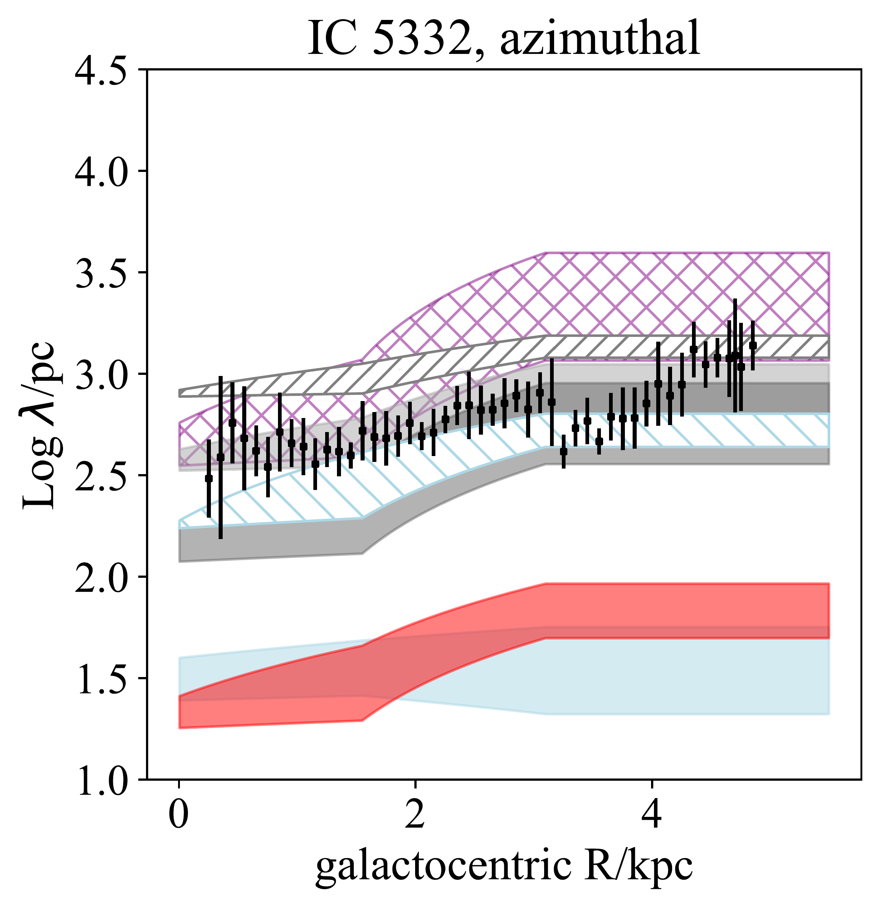

$\newcommand{\ensuremath}{}$
$\newcommand{\xspace}{}$
$\newcommand{\object}[1]{\texttt{#1}}$
$\newcommand{\farcs}{{.}''}$
$\newcommand{\farcm}{{.}'}$
$\newcommand{\arcsec}{''}$
$\newcommand{\arcmin}{'}$
$\newcommand{\ion}[2]{#1#2}$
$\newcommand{\textsc}[1]{\textrm{#1}}$
$\newcommand{\hl}[1]{\textrm{#1}}$
$\newcommand{\degree}{\ensuremath{^\circ}}$
$\newcommand{\kmskpc}{ap{km s^{-1} kpc^{-1}}}$
$\newcommand{\meanv}{\ensuremath{<v>}}$
$\newcommand{\vect}[1]{\boldsymbol{#1}}$
$\newcommand{\}{sol}$
$\newcommand{\}{natexlab}$

$\newcommand{$\ensuremath$}{}$
$\newcommand{$\xspace$}{}$
$\newcommand{$\object$}[1]{\texttt{#1}}$
$\newcommand{$\farcs$}{{.}''}$
$\newcommand{$\farcm$}{{.}'}$
$\newcommand{$\arcsec$}{''}$
$\newcommand{$\arcmin$}{'}$
$\newcommand{$\ion$}[2]{#1#2}$
$\newcommand{$\textsc$}[1]{\textrm{#1}}$
$\newcommand{$\hl$}[1]{\textrm{#1}}$
$\newcommand{$\degree$}{$\ensuremath${^\circ}}$
$\newcommand{$\kmskpc$}{ap{km s^{-1} kpc^{-1}}}$
$\newcommand{$\meanv$}{$\ensuremath${<v>}}$
$\newcommand{$\vect$}[1]{\boldsymbol{#1}}$
$\newcommand{\}{sol}$
$\newcommand{\}{natexlab}$

# PHANGS--JWST First Results: ISM structure on the turbulent Jeans scale in four disk galaxies observed by JWST and ALMA

<mark>Appeared on: 2022-12-14</mark> - _15 pages, 4 figures. Accepted as part of a PHANGS-JWST ApJL Focus Issue_

Sharon E. Meidt, et al. -- incl., <mark>Eva~Schinnerer</mark>, <mark>Janice C. Lee</mark>, <mark>Jonathan~D.~Henshaw</mark>, <mark>Daizhong Liu</mark>, <mark>Rowan J. Smith</mark>

**Abstract:** JWST/MIRI imaging of the nearby galaxies IC 5332, NGC 628, NGC 1365 and NGC 7496 from PHANGS reveals a richness of gas structures that in each case form a quasi-regular network of interconnected filaments, shells and voids.  We examine whether this multi-scale network of structure is consistent with the fragmentation of the gas disk through gravitational instability.  We use FilFinder to detect the web of filamentary features in each galaxy and determine their characteristic radial and azimuthal spacings.  These spacings are then compared to estimates of the most Toomre-unstable length (a few kpc), the turbulent Jeans length (a few hundred pc) and the disk scale height (tens of pc) reconstructed using PHANGS-ALMA observations of the molecular gas as a dynamical tracer.  Our analysis of the four galaxies targeted in this work indicates that Jeans-scale structure is pervasive.  Future work will be essential for determining how the structure observed in gas disks impacts not only the rate and location of star formation but also how stellar feedback interacts positively or negatively with the surrounding multi-phase gas reservoir.

**Figure 2. -** (Top) JWST/MIRI 11.3 micron images and (bottom) FilFinder masks (see $\S$\ref{sec:FilFinder}) for two PHANGS-JWST targets, NGC 0628 (left) and IC 5332 (right).  The MIRI images are displayed on a asinh stretch.  The physical scale is indicated by a white bar in the left panels, while the red ellipse in the right panels positioned at a galactocentric radius $R$=2 kpc marks the orientation of elliptical annuli in the azimuthal spacings of the filaments identified in these two galaxies.  \ (*fig:maps1*)

**Figure 3. -** (Top) JWST/MIRI 11.3 micron images and (bottom) FilFinder masks (see $\S$\ref{sec:FilFinder}) for two PHANGS-JWST targets, NGC 1365 (left) and NGC 7496 (right).  The MIRI images are displayed on a asinh stretch. The physical scale is indicated by a white bar in the left panels, while the red lines in the right panels illustrate the orientation of one of the segments along which radial spacings are measured in these two galaxies. (deprojected).\ (*fig:maps2*)

**Figure 4. -** Comparison between the spacings measured for filaments detected by FilFinder (black) and estimates for the Jeans length, Toomre length, most unstable 2D wavelength and gas scale height (gray, blue, red and purple hatched regions) in (clockwise from top left) NGC 628, IC 5332, NGC 7496 and NGC 1365.  In NGC 628 and IC 5332 the average azimuthal filament spacings in 300-pc wide (projected) radial bins are shown. In NGC 1365 and NGC 7496, the average radial filaments spacings in two radial zones $R<$2.5 kpc and $R>2.5$ kpc are shown.  The dark gray bar depicts the Jeans length estimated (where possible) using a determination of the equilibrium gas scale height show in red (see $\S$\ref{sec:jeanstoomre}), while the light gray band shows the range of values implied adopting a fixed 100-pc scale height.  The light blue band traces the range in Toomre lengths estimated for each gas disk.  The purple band shows the value estimated for $\lambda_{2D}$ where 2D structure preferentially forms as long as $Q$ does not exceed unity.  Note that, given the estimated $\lambda_T$, these $\lambda_{2D}$ estimates would all coincide with $Q>1$, disfavoring structure on this scale (see eq. [\ref{eq:toomre}]). Additional hatched light gray and light blue bands for IC 5332 show, respectively, the Jeans length (forward hatch) and Toomre length (backward hatch) when an atomic gas component is included, assuming a constant $h$=100 pc.
  (*fig:spacings*)

