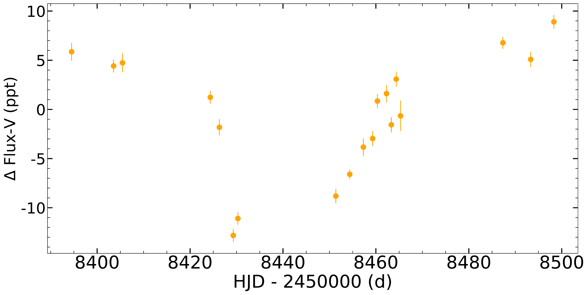

$\newcommand{\ensuremath}{}$
$\newcommand{\xspace}{}$
$\newcommand{\object}[1]{\texttt{#1}}$
$\newcommand{\farcs}{{.}''}$
$\newcommand{\farcm}{{.}'}$
$\newcommand{\arcsec}{''}$
$\newcommand{\arcmin}{'}$
$\newcommand{\ion}[2]{#1#2}$
$\newcommand{\textsc}[1]{\textrm{#1}}$
$\newcommand{\hl}[1]{\textrm{#1}}$

$\newcommand{$\ensuremath$}{}$
$\newcommand{$\xspace$}{}$
$\newcommand{$\object$}[1]{\texttt{#1}}$
$\newcommand{$\farcs$}{{.}''}$
$\newcommand{$\farcm$}{{.}'}$
$\newcommand{$\arcsec$}{''}$
$\newcommand{$\arcmin$}{'}$
$\newcommand{$\ion$}[2]{#1#2}$
$\newcommand{$\textsc$}[1]{\textrm{#1}}$
$\newcommand{$\hl$}[1]{\textrm{#1}}$

# The data used in this paper is available in electronic form at the CDS via anonymous ftp to cdsarc.u-strasbg.fr (130.79.128.5) or via http://cdsweb.u-strasbg.fr/cgi-bin/qcat?J/A+A/

<mark>Appeared on: 2022-12-15</mark> - _23 pages, 20 figures, 3 tables_

A. Suárez Mascareño, et al. -- incl., <mark><mark>J. Lillo-Box</mark></mark>, <mark><mark>J. I. González Hernández</mark></mark>, <mark><mark>Th. Henning</mark></mark>

**Abstract:** We report the discovery and characterisation of two Earth-mass planets orbiting in the habitable zone of the nearby M-dwarf GJ 1002 based on the analysis of the radial-velocity (RV) time series from the ESPRESSO and CARMENES spectrographs. The host star is the quiet M5.5 V star GJ 1002  (relatively faint in the optical,$V \sim 13.8$mag, but brighter in the infrared,$J \sim 8.3$mag), located at 4.84 pc from the Sun. We analyse 139 spectroscopic observations taken between 2017 and 2021. We performed a joint analysis of the time series of the RV and full-width half maximum (FWHM) of the cross-correlation function (CCF) to model the planetary and stellar signals present in the data, applying Gaussian process regression to deal with the stellar activity. We detect the signal of two planets orbiting GJ 1002. GJ 1002 b is a planet with a minimum mass$m_p \sin i $of 1.08$\pm$0.13 M$_{\oplus}$with an orbital period of 10.3465$\pm$0.0027 days at a distance of 0.0457$\pm$0.0013 au from its parent star, receiving an estimated stellar flux of 0.67$F_{\oplus}$. GJ 1002 c is a planet with a minimum mass$m_p \sin i $of 1.36$\pm$0.17 M$_{\oplus}$with an orbital period of 20.202$\pm$0.013 days at a distance of 0.0738$\pm$0.0021 au from its parent star, receiving an estimated stellar flux of 0.257$F_{\oplus}$. We also detect the rotation signature of the star, with a period of 126$\pm$15 days. We find that there is a correlation between the temperature of certain optical elements in the spectrographs and changes in the instrumental profile that can affect the scientific data, showing a seasonal behaviour that creates spurious signals at periods longer than$\sim$200 days. GJ 1002 is one of the few known nearby systems with planets that could potentially host habitable environments. The closeness of the host star to the Sun makes the angular sizes of the orbits of both planets ($\sim$9.7 mas and$\sim$15.7 mas, respectively) large enough for their atmosphere to be studied via high-contrast high-resolution spectroscopy with instruments such as the future spectrograph ANDES for the ELT or the LIFE mission.

**Figure 19. -** Activity indicators (left panels) and their GLS periodograms (right panels). All spectroscopic indictors have been detrended against the temperature of the \'Echelle grating. The green shaded regions in the GLS periodograms show the periods of the planets GJ 1002 b and c. The widths of the region around the periods have been exaggerated for better visualisation. The red shaded regions shows the 95\% confidence interval around the measured rotation period. In all cases, the median value of each dataset has been subtracted. (*activity_ind*)

**Figure 6. -** Scientific data used in the subsequent analysis. \textit{Top panel}: RV data of GJ 1002. The purple filled circles show the CARMENES data. The teal symbols show the ESPRESSO data. \textit{Middle panel}: FWHM time series of GJ 1002. \textit{Bottom panel}: SNO V-band photometry of GJ 1002. (*gj1002_data*)

**Figure 11. -** Activity-only model. \textit{Top panels}: Combined FWHM time series of ESPRESSO and CARMENES with the best fit model. The right panel shows a zoom to the latest ESPRESSO campaign. \textit{Middle panels}: Combined RV time series of ESPRESSO and CARMENES with the best fit activity-only model. \textit{Bottom panels}: Residuals after the activity-only fit of the RV time series of ESPRESSO and CARMENES. The right panel shows the GLS periodogram of the residuals. The computation of the periodogram uses the offsets and the jitters estimated for model 0-Planets in table \ref{parameters_1}. (*model_rv_0p*)

