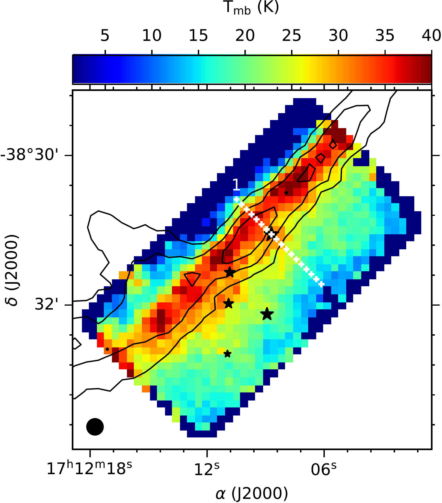
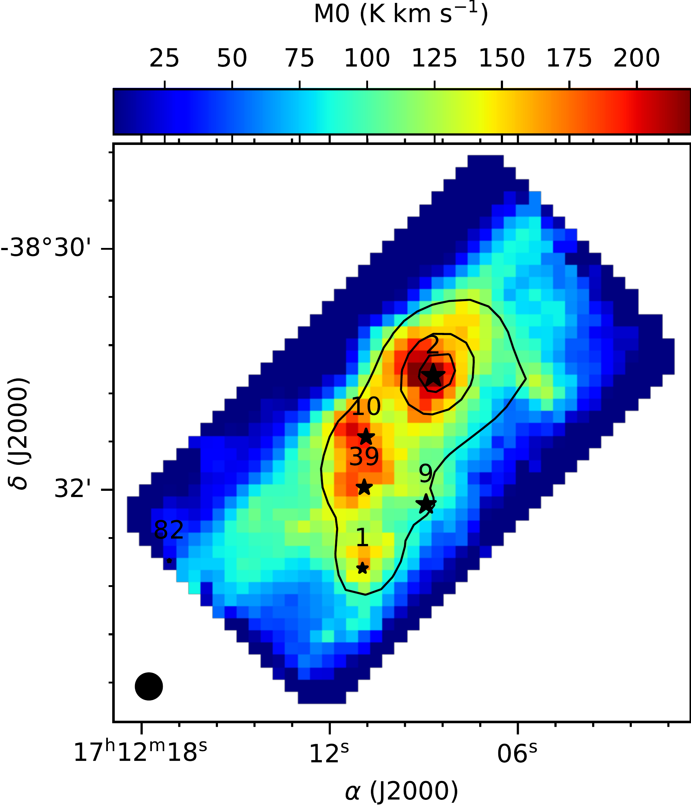
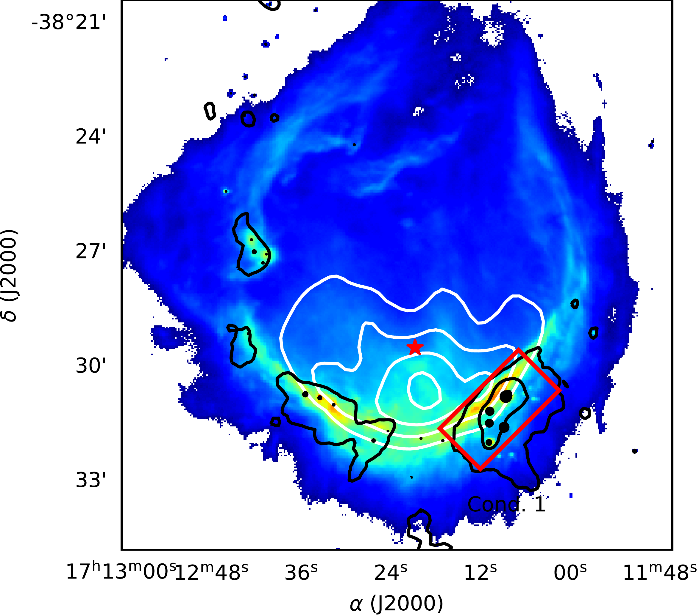
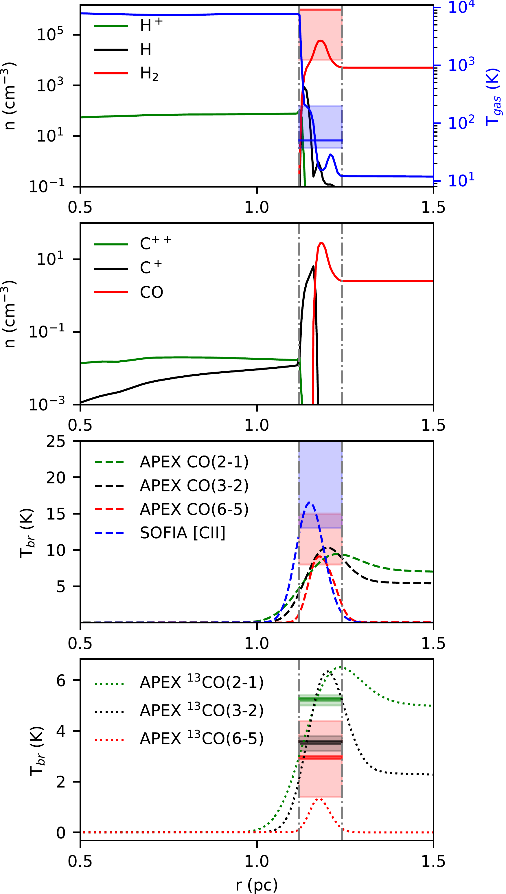

$\newcommand{\ensuremath}{}$
$\newcommand{\xspace}{}$
$\newcommand{\object}[1]{\texttt{#1}}$
$\newcommand{\farcs}{{.}''}$
$\newcommand{\farcm}{{.}'}$
$\newcommand{\arcsec}{''}$
$\newcommand{\arcmin}{'}$
$\newcommand{\ion}[2]{#1#2}$
$\newcommand{\textsc}[1]{\textrm{#1}}$
$\newcommand{\hl}[1]{\textrm{#1}}$
$\newcommand{\hii}{H {\sc{ii}}}$
$\newcommand{\cii}{C {\sc{ii}}}$
$\newcommand{\kms}{ km s^{-1}}$
$\newcommand{\co}{CO(6--5)}$
$\newcommand{\tco}{^{13}CO(6--5)}$
$\newcommand{\tmb}{T_{\tm mb}}$
$\newcommand{\offsets}{(\Delta \alpha, \Delta \delta)}$
$\newcommand{\innersize}{0.9~pc}$
$\newcommand{\distance}{1.3~kpc}$
$\newcommand{\thebibliography}{\DeclareRobustCommand{\VAN}[3]{##3}\VANthebibliography}$

$\newcommand{$\ensuremath$}{}$
$\newcommand{$\xspace$}{}$
$\newcommand{$\object$}[1]{\texttt{#1}}$
$\newcommand{$\farcs$}{{.}''}$
$\newcommand{$\farcm$}{{.}'}$
$\newcommand{$\arcsec$}{''}$
$\newcommand{$\arcmin$}{'}$
$\newcommand{$\ion$}[2]{#1#2}$
$\newcommand{$\textsc$}[1]{\textrm{#1}}$
$\newcommand{$\hl$}[1]{\textrm{#1}}$
$\newcommand{$\hii$}{H {\sc{ii}}}$
$\newcommand{$\cii$}{C {\sc{ii}}}$
$\newcommand{$\kms$}{ km s^{-1}}$
$\newcommand{$\co$}{CO(6--5)}$
$\newcommand{$\tco$}{^{13}CO(6--5)}$
$\newcommand{$\tmb$}{T_{\tm mb}}$
$\newcommand{$\offsets$}{(\Delta \alpha, \Delta \delta)}$
$\newcommand{$\innersize$}{0.9~pc}$
$\newcommand{$\distance$}{1.3~kpc}$
$\newcommand{$\thebibliography$}{\DeclareRobustCommand{\VAN}[3]{##3}\VANthebibliography}$

# The shocked molecular layer in RCW 120

<mark>Appeared on: 2022-12-20</mark> - _accepted for publication in MNRAS_

M. S. Kirsanova, et al. -- incl., <mark><mark>A. O. H. Olofsson</mark></mark>, <mark><mark>D. A. Semenov</mark></mark>

**Abstract:** Expansion of wind-blown bubbles or$\hii$regions lead to formation of shocks in the interstellar medium, which compress surrounding gas into dense layers. We made spatially and velocity-resolved observations of the RCW 120 PDR and nearby molecular gas with$\co$and$\tco$lines and distinguished a bright CO-emitting layer, which we related with the dense shocked molecular gas moving away from the ionizing star due to expansion of$\hii$region. Simulating gas density and temperature, as well as brightness of several CO and C+ emission lines from the PDR, we found reasonable agreement with the observed values. Analysing gas kinematics, we revealed the large-scale shocked PDR and also several dense environments of embedded protostars and outflows. We observe the shocked layer as the most regular structure in the$\co$map and in the velocity space, when the gas around YSOs is dispersed by the outflows.

**Figure 7. -** Left: map of the $\co$  peak intensity in the RCW 120 PDR shown by colour scale. Contours show brightness of the [$\cii$] line emission at 20, 30 and 40 K. White crosses show positions of the $\tco$  spectra shown in Fig. \ref{fig:individual_spectra}, where position 1 corresponds to illuminated side of the PDR. Right: map of the $\co$  integrated intensity shown by colour scale. The 870 $\rm \mu$m contours for 0.4, 2.0 and 10.0 Jy/beam are shown by contours. The APEX beam at 691 GHz is shown by black circle. The black stars show the locations of YSOs from \citet{Figueira_2017} in both plots and in following figures. (*fig:obsemission*)

**Figure 1. -** Image of RCW 120 at 70\micron . Color scale shows emission of neutral material around the ionized gas. The position of the ionizing star of RCW 120 is marked as a red star. The 843 MHz radio continuum emission corresponding to free-free emission of the ionized gas is shown with white contours linearly spaced from from 0.1 to 0.4 Jy/beam. The 870 $\rm \mu$m contours for 0.4, 2.0 and 10.0 Jy/beam are shown in black. Black circles show the locations of compact sources described by \citet{Figueira_2017}(their Table 5). The sizes of the circles depend linearly on the source masses \citep[$M_{\rm env}$ from][]{Figueira_2017} here and on the following figures. The area, observed in the $\co$  line, is shown by the red rectangle. (*fig:obsregion*)

**Figure 3. -** Simulated (lines) and observed (colour rectangles and horizontal straight lines) properties of the RCW 120 PDR. Simulated physical conditions and chemical composition in the dense neutral layer around the $\hii$  region obtained with the MARION model are shown on the two top panels. The ionizing star is located outside the left border of the panels in the beginning of the horizontal axe. The red rectangles and the red lines show the $\pm \sigma$ significance intervals and the best-fit solution of the non-LTE analysis with the observed and archival data (see Sec. \ref{sec:analysis}). Simulated brightness of the $\cii$, CO and $^{13}$CO emission in different lines obtained with the RADEX software is shown in two bottom panels. Green and black horizontal colour bold lines and rectangles show the brightness and $\pm \sigma$ intervals for the archival $^{13}$CO(2--1) and (3--2) lines. The observed range of $\co$  and $\tco$  brightness are shown by the red rectangle. The $\tco$  brightness used for simulations with RADEX is shown by the red horizontal line. (*fig:radexmodel*)

