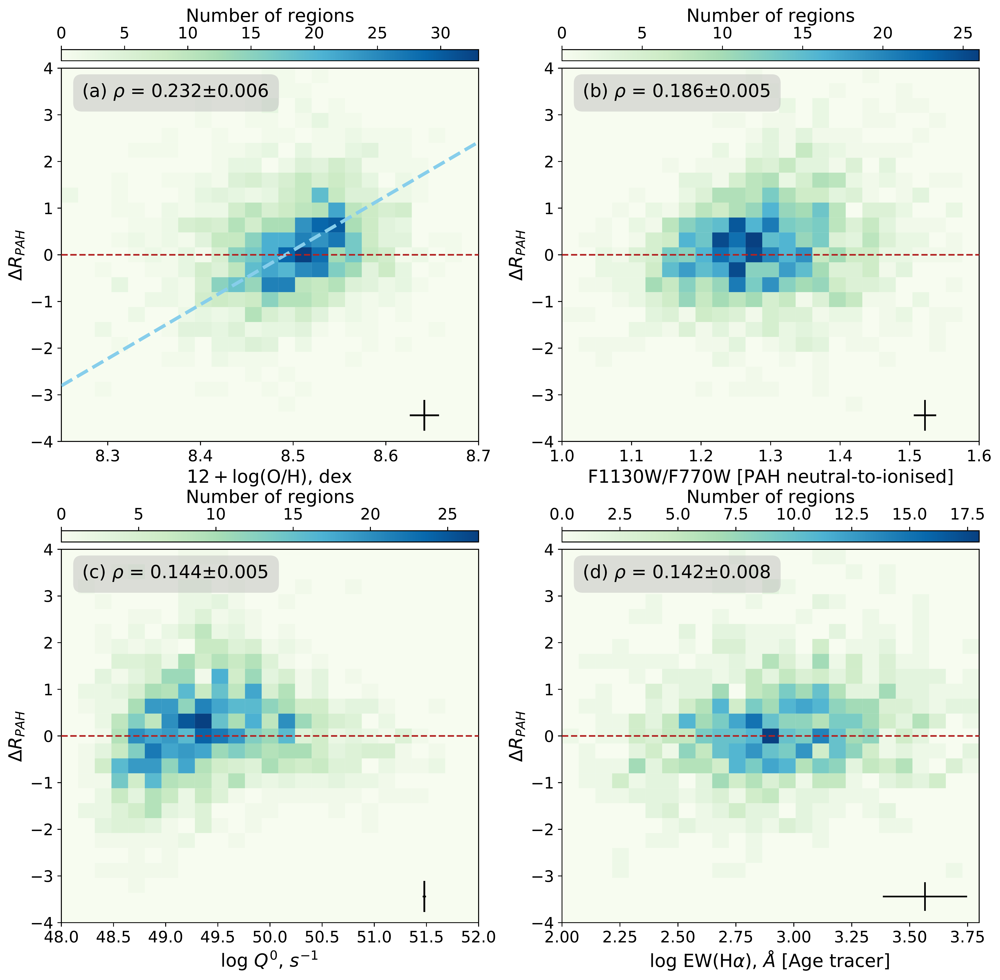

$\newcommand{\ensuremath}{}$
$\newcommand{\xspace}{}$
$\newcommand{\object}[1]{\texttt{#1}}$
$\newcommand{\farcs}{{.}''}$
$\newcommand{\farcm}{{.}'}$
$\newcommand{\arcsec}{''}$
$\newcommand{\arcmin}{'}$
$\newcommand{\ion}[2]{#1#2}$
$\newcommand{\textsc}[1]{\textrm{#1}}$
$\newcommand{\hl}[1]{\textrm{#1}}$
$\newcommand{\OSU}{\label{OSU} Department of Astronomy, The Ohio State University, 140 West 18th Avenue, Columbus, Ohio 43210, USA}$
$\newcommand{\Alberta}{\label{Alberta} Department of Physics, University of Alberta, Edmonton, AB T6G 2E1, Canada}$
$\newcommand{\ANU}{\label{ANU} Research School of Astronomy and Astrophysics, Australian National University, Canberra, ACT 2611, Australia}$
$\newcommand{\IPAC}{\label{IPAC} Caltech-IPAC, 1200 E. California Blvd. Pasadena, CA 91125, USA}$
$\newcommand{\Carnegie}{\label{Carnegi} Observatories of the Carnegie Institution for Science, 813 Santa Barbara Street, Pasadena, CA 91101, USA}$
$\newcommand{ÇAPP}{\label{CCAPP} Center for Cosmology and Astroparticle Physics, 191 West Woodruff Avenue, Columbus, OH 43210, USA}$
$\newcommand{\CfA}{\label{CfA} Harvard-Smithsonian Center for Astrophysics, 60 Garden Street, Cambridge, MA 02138, USA}$
$\newcommand{\CITEVA}{\label{CITEVA} Centro de Astronomía (CITEVA), Universidad de Antofagasta, Avenida Angamos 601, Antofagasta, Chile}$
$\newcommand{\CNRS}{\label{CNRS} CNRS, IRAP, 9 Av. du Colonel Roche, BP 44346, F-31028 Toulouse cedex 4, France}$
$\newcommand{\ESO}{\label{ESO} European Southern Observatory, Karl-Schwarzschild Stra{\ss}e 2, D-85748 Garching bei München, Germany}$
$\newcommand{\HD}{\label{HD} Astronomisches Rechen-Institut, Zentrum für Astronomie der Universität Heidelberg, Mönchhofstra\ss e 12-14, D-69120 Heidelberg, Germany}$
$\newcommand{\ICRAR}{\label{ICRAR} International Centre for Radio Astronomy Research, University of Western Australia, 35 Stirling Highway, Crawley, WA 6009, Australia}$
$\newcommand{\IRAM}{\label{IRAM} Institut de Radioastronomie Millimétrique (IRAM), 300 Rue de la Piscine, F-38406 Saint Martin d'Hères, France}$
$\newcommand{\ITA}{\label{ITA} Universität Heidelberg, Zentrum für Astronomie, Institut für Theoretische Astrophysik, Albert-Ueberle-Str 2, D-69120 Heidelberg, Germany}$
$\newcommand{\IWR}{\label{IWR} Universität Heidelberg, Interdisziplinäres Zentrum für Wissenschaftliches Rechnen, Im Neuenheimer Feld 205, D-69120 Heidelberg, Germany}$
$\newcommand{\JHU}{\label{JHU} Department of Physics and Astronomy, The Johns Hopkins University, Baltimore, MD 21218, USA}$
$\newcommand{\Leiden}{\label{Leiden} Leiden Observatory, Leiden University, P.O. Box 9513, 2300 RA Leiden, The Netherlands}$
$\newcommand{\Maryland}{\label{Maryland} Department of Astronomy, University of Maryland, College Park, MD 20742, USA}$
$\newcommand{\MPE}{\label{MPE} Max-Planck-Institut für extraterrestrische Physik, Giessenbachstra{\ss}e 1, D-85748 Garching, Germany}$
$\newcommand{\MPIA}{\label{MPIA} Max-Planck-Institut für Astronomie, Königstuhl 17, D-69117, Heidelberg, Germany}$
$\newcommand{\Nagoya}{\label{Nagoya} Department of Physics, Nagoya University, Furo-cho, Chikusa-ku, Nagoya, Aichi 464-8602, Japan}$
$\newcommand{\NRAO}{\label{NRAO} National Radio Astronomy Observatory, 520 Edgemont Road, Charlottesville, VA 22903-2475, USA}$
$\newcommand{\OAN}{\label{OAN} Observatorio Astronómico Nacional (IGN), C/Alfonso XII, 3, E-28014 Madrid, Spain}$
$\newcommand{\ObsParis}{\label{ObsParis} Sorbonne Université, Observatoire de Paris, Université PSL, CNRS, LERMA, F-75014, Paris, France}$
$\newcommand{\Oxford}{\label{Oxford} Sub-department of Astrophysics, Department of Physics, University of Oxford, Keble Road, Oxford OX1 3RH, UK}$
$\newcommand{\Princeton}{\label{Princeton} Department of Astrophysical Sciences, Princeton University, Princeton, NJ 08544 USA}$
$\newcommand{\UToledo}{\label{UToledo} University of Toledo, 2801 W. Bancroft St., Mail Stop 111, Toledo, OH, 43606}$
$\newcommand{\Toulouse}{\label{Toulouse} Université de Toulouse, UPS-OMP, IRAP, F-31028 Toulouse cedex 4, France}$
$\newcommand{\UBonn}{\label{UBonn} Argelander-Institut für Astronomie, Universität Bonn, Auf dem Hügel 71, 53121 Bonn, Germany}$
$\newcommand{\UChile}{\label{UChile} Departamento de Astronomía, Universidad de Chile, Camino del Observatorio 1515, Las Condes, Santiago, Chile}$
$\newcommand{\UConn}{\label{UConn} Department of Physics, University of Connecticut, Storrs, CT, 06269, USA}$
$\newcommand{\UGent}{\label{UGent} Sterrenkundig Observatorium, Universiteit Gent, Krijgslaan 281 S9, B-9000 Gent, Belgium}$
$\newcommand{\ULyon}{\label{ULyon} Univ Lyon, Univ Lyon 1, ENS de Lyon, CNRS, Centre de Recherche Astrophysique de Lyon UMR5574,\F-69230 Saint-Genis-Laval, France}$
$\newcommand{\UMass}{\label{UMass} University of Massachusetts—Amherst, 710 N. Pleasant Street, Amherst, MA 01003, USA}$
$\newcommand{\UWyoming}{\label{UWyoming} Department of Physics and Astronomy, University of Wyoming, Laramie, WY 82071, USA}$
$\newcommand{\LAM}{\label{LAM} Aix Marseille Univ, CNRS, CNES, LAM (Laboratoire d’Astrophysique de Marseille), Marseille, France}$
$\newcommand{\UHawaii}{\label{UHawaii} Institute for Astronomy, University of Hawaii, 2680 Woodlawn Drive, Honolulu, HI 96822, USA}$
$\newcommand{\UCM}{\label{UCM} Departamento de Física de la Tierra y Astrofísica, Universidad Complutense de Madrid, E-28040, Spain}$
$\newcommand{\IPARC}{\label{IPARC} Instituto de Física de Partículas y del Cosmos IPARCOS, Facultad de Ciencias Físicas, Universidad Complutense de Madrid, E-28040, Spain}$
$\newcommand{\STScI}{\label{STScI} Space Telescope Science Institute, 3700 San Martin Drive, Baltimore, MD 21218, USA}$
$\newcommand{\STScIESA}{\label{STScIESA} AURA for the European Space Agency (ESA), Space Telescope Science Institute, 3700 San Martin Drive, Baltimore, MD 21218, USA}$
$\newcommand{\McMaster}{\label{McMaster} Department of Physics and Astronomy, McMaster University, 1280 Main Street West, Hamilton, ON L8S 4M1, Canada}$
$\newcommand{\INAF}{\label{INAF} INAF -- Osservatorio Astrofisico di Arcetri, Largo E. Fermi 5, I-50157, Florence, Italy}$
$\newcommand{\Sydney}{\label{Sydney} Sydney Institute for Astronomy, School of Physics A28, The University of Sydney, NSW 2006, Australia}$
$\newcommand{\UA}{\label{UA} Centro de Astronomía (CITEVA), Universidad de Antofagasta, Avenida Angamos 601, Antofagasta, Chile}$
$\newcommand{\CITA}{\label{CITA} Canadian Institute for Theoretical Astrophysics (CITA), University of Toronto, 60 St George St, Toronto, ON M5S 3H8, Canada}$
$\newcommand{\ASIAA}{\label{ASIAA} Institute of Astronomy and Astrophysics, Academia Sinica, No. 1, Sec. 4, Roosevelt Road, Taipei 10617, Taiwan}$
$\newcommand{\TKU}{\label{TKU} Department of Physics, Tamkang University, No.151, Yingzhuan Rd., Tamsui Dist., New Taipei City 251301, Taiwan}$
$\newcommand{\PSMA}{\label{PSMA} Penn State Mont Alto, 1 Campus Drive, Mont Alto, PA  17237, USA}$
$\newcommand{\eso}{\label{ESO} European Southern Observatory, Karl-Schwarzschild-Stra{\ss}e 2, 85748 Garching, Germany}$
$\newcommand{\ILL}{\label{ILL} ILL}$
$\newcommand{\stromlo}{\label{stromlo} Research School of Astronomy and Astrophysics, Australian National University, Mt Stromlo Observatory, Weston Creek, ACT 2611, Australia}$
$\newcommand{\UCSD}{\label{UCSD} Center for Astrophysics \& Space Sciences, Department of Physics, University of California, San Diego, 9500 Gilman Drive, San Diego, CA 92093, USA}$
$\newcommand{\USorbonne}{\label{Usorbonne} Sorbonne Université, Observatoire de Paris, Université PSL, \' Ecole normale supérieure, CNRS, LERMA, F-75005, Paris, France}$
$\newcommand{\vdag}{(v)^\dagger}$
$\newcommand$
$\newcommand$
$\newcommand{\sigmaHa}{\sigma(\mathrm{H\alpha})}$
$\newcommand{\Ha}{\mathrm{H\alpha}}$
$\newcommand{\Hb}{\mathrm{H\beta}}$
$\newcommand{\SIIHa}{[S~\textsc{ii}]/\mathrm{H\alpha}}$
$\newcommand{\NIIHa}{[N~\textsc{ii}]/\mathrm{H\alpha}}$
$\newcommand{\OIIIHb}{[O~\textsc{iii}]/\mathrm{H\beta}}$
$\newcommand{\OIII}{[O~\textsc{iii}]}$
$\newcommand{\SII}{[S~\textsc{ii}]}$
$\newcommand{\SIII}{[S~\textsc{iii}]}$
$\newcommand{\SIIISII}{[S~\textsc{iii}]/[S~\textsc{ii}]}$
$\newcommand{\HII}{H~\textsc{ii}}$
$\newcommand{\HI}{H~\textsc{i}}$
$\newcommand{\kms}{\rm km s^{-1}}$
$\newcommand{\JWST}{\rm{\it JWST}}$
$\newcommand{\Herschel}{\rm{\it Herschel}}$
$\newcommand{\Spitzer}{\rm{\it Spitzer}}$
$\newcommand{\HST}{\rm{\it HST}}$
$\newcommand{\qPAH}{q_\mathrm{PAH}}$
$\newcommand{\nreg}{1529}$
$\newcommand{\red}{\textcolor{red}}$
$\newcommand{\revone}{\}$

$\newcommand{\ensuremath}{}$
$\newcommand{\xspace}{}$
$\newcommand{\object}[1]{\texttt{#1}}$
$\newcommand{\farcs}{{.}''}$
$\newcommand{\farcm}{{.}'}$
$\newcommand{\arcsec}{''}$
$\newcommand{\arcmin}{'}$
$\newcommand{\ion}[2]{#1#2}$
$\newcommand{\textsc}[1]{\textrm{#1}}$
$\newcommand{\hl}[1]{\textrm{#1}}$
$\newcommand{\OSU}{\label{OSU} Department of Astronomy, The Ohio State University, 140 West 18th Avenue, Columbus, Ohio 43210, USA}$
$\newcommand{\Alberta}{\label{Alberta} Department of Physics, University of Alberta, Edmonton, AB T6G 2E1, Canada}$
$\newcommand{\ANU}{\label{ANU} Research School of Astronomy and Astrophysics, Australian National University, Canberra, ACT 2611, Australia}$
$\newcommand{\IPAC}{\label{IPAC} Caltech-IPAC, 1200 E. California Blvd. Pasadena, CA 91125, USA}$
$\newcommand{\Carnegie}{\label{Carnegi} Observatories of the Carnegie Institution for Science, 813 Santa Barbara Street, Pasadena, CA 91101, USA}$
$\newcommand{ÇAPP}{\label{CCAPP} Center for Cosmology and Astroparticle Physics, 191 West Woodruff Avenue, Columbus, OH 43210, USA}$
$\newcommand{\CfA}{\label{CfA} Harvard-Smithsonian Center for Astrophysics, 60 Garden Street, Cambridge, MA 02138, USA}$
$\newcommand{\CITEVA}{\label{CITEVA} Centro de Astronomía (CITEVA), Universidad de Antofagasta, Avenida Angamos 601, Antofagasta, Chile}$
$\newcommand{\CNRS}{\label{CNRS} CNRS, IRAP, 9 Av. du Colonel Roche, BP 44346, F-31028 Toulouse cedex 4, France}$
$\newcommand{\ESO}{\label{ESO} European Southern Observatory, Karl-Schwarzschild Stra{\ss}e 2, D-85748 Garching bei München, Germany}$
$\newcommand{\HD}{\label{HD} Astronomisches Rechen-Institut, Zentrum für Astronomie der Universität Heidelberg, Mönchhofstra\ss e 12-14, D-69120 Heidelberg, Germany}$
$\newcommand{\ICRAR}{\label{ICRAR} International Centre for Radio Astronomy Research, University of Western Australia, 35 Stirling Highway, Crawley, WA 6009, Australia}$
$\newcommand{\IRAM}{\label{IRAM} Institut de Radioastronomie Millimétrique (IRAM), 300 Rue de la Piscine, F-38406 Saint Martin d'Hères, France}$
$\newcommand{\ITA}{\label{ITA} Universität Heidelberg, Zentrum für Astronomie, Institut für Theoretische Astrophysik, Albert-Ueberle-Str 2, D-69120 Heidelberg, Germany}$
$\newcommand{\IWR}{\label{IWR} Universität Heidelberg, Interdisziplinäres Zentrum für Wissenschaftliches Rechnen, Im Neuenheimer Feld 205, D-69120 Heidelberg, Germany}$
$\newcommand{\JHU}{\label{JHU} Department of Physics and Astronomy, The Johns Hopkins University, Baltimore, MD 21218, USA}$
$\newcommand{\Leiden}{\label{Leiden} Leiden Observatory, Leiden University, P.O. Box 9513, 2300 RA Leiden, The Netherlands}$
$\newcommand{\Maryland}{\label{Maryland} Department of Astronomy, University of Maryland, College Park, MD 20742, USA}$
$\newcommand{\MPE}{\label{MPE} Max-Planck-Institut für extraterrestrische Physik, Giessenbachstra{\ss}e 1, D-85748 Garching, Germany}$
$\newcommand{\MPIA}{\label{MPIA} Max-Planck-Institut für Astronomie, Königstuhl 17, D-69117, Heidelberg, Germany}$
$\newcommand{\Nagoya}{\label{Nagoya} Department of Physics, Nagoya University, Furo-cho, Chikusa-ku, Nagoya, Aichi 464-8602, Japan}$
$\newcommand{\NRAO}{\label{NRAO} National Radio Astronomy Observatory, 520 Edgemont Road, Charlottesville, VA 22903-2475, USA}$
$\newcommand{\OAN}{\label{OAN} Observatorio Astronómico Nacional (IGN), C/Alfonso XII, 3, E-28014 Madrid, Spain}$
$\newcommand{\ObsParis}{\label{ObsParis} Sorbonne Université, Observatoire de Paris, Université PSL, CNRS, LERMA, F-75014, Paris, France}$
$\newcommand{\Oxford}{\label{Oxford} Sub-department of Astrophysics, Department of Physics, University of Oxford, Keble Road, Oxford OX1 3RH, UK}$
$\newcommand{\Princeton}{\label{Princeton} Department of Astrophysical Sciences, Princeton University, Princeton, NJ 08544 USA}$
$\newcommand{\UToledo}{\label{UToledo} University of Toledo, 2801 W. Bancroft St., Mail Stop 111, Toledo, OH, 43606}$
$\newcommand{\Toulouse}{\label{Toulouse} Université de Toulouse, UPS-OMP, IRAP, F-31028 Toulouse cedex 4, France}$
$\newcommand{\UBonn}{\label{UBonn} Argelander-Institut für Astronomie, Universität Bonn, Auf dem Hügel 71, 53121 Bonn, Germany}$
$\newcommand{\UChile}{\label{UChile} Departamento de Astronomía, Universidad de Chile, Camino del Observatorio 1515, Las Condes, Santiago, Chile}$
$\newcommand{\UConn}{\label{UConn} Department of Physics, University of Connecticut, Storrs, CT, 06269, USA}$
$\newcommand{\UGent}{\label{UGent} Sterrenkundig Observatorium, Universiteit Gent, Krijgslaan 281 S9, B-9000 Gent, Belgium}$
$\newcommand{\ULyon}{\label{ULyon} Univ Lyon, Univ Lyon 1, ENS de Lyon, CNRS, Centre de Recherche Astrophysique de Lyon UMR5574,\F-69230 Saint-Genis-Laval, France}$
$\newcommand{\UMass}{\label{UMass} University of Massachusetts—Amherst, 710 N. Pleasant Street, Amherst, MA 01003, USA}$
$\newcommand{\UWyoming}{\label{UWyoming} Department of Physics and Astronomy, University of Wyoming, Laramie, WY 82071, USA}$
$\newcommand{\LAM}{\label{LAM} Aix Marseille Univ, CNRS, CNES, LAM (Laboratoire d’Astrophysique de Marseille), Marseille, France}$
$\newcommand{\UHawaii}{\label{UHawaii} Institute for Astronomy, University of Hawaii, 2680 Woodlawn Drive, Honolulu, HI 96822, USA}$
$\newcommand{\UCM}{\label{UCM} Departamento de Física de la Tierra y Astrofísica, Universidad Complutense de Madrid, E-28040, Spain}$
$\newcommand{\IPARC}{\label{IPARC} Instituto de Física de Partículas y del Cosmos IPARCOS, Facultad de Ciencias Físicas, Universidad Complutense de Madrid, E-28040, Spain}$
$\newcommand{\STScI}{\label{STScI} Space Telescope Science Institute, 3700 San Martin Drive, Baltimore, MD 21218, USA}$
$\newcommand{\STScIESA}{\label{STScIESA} AURA for the European Space Agency (ESA), Space Telescope Science Institute, 3700 San Martin Drive, Baltimore, MD 21218, USA}$
$\newcommand{\McMaster}{\label{McMaster} Department of Physics and Astronomy, McMaster University, 1280 Main Street West, Hamilton, ON L8S 4M1, Canada}$
$\newcommand{\INAF}{\label{INAF} INAF -- Osservatorio Astrofisico di Arcetri, Largo E. Fermi 5, I-50157, Florence, Italy}$
$\newcommand{\Sydney}{\label{Sydney} Sydney Institute for Astronomy, School of Physics A28, The University of Sydney, NSW 2006, Australia}$
$\newcommand{\UA}{\label{UA} Centro de Astronomía (CITEVA), Universidad de Antofagasta, Avenida Angamos 601, Antofagasta, Chile}$
$\newcommand{\CITA}{\label{CITA} Canadian Institute for Theoretical Astrophysics (CITA), University of Toronto, 60 St George St, Toronto, ON M5S 3H8, Canada}$
$\newcommand{\ASIAA}{\label{ASIAA} Institute of Astronomy and Astrophysics, Academia Sinica, No. 1, Sec. 4, Roosevelt Road, Taipei 10617, Taiwan}$
$\newcommand{\TKU}{\label{TKU} Department of Physics, Tamkang University, No.151, Yingzhuan Rd., Tamsui Dist., New Taipei City 251301, Taiwan}$
$\newcommand{\PSMA}{\label{PSMA} Penn State Mont Alto, 1 Campus Drive, Mont Alto, PA  17237, USA}$
$\newcommand{\eso}{\label{ESO} European Southern Observatory, Karl-Schwarzschild-Stra{\ss}e 2, 85748 Garching, Germany}$
$\newcommand{\ILL}{\label{ILL} ILL}$
$\newcommand{\stromlo}{\label{stromlo} Research School of Astronomy and Astrophysics, Australian National University, Mt Stromlo Observatory, Weston Creek, ACT 2611, Australia}$
$\newcommand{\UCSD}{\label{UCSD} Center for Astrophysics \& Space Sciences, Department of Physics, University of California, San Diego, 9500 Gilman Drive, San Diego, CA 92093, USA}$
$\newcommand{\USorbonne}{\label{Usorbonne} Sorbonne Université, Observatoire de Paris, Université PSL, \' Ecole normale supérieure, CNRS, LERMA, F-75005, Paris, France}$
$\newcommand{\vdag}{(v)^\dagger}$
$\newcommand$
$\newcommand$
$\newcommand{\sigmaHa}{\sigma(\mathrm{H\alpha})}$
$\newcommand{\Ha}{\mathrm{H\alpha}}$
$\newcommand{\Hb}{\mathrm{H\beta}}$
$\newcommand{\SIIHa}{[S~\textsc{ii}]/\mathrm{H\alpha}}$
$\newcommand{\NIIHa}{[N~\textsc{ii}]/\mathrm{H\alpha}}$
$\newcommand{\OIIIHb}{[O~\textsc{iii}]/\mathrm{H\beta}}$
$\newcommand{\OIII}{[O~\textsc{iii}]}$
$\newcommand{\SII}{[S~\textsc{ii}]}$
$\newcommand{\SIII}{[S~\textsc{iii}]}$
$\newcommand{\SIIISII}{[S~\textsc{iii}]/[S~\textsc{ii}]}$
$\newcommand{\HII}{H~\textsc{ii}}$
$\newcommand{\HI}{H~\textsc{i}}$
$\newcommand{\kms}{\rm km s^{-1}}$
$\newcommand{\JWST}{\rm{\it JWST}}$
$\newcommand{\Herschel}{\rm{\it Herschel}}$
$\newcommand{\Spitzer}{\rm{\it Spitzer}}$
$\newcommand{\HST}{\rm{\it HST}}$
$\newcommand{\qPAH}{q_\mathrm{PAH}}$
$\newcommand{\nreg}{1529}$
$\newcommand{\red}{\textcolor{red}}$
$\newcommand{\revone}{\}$

# PHANGS-JWST First Results: Destruction of the PAH molecules in HII regions probed by JWST and MUSE

<mark>Appeared on: 2022-12-18</mark> - _16 pages, 7 figures, 1 table. Accepted for publication in ApJL as part of a PHANGS-JWST First Results Focus issue_

Oleg V. Egorov, et al. -- incl., <mark>Kathryn Kreckel</mark>, <mark>Eva Schinnerer</mark>

**Abstract:** Polycyclic aromatic hydrocarbons (PAHs) play a critical role in the reprocessing of stellar radiation and in balancing the heating and cooling processes in the interstellar medium (ISM), but appear to be destroyed in \HII regions.However, the mechanisms driving their destruction are still not completely understood. Using  PHANGS-JWST and PHANGS-MUSE observations,we investigate how the PAH fraction changes in about 1500 \HII regions across four nearby star-forming galaxies (NGC 628, NGC 1365, NGC 7496, IC 5332). We find a strong anti-correlation between the PAH fraction and the ionization parameter (the ratio between the ionizing photon flux and the hydrogen density)  of \HII regions. This relation becomes steeper for more luminous \HII regions. The metallicity of \HII regions has only a minor impact on these results in our galaxy sample. We find that the PAH fraction decreases with the \Ha equivalent width -- a proxy for the age of the \HII regions -- although this trend is much weaker than the one identified using the ionization parameter. Our results are consistent with a scenario where hydrogen-ionizing UV radiation is the dominant source of PAH destruction in star-forming regions.

**Figure 2. -** Correlation of PAH abundance, traced by $R_{\rm PAH}$, with  ionization parameter, traced by $\log$($\SII$ISII) (Panels a, b), or ionization fraction $f_{\rm ion}$(Panels c, d). Color encodes the oxygen abundance $12+\log(\mathrm{O/H})$(Panel a), ratio of F1130W/F770W -- a proxy for the ionization state of PAHs (Panel b), number of hydrogen ionizing photons $Q^0$(Panel c), and effective radii of the $\HII$ regions relative to the PSF of the MUSE data (Panel d). Dashed lines show a linear fit for the $\HII$ regions (Eq. \ref{eq:corr1} for Panels a,b). Faint ($Q^0 < 10^{50} {\rm s}^{-1}$; green dashed line, Eq. \ref{eq:corr_fnt}) and bright ($Q^0 > 10^{50} {\rm s}^{-1}$; magenta dashed line, Eq. \ref{eq:corr_brt}) $\HII$ regions are considered separately on Panels c and d. The Spearman's correlation coefficient ($\rho$) is given in the corner of each plot. \revone{Coefficients $\rho_1$ and $\rho_2$ are calculated separately for the black and cyan points (Panels b and d), or for the faint and bright regions (Panel c), respectively. The errors on $\rho$ are derived from 1000 Monte Carlo realization with the data randomly distributed around the measured values within the uncertainties.} (*fig:Rpah_vs_ip*)

**Figure 3. -** Secondary dependence of the PAH fraction on: the oxygen abundance of $\HII$ regions, measured as $12+\log\mathrm{(O/H)}$(Panel a); the F1130W/F770W flux ratio, sensitive to the relative fraction of neutral to ionized PAH (Panel b); the number of hydrogen ionizing photons $Q^0$(Panel c); the equivalent width of $\Ha$, corrected for the contribution of the underlying old stellar population (Panel d). The 2D histograms on each panel show the distribution of  $\Delta R_{\rm PAH}$, obtained after subtracting of the values derived by Eq. \ref{eq:corr1} from the measured $R_{\rm PAH}$. The red dashed line shows a zero-difference level. The light-blue dashed line on Panel (a) corresponds to a linear fit defined by Eq. \ref{eq:corr_secondary}, tracing the secondary relation of $R_{\rm PAH}$ on metallicity.  The Spearman's correlation coefficient ($\rho$) is given in the corner of each plot. \revone{Its uncertainty is derived in the same way as in Fig. \ref{fig:Rpah_vs_ip}. The error bars in the right-hand corner correspond to the 95th-percentile uncertainties of the measured values.} (*fig:Rpah_secondary*)

**Figure 4. -** Correlation of the PAH fraction, traced by $R_{\rm PAH}$, with different physical conditions. Panel a: correlation with oxygen abundance, $12+\log(\mathrm{O/H})$, with red symbols showing the mean value for each galaxy.
    Panel b: equivalent width of $\Ha$, $EW(\mathrm{H}\alpha)$, corrected for the contribution of the underlying old stellar population, and a tracer of $\HII$ region age. Note that because of the large uncertainty introduced by this background continuum subtraction, we consider here only regions with relative error $\delta(EW(\mathrm{H}\alpha)) < 10\%$.
    Panel c: $\log$($\OIIIHb$), a tracer of the hardness of the UV radiation. \revone{The Spearman's correlation coefficient ($\rho$) is given in the corner of each plot. Its uncertainty is derived in the same way as in Fig. \ref{fig:Rpah_vs_ip}. The error bars in the right-hand corner correspond to the 95th-percentile uncertainties of the measured values.} (*fig:Rpah_other_corr*)

