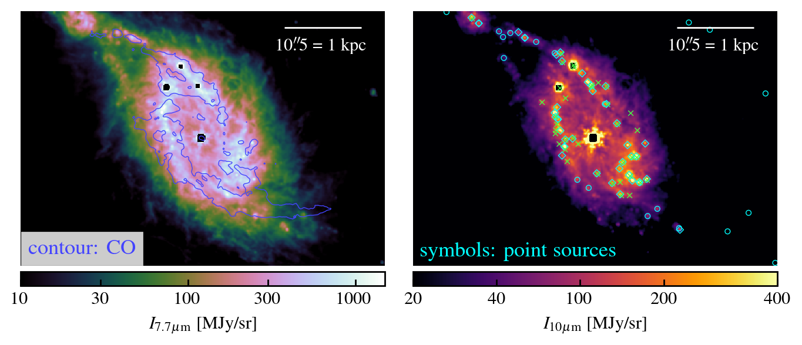

$\newcommand{\ensuremath}{}$
$\newcommand{\xspace}{}$
$\newcommand{\object}[1]{\texttt{#1}}$
$\newcommand{\farcs}{{.}''}$
$\newcommand{\farcm}{{.}'}$
$\newcommand{\arcsec}{''}$
$\newcommand{\arcmin}{'}$
$\newcommand{\ion}[2]{#1#2}$
$\newcommand{\textsc}[1]{\textrm{#1}}$
$\newcommand{\hl}[1]{\textrm{#1}}$
$\newcommand{\vdag}{(v)^\dagger}$
$\newcommand$
$\newcommand$
$\newcommand{\comm}[1]{{\color{red} \textbf{#1}}}$
$\newcommand{\Msun}{\mathrm{M}_{\sun}}$
$\newcommand{\fr}[1]{{\color{green} \textbf{#1}}}$
$\newcommand{\vdag}{(v)^\dagger}$
$\newcommand$
$\newcommand$
$\newcommand{\comm}[1]{{\color{red} \textbf{#1}}}$
$\newcommand{\Msun}{\mathrm{M}_{\sun}}$
$\newcommand{\fr}[1]{{\color{green} \textbf{#1}}}$

$\newcommand{\ensuremath}{}$
$\newcommand{\xspace}{}$
$\newcommand{\object}[1]{\texttt{#1}}$
$\newcommand{\farcs}{{.}''}$
$\newcommand{\farcm}{{.}'}$
$\newcommand{\arcsec}{''}$
$\newcommand{\arcmin}{'}$
$\newcommand{\ion}[2]{#1#2}$
$\newcommand{\textsc}[1]{\textrm{#1}}$
$\newcommand{\hl}[1]{\textrm{#1}}$
$\newcommand{\vdag}{(v)^\dagger}$
$\newcommand$
$\newcommand$
$\newcommand{\comm}[1]{{\color{red} \textbf{#1}}}$
$\newcommand{\Msun}{\mathrm{M}_{\sun}}$
$\newcommand{\fr}[1]{{\color{green} \textbf{#1}}}$
$\newcommand{\vdag}{(v)^\dagger}$
$\newcommand$
$\newcommand$
$\newcommand{\comm}[1]{{\color{red} \textbf{#1}}}$
$\newcommand{\Msun}{\mathrm{M}_{\sun}}$
$\newcommand{\fr}[1]{{\color{green} \textbf{#1}}}$

# PHANGS-JWST First Results: Rapid Evolution of Star Formation in the Central Molecular Gas Ring of NGC 1365

<mark>Appeared on: 2022-12-18</mark> - _24 pages, 8 figures, accepted for publications as part of PHANGS-JWST ApJL Focus Issue_

<mark><mark>Eva Schinnerer</mark></mark>, et al. -- incl., <mark><mark>Stephen Hannon</mark></mark>, <mark><mark>Justus Neumann</mark></mark>, <mark><mark>Sophia K. Stuber</mark></mark>

**Abstract:** Large-scale bars can fuel galaxy centers with molecular gas, often leading to the development of dense ring-like structures where intense star formation occurs, forming a very different environment compared to galactic disks. We pair $\sim$ 0.3 \arcsec (30 pc) resolution new JWST/MIRI imaging with archival ALMA CO(2-1) mapping of the central $\sim$ 5 kpc of the nearby barred spiral galaxy NGC 1365, to investigate the physical mechanisms responsible for this extreme star formation.The molecular gas morphology is resolved into two well-known bright bar lanes that surround a smooth dynamically cold gas disk ( $\rm R_{gal} \sim 475 pc$ ) reminiscent of non-star-forming disks in early type galaxies and likely fed by gas inflow triggered by stellar feedback in the lanes. The lanes host a large number of JWST-identified massive young star clusters. We find some evidence for temporal star formation evolution along the ring.The complex kinematics in the gas lanes reveal strong streaming motions and may be consistent with convergence of gas streamlines expected there. Indeed, the extreme line-widths are found to be the result of inter-`cloud' motion between gas peaks; {\sc ScousePy} decomposition reveals multiple components with line widths of $\rm \langle\sigma_{CO,scouse}\rangle \approx 19 km s^{-1}$ and surface densities of $\rm \langle \Sigma_{H_2,scouse}\rangle \approx  800 M_{\odot} pc^{-2}$ , similar to the properties observed throughout the rest of the central molecular gas structure.  Tailored hydro-dynamical simulations exhibit many of the observed properties and imply that the observed structures are transient and highly time-variable.  From our study of NGC 1365, we conclude that it is predominantly the high gas inflow triggered by the bar that is setting the star formation in its CMZ.

**Figure 4. -** {\sc ScousePy} decomposition of the 30 pc resolution molecular CO(2-1) gas emission. Multiple Gaussian components are needed to fit $\sim31\%$ of the data. This is demonstrated most clearly in the spiral arms, where two and three component models are common (up to six components in the southwestern arm; _top left_). Spectra from selected regions with the resulting {\sc ScousePy} fits typically exhibit well separated line components (_top right_). The inferred peak CO temperature and velocity dispersions of the individual {\sc ScousePy} components (_bottom left_) occupy a similar region of parameter space independent of whether they are derived from single or multiple components fits (color-coding). The grey shaded regions here correspond to the limits of our fitting (a signal-to-noise ratio of 2 and a single channel width).
    The three-dimensional representation of the individual {\sc ScousePy} components located within the white dashed box in the top left panel, displayed in $ppv$ space (_bottom right_), reveals an inner smoothly rotating disk (highlighted in black; extracted from the ellipse in the top left panel) while the bar lanes show strong local fluctuations in velocity indicating an increasing complexity of the kinematics in the molecular gas there (the color here refers to the peak CO temperature of the individual components). The physical spacing of the $pp$ grid in this image is $\sim475$ pc. (*fig:scouse*)

**Figure 12. -** {\sc ScousePy} decomposition of the 30 pc resolution molecular CO(2-1) gas emission. Multiple Gaussian components are needed to fit $\sim31\%$ of the data. This is demonstrated most clearly in the spiral arms, where two and three component models are common (up to six components in the southwestern arm; _top left_). Spectra from selected regions with the resulting {\sc ScousePy} fits typically exhibit well separated line components (_top right_). The inferred peak CO temperature and velocity dispersions of the individual {\sc ScousePy} components (_bottom left_) occupy a similar region of parameter space independent of whether they are derived from single or multiple components fits (color-coding). The grey shaded regions here correspond to the limits of our fitting (a signal-to-noise ratio of 2 and a single channel width).
    The three-dimensional representation of the individual {\sc ScousePy} components located within the white dashed box in the top left panel, displayed in $ppv$ space (_bottom right_), reveals an inner smoothly rotating disk (highlighted in black; extracted from the ellipse in the top left panel) while the bar lanes show strong local fluctuations in velocity indicating an increasing complexity of the kinematics in the molecular gas there (the color here refers to the peak CO temperature of the individual components). The physical spacing of the $pp$ grid in this image is $\sim475$ pc. (*fig:scouse*)

**Figure 3. -** Distribution of the emission from PAHs and hot dust emission as probed by JWST/MIRI observations at $\sim$0.3$\arcsec$ resolution, which is comparable to the resolution of the ALMA CO(2-1) data (North is up, East to the left.).
    _Left:_ The F770W filter with a $\sim$0.24$\arcsec$ resolution reveals the overall distribution of the neutral ISM as its emission is dominated by the  7.7$\mu$m  PAH feature. For reference the distribution of the CO emission is shown by a single blue contour. Note that the central position is significantly affected by saturation due to the bright AGN and dominated by its PSF causing the artefacts. Also the three brightest compact sources north of the AGN are saturated.
    _Right:_ Several embedded young star-forming clusters are evident in the 10 $\mu$m emission and stand out as bright compact sources. Our 10 $\mu$m-selected sources are highlighted by the cyan diamond symbols and are only found in the region shown. About 57\% of these objects coincide with the young ($<$10 Myr) star clusters studied by \citet[][shown as green crosses]{WHITMORE_PHANGSJWST} and have estimated stellar masses of $\rm 10^6  M_{\odot}$ or higher. The 21 $\mu$m-selected sources from \cite{HASSANI_PHANGSJWST} that are classified as ISM emitting sources are shown as cyan circles. The dearth of clusters in the bar lane southwest of the nucleus is notable. (*fig:jwst*)

