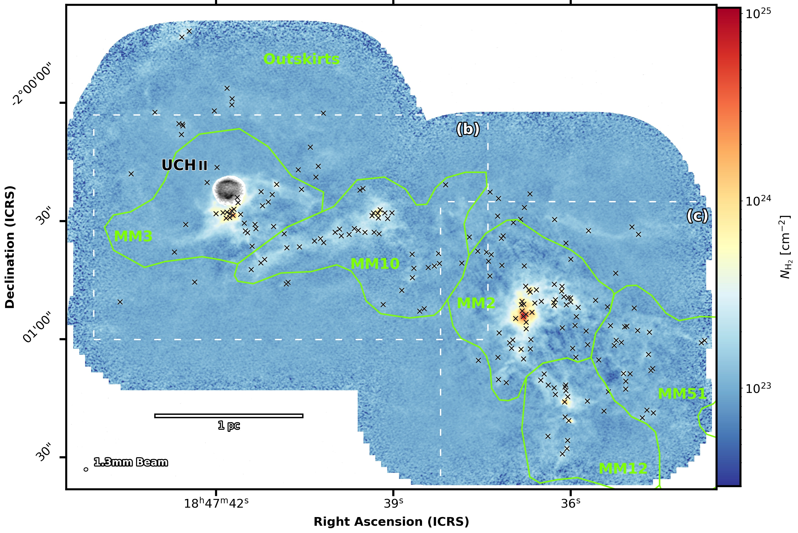
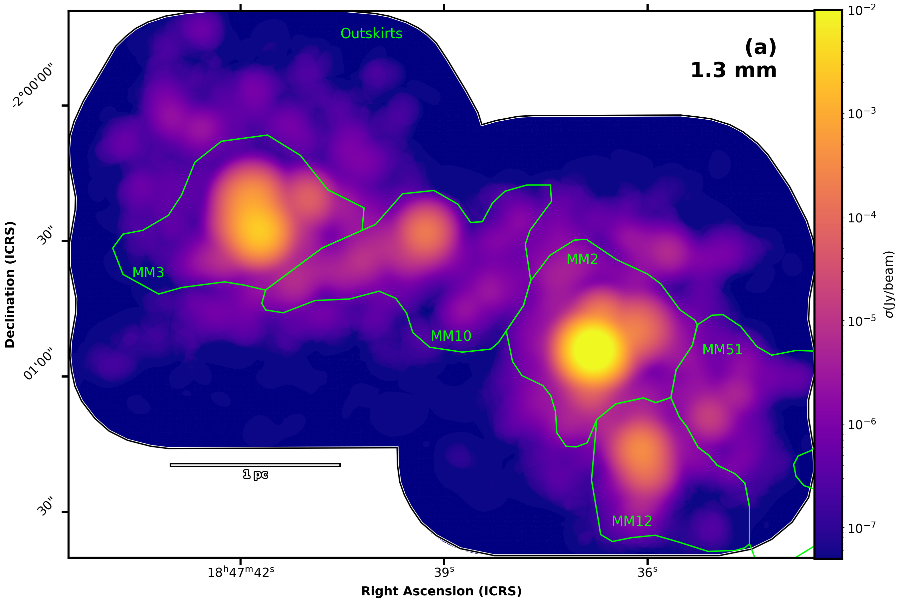
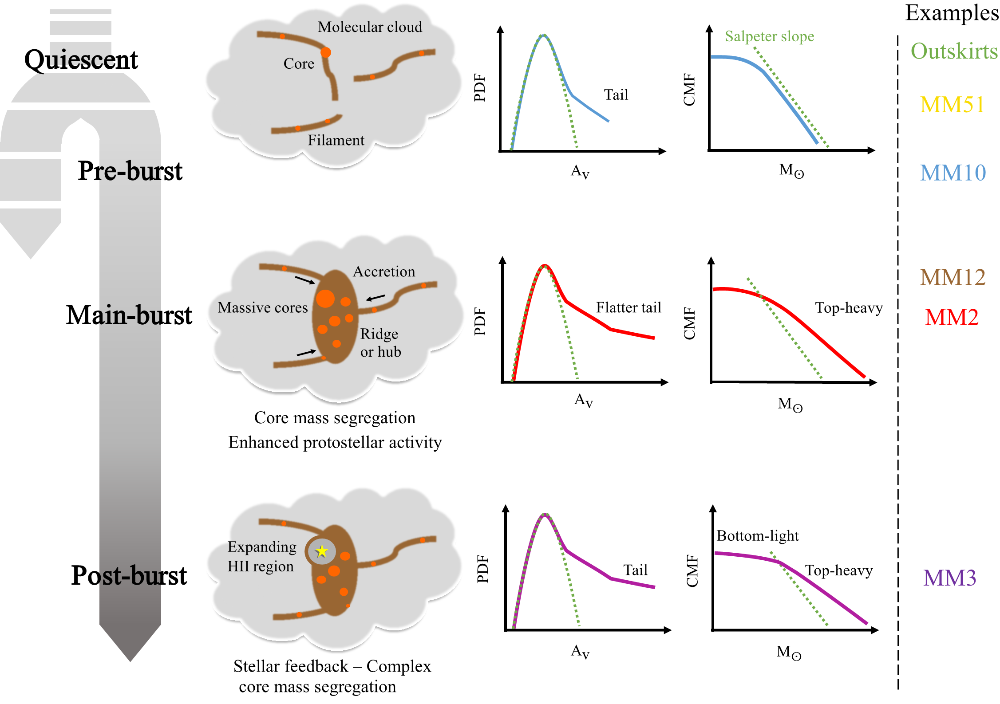

$\newcommand{\ensuremath}{}$
$\newcommand{\xspace}{}$
$\newcommand{\object}[1]{\texttt{#1}}$
$\newcommand{\farcs}{{.}''}$
$\newcommand{\farcm}{{.}'}$
$\newcommand{\arcsec}{''}$
$\newcommand{\arcmin}{'}$
$\newcommand{\ion}[2]{#1#2}$
$\newcommand{\textsc}[1]{\textrm{#1}}$
$\newcommand{\hl}[1]{\textrm{#1}}$
$\newcommand{\Msol}{\ensuremath{M_{\odot}}}$
$\newcommand{\Lsol}{\ensuremath{L_{\odot}}}$
$\newcommand{\kms}{\ensuremath{\rm km s^{-1} }}$
$\newcommand{\hii}{H\mbox{\sc ii} }$
$\newcommand{\bsens}{\texttt{bsens}\xspace}$
$\newcommand{\cleanest}{\texttt{cleanest}\xspace}$
$\newcommand{\denoised}{\texttt{denoised}\xspace}$
$\newcommand{\original}{\texttt{denoised}\xspace}$
$\newcommand{\Av}{A_{\rm v}}$
$\newcommand{\NHtwo}{N_{\rm H_2}}$
$\newcommand{\NHtwoUnits}{\times 10^{21} cm^{-2}}$
$\newcommand{\st}{^{\star}}$
$\newcommand{\arraystretch}{1.5}$
$\newcommand{\arraystretch}{1.2}$
$\newcommand{\}{mean}$

$\newcommand{$\ensuremath$}{}$
$\newcommand{$\xspace$}{}$
$\newcommand{$\object$}[1]{\texttt{#1}}$
$\newcommand{$\farcs$}{{.}''}$
$\newcommand{$\farcm$}{{.}'}$
$\newcommand{$\arcsec$}{''}$
$\newcommand{$\arcmin$}{'}$
$\newcommand{$\ion$}[2]{#1#2}$
$\newcommand{$\textsc$}[1]{\textrm{#1}}$
$\newcommand{$\hl$}[1]{\textrm{#1}}$
$\newcommand{$\Msol$}{$\ensuremath${M_{\odot}}}$
$\newcommand{$\Lsol$}{$\ensuremath${L_{\odot}}}$
$\newcommand{$\kms$}{$\ensuremath${\rm km s^{-1} }}$
$\newcommand{$\hii$}{H\mbox{\sc ii} }$
$\newcommand{$\bsens$}{\texttt{bsens}$\xspace$}$
$\newcommand{$\cleanest$}{\texttt{cleanest}$\xspace$}$
$\newcommand{$\denoised$}{\texttt{denoised}$\xspace$}$
$\newcommand{$\original$}{\texttt{denoised}$\xspace$}$
$\newcommand{$\Av$}{A_{\rm v}}$
$\newcommand{$\NHtwo$}{N_{\rm H_2}}$
$\newcommand{$\NHtwo$Units}{\times 10^{21} cm^{-2}}$
$\newcommand{$\st$}{^{$\st$ar}}$
$\newcommand{$\arraystretch$}{1.5}$
$\newcommand{$\arraystretch$}{1.2}$
$\newcommand{\}{mean}$

# MM3 mini-starburst

<mark>Appeared on: 2022-12-20</mark> - _Accepted for publication in A&A (december, 5th 2022), 24 pages, 14 figures_

Y. Pouteau, et al. -- incl., <mark><mark>P. Hennebelle</mark></mark>, <mark><mark>F. Herpin</mark></mark>, <mark><mark>H.-L. Liu</mark></mark>

**Abstract:** Among the most central open questions on the initial mass function (IMF) of stars is the impact of the environment on the shape of the core mass function (CMF) and thus potentially on the IMF.The ALMA-IMF Large Program aims to investigate the variations of the core distributions (CMF and mass segregation) with cloud characteristics such as the density and kinematic of the gas, as diagnostic observables of the formation process and evolution. The present study focuses on the W43-MM2\&MM3 mini-starburst, whose CMF has been recently found to be top-heavy with respect to the Salpeter slope of the canonical IMF.W43-MM2\&MM3 is a useful test case for environmental studies because it harbors a rich cluster containing a statistically significant number of cores (specifically, 205 cores), previously characterized in paper III. We applied a multiscale decomposition technique on the ALMA 1.3 mm and 3 mm continuum images of W43-MM2\&MM3 to define six subregions each of 0.5-1 pc in size. For each subregion we characterize the high column density probability distribution function,$\eta$-PDF, shape of the cloud gas using the 1.3 mm image. Using the core catalog, we investigate correlations between the CMF and, cloud and core properties such as the$\eta$-PDF and core mass segregation.We classify the W43-MM2\&MM3 subregions into different stages of evolution, from quiescent to burst to post-burst, based on the surface number density of cores, number of outflows, and UC$\hii$presence. The high-mass end ($>$1$\Msol$) of the subregion CMFs vary from being close to the Salpeter slope (quiescent) to top-heavy (burst and post-burst). Moreover, the second tail of the$\eta$-PDF varies from steep (quiescent), to flat (burst and post-burst) like observed for the high mass star-forming clouds. We found that subregions with flat second$\eta$-PDF tails display top-heavy CMFs.In dynamical environments such as W43-MM2\&MM3, the high-mass end of the CMF appears to be rooted in the cloud structure at high (column) densities that surrounds cores. This connection stems from the fact that cores and their immediate surroundings are both determined and shaped by cloud formation process, current evolutionary state of the cloud, and broader the star formation history. The CMF may evolve from Salpeter to top-heavy throughout the star formation process from the quiescent to the burst phase. This scenario raises the question of if the CMF might revert again to Salpeter as the cloud approaches the end of its star formation stage, a hypothesis that remains to be tested.

**Figure 2. -** The W43-MM2\&MM3 mini-starburst ridge traced by its column density (color scale), derived from the ALMA 1.3 mm continuum image of \cite{pouteau2022}. It hosts a rich cluster of 205 cores (gray crosses) reported by \cite{pouteau2022} and the ultra-compact $\hii$(UC$\hii$) region of W43-MM3, traced by its H41$\alpha$ emission line (Galv\'an-Madrid et al. in prep., gray scale) and where the column density is not computed. Green polygons outline the W43-MM2\&MM3 subregions defined in Sect. \ref{sect:subregions def}. The ellipse in the lower left corner indicates the $0.46$\arcsec$$ angular resolution of the column density image while the scale bar indicates the length scale at a distance of 5.5 kpc. \textit{a)} White dashed boxes outline the zooms-ins of \textit{b--c}. (*fig:nh2 and cores*)

**Figure 4. -** Subregions of $0.5-1$ pc sizes identified in the W43-MM2\&MM3 ridge from the ALMA 12 m array $\denoised$$\bsens$ continuum images of \cite{pouteau2022} at 1.3 mm (\textit{panel a}) and 3 mm (\textit{panel b}).
A multi-scale decomposition was performed, decomposition scales of $\sim$4$-7$\arcsec$$ were chosen and subregion outlines (green contours) were set to follow inflection points in the column density distribution. Subregions are labelled MM2, MM3, MM10, MM12 and MM51 following the names of fragments extracted from $\sim$10$\arcsec$ resolution (sub)millimeter images \citep{motte2003}. The remaining subregion at 1.3 mm is labelled Outskirts. The white contour outlines the 1.3 mm coverage in panel \textit{(b)} and a 1-pc scale bar is shown in the lower-left corner of each image. (*fig:mngseg scales*)

**Figure 7. -** Schematic evolutionary diagram of subregions in dynamical star-forming clouds, which are qualified as either quiescent or by following the different phases before, during, and after their main star formation event: pre-burst, main burst and post-burst. Their characteristics, including cloud column density $\eta$-PDF, CMF, and core mass segregation are illustrated. \textit{Top panels:} Subregions in quiescent or pre-burst regimes present a $\eta$-PDF tail close to that found in low-mass star-forming regions and a CMF high-mass end close to the Salpeter slope. \textit{Central panels:} Subregions in their main burst regime harbor an enhanced star-formation activity and strong core mass segregation. They display an $\eta$-PDF with a much flatter second tail as well as a top-heavy CMF. \textit{Bottom panels:} Post-burst subregions, under the influence of stellar feedback, have less sustained star formation activity and more complex core mass segregation. They also present an $\eta$-PDF with a flat second tail, and a CMF which is both top-heavy and bottom-light. The location on the time sequence of the W43-MM2\&MM3 subregions are given to summarize the result of present article. (*fig:summary*)

