

$\newcommand{\ensuremath}{}$
$\newcommand{\xspace}{}$
$\newcommand{\object}[1]{\texttt{#1}}$
$\newcommand{\farcs}{{.}''}$
$\newcommand{\farcm}{{.}'}$
$\newcommand{\arcsec}{''}$
$\newcommand{\arcmin}{'}$
$\newcommand{\ion}[2]{#1#2}$
$\newcommand{\textsc}[1]{\textrm{#1}}$
$\newcommand{\hl}[1]{\textrm{#1}}$

$\newcommand{$\ensuremath$}{}$
$\newcommand{$\xspace$}{}$
$\newcommand{$\object$}[1]{\texttt{#1}}$
$\newcommand{$\farcs$}{{.}''}$
$\newcommand{$\farcm$}{{.}'}$
$\newcommand{$\arcsec$}{''}$
$\newcommand{$\arcmin$}{'}$
$\newcommand{$\ion$}[2]{#1#2}$
$\newcommand{$\textsc$}[1]{\textrm{#1}}$
$\newcommand{$\hl$}[1]{\textrm{#1}}$

# Differences in physical properties of coronal bright points and their ALMA counterparts within and outside coronal holes

<mark>Appeared on: 2022-12-20</mark> - _27 pages, 28 figures, accepted in Astronomy and Astrophysics_

F. Matković, et al. -- incl., <mark><mark>S. G. Heinemann</mark></mark>

**Abstract:** This study investigates and compares brightness and area of coronal bright points (CBPs) inside and outside of coronal holes (CHs) using the single-dish Band 6 observations by the Atacama Large Millimeter/submillimeter Array (ALMA), combined with extreme-ultraviolet (EUV) 193 $\overset{\circ}{\mathrm{A}}$ filtergrams obtained by the Atmospheric Imaging Assembly (AIA) and magnetograms obtained by the Helioseismic and Magnetic Imager (HMI), both on board Solar Dynamics Observatory (SDO). The CH boundaries were extracted from the SDO/AIA images using the Collection of Analysis Tools for Coronal Holes (CATCH) and CBPs were identified in the SDO/AIA, SDO/HMI, and ALMA data. Measurements of brightness and areas in both ALMA and SDO/AIA images were conducted for CBPs within CHs and quiet Sun regions outside CHs. A statistical analysis of the measured physical properties resulted in a lower average CBP brightness in both ALMA and SDO/AIA data for CBPs within the CHs. Depending on the CBP sample size, the difference in intensity for the SDO/AIA data, and brightness temperature for the ALMA data, between the CBPs inside and outside CHs ranged from between 2$\sigma$ and 4.5$\sigma$, showing a statistically significant difference between those two CBP groups. For CBP areas, CBPs within the CH boundaries showed smaller areas on average, with the observed difference between the two CBP groups between 1$\sigma$ and 2$\sigma$ for the SDO/AIA data, and up to 3.5$\sigma$ for the ALMA data, indicating that CBP areas are also significantly different. Given the measured properties, we conclude that the CBPs inside CHs tend to be less bright on average, but also smaller in comparison to those outside of CHs. This conclusion might point to the specific physical conditions and properties of the local CH region around a CBP limiting the maximum achievable intensity (temperature) and size of a CBP. 

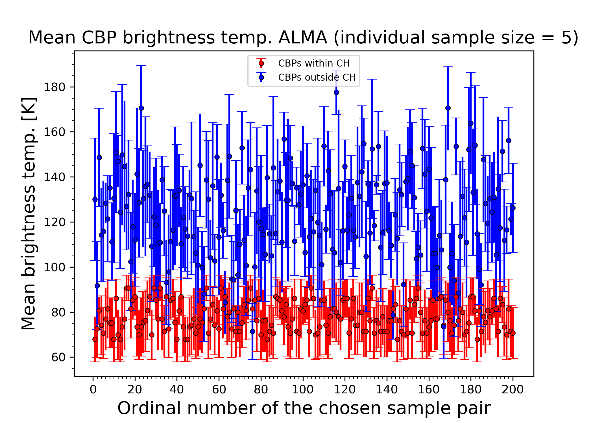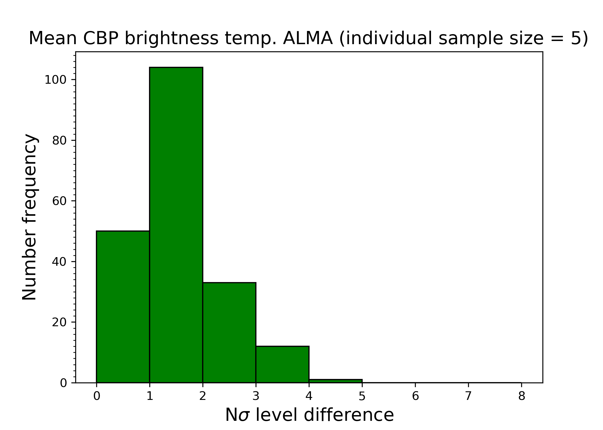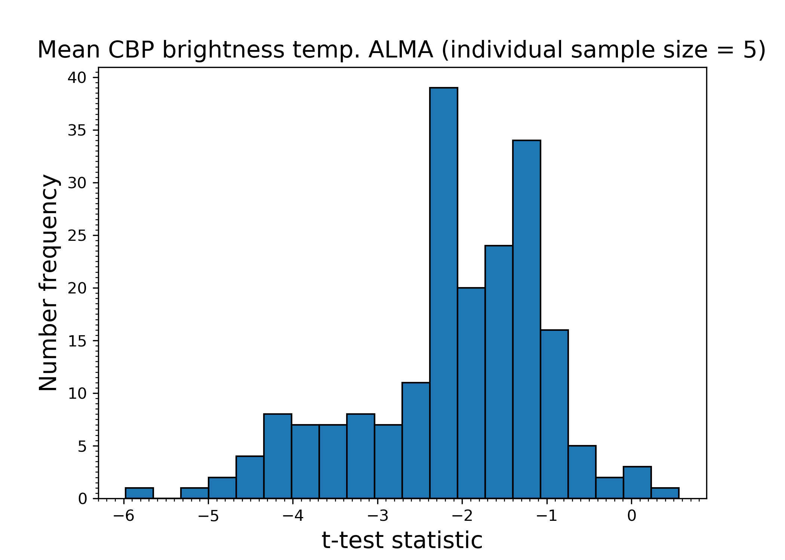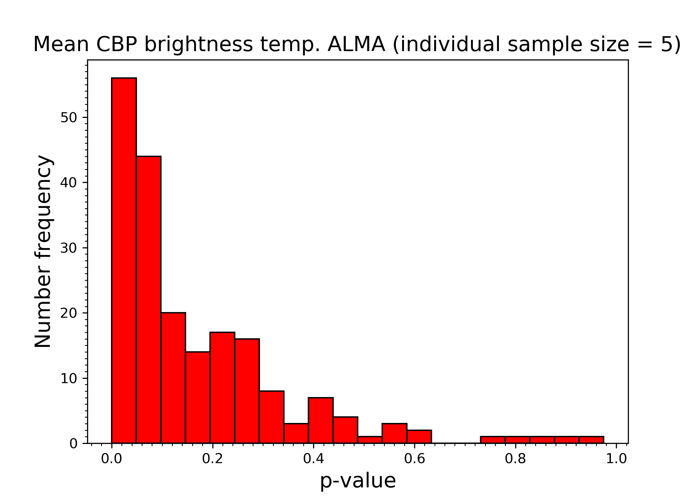

**Figure 13. -** Statistical analysis of mean ALMA Band 6 CBP brightness temperature. Top row: Left panel shows the mean values of the mean CBP intensities in the ALMA Band 6 image with corresponding standard errors of 200 randomly chosen equal size CBP sample pairs, with one sample containing CBPs within (red) and the other outside (blue) the CH1. The right panel shows histogram of the largest N for which the relation (\ref{Nsigma}) holds true. Bottom row: Left panel shows histogram of the $t$-test statistic values ($t$-values) and the right panel shows the histogram of the $p$-values obtained for the mean values of CBP mean intensities in the ALMA Band 6 image. Individual CBP sample contains 5 randomly chosen CBPs out of the many selected CBPs either within or outside the CH1. (*mean_int_fig_ch1*)

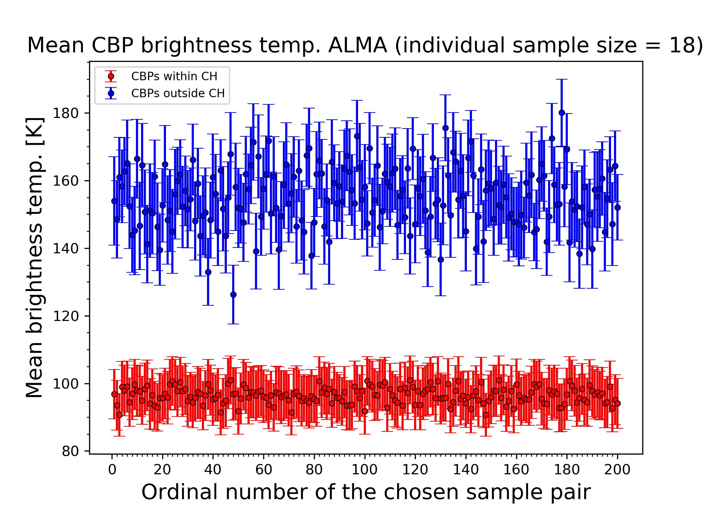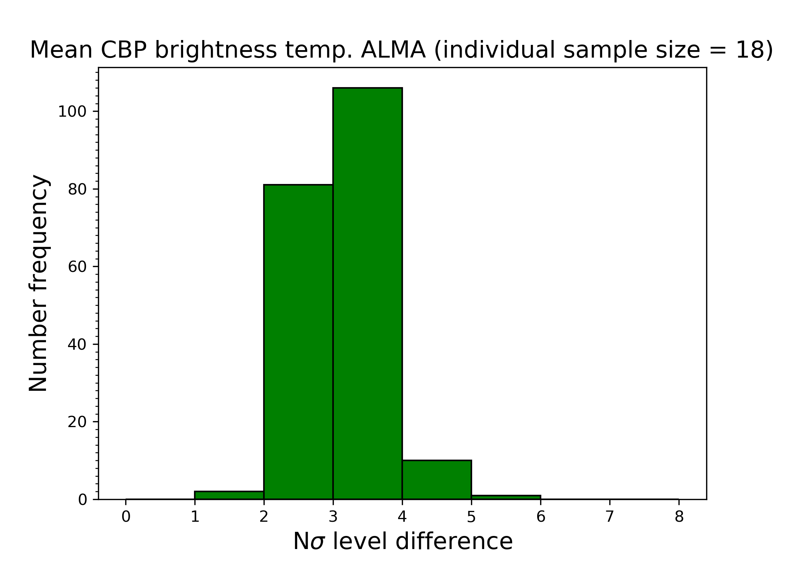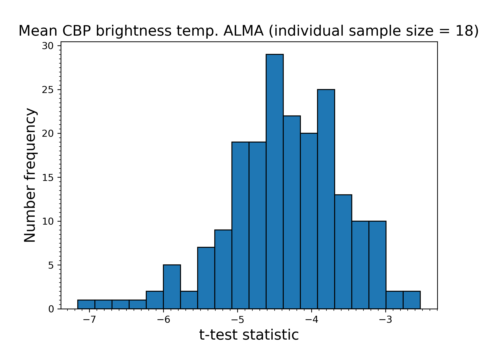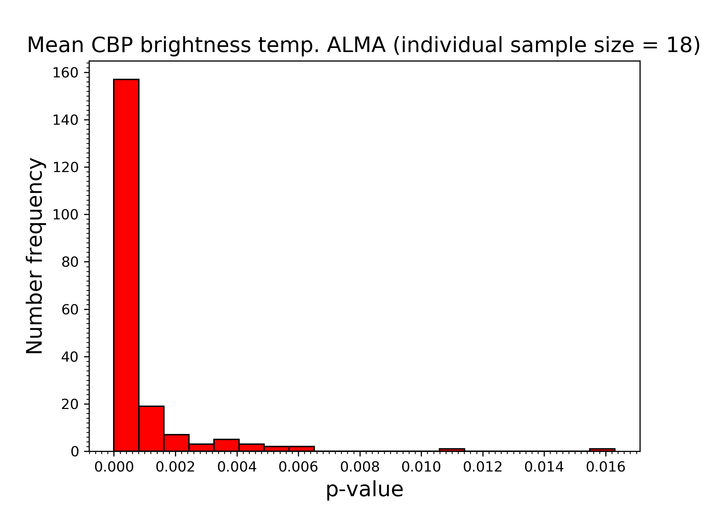

**Figure 4. -** Statistical analysis of mean ALMA Band 6 CBP brightness temperature. Top row: Left panel shows the mean values of the mean CBP intensities in the ALMA Band 6 image with corresponding standard errors of 200 randomly chosen equal size CBP sample pairs, with one sample containing CBPs within (red) and the other outside (blue) the CH2. The right panel shows histogram of the largest N for which the relation (\ref{Nsigma}) holds true. Bottom row: Left panel shows histogram of the $t$-test statistic values ($t$-values) and the right panel shows the histogram of the $p$-values obtained for the mean values of CBP mean intensities in the ALMA Band 6 image. Individual CBP sample contains 18 randomly chosen CBPs out of the many selected CBPs either within or outside the CH2. (*mean_int_fig*)

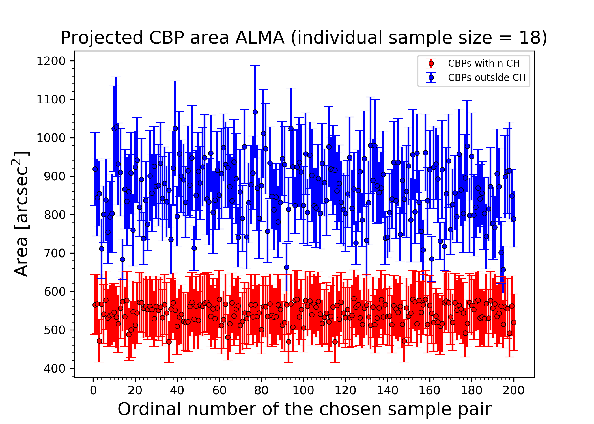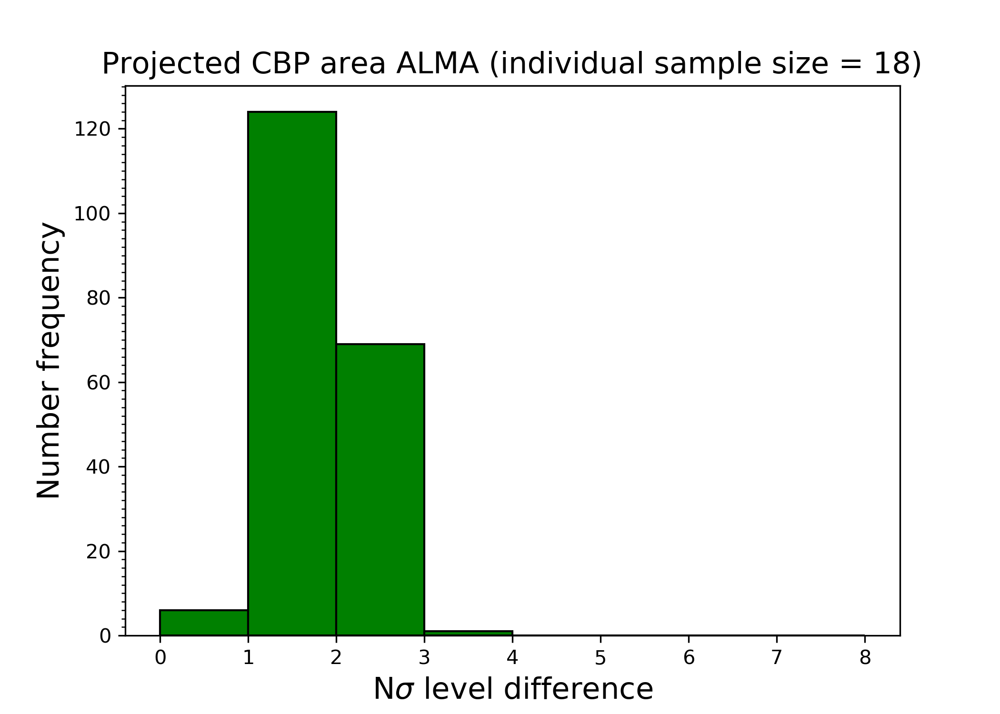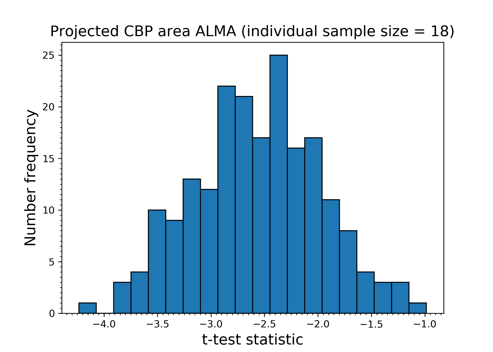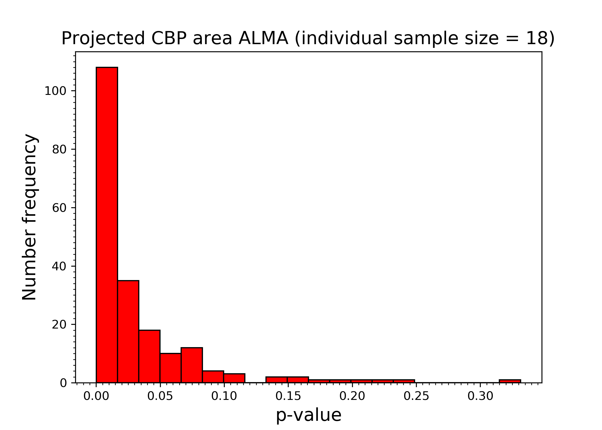

**Figure 6. -** Statistical analysis of projected ALMA Band 6 CBP area. Top row: Left panel shows the mean values of the CBP areas in the ALMA Band 6 image with corresponding standard errors of 200 randomly chosen equal size CBP sample pairs, with one sample containing CBPs within (red) and the other outside (blue) the CH2. The right panel shows histogram of the largest N for which the relation (\ref{Nsigma}) holds true. Bottom row: Left panel shows histograms of the $t$-test statistic values ($t$-values) and the right panel shows the histogram of the $p$-values obtained for the mean values of CBP areas in the ALMA Band 6 image. Individual CBP sample contains 18 randomly chosen CBPs out of the many selected CBPs either within or outside the CH2. (*area_fig*)

