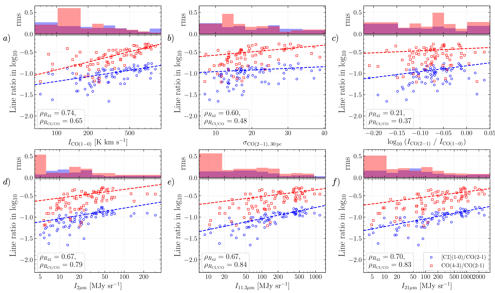

$\newcommand{\ensuremath}{}$
$\newcommand{\xspace}{}$
$\newcommand{\object}[1]{\texttt{#1}}$
$\newcommand{\farcs}{{.}''}$
$\newcommand{\farcm}{{.}'}$
$\newcommand{\arcsec}{''}$
$\newcommand{\arcmin}{'}$
$\newcommand{\ion}[2]{#1#2}$
$\newcommand{\textsc}[1]{\textrm{#1}}$
$\newcommand{\hl}[1]{\textrm{#1}}$
$\newcommand{\vdag}{(v)^\dagger}$
$\newcommand{\TODO}[2][]{$
$\ifthenelse{\isempty{#1}}{\textbf{\textcolor{red}{TODO: #2}}}{\textbf{\textcolor{red}{TODO (#1) #2}}}$
$}$
$\newcommand{\J}[2][]{$
$	\ifthenelse{\isempty{#1}}{\begingroup$
$\newcommand{\JlowerN}{\}ADD{#2}{-1}{\JlowerN}$
$		J=#2{\to}\JlowerN$
$		\endgroup$
$	}{J=#1{\to}#2}$
$}$
$\newcommand{\rom}[1]{{{\uppercase\expandafter{\romannumeral #1}}}}$
$\newcommand{\romup}[1]{{\textup{\uppercase\expandafter{\romannumeral #1}}}}$
$\newcommand{\incode}[1]{{\raggedright\lstinline|#1|}}$
$\newcommand{\incodep}[1]{{\raggedright\lstinline|"#1"|}}$
$\newcommand{\neutralcarbon}{\ifmmode \text{C\textsc{i}} \else{\sc C i}\fi}$
$\newcommand{\ionizedcarbon}{\ifmmode \text{C\textsc{ii}} \else{\sc C ii}\fi}$
$\newcommand{\neutralhydrogen}{\ifmmode \text{H\textsc{i}} \else{\sc H i}\fi}$
$\newcommand{\ionizedhydrogen}{\ifmmode \text{H\textsc{ii}} \else{\sc H ii}\fi}$
$\newcommand{\carbonmonoxide}{\ifmmode \text{\textsc{CO}} \else{\sc CO}\fi}$
$\newcommand{\DefineRemark}[2]{$
$\expandafter\newcommand\csname rmk-#1\endcsname{#2}$
$}$
$\newcommand{\Remark}[1]{\csname rmk-#1\endcsname}$
$\newcommand$
$\newcommand{\figurename}{Fig.}$
$\newcommand{\gtsima}{\; \buildrel > \over \sim \;}$
$\newcommand{\ltsima}{\; \buildrel < \over \sim \;}$
$\newcommand{\prosima}{\; \buildrel \propto \over \sim \;}$
$\newcommand{\gsim}{\lower.5ex\hbox{\gtsima}}$
$\newcommand{\lsim}{\lower.5ex\hbox{\ltsima}}$
$\newcommand{\simgt}{\lower.5ex\hbox{\gtsima}}$
$\newcommand{\simlt}{\lower.5ex\hbox{\ltsima}}$
$\newcommand{\simpr}{\lower.5ex\hbox{\prosima}}$
$\newcommand{\la}{\lsim}$
$\newcommand{\beq}{\begin{equation}}$
$\newcommand{\eeq}{\end{equation}}$
$\newcommand{\8mu}{8 \mu{\rm m}}$
$\newcommand{\16mu}{16 \mu{\rm m}}$
$\newcommand{\24mu}{24 \mu{\rm m}}$
$\newcommand{\70mu}{70 \mu{\rm m}}$
$\newcommand{\Umean}{\left<U\right>}$
$\newcommand{\Umin}{U_{\mathrm{min}}}$
$\newcommand{\Umax}{U_{\mathrm{max}}}$
$\newcommand{\SNR}{\mathrm{S/N}}$
$\newcommand{\alphaCO}{\alpha_{\mathrm{CO}}}$
$\newcommand{\deltaGDzero}{\delta_{\mathrm{GDR,0}}}$
$\newcommand{\deltaGDR}{\delta_{\mathrm{GDR}}}$
$\newcommand{\deltaDGR}{\delta_{\mathrm{DGR}}}$
$\newcommand{\deltaISM}{\delta_{\mathrm{ISM}}}$
$\newcommand{\deltaGas}{\mu_{\mathrm{molgas}}}$
$\newcommand{\deltaTotalGas}{\mu_{\mathrm{totalgas}}}$
$\newcommand{\deltaTotalGDR}{\delta_{\mathrm{totalGDR}}}$
$\newcommand{\deltaMS}{\delta{\mathrm{MS}}}$
$\newcommand{\DeltaMS}{\Delta{\mathrm{MS}}}$
$\newcommand{\GDR}{\mathrm{GDR}}$
$\newcommand{\DGR}{\mathrm{DGR}}$
$\newcommand{\Tkin}{T_{\mathrm{kin}}}$
$\newcommand{\nmean}{\left<n_{\mathrm{H}_2}\right>}$
$\newcommand{\nthresh}{n_{\mathrm{H_2,thresh}}}$
$\newcommand{\nH2}{n_{\mathrm{H}_2}}$
$\newcommand{\nHtwo}{n_{\mathrm{H}_2}}$
$\newcommand{\NH2_}{N_{\mathrm{H}_2}}$
$\newcommand{\percmcubic}{\mathrm{cm}^{-3}}$
$\newcommand{\percmsquare}{\mathrm{cm}^{-2}}$
$\newcommand{\dvddr}{\mathrm{d}v/\mathrm{d}r}$
$\newcommand{\lgNH2_}{\mathrm{log}_{10} (N_{\mathrm{H}_2} / \mathrm{cm^{-2}})}$
$\newcommand{\lgnmean}{\mathrm{log}_{10} \left<n_{\mathrm{H_2}}\right>}$
$\newcommand{\lgnHtwo}{\mathrm{log} n_{\mathrm{H_2}}}$
$\newcommand{\lgnthresh}{\mathrm{log}_{10} (n_{\mathrm{H_2,thresh}})}$
$\newcommand{\alphavir}{\alpha_{\mathrm{vir}}}$
$\newcommand{\HIrom}{\mathrm{H}\textnormal{\textup{\uppercase\expandafter{\romannumeral 1}}}}$
$\newcommand{\HIIrom}{\mathrm{H}\textnormal{\textup{\uppercase\expandafter{\romannumeral 2}}}}$
$\newcommand{\CO}{\mathrm{CO}}$
$\newcommand{\metalZOH}{12+\log_{10}(\mathrm{O/H})}$
$\newcommand{\Msun}{\mathrm{M}_{\odot}}$
$\newcommand{\Lsun}{\mathrm{L}_{\odot}}$
$\newcommand{\Kkmspc2}{\mathrm{K km s^{-1} pc^{2}}}$
$\newcommand{\kms}{\mathrm{km s^{-1}}}$
$\newcommand{\SFR}{\mathrm{SFR}}$
$\newcommand{\LIR}{L_{\mathrm{IR}}}$
$\newcommand{\Mstar}{M_{\star}}$
$\newcommand{\Mdust}{M_{\mathrm{dust}}}$
$\newcommand{\Tdust}{T_{\mathrm{dust}}}$
$\newcommand{\Mgas}{M_{\mathrm{gas}}}$
$\newcommand{\Mmolgas}{M_{\mathrm{mol gas}}}$
$\newcommand{\Mtotalgas}{M_{\mathrm{total gas}}}$
$\newcommand{\Matomicgas}{M_{\mathrm{atomic gas}}}$
$\newcommand{\arcsec}{"}$
$\newcommand{\R52}{R_{52}}$
$\newcommand{\fPDR}{f_{\mathrm{PDR}}}$
$\newcommand{\fmol}{f_{\mathrm{mol}}}$
$\newcommand{\fH2_}{f_{\mathrm{H_2}}}$
$\newcommand{\MH2_}{M_{\mathrm{H_2}}}$
$\newcommand{\XCICO}{[\mathrm{C}{\text{\sc{i}}/\mathrm{CO}]}}$
$\newcommand{\micron}{\mu\mathrm{m}}$
$\newcommand{\Jykms}{\mathrm{Jy km/s}}$
$\newcommand{\Kkms_}{\mathrm{K km/s}}$
$\newcommand{\LprimeCO}{L^{\prime}_{\mathrm{CO}}}$
$\newcommand{\MAGPHYS}{\textsc{MAGPHYS}}$
$\newcommand{\michi2}{\textsc{MiChi2}}$
$\newcommand{\um}{\ifmmode{\mu\mathrm{m}}\else{\mu\mathrm{m}}\fi}$
$\newcommand{\cofour}{CO(4--3)}$
$\newcommand{\cotwo}{CO(2--1)}$
$\newcommand{\J}[2][]{$
$	\ifthenelse{\isempty{#1}}{\begingroup$
$\newcommand{\JlowerN}{\}ADD{#2}{-1}{\JlowerN}$
$		J=#2{\to}\JlowerN$
$		\endgroup$
$	}{J=#1{\to}#2}$
$}$
$\newcommand{\rom}[1]{{{\uppercase\expandafter{\romannumeral #1}}}}$
$\newcommand{\romup}[1]{{\textup{\uppercase\expandafter{\romannumeral #1}}}}$
$\newcommand{\incode}[1]{{\raggedright\lstinline|#1|}}$
$\newcommand{\incodep}[1]{{\raggedright\lstinline|"#1"|}}$
$\newcommand{\neutralcarbon}{\ifmmode \text{C\textsc{i}} \else{\sc C i}\fi}$
$\newcommand{\ionizedcarbon}{\ifmmode \text{C\textsc{ii}} \else{\sc C ii}\fi}$
$\newcommand{\neutralhydrogen}{\ifmmode \text{H\textsc{i}} \else{\sc H i}\fi}$
$\newcommand{\ionizedhydrogen}{\ifmmode \text{H\textsc{ii}} \else{\sc H ii}\fi}$
$\newcommand{\carbonmonoxide}{\ifmmode \text{\textsc{CO}} \else{\sc CO}\fi}$
$\newcommand{\HII}{\ionizedhydrogen}$
$\newcommand{\CI}{\neutralcarbon}$
$\newcommand{\CO}{\carbonmonoxide}$
$\newcommand{\}{alphaCO}{\relax\ifmmode$
$    \alpha_\mathrm{CO}$
$    \else{\alpha_\mathrm{CO}}\fi$
$    }$
$\newcommand{\DefineRemark}[2]{$
$\expandafter\newcommand\csname rmk-#1\endcsname{#2}$
$}$
$\newcommand{\Remark}[1]{\csname rmk-#1\endcsname}$
$\DefineRemark{CI3P13P0}{[\mathrm{C}{\text{\sc{i}}}]\;(^{3}P_{1}\textnormal{--}^{3}P_{0})}$
$\DefineRemark{CI}{\mathrm{C}{\text{\sc{i}}}}$
$\DefineRemark{CI10}{[\mathrm{C}{\text{\sc{i}}}] (1\textnormal{--}0)}$
$\DefineRemark{CI21}{[\mathrm{C}{\text{\sc{i}}}] (2\textnormal{--}1)}$
$\DefineRemark{CO}{\mathrm{CO}}$
$\DefineRemark{CO10}{\mathrm{CO} (1\textnormal{--}0)}$
$\DefineRemark{CO21}{\mathrm{CO} (2\textnormal{--}1)}$
$\DefineRemark{CO32}{\mathrm{CO} (3\textnormal{--}2)}$
$\DefineRemark{CO43}{\mathrm{CO} (4\textnormal{--}3)}$
$\DefineRemark{COJ10}{\mathrm{CO} (J=1 \to 0)}$
$\DefineRemark{COJ21}{\mathrm{CO} (J=2 \to 1)}$
$\DefineRemark{COJ32}{\mathrm{CO} (J=3 \to 2)}$
$\DefineRemark{COJ43}{\mathrm{CO} (J=4 \to 3)}$
$\DefineRemark{RCI10CO10}{$
${R}_{\mathrm{C{\text{\sc{i}}}_{10}}/\mathrm{CO_{10}}}$
$}$
$\DefineRemark{RCI10CO21}{$
${R}_{\mathrm{C{\text{\sc{i}}}_{10}}/\mathrm{CO_{21}}}$
$}$
$\DefineRemark{RCI10CO32}{$
${R}_{\mathrm{C{\text{\sc{i}}}_{10}}/\mathrm{CO_{32}}}$
$}$
$\DefineRemark{RCI10CO43}{$
${R}_{\mathrm{C{\text{\sc{i}}}_{10}}/\mathrm{CO_{43}}}$
$}$
$\DefineRemark{LPrimeCO21}{L^{\prime}_{\Remark{CO21}}}$
$\DefineRemark{LPrimeCI10}{L^{\prime}_{\Remark{CI10}}}$
$\DefineRemark{ICO10}{I_{\Remark{CO10}}}$
$\DefineRemark{ICO21}{I_{\Remark{CO21}}}$
$\DefineRemark{ICO32}{I_{\Remark{CO32}}}$
$\DefineRemark{ICO43}{I_{\Remark{CO43}}}$
$\DefineRemark{ICI10}{I_{\Remark{CI10}}}$
$\DefineRemark{kms}{\mathrm{km s^{-1}}}$
$\DefineRemark{Kkms}{\mathrm{K km s^{-1}}}$
$\DefineRemark{Kkmspc2}{\mathrm{K km s^{-1} pc^{2}}}$
$\DefineRemark{MJysr}{\mathrm{MJy sr^{-1}}}$
$\DefineRemark{R42}{\ifmmode{R_{42}}\else{R_{42}}\fi}$
$\DefineRemark{R41}{\ifmmode{R_{41}}\else{R_{41}}\fi}$
$\DefineRemark{R31}{\ifmmode{R_{31}}\else{R_{31}}\fi}$
$\DefineRemark{R21}{\ifmmode{R_{21}}\else{R_{21}}\fi}$
$\DefineRemark{R02}{\ifmmode{R_{\rm C\text{\sc{i}}CO}}\else{R_{\rm C\text{\sc{i}}CO}}\fi}$
$\DefineRemark{RCICO}{\ifmmode{R_{\mathrm{C}\text{\sc{i}}\mathrm{CO}}}\else{R_{\mathrm{C}\text{\sc{i}}\mathrm{CO}}}\fi}$
$\newcommand{\figurename}{Fig.}$
$\accepted{December 7, 2022}$
$\submitjournal{ApJL}$
$\shorttitle{Stellar Feedback, Molecular Excitation and Dissociation in NGC~1365}$
$\shortauthors{Liu et al.}$
$\begin{document}$
$\title{PHANGS-JWST First Results: Stellar Feedback-Driven Excitation and Dissociation of Molecular Gas in the Starburst Ring of NGC 1365?$
$}$
$\correspondingauthor{Daizhong Liu}$
$\email{dzliu@mpe.mpg.de, astro.dzliu@gmail.com}$
$\author[0000-0001-9773-7479]{Daizhong Liu}$
$\affiliation{Max-Planck-Institut für Extraterrestrische Physik (MPE), Giessenbachstr. 1, D-85748 Garching, Germany}$
$\author[0000-0002-3933-7677]{Eva Schinnerer}$
$\affiliation{Max-Planck-Institut für Astronomie, Königstuhl 17, D-69117 Heidelberg, Germany}$
$\author[0000-0001-5301-1326]{Yixian Cao}$
$\affiliation{Max-Planck-Institut für Extraterrestrische Physik (MPE), Giessenbachstr. 1, D-85748 Garching, Germany}$
$\author[0000-0002-2545-1700]{Adam Leroy}$
$\affiliation{Department of Astronomy, The Ohio State University, 140 West 18th Ave, Columbus, OH 43210, USA}$
$\author[0000-0003-1242-505X]{Antonio Usero}$
$\affiliation{Observatorio Astronómico Nacional (IGN), C/Alfonso XII, 3, E-28014 Madrid, Spain}$
$\author[0000-0002-5204-2259]{Erik Rosolowsky}$
$\affiliation{Department of Physics, University of Alberta, Edmonton, AB T6G 2E1, Canada}$
$\author[0000-0002-6155-7166]{Eric Emsellem}$
$\affiliation{European Southern Observatory, Karl-Schwarzschild-Stra{\ss}e 2, 85748 Garching, Germany}$
$\affiliation{Univ Lyon, Univ Lyon1, ENS de Lyon, CNRS, Centre de Recherche Astrophysique de Lyon UMR5574, F-69230 Saint-Genis-Laval France}$
$\author[0000-0002-8804-0212]{J.~M.~Diederik~Kruijssen}$
$\affiliation{Cosmic Origins Of Life (COOL) Research DAO, coolresearch.io}$
$\author[0000-0002-5635-5180]{Mélanie Chevance}$
$\affiliation{Universität Heidelberg, Zentrum für Astronomie, Institut für Theoretische Astrophysik, Albert-Ueberle-Str 2, D-69120 Heidelberg, Germany}$
$\affiliation{Cosmic Origins Of Life (COOL) Research DAO, coolresearch.io}$
$\author[0000-0001-6708-1317]{Simon C. O. Glover}$
$\affiliation{Universität Heidelberg, Zentrum für Astronomie, Institut für Theoretische Astrophysik, Albert-Ueberle-Str 2, D-69120 Heidelberg, Germany}$
$\author[0000-0001-6113-6241]{Mattia C. Sormani}$
$\affiliation{Universität Heidelberg, Zentrum für Astronomie, Institut für Theoretische Astrophysik, Albert-Ueberle-Str 2, D-69120 Heidelberg, Germany}$
$\author[0000-0002-5480-5686]{Alberto D. Bolatto}$
$\affiliation{Department of Astronomy and Joint Space-Science Institute, University of Maryland, College Park, MD 20742, USA}$
$\author[0000-0003-0378-4667]{Jiayi~Sun}$
$\affiliation{Department of Physics and Astronomy, McMaster University, 1280 Main Street West, Hamilton, ON L8S 4M1, Canada}$
$\affiliation{Canadian Institute for Theoretical Astrophysics (CITA), University of Toronto, 60 St George Street, Toronto, ON M5S 3H8, Canada}$
$\author[0000-0002-9333-387X]{Sophia K. Stuber}$
$\affiliation{Max-Planck-Institut für Astronomie, Königstuhl 17, D-69117 Heidelberg, Germany}$
$\author[0000-0003-4209-1599]{Yu-Hsuan Teng}$
$\affiliation{Center for Astrophysics and Space Sciences, Department of Physics, University of California, San Diego, 9500 Gilman Drive, La Jolla, CA 92093, USA}$
$\author[0000-0003-0166-9745]{Frank Bigiel}$
$\affiliation{Argelander-Institut für Astronomie, Universität Bonn, Auf dem Hügel 71, 53121 Bonn, Germany}$
$\author[0000-0003-0583-7363]{Ivana Be\v{s}li\'c}$
$\affiliation{Argelander-Institut für Astronomie, Universität Bonn, Auf dem Hügel 71, 53121 Bonn, Germany}$
$\author[0000-0002-3247-5321]{Kathryn~Grasha}$
$\affiliation{Research School of Astronomy and Astrophysics, Australian National University, Canberra, ACT 2611, Australia}$
$\affiliation{ARC Centre of Excellence for All Sky Astrophysics in 3 Dimensions (ASTRO 3D), Australia}$
$\author[0000-0001-9656-7682]{Jonathan~D.~Henshaw}$
$\affiliation{Astrophysics Research Institute, Liverpool John Moores University, 146 Brownlow Hill, Liverpool L3 5RF, UK}$
$\affiliation{Max-Planck-Institut für Astronomie, Königstuhl 17, D-69117 Heidelberg, Germany}$
$\author[0000-0003-0410-4504]{Ashley.~T.~Barnes}$
$\affiliation{Argelander-Institut für Astronomie, Universität Bonn, Auf dem Hügel 71, 53121 Bonn, Germany}$
$\author[0000-0002-8760-6157]{Jakob~S.~den Brok}$
$\affiliation{Argelander-Institut für Astronomie, Universität Bonn, Auf dem Hügel 71, 53121 Bonn, Germany}$
$\author[0000-0002-2501-9328]{Toshiki Saito}$
$\affiliation{National Astronomical Observatory of Japan, 2-21-1 Osawa, Mitaka, Tokyo, 181-8588, Japan}$
$\author[0000-0002-5782-9093]{Daniel~A.~Dale}$
$\affiliation{Department of Physics and Astronomy, University of Wyoming, Laramie, WY 82071, USA}$
$\author[0000-0002-7365-5791]{Elizabeth~J.~Watkins}$
$\affiliation{Astronomisches Rechen-Institut, Zentrum für Astronomie der Universität Heidelberg, Mönchhofstra\ss e 12-14, 69120 Heidelberg, Germany}$
$\author[0000-0002-1370-6964]{Hsi-An Pan}$
$\affiliation{Department of Physics, Tamkang University, No.151, Yingzhuan Road, Tamsui District, New Taipei City 251301, Taiwan}$
$\author[0000-0002-0560-3172]{Ralf S. Klessen}$
$\affiliation{Universität Heidelberg, Zentrum für Astronomie, Institut für Theoretische Astrophysik, Albert-Ueberle-Str 2, D-69120 Heidelberg, Germany}$
$\affiliation{Universität Heidelberg, Interdisziplinäres Zentrum für Wissenschaftliches Rechnen, Im Neuenheimer Feld 205, D-69120 Heidelberg, Germany}$
$\author[0000-0002-5259-2314]{Gagandeep~S. Anand}$
$\affiliation{Space Telescope Science Institute, 3700 San Martin Drive, Baltimore, MD 21218, USA}$
$\author[0000-0003-1943-723X]{Sinan Deger}$
$\affiliation{The Oskar Klein Centre for Cosmoparticle Physics, Department of Physics, Stockholm University, AlbaNova, Stockholm, SE-106 91, Sweden}$
$\author[0000-0002-4755-118X]{Oleg V. Egorov}$
$\affiliation{Astronomisches Rechen-Institut, Zentrum für Astronomie der Universität Heidelberg, Mönchhofstra\ss e 12-14, 69120 Heidelberg, Germany}$
$\author[0000-0001-5310-467X]{Christopher~M. Faesi}$
$\affiliation{University of Massachusetts-Amherst, 710 North Pleasant Street, Amherst, MA 01003, USA}$
$\author[0000-0002-8806-6308]{Hamid Hassani}$
$\affiliation{Department of Physics, University of Alberta, Edmonton, Alberta, T6G 2E1, Canada}$
$\author[0000-0003-3917-6460]{Kirsten L. Larson}$
$\affiliation{AURA for the European Space Agency (ESA), Space Telescope Science Institute, 3700 San Martin Drive, Baltimore, MD 21218, USA}$
$\author[0000-0002-2278-9407]{Janice~C. Lee}$
$\affiliation{Gemini Observatory/NSF's NOIRLab, 950 N. Cherry Avenue, Tucson, AZ 85719, USA; Caltech/IPAC, California Institute of Technology, Pasadena, CA 91125, USA}$
$\author[0000-0002-1790-3148]{Laura A. Lopez}$
$\affiliation{Department of Astronomy, The Ohio State University, 140 West 18th Ave, Columbus, OH 43210, USA}$
$\affiliation{Center for Cosmology and Astroparticle Physics, 191 West Woodruff Avenue, Columbus, OH 43210, USA}$
$\affiliation{Flatiron Institute, Center for Computational Astrophysics, NY 10010, USA}$
$\author[0000-0003-3061-6546]{Jér\^{o}me Pety}$
$\affiliation{IRAM, 300 rue de la Piscine, 38400 Saint Martin d'Hères, France}$
$\affiliation{LERMA, Observatoire de Paris, PSL Research University, CNRS, Sorbonne Universités, 75014 Paris}$
$\author[0000-0002-4378-8534]{Karin Sandstrom}$
$\affiliation{Center for Astrophysics and Space Sciences, Department of Physics, University of California, San Diego, 9500 Gilman Drive, La Jolla, CA 92093, USA}$
$\author[0000-0002-8528-7340]{David~A. Thilker}$
$\affiliation{Department of Physics and Astronomy, The Johns Hopkins University, Baltimore, MD 21218, USA}$
$\author[0000-0002-3784-7032]{Bradley~C. Whitmore}$
$\affiliation{Space Telescope Science Institute, 3700 San Martin Drive, Baltimore, MD 21218, USA}$
$\author[0000-0002-0012-2142]{Thomas G. Williams}$
$\affiliation{Sub-department of Astrophysics, Department of Physics, University of Oxford, Keble Road, Oxford OX1 3RH, UK}$
$\affiliation{Max-Planck-Institut für Astronomie, Königstuhl 17, D-69117 Heidelberg, Germany}$
$\suppressAffiliations$
$\begin{abstract}$
$We compare embedded young massive star clusters (YMCs) to (sub-)millimeter line observations tracing the excitation and dissociation of molecular gas in the starburst ring of NGC~1365. This galaxy hosts one of the strongest nuclear starbursts and richest populations of YMCs within 20~Mpc.$
$Here we combine near-/mid-IR PHANGS-JWST imaging with new ALMA multi-J CO(1--0, 2--1 and 4--3) and [\CI](1--0) mapping, which we use to trace CO excitation via \Remark{R42}=\Remark{ICO43}/\Remark{ICO21} and \Remark{R21}=\Remark{ICO21}/\Remark{ICO10} and dissociation via \Remark{RCICO}=\Remark{ICI10}/\Remark{ICO21} at 330~pc resolution.$
$We find that the gas flowing into the starburst ring from northeast to southwest appears strongly affected by stellar feedback, showing decreased excitation (lower \Remark{R42}) and increased signatures of dissociation (higher \Remark{RCICO}) in the downstream regions.$
$There, radiative transfer modelling suggests that the molecular gas density decreases and temperature and \XCICO abundance ratio increase.$
$We compare \Remark{R42} and \Remark{RCICO} with local conditions across the regions and find that both correlate with near-IR 2~\um emission tracing the YMCs and with both PAH (11.3~\um) and dust continuum (21~\um) emission.$
$In general, \Remark{RCICO} exhibits \sim 0.1~dex tighter correlations than \Remark{R42}, suggesting \CI  to be a more sensitive tracer of changing physical conditions in the NGC~1365 starburst than CO(4--3).$
$Our results are consistent with a scenario where gas flows into the two arm regions along the bar, becomes condensed/shocked, forms YMCs, and then these YMCs heat and dissociate the gas.$
$\end{abstract}$
$\keywords{galaxies: ISM --- galaxies: star formation --- ISM: molecules --- ISM: atoms}$
$\n\end{document}}}}\end{equation}}$
$\newcommand{\eeq}{\end{equation}}$
$\newcommand{\8mu}{8 \mu{\rm m}}$
$\newcommand{\16mu}{16 \mu{\rm m}}$
$\newcommand{\24mu}{24 \mu{\rm m}}$
$\newcommand{\70mu}{70 \mu{\rm m}}$
$\newcommand{\Umean}{\left<U\right>}$
$\newcommand{\Umin}{U_{\mathrm{min}}}$
$\newcommand{\Umax}{U_{\mathrm{max}}}$
$\newcommand{\SNR}{\mathrm{S/N}}$
$\newcommand{\alphaCO}{\alpha_{\mathrm{CO}}}$
$\newcommand{\deltaGDzero}{\delta_{\mathrm{GDR,0}}}$
$\newcommand{\deltaGDR}{\delta_{\mathrm{GDR}}}$
$\newcommand{\deltaDGR}{\delta_{\mathrm{DGR}}}$
$\newcommand{\deltaISM}{\delta_{\mathrm{ISM}}}$
$\newcommand{\deltaGas}{\mu_{\mathrm{molgas}}}$
$\newcommand{\deltaTotalGas}{\mu_{\mathrm{totalgas}}}$
$\newcommand{\deltaTotalGDR}{\delta_{\mathrm{totalGDR}}}$
$\newcommand{\deltaMS}{\delta{\mathrm{MS}}}$
$\newcommand{\DeltaMS}{\Delta{\mathrm{MS}}}$
$\newcommand{\GDR}{\mathrm{GDR}}$
$\newcommand{\DGR}{\mathrm{DGR}}$
$\newcommand{\Tkin}{T_{\mathrm{kin}}}$
$\newcommand{\nmean}{\left<n_{\mathrm{H}_2}\right>}$
$\newcommand{\nthresh}{n_{\mathrm{H_2,thresh}}}$
$\newcommand{\nH2}{n_{\mathrm{H}_2}}$
$\newcommand{\nHtwo}{n_{\mathrm{H}_2}}$
$\newcommand{\NH2_}{N_{\mathrm{H}_2}}$
$\newcommand{\percmcubic}{\mathrm{cm}^{-3}}$
$\newcommand{\percmsquare}{\mathrm{cm}^{-2}}$
$\newcommand{\dvddr}{\mathrm{d}v/\mathrm{d}r}$
$\newcommand{\lgNH2_}{\mathrm{log}_{10} (N_{\mathrm{H}_2} / \mathrm{cm^{-2}})}$
$\newcommand{\lgnmean}{\mathrm{log}_{10} \left<n_{\mathrm{H_2}}\right>}$
$\newcommand{\lgnHtwo}{\mathrm{log} n_{\mathrm{H_2}}}$
$\newcommand{\lgnthresh}{\mathrm{log}_{10} (n_{\mathrm{H_2,thresh}})}$
$\newcommand{\alphavir}{\alpha_{\mathrm{vir}}}$
$\newcommand{\HIrom}{\mathrm{H}\textnormal{\textup{\uppercase\expandafter{\romannumeral 1}}}}$
$\newcommand{\HIIrom}{\mathrm{H}\textnormal{\textup{\uppercase\expandafter{\romannumeral 2}}}}$
$\newcommand{\CO}{\mathrm{CO}}$
$\newcommand{\metalZOH}{12+\log_{10}(\mathrm{O/H})}$
$\newcommand{\Msun}{\mathrm{M}_{\odot}}$
$\newcommand{\Lsun}{\mathrm{L}_{\odot}}$
$\newcommand{\Kkmspc2}{\mathrm{K km s^{-1} pc^{2}}}$
$\newcommand{\kms}{\mathrm{km s^{-1}}}$
$\newcommand{\SFR}{\mathrm{SFR}}$
$\newcommand{\LIR}{L_{\mathrm{IR}}}$
$\newcommand{\Mstar}{M_{\star}}$
$\newcommand{\Mdust}{M_{\mathrm{dust}}}$
$\newcommand{\Tdust}{T_{\mathrm{dust}}}$
$\newcommand{\Mgas}{M_{\mathrm{gas}}}$
$\newcommand{\Mmolgas}{M_{\mathrm{mol gas}}}$
$\newcommand{\Mtotalgas}{M_{\mathrm{total gas}}}$
$\newcommand{\Matomicgas}{M_{\mathrm{atomic gas}}}$
$\newcommand{\arcsec}{"}$
$\newcommand{\R52}{R_{52}}$
$\newcommand{\fPDR}{f_{\mathrm{PDR}}}$
$\newcommand{\fmol}{f_{\mathrm{mol}}}$
$\newcommand{\fH2_}{f_{\mathrm{H_2}}}$
$\newcommand{\MH2_}{M_{\mathrm{H_2}}}$
$\newcommand{\XCICO}{[\mathrm{C}{\text{\sc{i}}/\mathrm{CO}]}}$
$\newcommand{\micron}{\mu\mathrm{m}}$
$\newcommand{\Jykms}{\mathrm{Jy km/s}}$
$\newcommand{\Kkms_}{\mathrm{K km/s}}$
$\newcommand{\LprimeCO}{L^{\prime}_{\mathrm{CO}}}$
$\newcommand{\MAGPHYS}{\textsc{MAGPHYS}}$
$\newcommand{\michi2}{\textsc{MiChi2}}$
$\newcommand{\um}{\ifmmode{\mu\mathrm{m}}\else{\mu\mathrm{m}}\fi}$
$\newcommand{\cofour}{CO(4--3)}$
$\newcommand{\cotwo}{CO(2--1)}$
$\newcommand{\J}[2][]{$
$	\ifthenelse{\isempty{#1}}{\begingroup$
$\newcommand{\JlowerN}{\}ADD{#2}{-1}{\JlowerN}$
$		J=#2{\to}\JlowerN$
$		\endgroup$
$	}{J=#1{\to}#2}$
$}$
$\newcommand{\rom}[1]{{{\uppercase\expandafter{\romannumeral #1}}}}$
$\newcommand{\romup}[1]{{\textup{\uppercase\expandafter{\romannumeral #1}}}}$
$\newcommand{\incode}[1]{{\raggedright\lstinline|#1|}}$
$\newcommand{\incodep}[1]{{\raggedright\lstinline|"#1"|}}$
$\newcommand{\neutralcarbon}{\ifmmode \text{C\textsc{i}} \else{\sc C i}\fi}$
$\newcommand{\ionizedcarbon}{\ifmmode \text{C\textsc{ii}} \else{\sc C ii}\fi}$
$\newcommand{\neutralhydrogen}{\ifmmode \text{H\textsc{i}} \else{\sc H i}\fi}$
$\newcommand{\ionizedhydrogen}{\ifmmode \text{H\textsc{ii}} \else{\sc H ii}\fi}$
$\newcommand{\carbonmonoxide}{\ifmmode \text{\textsc{CO}} \else{\sc CO}\fi}$
$\newcommand{\HII}{\ionizedhydrogen}$
$\newcommand{\CI}{\neutralcarbon}$
$\newcommand{\CO}{\carbonmonoxide}$
$\newcommand{\}{alphaCO}{\relax\ifmmode$
$    \alpha_\mathrm{CO}$
$    \else{\alpha_\mathrm{CO}}\fi$
$    }$
$\newcommand{\DefineRemark}[2]{$
$\expandafter\newcommand\csname rmk-#1\endcsname{#2}$
$}$
$\newcommand{\Remark}[1]{\csname rmk-#1\endcsname}$
$\DefineRemark{CI3P13P0}{[\mathrm{C}{\text{\sc{i}}}]\;(^{3}P_{1}\textnormal{--}^{3}P_{0})}$
$\DefineRemark{CI}{\mathrm{C}{\text{\sc{i}}}}$
$\DefineRemark{CI10}{[\mathrm{C}{\text{\sc{i}}}] (1\textnormal{--}0)}$
$\DefineRemark{CI21}{[\mathrm{C}{\text{\sc{i}}}] (2\textnormal{--}1)}$
$\DefineRemark{CO}{\mathrm{CO}}$
$\DefineRemark{CO10}{\mathrm{CO} (1\textnormal{--}0)}$
$\DefineRemark{CO21}{\mathrm{CO} (2\textnormal{--}1)}$
$\DefineRemark{CO32}{\mathrm{CO} (3\textnormal{--}2)}$
$\DefineRemark{CO43}{\mathrm{CO} (4\textnormal{--}3)}$
$\DefineRemark{COJ10}{\mathrm{CO} (J=1 \to 0)}$
$\DefineRemark{COJ21}{\mathrm{CO} (J=2 \to 1)}$
$\DefineRemark{COJ32}{\mathrm{CO} (J=3 \to 2)}$
$\DefineRemark{COJ43}{\mathrm{CO} (J=4 \to 3)}$
$\DefineRemark{RCI10CO10}{$
${R}_{\mathrm{C{\text{\sc{i}}}_{10}}/\mathrm{CO_{10}}}$
$}$
$\DefineRemark{RCI10CO21}{$
${R}_{\mathrm{C{\text{\sc{i}}}_{10}}/\mathrm{CO_{21}}}$
$}$
$\DefineRemark{RCI10CO32}{$
${R}_{\mathrm{C{\text{\sc{i}}}_{10}}/\mathrm{CO_{32}}}$
$}$
$\DefineRemark{RCI10CO43}{$
${R}_{\mathrm{C{\text{\sc{i}}}_{10}}/\mathrm{CO_{43}}}$
$}$
$\DefineRemark{LPrimeCO21}{L^{\prime}_{\Remark{CO21}}}$
$\DefineRemark{LPrimeCI10}{L^{\prime}_{\Remark{CI10}}}$
$\DefineRemark{ICO10}{I_{\Remark{CO10}}}$
$\DefineRemark{ICO21}{I_{\Remark{CO21}}}$
$\DefineRemark{ICO32}{I_{\Remark{CO32}}}$
$\DefineRemark{ICO43}{I_{\Remark{CO43}}}$
$\DefineRemark{ICI10}{I_{\Remark{CI10}}}$
$\DefineRemark{kms}{\mathrm{km s^{-1}}}$
$\DefineRemark{Kkms}{\mathrm{K km s^{-1}}}$
$\DefineRemark{Kkmspc2}{\mathrm{K km s^{-1} pc^{2}}}$
$\DefineRemark{MJysr}{\mathrm{MJy sr^{-1}}}$
$\DefineRemark{R42}{\ifmmode{R_{42}}\else{R_{42}}\fi}$
$\DefineRemark{R41}{\ifmmode{R_{41}}\else{R_{41}}\fi}$
$\DefineRemark{R31}{\ifmmode{R_{31}}\else{R_{31}}\fi}$
$\DefineRemark{R21}{\ifmmode{R_{21}}\else{R_{21}}\fi}$
$\DefineRemark{R02}{\ifmmode{R_{\rm C\text{\sc{i}}CO}}\else{R_{\rm C\text{\sc{i}}CO}}\fi}$
$\DefineRemark{RCICO}{\ifmmode{R_{\mathrm{C}\text{\sc{i}}\mathrm{CO}}}\else{R_{\mathrm{C}\text{\sc{i}}\mathrm{CO}}}\fi}$
$\newcommand{\figurename}{Fig.}$
$\accepted{December 7, 2022}$
$\submitjournal{ApJL}$
$\shorttitle{Stellar Feedback, Molecular Excitation and Dissociation in NGC~1365}$
$\shortauthors{Liu et al.}$
$\begin{document}$
$\title{PHANGS-JWST First Results: Stellar Feedback-Driven Excitation and Dissociation of Molecular Gas in the Starburst Ring of NGC 1365?$
$}$
$\correspondingauthor{Daizhong Liu}$
$\email{dzliu@mpe.mpg.de, astro.dzliu@gmail.com}$
$\author[0000-0001-9773-7479]{Daizhong Liu}$
$\affiliation{Max-Planck-Institut für Extraterrestrische Physik (MPE), Giessenbachstr. 1, D-85748 Garching, Germany}$
$\author[0000-0002-3933-7677]{Eva Schinnerer}$
$\affiliation{Max-Planck-Institut für Astronomie, Königstuhl 17, D-69117 Heidelberg, Germany}$
$\author[0000-0001-5301-1326]{Yixian Cao}$
$\affiliation{Max-Planck-Institut für Extraterrestrische Physik (MPE), Giessenbachstr. 1, D-85748 Garching, Germany}$
$\author[0000-0002-2545-1700]{Adam Leroy}$
$\affiliation{Department of Astronomy, The Ohio State University, 140 West 18th Ave, Columbus, OH 43210, USA}$
$\author[0000-0003-1242-505X]{Antonio Usero}$
$\affiliation{Observatorio Astronómico Nacional (IGN), C/Alfonso XII, 3, E-28014 Madrid, Spain}$
$\author[0000-0002-5204-2259]{Erik Rosolowsky}$
$\affiliation{Department of Physics, University of Alberta, Edmonton, AB T6G 2E1, Canada}$
$\author[0000-0002-6155-7166]{Eric Emsellem}$
$\affiliation{European Southern Observatory, Karl-Schwarzschild-Stra{\ss}e 2, 85748 Garching, Germany}$
$\affiliation{Univ Lyon, Univ Lyon1, ENS de Lyon, CNRS, Centre de Recherche Astrophysique de Lyon UMR5574, F-69230 Saint-Genis-Laval France}$
$\author[0000-0002-8804-0212]{J.~M.~Diederik~Kruijssen}$
$\affiliation{Cosmic Origins Of Life (COOL) Research DAO, coolresearch.io}$
$\author[0000-0002-5635-5180]{Mélanie Chevance}$
$\affiliation{Universität Heidelberg, Zentrum für Astronomie, Institut für Theoretische Astrophysik, Albert-Ueberle-Str 2, D-69120 Heidelberg, Germany}$
$\affiliation{Cosmic Origins Of Life (COOL) Research DAO, coolresearch.io}$
$\author[0000-0001-6708-1317]{Simon C. O. Glover}$
$\affiliation{Universität Heidelberg, Zentrum für Astronomie, Institut für Theoretische Astrophysik, Albert-Ueberle-Str 2, D-69120 Heidelberg, Germany}$
$\author[0000-0001-6113-6241]{Mattia C. Sormani}$
$\affiliation{Universität Heidelberg, Zentrum für Astronomie, Institut für Theoretische Astrophysik, Albert-Ueberle-Str 2, D-69120 Heidelberg, Germany}$
$\author[0000-0002-5480-5686]{Alberto D. Bolatto}$
$\affiliation{Department of Astronomy and Joint Space-Science Institute, University of Maryland, College Park, MD 20742, USA}$
$\author[0000-0003-0378-4667]{Jiayi~Sun}$
$\affiliation{Department of Physics and Astronomy, McMaster University, 1280 Main Street West, Hamilton, ON L8S 4M1, Canada}$
$\affiliation{Canadian Institute for Theoretical Astrophysics (CITA), University of Toronto, 60 St George Street, Toronto, ON M5S 3H8, Canada}$
$\author[0000-0002-9333-387X]{Sophia K. Stuber}$
$\affiliation{Max-Planck-Institut für Astronomie, Königstuhl 17, D-69117 Heidelberg, Germany}$
$\author[0000-0003-4209-1599]{Yu-Hsuan Teng}$
$\affiliation{Center for Astrophysics and Space Sciences, Department of Physics, University of California, San Diego, 9500 Gilman Drive, La Jolla, CA 92093, USA}$
$\author[0000-0003-0166-9745]{Frank Bigiel}$
$\affiliation{Argelander-Institut für Astronomie, Universität Bonn, Auf dem Hügel 71, 53121 Bonn, Germany}$
$\author[0000-0003-0583-7363]{Ivana Be\v{s}li\'c}$
$\affiliation{Argelander-Institut für Astronomie, Universität Bonn, Auf dem Hügel 71, 53121 Bonn, Germany}$
$\author[0000-0002-3247-5321]{Kathryn~Grasha}$
$\affiliation{Research School of Astronomy and Astrophysics, Australian National University, Canberra, ACT 2611, Australia}$
$\affiliation{ARC Centre of Excellence for All Sky Astrophysics in 3 Dimensions (ASTRO 3D), Australia}$
$\author[0000-0001-9656-7682]{Jonathan~D.~Henshaw}$
$\affiliation{Astrophysics Research Institute, Liverpool John Moores University, 146 Brownlow Hill, Liverpool L3 5RF, UK}$
$\affiliation{Max-Planck-Institut für Astronomie, Königstuhl 17, D-69117 Heidelberg, Germany}$
$\author[0000-0003-0410-4504]{Ashley.~T.~Barnes}$
$\affiliation{Argelander-Institut für Astronomie, Universität Bonn, Auf dem Hügel 71, 53121 Bonn, Germany}$
$\author[0000-0002-8760-6157]{Jakob~S.~den Brok}$
$\affiliation{Argelander-Institut für Astronomie, Universität Bonn, Auf dem Hügel 71, 53121 Bonn, Germany}$
$\author[0000-0002-2501-9328]{Toshiki Saito}$
$\affiliation{National Astronomical Observatory of Japan, 2-21-1 Osawa, Mitaka, Tokyo, 181-8588, Japan}$
$\author[0000-0002-5782-9093]{Daniel~A.~Dale}$
$\affiliation{Department of Physics and Astronomy, University of Wyoming, Laramie, WY 82071, USA}$
$\author[0000-0002-7365-5791]{Elizabeth~J.~Watkins}$
$\affiliation{Astronomisches Rechen-Institut, Zentrum für Astronomie der Universität Heidelberg, Mönchhofstra\ss e 12-14, 69120 Heidelberg, Germany}$
$\author[0000-0002-1370-6964]{Hsi-An Pan}$
$\affiliation{Department of Physics, Tamkang University, No.151, Yingzhuan Road, Tamsui District, New Taipei City 251301, Taiwan}$
$\author[0000-0002-0560-3172]{Ralf S. Klessen}$
$\affiliation{Universität Heidelberg, Zentrum für Astronomie, Institut für Theoretische Astrophysik, Albert-Ueberle-Str 2, D-69120 Heidelberg, Germany}$
$\affiliation{Universität Heidelberg, Interdisziplinäres Zentrum für Wissenschaftliches Rechnen, Im Neuenheimer Feld 205, D-69120 Heidelberg, Germany}$
$\author[0000-0002-5259-2314]{Gagandeep~S. Anand}$
$\affiliation{Space Telescope Science Institute, 3700 San Martin Drive, Baltimore, MD 21218, USA}$
$\author[0000-0003-1943-723X]{Sinan Deger}$
$\affiliation{The Oskar Klein Centre for Cosmoparticle Physics, Department of Physics, Stockholm University, AlbaNova, Stockholm, SE-106 91, Sweden}$
$\author[0000-0002-4755-118X]{Oleg V. Egorov}$
$\affiliation{Astronomisches Rechen-Institut, Zentrum für Astronomie der Universität Heidelberg, Mönchhofstra\ss e 12-14, 69120 Heidelberg, Germany}$
$\author[0000-0001-5310-467X]{Christopher~M. Faesi}$
$\affiliation{University of Massachusetts-Amherst, 710 North Pleasant Street, Amherst, MA 01003, USA}$
$\author[0000-0002-8806-6308]{Hamid Hassani}$
$\affiliation{Department of Physics, University of Alberta, Edmonton, Alberta, T6G 2E1, Canada}$
$\author[0000-0003-3917-6460]{Kirsten L. Larson}$
$\affiliation{AURA for the European Space Agency (ESA), Space Telescope Science Institute, 3700 San Martin Drive, Baltimore, MD 21218, USA}$
$\author[0000-0002-2278-9407]{Janice~C. Lee}$
$\affiliation{Gemini Observatory/NSF's NOIRLab, 950 N. Cherry Avenue, Tucson, AZ 85719, USA; Caltech/IPAC, California Institute of Technology, Pasadena, CA 91125, USA}$
$\author[0000-0002-1790-3148]{Laura A. Lopez}$
$\affiliation{Department of Astronomy, The Ohio State University, 140 West 18th Ave, Columbus, OH 43210, USA}$
$\affiliation{Center for Cosmology and Astroparticle Physics, 191 West Woodruff Avenue, Columbus, OH 43210, USA}$
$\affiliation{Flatiron Institute, Center for Computational Astrophysics, NY 10010, USA}$
$\author[0000-0003-3061-6546]{Jér\^{o}me Pety}$
$\affiliation{IRAM, 300 rue de la Piscine, 38400 Saint Martin d'Hères, France}$
$\affiliation{LERMA, Observatoire de Paris, PSL Research University, CNRS, Sorbonne Universités, 75014 Paris}$
$\author[0000-0002-4378-8534]{Karin Sandstrom}$
$\affiliation{Center for Astrophysics and Space Sciences, Department of Physics, University of California, San Diego, 9500 Gilman Drive, La Jolla, CA 92093, USA}$
$\author[0000-0002-8528-7340]{David~A. Thilker}$
$\affiliation{Department of Physics and Astronomy, The Johns Hopkins University, Baltimore, MD 21218, USA}$
$\author[0000-0002-3784-7032]{Bradley~C. Whitmore}$
$\affiliation{Space Telescope Science Institute, 3700 San Martin Drive, Baltimore, MD 21218, USA}$
$\author[0000-0002-0012-2142]{Thomas G. Williams}$
$\affiliation{Sub-department of Astrophysics, Department of Physics, University of Oxford, Keble Road, Oxford OX1 3RH, UK}$
$\affiliation{Max-Planck-Institut für Astronomie, Königstuhl 17, D-69117 Heidelberg, Germany}$
$\suppressAffiliations$
$\begin{abstract}$
$We compare embedded young massive star clusters (YMCs) to (sub-)millimeter line observations tracing the excitation and dissociation of molecular gas in the starburst ring of NGC~1365. This galaxy hosts one of the strongest nuclear starbursts and richest populations of YMCs within 20~Mpc.$
$Here we combine near-/mid-IR PHANGS-JWST imaging with new ALMA multi-J CO(1--0, 2--1 and 4--3) and [\CI](1--0) mapping, which we use to trace CO excitation via \Remark{R42}=\Remark{ICO43}/\Remark{ICO21} and \Remark{R21}=\Remark{ICO21}/\Remark{ICO10} and dissociation via \Remark{RCICO}=\Remark{ICI10}/\Remark{ICO21} at 330~pc resolution.$
$We find that the gas flowing into the starburst ring from northeast to southwest appears strongly affected by stellar feedback, showing decreased excitation (lower \Remark{R42}) and increased signatures of dissociation (higher \Remark{RCICO}) in the downstream regions.$
$There, radiative transfer modelling suggests that the molecular gas density decreases and temperature and \XCICO abundance ratio increase.$
$We compare \Remark{R42} and \Remark{RCICO} with local conditions across the regions and find that both correlate with near-IR 2~\um emission tracing the YMCs and with both PAH (11.3~\um) and dust continuum (21~\um) emission.$
$In general, \Remark{RCICO} exhibits \sim 0.1~dex tighter correlations than \Remark{R42}, suggesting \CI  to be a more sensitive tracer of changing physical conditions in the NGC~1365 starburst than CO(4--3).$
$Our results are consistent with a scenario where gas flows into the two arm regions along the bar, becomes condensed/shocked, forms YMCs, and then these YMCs heat and dissociate the gas.$
$\end{abstract}$
$\keywords{galaxies: ISM --- galaxies: star formation --- ISM: molecules --- ISM: atoms}$
$\n\end{document}}}}$
$\newcommand{\Umin}{U_{\mathrm{min}}}$
$\newcommand{\Umax}{U_{\mathrm{max}}}$
$\newcommand{\SNR}{\mathrm{S/N}}$
$\newcommand{\alphaCO}{\alpha_{\mathrm{CO}}}$
$\newcommand{\deltaGDzero}{\delta_{\mathrm{GDR,0}}}$
$\newcommand{\deltaGDR}{\delta_{\mathrm{GDR}}}$
$\newcommand{\deltaDGR}{\delta_{\mathrm{DGR}}}$
$\newcommand{\deltaISM}{\delta_{\mathrm{ISM}}}$
$\newcommand{\deltaGas}{\mu_{\mathrm{molgas}}}$
$\newcommand{\deltaTotalGas}{\mu_{\mathrm{totalgas}}}$
$\newcommand{\deltaTotalGDR}{\delta_{\mathrm{totalGDR}}}$
$\newcommand{\deltaMS}{\delta{\mathrm{MS}}}$
$\newcommand{\DeltaMS}{\Delta{\mathrm{MS}}}$
$\newcommand{\GDR}{\mathrm{GDR}}$
$\newcommand{\DGR}{\mathrm{DGR}}$
$\newcommand{\Tkin}{T_{\mathrm{kin}}}$
$\newcommand{\nmean}{\left<n_{\mathrm{H}_2}\right>}$
$\newcommand{\nthresh}{n_{\mathrm{H_2,thresh}}}$
$\newcommand{\nH2}{n_{\mathrm{H}_2}}$
$\newcommand{\nHtwo}{n_{\mathrm{H}_2}}$
$\newcommand{\NH2_}{N_{\mathrm{H}_2}}$
$\newcommand{\percmcubic}{\mathrm{cm}^{-3}}$
$\newcommand{\percmsquare}{\mathrm{cm}^{-2}}$
$\newcommand{\dvddr}{\mathrm{d}v/\mathrm{d}r}$
$\newcommand{\lgNH2_}{\mathrm{log}_{10} (N_{\mathrm{H}_2} / \mathrm{cm^{-2}})}$
$\newcommand{\lgnmean}{\mathrm{log}_{10} \left<n_{\mathrm{H_2}}\right>}$
$\newcommand{\lgnHtwo}{\mathrm{log} n_{\mathrm{H_2}}}$
$\newcommand{\lgnthresh}{\mathrm{log}_{10} (n_{\mathrm{H_2,thresh}})}$
$\newcommand{\alphavir}{\alpha_{\mathrm{vir}}}$
$\newcommand{\HIrom}{\mathrm{H}\textnormal{\textup{\uppercase\expandafter{\romannumeral 1}}}}$
$\newcommand{\HIIrom}{\mathrm{H}\textnormal{\textup{\uppercase\expandafter{\romannumeral 2}}}}$
$\newcommand{\CO}{\mathrm{CO}}$
$\newcommand{\metalZOH}{12+\log_{10}(\mathrm{O/H})}$
$\newcommand{\Msun}{\mathrm{M}_{\odot}}$
$\newcommand{\Lsun}{\mathrm{L}_{\odot}}$
$\newcommand{\Kkmspc2}{\mathrm{K km s^{-1} pc^{2}}}$
$\newcommand{\kms}{\mathrm{km s^{-1}}}$
$\newcommand{\SFR}{\mathrm{SFR}}$
$\newcommand{\LIR}{L_{\mathrm{IR}}}$
$\newcommand{\Mstar}{M_{\star}}$
$\newcommand{\Mdust}{M_{\mathrm{dust}}}$
$\newcommand{\Tdust}{T_{\mathrm{dust}}}$
$\newcommand{\Mgas}{M_{\mathrm{gas}}}$
$\newcommand{\Mmolgas}{M_{\mathrm{mol gas}}}$
$\newcommand{\Mtotalgas}{M_{\mathrm{total gas}}}$
$\newcommand{\Matomicgas}{M_{\mathrm{atomic gas}}}$
$\newcommand{\arcsec}{"}$
$\newcommand{\R52}{R_{52}}$
$\newcommand{\fPDR}{f_{\mathrm{PDR}}}$
$\newcommand{\fmol}{f_{\mathrm{mol}}}$
$\newcommand{\fH2_}{f_{\mathrm{H_2}}}$
$\newcommand{\MH2_}{M_{\mathrm{H_2}}}$
$\newcommand{\XCICO}{[\mathrm{C}{\text{\sc{i}}/\mathrm{CO}]}}$
$\newcommand{\micron}{\mu\mathrm{m}}$
$\newcommand{\Jykms}{\mathrm{Jy km/s}}$
$\newcommand{\Kkms_}{\mathrm{K km/s}}$
$\newcommand{\LprimeCO}{L^{\prime}_{\mathrm{CO}}}$
$\newcommand{\MAGPHYS}{\textsc{MAGPHYS}}$
$\newcommand{\michi2}{\textsc{MiChi2}}$
$\newcommand{\um}{\ifmmode{\mu\mathrm{m}}\else{\mu\mathrm{m}}\fi}$
$\newcommand{\cofour}{CO(4--3)}$
$\newcommand{\cotwo}{CO(2--1)}$
$\newcommand{\J}[2][]{$
$	\ifthenelse{\isempty{#1}}{\begingroup$
$\newcommand{\JlowerN}{\}ADD{#2}{-1}{\JlowerN}$
$		J=#2{\to}\JlowerN$
$		\endgroup$
$	}{J=#1{\to}#2}$
$}$
$\newcommand{\rom}[1]{{{\uppercase\expandafter{\romannumeral #1}}}}$
$\newcommand{\romup}[1]{{\textup{\uppercase\expandafter{\romannumeral #1}}}}$
$\newcommand{\incode}[1]{{\raggedright\lstinline|#1|}}$
$\newcommand{\incodep}[1]{{\raggedright\lstinline|"#1"|}}$
$\newcommand{\neutralcarbon}{\ifmmode \text{C\textsc{i}} \else{\sc C i}\fi}$
$\newcommand{\ionizedcarbon}{\ifmmode \text{C\textsc{ii}} \else{\sc C ii}\fi}$
$\newcommand{\neutralhydrogen}{\ifmmode \text{H\textsc{i}} \else{\sc H i}\fi}$
$\newcommand{\ionizedhydrogen}{\ifmmode \text{H\textsc{ii}} \else{\sc H ii}\fi}$
$\newcommand{\carbonmonoxide}{\ifmmode \text{\textsc{CO}} \else{\sc CO}\fi}$
$\newcommand{\HII}{\ionizedhydrogen}$
$\newcommand{\CI}{\neutralcarbon}$
$\newcommand{\CO}{\carbonmonoxide}$
$\newcommand{\}{alphaCO}{\relax\ifmmode$
$    \alpha_\mathrm{CO}$
$    \else{\alpha_\mathrm{CO}}\fi$
$    }$
$\newcommand{\DefineRemark}[2]{$
$\expandafter\newcommand\csname rmk-#1\endcsname{#2}$
$}$
$\newcommand{\Remark}[1]{\csname rmk-#1\endcsname}$
$\DefineRemark{CI3P13P0}{[\mathrm{C}{\text{\sc{i}}}]\;(^{3}P_{1}\textnormal{--}^{3}P_{0})}$
$\DefineRemark{CI}{\mathrm{C}{\text{\sc{i}}}}$
$\DefineRemark{CI10}{[\mathrm{C}{\text{\sc{i}}}] (1\textnormal{--}0)}$
$\DefineRemark{CI21}{[\mathrm{C}{\text{\sc{i}}}] (2\textnormal{--}1)}$
$\DefineRemark{CO}{\mathrm{CO}}$
$\DefineRemark{CO10}{\mathrm{CO} (1\textnormal{--}0)}$
$\DefineRemark{CO21}{\mathrm{CO} (2\textnormal{--}1)}$
$\DefineRemark{CO32}{\mathrm{CO} (3\textnormal{--}2)}$
$\DefineRemark{CO43}{\mathrm{CO} (4\textnormal{--}3)}$
$\DefineRemark{COJ10}{\mathrm{CO} (J=1 \to 0)}$
$\DefineRemark{COJ21}{\mathrm{CO} (J=2 \to 1)}$
$\DefineRemark{COJ32}{\mathrm{CO} (J=3 \to 2)}$
$\DefineRemark{COJ43}{\mathrm{CO} (J=4 \to 3)}$
$\DefineRemark{RCI10CO10}{$
${R}_{\mathrm{C{\text{\sc{i}}}_{10}}/\mathrm{CO_{10}}}$
$}$
$\DefineRemark{RCI10CO21}{$
${R}_{\mathrm{C{\text{\sc{i}}}_{10}}/\mathrm{CO_{21}}}$
$}$
$\DefineRemark{RCI10CO32}{$
${R}_{\mathrm{C{\text{\sc{i}}}_{10}}/\mathrm{CO_{32}}}$
$}$
$\DefineRemark{RCI10CO43}{$
${R}_{\mathrm{C{\text{\sc{i}}}_{10}}/\mathrm{CO_{43}}}$
$}$
$\DefineRemark{LPrimeCO21}{L^{\prime}_{\Remark{CO21}}}$
$\DefineRemark{LPrimeCI10}{L^{\prime}_{\Remark{CI10}}}$
$\DefineRemark{ICO10}{I_{\Remark{CO10}}}$
$\DefineRemark{ICO21}{I_{\Remark{CO21}}}$
$\DefineRemark{ICO32}{I_{\Remark{CO32}}}$
$\DefineRemark{ICO43}{I_{\Remark{CO43}}}$
$\DefineRemark{ICI10}{I_{\Remark{CI10}}}$
$\DefineRemark{kms}{\mathrm{km s^{-1}}}$
$\DefineRemark{Kkms}{\mathrm{K km s^{-1}}}$
$\DefineRemark{Kkmspc2}{\mathrm{K km s^{-1} pc^{2}}}$
$\DefineRemark{MJysr}{\mathrm{MJy sr^{-1}}}$
$\DefineRemark{R42}{\ifmmode{R_{42}}\else{R_{42}}\fi}$
$\DefineRemark{R41}{\ifmmode{R_{41}}\else{R_{41}}\fi}$
$\DefineRemark{R31}{\ifmmode{R_{31}}\else{R_{31}}\fi}$
$\DefineRemark{R21}{\ifmmode{R_{21}}\else{R_{21}}\fi}$
$\DefineRemark{R02}{\ifmmode{R_{\rm C\text{\sc{i}}CO}}\else{R_{\rm C\text{\sc{i}}CO}}\fi}$
$\DefineRemark{RCICO}{\ifmmode{R_{\mathrm{C}\text{\sc{i}}\mathrm{CO}}}\else{R_{\mathrm{C}\text{\sc{i}}\mathrm{CO}}}\fi}$
$\newcommand{\figurename}{Fig.}$
$\accepted{December 7, 2022}$
$\submitjournal{ApJL}$
$\shorttitle{Stellar Feedback, Molecular Excitation and Dissociation in NGC~1365}$
$\shortauthors{Liu et al.}$
$\begin{document}$
$\title{PHANGS-JWST First Results: Stellar Feedback-Driven Excitation and Dissociation of Molecular Gas in the Starburst Ring of NGC 1365?$
$}$
$\correspondingauthor{Daizhong Liu}$
$\email{dzliu@mpe.mpg.de, astro.dzliu@gmail.com}$
$\author[0000-0001-9773-7479]{Daizhong Liu}$
$\affiliation{Max-Planck-Institut für Extraterrestrische Physik (MPE), Giessenbachstr. 1, D-85748 Garching, Germany}$
$\author[0000-0002-3933-7677]{Eva Schinnerer}$
$\affiliation{Max-Planck-Institut für Astronomie, Königstuhl 17, D-69117 Heidelberg, Germany}$
$\author[0000-0001-5301-1326]{Yixian Cao}$
$\affiliation{Max-Planck-Institut für Extraterrestrische Physik (MPE), Giessenbachstr. 1, D-85748 Garching, Germany}$
$\author[0000-0002-2545-1700]{Adam Leroy}$
$\affiliation{Department of Astronomy, The Ohio State University, 140 West 18th Ave, Columbus, OH 43210, USA}$
$\author[0000-0003-1242-505X]{Antonio Usero}$
$\affiliation{Observatorio Astronómico Nacional (IGN), C/Alfonso XII, 3, E-28014 Madrid, Spain}$
$\author[0000-0002-5204-2259]{Erik Rosolowsky}$
$\affiliation{Department of Physics, University of Alberta, Edmonton, AB T6G 2E1, Canada}$
$\author[0000-0002-6155-7166]{Eric Emsellem}$
$\affiliation{European Southern Observatory, Karl-Schwarzschild-Stra{\ss}e 2, 85748 Garching, Germany}$
$\affiliation{Univ Lyon, Univ Lyon1, ENS de Lyon, CNRS, Centre de Recherche Astrophysique de Lyon UMR5574, F-69230 Saint-Genis-Laval France}$
$\author[0000-0002-8804-0212]{J.~M.~Diederik~Kruijssen}$
$\affiliation{Cosmic Origins Of Life (COOL) Research DAO, coolresearch.io}$
$\author[0000-0002-5635-5180]{Mélanie Chevance}$
$\affiliation{Universität Heidelberg, Zentrum für Astronomie, Institut für Theoretische Astrophysik, Albert-Ueberle-Str 2, D-69120 Heidelberg, Germany}$
$\affiliation{Cosmic Origins Of Life (COOL) Research DAO, coolresearch.io}$
$\author[0000-0001-6708-1317]{Simon C. O. Glover}$
$\affiliation{Universität Heidelberg, Zentrum für Astronomie, Institut für Theoretische Astrophysik, Albert-Ueberle-Str 2, D-69120 Heidelberg, Germany}$
$\author[0000-0001-6113-6241]{Mattia C. Sormani}$
$\affiliation{Universität Heidelberg, Zentrum für Astronomie, Institut für Theoretische Astrophysik, Albert-Ueberle-Str 2, D-69120 Heidelberg, Germany}$
$\author[0000-0002-5480-5686]{Alberto D. Bolatto}$
$\affiliation{Department of Astronomy and Joint Space-Science Institute, University of Maryland, College Park, MD 20742, USA}$
$\author[0000-0003-0378-4667]{Jiayi~Sun}$
$\affiliation{Department of Physics and Astronomy, McMaster University, 1280 Main Street West, Hamilton, ON L8S 4M1, Canada}$
$\affiliation{Canadian Institute for Theoretical Astrophysics (CITA), University of Toronto, 60 St George Street, Toronto, ON M5S 3H8, Canada}$
$\author[0000-0002-9333-387X]{Sophia K. Stuber}$
$\affiliation{Max-Planck-Institut für Astronomie, Königstuhl 17, D-69117 Heidelberg, Germany}$
$\author[0000-0003-4209-1599]{Yu-Hsuan Teng}$
$\affiliation{Center for Astrophysics and Space Sciences, Department of Physics, University of California, San Diego, 9500 Gilman Drive, La Jolla, CA 92093, USA}$
$\author[0000-0003-0166-9745]{Frank Bigiel}$
$\affiliation{Argelander-Institut für Astronomie, Universität Bonn, Auf dem Hügel 71, 53121 Bonn, Germany}$
$\author[0000-0003-0583-7363]{Ivana Be\v{s}li\'c}$
$\affiliation{Argelander-Institut für Astronomie, Universität Bonn, Auf dem Hügel 71, 53121 Bonn, Germany}$
$\author[0000-0002-3247-5321]{Kathryn~Grasha}$
$\affiliation{Research School of Astronomy and Astrophysics, Australian National University, Canberra, ACT 2611, Australia}$
$\affiliation{ARC Centre of Excellence for All Sky Astrophysics in 3 Dimensions (ASTRO 3D), Australia}$
$\author[0000-0001-9656-7682]{Jonathan~D.~Henshaw}$
$\affiliation{Astrophysics Research Institute, Liverpool John Moores University, 146 Brownlow Hill, Liverpool L3 5RF, UK}$
$\affiliation{Max-Planck-Institut für Astronomie, Königstuhl 17, D-69117 Heidelberg, Germany}$
$\author[0000-0003-0410-4504]{Ashley.~T.~Barnes}$
$\affiliation{Argelander-Institut für Astronomie, Universität Bonn, Auf dem Hügel 71, 53121 Bonn, Germany}$
$\author[0000-0002-8760-6157]{Jakob~S.~den Brok}$
$\affiliation{Argelander-Institut für Astronomie, Universität Bonn, Auf dem Hügel 71, 53121 Bonn, Germany}$
$\author[0000-0002-2501-9328]{Toshiki Saito}$
$\affiliation{National Astronomical Observatory of Japan, 2-21-1 Osawa, Mitaka, Tokyo, 181-8588, Japan}$
$\author[0000-0002-5782-9093]{Daniel~A.~Dale}$
$\affiliation{Department of Physics and Astronomy, University of Wyoming, Laramie, WY 82071, USA}$
$\author[0000-0002-7365-5791]{Elizabeth~J.~Watkins}$
$\affiliation{Astronomisches Rechen-Institut, Zentrum für Astronomie der Universität Heidelberg, Mönchhofstra\ss e 12-14, 69120 Heidelberg, Germany}$
$\author[0000-0002-1370-6964]{Hsi-An Pan}$
$\affiliation{Department of Physics, Tamkang University, No.151, Yingzhuan Road, Tamsui District, New Taipei City 251301, Taiwan}$
$\author[0000-0002-0560-3172]{Ralf S. Klessen}$
$\affiliation{Universität Heidelberg, Zentrum für Astronomie, Institut für Theoretische Astrophysik, Albert-Ueberle-Str 2, D-69120 Heidelberg, Germany}$
$\affiliation{Universität Heidelberg, Interdisziplinäres Zentrum für Wissenschaftliches Rechnen, Im Neuenheimer Feld 205, D-69120 Heidelberg, Germany}$
$\author[0000-0002-5259-2314]{Gagandeep~S. Anand}$
$\affiliation{Space Telescope Science Institute, 3700 San Martin Drive, Baltimore, MD 21218, USA}$
$\author[0000-0003-1943-723X]{Sinan Deger}$
$\affiliation{The Oskar Klein Centre for Cosmoparticle Physics, Department of Physics, Stockholm University, AlbaNova, Stockholm, SE-106 91, Sweden}$
$\author[0000-0002-4755-118X]{Oleg V. Egorov}$
$\affiliation{Astronomisches Rechen-Institut, Zentrum für Astronomie der Universität Heidelberg, Mönchhofstra\ss e 12-14, 69120 Heidelberg, Germany}$
$\author[0000-0001-5310-467X]{Christopher~M. Faesi}$
$\affiliation{University of Massachusetts-Amherst, 710 North Pleasant Street, Amherst, MA 01003, USA}$
$\author[0000-0002-8806-6308]{Hamid Hassani}$
$\affiliation{Department of Physics, University of Alberta, Edmonton, Alberta, T6G 2E1, Canada}$
$\author[0000-0003-3917-6460]{Kirsten L. Larson}$
$\affiliation{AURA for the European Space Agency (ESA), Space Telescope Science Institute, 3700 San Martin Drive, Baltimore, MD 21218, USA}$
$\author[0000-0002-2278-9407]{Janice~C. Lee}$
$\affiliation{Gemini Observatory/NSF's NOIRLab, 950 N. Cherry Avenue, Tucson, AZ 85719, USA; Caltech/IPAC, California Institute of Technology, Pasadena, CA 91125, USA}$
$\author[0000-0002-1790-3148]{Laura A. Lopez}$
$\affiliation{Department of Astronomy, The Ohio State University, 140 West 18th Ave, Columbus, OH 43210, USA}$
$\affiliation{Center for Cosmology and Astroparticle Physics, 191 West Woodruff Avenue, Columbus, OH 43210, USA}$
$\affiliation{Flatiron Institute, Center for Computational Astrophysics, NY 10010, USA}$
$\author[0000-0003-3061-6546]{Jér\^{o}me Pety}$
$\affiliation{IRAM, 300 rue de la Piscine, 38400 Saint Martin d'Hères, France}$
$\affiliation{LERMA, Observatoire de Paris, PSL Research University, CNRS, Sorbonne Universités, 75014 Paris}$
$\author[0000-0002-4378-8534]{Karin Sandstrom}$
$\affiliation{Center for Astrophysics and Space Sciences, Department of Physics, University of California, San Diego, 9500 Gilman Drive, La Jolla, CA 92093, USA}$
$\author[0000-0002-8528-7340]{David~A. Thilker}$
$\affiliation{Department of Physics and Astronomy, The Johns Hopkins University, Baltimore, MD 21218, USA}$
$\author[0000-0002-3784-7032]{Bradley~C. Whitmore}$
$\affiliation{Space Telescope Science Institute, 3700 San Martin Drive, Baltimore, MD 21218, USA}$
$\author[0000-0002-0012-2142]{Thomas G. Williams}$
$\affiliation{Sub-department of Astrophysics, Department of Physics, University of Oxford, Keble Road, Oxford OX1 3RH, UK}$
$\affiliation{Max-Planck-Institut für Astronomie, Königstuhl 17, D-69117 Heidelberg, Germany}$
$\suppressAffiliations$
$\begin{abstract}$
$We compare embedded young massive star clusters (YMCs) to (sub-)millimeter line observations tracing the excitation and dissociation of molecular gas in the starburst ring of NGC~1365. This galaxy hosts one of the strongest nuclear starbursts and richest populations of YMCs within 20~Mpc.$
$Here we combine near-/mid-IR PHANGS-JWST imaging with new ALMA multi-J CO(1--0, 2--1 and 4--3) and [\CI](1--0) mapping, which we use to trace CO excitation via \Remark{R42}=\Remark{ICO43}/\Remark{ICO21} and \Remark{R21}=\Remark{ICO21}/\Remark{ICO10} and dissociation via \Remark{RCICO}=\Remark{ICI10}/\Remark{ICO21} at 330~pc resolution.$
$We find that the gas flowing into the starburst ring from northeast to southwest appears strongly affected by stellar feedback, showing decreased excitation (lower \Remark{R42}) and increased signatures of dissociation (higher \Remark{RCICO}) in the downstream regions.$
$There, radiative transfer modelling suggests that the molecular gas density decreases and temperature and \XCICO abundance ratio increase.$
$We compare \Remark{R42} and \Remark{RCICO} with local conditions across the regions and find that both correlate with near-IR 2~\um emission tracing the YMCs and with both PAH (11.3~\um) and dust continuum (21~\um) emission.$
$In general, \Remark{RCICO} exhibits \sim 0.1~dex tighter correlations than \Remark{R42}, suggesting \CI  to be a more sensitive tracer of changing physical conditions in the NGC~1365 starburst than CO(4--3).$
$Our results are consistent with a scenario where gas flows into the two arm regions along the bar, becomes condensed/shocked, forms YMCs, and then these YMCs heat and dissociate the gas.$
$\end{abstract}$
$\keywords{galaxies: ISM --- galaxies: star formation --- ISM: molecules --- ISM: atoms}$
$\n\end{document}}}$
$\newcommand{\nthresh}{n_{\mathrm{H_2,thresh}}}$
$\newcommand{\nH2}{n_{\mathrm{H}_2}}$
$\newcommand{\nHtwo}{n_{\mathrm{H}_2}}$
$\newcommand{\NH2_}{N_{\mathrm{H}_2}}$
$\newcommand{\percmcubic}{\mathrm{cm}^{-3}}$
$\newcommand{\percmsquare}{\mathrm{cm}^{-2}}$
$\newcommand{\dvddr}{\mathrm{d}v/\mathrm{d}r}$
$\newcommand{\lgNH2_}{\mathrm{log}_{10} (N_{\mathrm{H}_2} / \mathrm{cm^{-2}})}$
$\newcommand{\lgnmean}{\mathrm{log}_{10} \left<n_{\mathrm{H_2}}\right>}$
$\newcommand{\lgnHtwo}{\mathrm{log} n_{\mathrm{H_2}}}$
$\newcommand{\lgnthresh}{\mathrm{log}_{10} (n_{\mathrm{H_2,thresh}})}$
$\newcommand{\alphavir}{\alpha_{\mathrm{vir}}}$
$\newcommand{\HIrom}{\mathrm{H}\textnormal{\textup{\uppercase\expandafter{\romannumeral 1}}}}$
$\newcommand{\HIIrom}{\mathrm{H}\textnormal{\textup{\uppercase\expandafter{\romannumeral 2}}}}$
$\newcommand{\CO}{\mathrm{CO}}$
$\newcommand{\metalZOH}{12+\log_{10}(\mathrm{O/H})}$
$\newcommand{\Msun}{\mathrm{M}_{\odot}}$
$\newcommand{\Lsun}{\mathrm{L}_{\odot}}$
$\newcommand{\Kkmspc2}{\mathrm{K km s^{-1} pc^{2}}}$
$\newcommand{\kms}{\mathrm{km s^{-1}}}$
$\newcommand{\SFR}{\mathrm{SFR}}$
$\newcommand{\LIR}{L_{\mathrm{IR}}}$
$\newcommand{\Mstar}{M_{\star}}$
$\newcommand{\Mdust}{M_{\mathrm{dust}}}$
$\newcommand{\Tdust}{T_{\mathrm{dust}}}$
$\newcommand{\Mgas}{M_{\mathrm{gas}}}$
$\newcommand{\Mmolgas}{M_{\mathrm{mol gas}}}$
$\newcommand{\Mtotalgas}{M_{\mathrm{total gas}}}$
$\newcommand{\Matomicgas}{M_{\mathrm{atomic gas}}}$
$\newcommand{\arcsec}{"}$
$\newcommand{\R52}{R_{52}}$
$\newcommand{\fPDR}{f_{\mathrm{PDR}}}$
$\newcommand{\fmol}{f_{\mathrm{mol}}}$
$\newcommand{\fH2_}{f_{\mathrm{H_2}}}$
$\newcommand{\MH2_}{M_{\mathrm{H_2}}}$
$\newcommand{\XCICO}{[\mathrm{C}{\text{\sc{i}}/\mathrm{CO}]}}$
$\newcommand{\micron}{\mu\mathrm{m}}$
$\newcommand{\Jykms}{\mathrm{Jy km/s}}$
$\newcommand{\Kkms_}{\mathrm{K km/s}}$
$\newcommand{\LprimeCO}{L^{\prime}_{\mathrm{CO}}}$
$\newcommand{\MAGPHYS}{\textsc{MAGPHYS}}$
$\newcommand{\michi2}{\textsc{MiChi2}}$
$\newcommand{\um}{\ifmmode{\mu\mathrm{m}}\else{\mu\mathrm{m}}\fi}$
$\newcommand{\cofour}{CO(4--3)}$
$\newcommand{\cotwo}{CO(2--1)}$
$\newcommand{\J}[2][]{$
$	\ifthenelse{\isempty{#1}}{\begingroup$
$\newcommand{\JlowerN}{\}ADD{#2}{-1}{\JlowerN}$
$		J=#2{\to}\JlowerN$
$		\endgroup$
$	}{J=#1{\to}#2}$
$}$
$\newcommand{\rom}[1]{{{\uppercase\expandafter{\romannumeral #1}}}}$
$\newcommand{\romup}[1]{{\textup{\uppercase\expandafter{\romannumeral #1}}}}$
$\newcommand{\incode}[1]{{\raggedright\lstinline|#1|}}$
$\newcommand{\incodep}[1]{{\raggedright\lstinline|"#1"|}}$
$\newcommand{\neutralcarbon}{\ifmmode \text{C\textsc{i}} \else{\sc C i}\fi}$
$\newcommand{\ionizedcarbon}{\ifmmode \text{C\textsc{ii}} \else{\sc C ii}\fi}$
$\newcommand{\neutralhydrogen}{\ifmmode \text{H\textsc{i}} \else{\sc H i}\fi}$
$\newcommand{\ionizedhydrogen}{\ifmmode \text{H\textsc{ii}} \else{\sc H ii}\fi}$
$\newcommand{\carbonmonoxide}{\ifmmode \text{\textsc{CO}} \else{\sc CO}\fi}$
$\newcommand{\HII}{\ionizedhydrogen}$
$\newcommand{\CI}{\neutralcarbon}$
$\newcommand{\CO}{\carbonmonoxide}$
$\newcommand{\}{alphaCO}{\relax\ifmmode$
$    \alpha_\mathrm{CO}$
$    \else{\alpha_\mathrm{CO}}\fi$
$    }$
$\newcommand{\DefineRemark}[2]{$
$\expandafter\newcommand\csname rmk-#1\endcsname{#2}$
$}$
$\newcommand{\Remark}[1]{\csname rmk-#1\endcsname}$
$\DefineRemark{CI3P13P0}{[\mathrm{C}{\text{\sc{i}}}]\;(^{3}P_{1}\textnormal{--}^{3}P_{0})}$
$\DefineRemark{CI}{\mathrm{C}{\text{\sc{i}}}}$
$\DefineRemark{CI10}{[\mathrm{C}{\text{\sc{i}}}] (1\textnormal{--}0)}$
$\DefineRemark{CI21}{[\mathrm{C}{\text{\sc{i}}}] (2\textnormal{--}1)}$
$\DefineRemark{CO}{\mathrm{CO}}$
$\DefineRemark{CO10}{\mathrm{CO} (1\textnormal{--}0)}$
$\DefineRemark{CO21}{\mathrm{CO} (2\textnormal{--}1)}$
$\DefineRemark{CO32}{\mathrm{CO} (3\textnormal{--}2)}$
$\DefineRemark{CO43}{\mathrm{CO} (4\textnormal{--}3)}$
$\DefineRemark{COJ10}{\mathrm{CO} (J=1 \to 0)}$
$\DefineRemark{COJ21}{\mathrm{CO} (J=2 \to 1)}$
$\DefineRemark{COJ32}{\mathrm{CO} (J=3 \to 2)}$
$\DefineRemark{COJ43}{\mathrm{CO} (J=4 \to 3)}$
$\DefineRemark{RCI10CO10}{$
${R}_{\mathrm{C{\text{\sc{i}}}_{10}}/\mathrm{CO_{10}}}$
$}$
$\DefineRemark{RCI10CO21}{$
${R}_{\mathrm{C{\text{\sc{i}}}_{10}}/\mathrm{CO_{21}}}$
$}$
$\DefineRemark{RCI10CO32}{$
${R}_{\mathrm{C{\text{\sc{i}}}_{10}}/\mathrm{CO_{32}}}$
$}$
$\DefineRemark{RCI10CO43}{$
${R}_{\mathrm{C{\text{\sc{i}}}_{10}}/\mathrm{CO_{43}}}$
$}$
$\DefineRemark{LPrimeCO21}{L^{\prime}_{\Remark{CO21}}}$
$\DefineRemark{LPrimeCI10}{L^{\prime}_{\Remark{CI10}}}$
$\DefineRemark{ICO10}{I_{\Remark{CO10}}}$
$\DefineRemark{ICO21}{I_{\Remark{CO21}}}$
$\DefineRemark{ICO32}{I_{\Remark{CO32}}}$
$\DefineRemark{ICO43}{I_{\Remark{CO43}}}$
$\DefineRemark{ICI10}{I_{\Remark{CI10}}}$
$\DefineRemark{kms}{\mathrm{km s^{-1}}}$
$\DefineRemark{Kkms}{\mathrm{K km s^{-1}}}$
$\DefineRemark{Kkmspc2}{\mathrm{K km s^{-1} pc^{2}}}$
$\DefineRemark{MJysr}{\mathrm{MJy sr^{-1}}}$
$\DefineRemark{R42}{\ifmmode{R_{42}}\else{R_{42}}\fi}$
$\DefineRemark{R41}{\ifmmode{R_{41}}\else{R_{41}}\fi}$
$\DefineRemark{R31}{\ifmmode{R_{31}}\else{R_{31}}\fi}$
$\DefineRemark{R21}{\ifmmode{R_{21}}\else{R_{21}}\fi}$
$\DefineRemark{R02}{\ifmmode{R_{\rm C\text{\sc{i}}CO}}\else{R_{\rm C\text{\sc{i}}CO}}\fi}$
$\DefineRemark{RCICO}{\ifmmode{R_{\mathrm{C}\text{\sc{i}}\mathrm{CO}}}\else{R_{\mathrm{C}\text{\sc{i}}\mathrm{CO}}}\fi}$
$\newcommand{\figurename}{Fig.}$
$\accepted{December 7, 2022}$
$\submitjournal{ApJL}$
$\shorttitle{Stellar Feedback, Molecular Excitation and Dissociation in NGC~1365}$
$\shortauthors{Liu et al.}$
$\begin{document}$
$\title{PHANGS-JWST First Results: Stellar Feedback-Driven Excitation and Dissociation of Molecular Gas in the Starburst Ring of NGC 1365?$
$}$
$\correspondingauthor{Daizhong Liu}$
$\email{dzliu@mpe.mpg.de, astro.dzliu@gmail.com}$
$\author[0000-0001-9773-7479]{Daizhong Liu}$
$\affiliation{Max-Planck-Institut für Extraterrestrische Physik (MPE), Giessenbachstr. 1, D-85748 Garching, Germany}$
$\author[0000-0002-3933-7677]{Eva Schinnerer}$
$\affiliation{Max-Planck-Institut für Astronomie, Königstuhl 17, D-69117 Heidelberg, Germany}$
$\author[0000-0001-5301-1326]{Yixian Cao}$
$\affiliation{Max-Planck-Institut für Extraterrestrische Physik (MPE), Giessenbachstr. 1, D-85748 Garching, Germany}$
$\author[0000-0002-2545-1700]{Adam Leroy}$
$\affiliation{Department of Astronomy, The Ohio State University, 140 West 18th Ave, Columbus, OH 43210, USA}$
$\author[0000-0003-1242-505X]{Antonio Usero}$
$\affiliation{Observatorio Astronómico Nacional (IGN), C/Alfonso XII, 3, E-28014 Madrid, Spain}$
$\author[0000-0002-5204-2259]{Erik Rosolowsky}$
$\affiliation{Department of Physics, University of Alberta, Edmonton, AB T6G 2E1, Canada}$
$\author[0000-0002-6155-7166]{Eric Emsellem}$
$\affiliation{European Southern Observatory, Karl-Schwarzschild-Stra{\ss}e 2, 85748 Garching, Germany}$
$\affiliation{Univ Lyon, Univ Lyon1, ENS de Lyon, CNRS, Centre de Recherche Astrophysique de Lyon UMR5574, F-69230 Saint-Genis-Laval France}$
$\author[0000-0002-8804-0212]{J.~M.~Diederik~Kruijssen}$
$\affiliation{Cosmic Origins Of Life (COOL) Research DAO, coolresearch.io}$
$\author[0000-0002-5635-5180]{Mélanie Chevance}$
$\affiliation{Universität Heidelberg, Zentrum für Astronomie, Institut für Theoretische Astrophysik, Albert-Ueberle-Str 2, D-69120 Heidelberg, Germany}$
$\affiliation{Cosmic Origins Of Life (COOL) Research DAO, coolresearch.io}$
$\author[0000-0001-6708-1317]{Simon C. O. Glover}$
$\affiliation{Universität Heidelberg, Zentrum für Astronomie, Institut für Theoretische Astrophysik, Albert-Ueberle-Str 2, D-69120 Heidelberg, Germany}$
$\author[0000-0001-6113-6241]{Mattia C. Sormani}$
$\affiliation{Universität Heidelberg, Zentrum für Astronomie, Institut für Theoretische Astrophysik, Albert-Ueberle-Str 2, D-69120 Heidelberg, Germany}$
$\author[0000-0002-5480-5686]{Alberto D. Bolatto}$
$\affiliation{Department of Astronomy and Joint Space-Science Institute, University of Maryland, College Park, MD 20742, USA}$
$\author[0000-0003-0378-4667]{Jiayi~Sun}$
$\affiliation{Department of Physics and Astronomy, McMaster University, 1280 Main Street West, Hamilton, ON L8S 4M1, Canada}$
$\affiliation{Canadian Institute for Theoretical Astrophysics (CITA), University of Toronto, 60 St George Street, Toronto, ON M5S 3H8, Canada}$
$\author[0000-0002-9333-387X]{Sophia K. Stuber}$
$\affiliation{Max-Planck-Institut für Astronomie, Königstuhl 17, D-69117 Heidelberg, Germany}$
$\author[0000-0003-4209-1599]{Yu-Hsuan Teng}$
$\affiliation{Center for Astrophysics and Space Sciences, Department of Physics, University of California, San Diego, 9500 Gilman Drive, La Jolla, CA 92093, USA}$
$\author[0000-0003-0166-9745]{Frank Bigiel}$
$\affiliation{Argelander-Institut für Astronomie, Universität Bonn, Auf dem Hügel 71, 53121 Bonn, Germany}$
$\author[0000-0003-0583-7363]{Ivana Be\v{s}li\'c}$
$\affiliation{Argelander-Institut für Astronomie, Universität Bonn, Auf dem Hügel 71, 53121 Bonn, Germany}$
$\author[0000-0002-3247-5321]{Kathryn~Grasha}$
$\affiliation{Research School of Astronomy and Astrophysics, Australian National University, Canberra, ACT 2611, Australia}$
$\affiliation{ARC Centre of Excellence for All Sky Astrophysics in 3 Dimensions (ASTRO 3D), Australia}$
$\author[0000-0001-9656-7682]{Jonathan~D.~Henshaw}$
$\affiliation{Astrophysics Research Institute, Liverpool John Moores University, 146 Brownlow Hill, Liverpool L3 5RF, UK}$
$\affiliation{Max-Planck-Institut für Astronomie, Königstuhl 17, D-69117 Heidelberg, Germany}$
$\author[0000-0003-0410-4504]{Ashley.~T.~Barnes}$
$\affiliation{Argelander-Institut für Astronomie, Universität Bonn, Auf dem Hügel 71, 53121 Bonn, Germany}$
$\author[0000-0002-8760-6157]{Jakob~S.~den Brok}$
$\affiliation{Argelander-Institut für Astronomie, Universität Bonn, Auf dem Hügel 71, 53121 Bonn, Germany}$
$\author[0000-0002-2501-9328]{Toshiki Saito}$
$\affiliation{National Astronomical Observatory of Japan, 2-21-1 Osawa, Mitaka, Tokyo, 181-8588, Japan}$
$\author[0000-0002-5782-9093]{Daniel~A.~Dale}$
$\affiliation{Department of Physics and Astronomy, University of Wyoming, Laramie, WY 82071, USA}$
$\author[0000-0002-7365-5791]{Elizabeth~J.~Watkins}$
$\affiliation{Astronomisches Rechen-Institut, Zentrum für Astronomie der Universität Heidelberg, Mönchhofstra\ss e 12-14, 69120 Heidelberg, Germany}$
$\author[0000-0002-1370-6964]{Hsi-An Pan}$
$\affiliation{Department of Physics, Tamkang University, No.151, Yingzhuan Road, Tamsui District, New Taipei City 251301, Taiwan}$
$\author[0000-0002-0560-3172]{Ralf S. Klessen}$
$\affiliation{Universität Heidelberg, Zentrum für Astronomie, Institut für Theoretische Astrophysik, Albert-Ueberle-Str 2, D-69120 Heidelberg, Germany}$
$\affiliation{Universität Heidelberg, Interdisziplinäres Zentrum für Wissenschaftliches Rechnen, Im Neuenheimer Feld 205, D-69120 Heidelberg, Germany}$
$\author[0000-0002-5259-2314]{Gagandeep~S. Anand}$
$\affiliation{Space Telescope Science Institute, 3700 San Martin Drive, Baltimore, MD 21218, USA}$
$\author[0000-0003-1943-723X]{Sinan Deger}$
$\affiliation{The Oskar Klein Centre for Cosmoparticle Physics, Department of Physics, Stockholm University, AlbaNova, Stockholm, SE-106 91, Sweden}$
$\author[0000-0002-4755-118X]{Oleg V. Egorov}$
$\affiliation{Astronomisches Rechen-Institut, Zentrum für Astronomie der Universität Heidelberg, Mönchhofstra\ss e 12-14, 69120 Heidelberg, Germany}$
$\author[0000-0001-5310-467X]{Christopher~M. Faesi}$
$\affiliation{University of Massachusetts-Amherst, 710 North Pleasant Street, Amherst, MA 01003, USA}$
$\author[0000-0002-8806-6308]{Hamid Hassani}$
$\affiliation{Department of Physics, University of Alberta, Edmonton, Alberta, T6G 2E1, Canada}$
$\author[0000-0003-3917-6460]{Kirsten L. Larson}$
$\affiliation{AURA for the European Space Agency (ESA), Space Telescope Science Institute, 3700 San Martin Drive, Baltimore, MD 21218, USA}$
$\author[0000-0002-2278-9407]{Janice~C. Lee}$
$\affiliation{Gemini Observatory/NSF's NOIRLab, 950 N. Cherry Avenue, Tucson, AZ 85719, USA; Caltech/IPAC, California Institute of Technology, Pasadena, CA 91125, USA}$
$\author[0000-0002-1790-3148]{Laura A. Lopez}$
$\affiliation{Department of Astronomy, The Ohio State University, 140 West 18th Ave, Columbus, OH 43210, USA}$
$\affiliation{Center for Cosmology and Astroparticle Physics, 191 West Woodruff Avenue, Columbus, OH 43210, USA}$
$\affiliation{Flatiron Institute, Center for Computational Astrophysics, NY 10010, USA}$
$\author[0000-0003-3061-6546]{Jér\^{o}me Pety}$
$\affiliation{IRAM, 300 rue de la Piscine, 38400 Saint Martin d'Hères, France}$
$\affiliation{LERMA, Observatoire de Paris, PSL Research University, CNRS, Sorbonne Universités, 75014 Paris}$
$\author[0000-0002-4378-8534]{Karin Sandstrom}$
$\affiliation{Center for Astrophysics and Space Sciences, Department of Physics, University of California, San Diego, 9500 Gilman Drive, La Jolla, CA 92093, USA}$
$\author[0000-0002-8528-7340]{David~A. Thilker}$
$\affiliation{Department of Physics and Astronomy, The Johns Hopkins University, Baltimore, MD 21218, USA}$
$\author[0000-0002-3784-7032]{Bradley~C. Whitmore}$
$\affiliation{Space Telescope Science Institute, 3700 San Martin Drive, Baltimore, MD 21218, USA}$
$\author[0000-0002-0012-2142]{Thomas G. Williams}$
$\affiliation{Sub-department of Astrophysics, Department of Physics, University of Oxford, Keble Road, Oxford OX1 3RH, UK}$
$\affiliation{Max-Planck-Institut für Astronomie, Königstuhl 17, D-69117 Heidelberg, Germany}$
$\suppressAffiliations$
$\begin{abstract}$
$We compare embedded young massive star clusters (YMCs) to (sub-)millimeter line observations tracing the excitation and dissociation of molecular gas in the starburst ring of NGC~1365. This galaxy hosts one of the strongest nuclear starbursts and richest populations of YMCs within 20~Mpc.$
$Here we combine near-/mid-IR PHANGS-JWST imaging with new ALMA multi-J CO(1--0, 2--1 and 4--3) and [\CI](1--0) mapping, which we use to trace CO excitation via \Remark{R42}=\Remark{ICO43}/\Remark{ICO21} and \Remark{R21}=\Remark{ICO21}/\Remark{ICO10} and dissociation via \Remark{RCICO}=\Remark{ICI10}/\Remark{ICO21} at 330~pc resolution.$
$We find that the gas flowing into the starburst ring from northeast to southwest appears strongly affected by stellar feedback, showing decreased excitation (lower \Remark{R42}) and increased signatures of dissociation (higher \Remark{RCICO}) in the downstream regions.$
$There, radiative transfer modelling suggests that the molecular gas density decreases and temperature and \XCICO abundance ratio increase.$
$We compare \Remark{R42} and \Remark{RCICO} with local conditions across the regions and find that both correlate with near-IR 2~\um emission tracing the YMCs and with both PAH (11.3~\um) and dust continuum (21~\um) emission.$
$In general, \Remark{RCICO} exhibits \sim 0.1~dex tighter correlations than \Remark{R42}, suggesting \CI  to be a more sensitive tracer of changing physical conditions in the NGC~1365 starburst than CO(4--3).$
$Our results are consistent with a scenario where gas flows into the two arm regions along the bar, becomes condensed/shocked, forms YMCs, and then these YMCs heat and dissociate the gas.$
$\end{abstract}$
$\keywords{galaxies: ISM --- galaxies: star formation --- ISM: molecules --- ISM: atoms}$
$\n\end{document}}$
$\newcommand{\lgnHtwo}{\mathrm{log} n_{\mathrm{H_2}}}$
$\newcommand{\lgnthresh}{\mathrm{log}_{10} (n_{\mathrm{H_2,thresh}})}$
$\newcommand{\alphavir}{\alpha_{\mathrm{vir}}}$
$\newcommand{\HIrom}{\mathrm{H}\textnormal{\textup{\uppercase\expandafter{\romannumeral 1}}}}$
$\newcommand{\HIIrom}{\mathrm{H}\textnormal{\textup{\uppercase\expandafter{\romannumeral 2}}}}$
$\newcommand{\CO}{\mathrm{CO}}$
$\newcommand{\metalZOH}{12+\log_{10}(\mathrm{O/H})}$
$\newcommand{\Msun}{\mathrm{M}_{\odot}}$
$\newcommand{\Lsun}{\mathrm{L}_{\odot}}$
$\newcommand{\Kkmspc2}{\mathrm{K km s^{-1} pc^{2}}}$
$\newcommand{\kms}{\mathrm{km s^{-1}}}$
$\newcommand{\SFR}{\mathrm{SFR}}$
$\newcommand{\LIR}{L_{\mathrm{IR}}}$
$\newcommand{\Mstar}{M_{\star}}$
$\newcommand{\Mdust}{M_{\mathrm{dust}}}$
$\newcommand{\Tdust}{T_{\mathrm{dust}}}$
$\newcommand{\Mgas}{M_{\mathrm{gas}}}$
$\newcommand{\Mmolgas}{M_{\mathrm{mol gas}}}$
$\newcommand{\Mtotalgas}{M_{\mathrm{total gas}}}$
$\newcommand{\Matomicgas}{M_{\mathrm{atomic gas}}}$
$\newcommand{\arcsec}{"}$
$\newcommand{\R52}{R_{52}}$
$\newcommand{\fPDR}{f_{\mathrm{PDR}}}$
$\newcommand{\fmol}{f_{\mathrm{mol}}}$
$\newcommand{\fH2_}{f_{\mathrm{H_2}}}$
$\newcommand{\MH2_}{M_{\mathrm{H_2}}}$
$\newcommand{\XCICO}{[\mathrm{C}{\text{\sc{i}}/\mathrm{CO}]}}$
$\newcommand{\micron}{\mu\mathrm{m}}$
$\newcommand{\Jykms}{\mathrm{Jy km/s}}$
$\newcommand{\Kkms_}{\mathrm{K km/s}}$
$\newcommand{\LprimeCO}{L^{\prime}_{\mathrm{CO}}}$
$\newcommand{\MAGPHYS}{\textsc{MAGPHYS}}$
$\newcommand{\michi2}{\textsc{MiChi2}}$
$\newcommand{\um}{\ifmmode{\mu\mathrm{m}}\else{\mu\mathrm{m}}\fi}$
$\newcommand{\cofour}{CO(4--3)}$
$\newcommand{\cotwo}{CO(2--1)}$
$\newcommand{\HII}{\ionizedhydrogen}$
$\newcommand{\CI}{\neutralcarbon}$
$\newcommand{\CO}{\carbonmonoxide}$
$\newcommand{\}{alphaCO}$
$\newcommand{\JlowerN}{\}$

$\newcommand{\ensuremath}{}$
$\newcommand{\xspace}{}$
$\newcommand{\object}[1]{\texttt{#1}}$
$\newcommand{\farcs}{{.}''}$
$\newcommand{\farcm}{{.}'}$
$\newcommand{\arcsec}{''}$
$\newcommand{\arcmin}{'}$
$\newcommand{\ion}[2]{#1#2}$
$\newcommand{\textsc}[1]{\textrm{#1}}$
$\newcommand{\hl}[1]{\textrm{#1}}$
$\newcommand{\vdag}{(v)^\dagger}$
$\newcommand{\TODO}[2][]{$
$\ifthenelse{\isempty{#1}}{\textbf{\textcolor{red}{TODO: #2}}}{\textbf{\textcolor{red}{TODO (#1) #2}}}$
$}$
$\newcommand{\J}[2][]{$
$	\ifthenelse{\isempty{#1}}{\begingroup$
$\newcommand{\JlowerN}{\}ADD{#2}{-1}{\JlowerN}$
$		J=#2{\to}\JlowerN$
$		\endgroup$
$	}{J=#1{\to}#2}$
$}$
$\newcommand{\rom}[1]{{{\uppercase\expandafter{\romannumeral #1}}}}$
$\newcommand{\romup}[1]{{\textup{\uppercase\expandafter{\romannumeral #1}}}}$
$\newcommand{\incode}[1]{{\raggedright\lstinline|#1|}}$
$\newcommand{\incodep}[1]{{\raggedright\lstinline|"#1"|}}$
$\newcommand{\neutralcarbon}{\ifmmode \text{C\textsc{i}} \else{\sc C i}\fi}$
$\newcommand{\ionizedcarbon}{\ifmmode \text{C\textsc{ii}} \else{\sc C ii}\fi}$
$\newcommand{\neutralhydrogen}{\ifmmode \text{H\textsc{i}} \else{\sc H i}\fi}$
$\newcommand{\ionizedhydrogen}{\ifmmode \text{H\textsc{ii}} \else{\sc H ii}\fi}$
$\newcommand{\carbonmonoxide}{\ifmmode \text{\textsc{CO}} \else{\sc CO}\fi}$
$\newcommand{\DefineRemark}[2]{$
$\expandafter\newcommand\csname rmk-#1\endcsname{#2}$
$}$
$\newcommand{\Remark}[1]{\csname rmk-#1\endcsname}$
$\newcommand$
$\newcommand{\figurename}{Fig.}$
$\newcommand{\gtsima}{\; \buildrel > \over \sim \;}$
$\newcommand{\ltsima}{\; \buildrel < \over \sim \;}$
$\newcommand{\prosima}{\; \buildrel \propto \over \sim \;}$
$\newcommand{\gsim}{\lower.5ex\hbox{\gtsima}}$
$\newcommand{\lsim}{\lower.5ex\hbox{\ltsima}}$
$\newcommand{\simgt}{\lower.5ex\hbox{\gtsima}}$
$\newcommand{\simlt}{\lower.5ex\hbox{\ltsima}}$
$\newcommand{\simpr}{\lower.5ex\hbox{\prosima}}$
$\newcommand{\la}{\lsim}$
$\newcommand{\beq}{\begin{equation}}$
$\newcommand{\eeq}{\end{equation}}$
$\newcommand{\8mu}{8 \mu{\rm m}}$
$\newcommand{\16mu}{16 \mu{\rm m}}$
$\newcommand{\24mu}{24 \mu{\rm m}}$
$\newcommand{\70mu}{70 \mu{\rm m}}$
$\newcommand{\Umean}{\left<U\right>}$
$\newcommand{\Umin}{U_{\mathrm{min}}}$
$\newcommand{\Umax}{U_{\mathrm{max}}}$
$\newcommand{\SNR}{\mathrm{S/N}}$
$\newcommand{\alphaCO}{\alpha_{\mathrm{CO}}}$
$\newcommand{\deltaGDzero}{\delta_{\mathrm{GDR,0}}}$
$\newcommand{\deltaGDR}{\delta_{\mathrm{GDR}}}$
$\newcommand{\deltaDGR}{\delta_{\mathrm{DGR}}}$
$\newcommand{\deltaISM}{\delta_{\mathrm{ISM}}}$
$\newcommand{\deltaGas}{\mu_{\mathrm{molgas}}}$
$\newcommand{\deltaTotalGas}{\mu_{\mathrm{totalgas}}}$
$\newcommand{\deltaTotalGDR}{\delta_{\mathrm{totalGDR}}}$
$\newcommand{\deltaMS}{\delta{\mathrm{MS}}}$
$\newcommand{\DeltaMS}{\Delta{\mathrm{MS}}}$
$\newcommand{\GDR}{\mathrm{GDR}}$
$\newcommand{\DGR}{\mathrm{DGR}}$
$\newcommand{\Tkin}{T_{\mathrm{kin}}}$
$\newcommand{\nmean}{\left<n_{\mathrm{H}_2}\right>}$
$\newcommand{\nthresh}{n_{\mathrm{H_2,thresh}}}$
$\newcommand{\nH2}{n_{\mathrm{H}_2}}$
$\newcommand{\nHtwo}{n_{\mathrm{H}_2}}$
$\newcommand{\NH2_}{N_{\mathrm{H}_2}}$
$\newcommand{\percmcubic}{\mathrm{cm}^{-3}}$
$\newcommand{\percmsquare}{\mathrm{cm}^{-2}}$
$\newcommand{\dvddr}{\mathrm{d}v/\mathrm{d}r}$
$\newcommand{\lgNH2_}{\mathrm{log}_{10} (N_{\mathrm{H}_2} / \mathrm{cm^{-2}})}$
$\newcommand{\lgnmean}{\mathrm{log}_{10} \left<n_{\mathrm{H_2}}\right>}$
$\newcommand{\lgnHtwo}{\mathrm{log} n_{\mathrm{H_2}}}$
$\newcommand{\lgnthresh}{\mathrm{log}_{10} (n_{\mathrm{H_2,thresh}})}$
$\newcommand{\alphavir}{\alpha_{\mathrm{vir}}}$
$\newcommand{\HIrom}{\mathrm{H}\textnormal{\textup{\uppercase\expandafter{\romannumeral 1}}}}$
$\newcommand{\HIIrom}{\mathrm{H}\textnormal{\textup{\uppercase\expandafter{\romannumeral 2}}}}$
$\newcommand{\CO}{\mathrm{CO}}$
$\newcommand{\metalZOH}{12+\log_{10}(\mathrm{O/H})}$
$\newcommand{\Msun}{\mathrm{M}_{\odot}}$
$\newcommand{\Lsun}{\mathrm{L}_{\odot}}$
$\newcommand{\Kkmspc2}{\mathrm{K km s^{-1} pc^{2}}}$
$\newcommand{\kms}{\mathrm{km s^{-1}}}$
$\newcommand{\SFR}{\mathrm{SFR}}$
$\newcommand{\LIR}{L_{\mathrm{IR}}}$
$\newcommand{\Mstar}{M_{\star}}$
$\newcommand{\Mdust}{M_{\mathrm{dust}}}$
$\newcommand{\Tdust}{T_{\mathrm{dust}}}$
$\newcommand{\Mgas}{M_{\mathrm{gas}}}$
$\newcommand{\Mmolgas}{M_{\mathrm{mol gas}}}$
$\newcommand{\Mtotalgas}{M_{\mathrm{total gas}}}$
$\newcommand{\Matomicgas}{M_{\mathrm{atomic gas}}}$
$\newcommand{\arcsec}{"}$
$\newcommand{\R52}{R_{52}}$
$\newcommand{\fPDR}{f_{\mathrm{PDR}}}$
$\newcommand{\fmol}{f_{\mathrm{mol}}}$
$\newcommand{\fH2_}{f_{\mathrm{H_2}}}$
$\newcommand{\MH2_}{M_{\mathrm{H_2}}}$
$\newcommand{\XCICO}{[\mathrm{C}{\text{\sc{i}}/\mathrm{CO}]}}$
$\newcommand{\micron}{\mu\mathrm{m}}$
$\newcommand{\Jykms}{\mathrm{Jy km/s}}$
$\newcommand{\Kkms_}{\mathrm{K km/s}}$
$\newcommand{\LprimeCO}{L^{\prime}_{\mathrm{CO}}}$
$\newcommand{\MAGPHYS}{\textsc{MAGPHYS}}$
$\newcommand{\michi2}{\textsc{MiChi2}}$
$\newcommand{\um}{\ifmmode{\mu\mathrm{m}}\else{\mu\mathrm{m}}\fi}$
$\newcommand{\cofour}{CO(4--3)}$
$\newcommand{\cotwo}{CO(2--1)}$
$\newcommand{\J}[2][]{$
$	\ifthenelse{\isempty{#1}}{\begingroup$
$\newcommand{\JlowerN}{\}ADD{#2}{-1}{\JlowerN}$
$		J=#2{\to}\JlowerN$
$		\endgroup$
$	}{J=#1{\to}#2}$
$}$
$\newcommand{\rom}[1]{{{\uppercase\expandafter{\romannumeral #1}}}}$
$\newcommand{\romup}[1]{{\textup{\uppercase\expandafter{\romannumeral #1}}}}$
$\newcommand{\incode}[1]{{\raggedright\lstinline|#1|}}$
$\newcommand{\incodep}[1]{{\raggedright\lstinline|"#1"|}}$
$\newcommand{\neutralcarbon}{\ifmmode \text{C\textsc{i}} \else{\sc C i}\fi}$
$\newcommand{\ionizedcarbon}{\ifmmode \text{C\textsc{ii}} \else{\sc C ii}\fi}$
$\newcommand{\neutralhydrogen}{\ifmmode \text{H\textsc{i}} \else{\sc H i}\fi}$
$\newcommand{\ionizedhydrogen}{\ifmmode \text{H\textsc{ii}} \else{\sc H ii}\fi}$
$\newcommand{\carbonmonoxide}{\ifmmode \text{\textsc{CO}} \else{\sc CO}\fi}$
$\newcommand{\HII}{\ionizedhydrogen}$
$\newcommand{\CI}{\neutralcarbon}$
$\newcommand{\CO}{\carbonmonoxide}$
$\newcommand{\}{alphaCO}{\relax\ifmmode$
$    \alpha_\mathrm{CO}$
$    \else{\alpha_\mathrm{CO}}\fi$
$    }$
$\newcommand{\DefineRemark}[2]{$
$\expandafter\newcommand\csname rmk-#1\endcsname{#2}$
$}$
$\newcommand{\Remark}[1]{\csname rmk-#1\endcsname}$
$\DefineRemark{CI3P13P0}{[\mathrm{C}{\text{\sc{i}}}]\;(^{3}P_{1}\textnormal{--}^{3}P_{0})}$
$\DefineRemark{CI}{\mathrm{C}{\text{\sc{i}}}}$
$\DefineRemark{CI10}{[\mathrm{C}{\text{\sc{i}}}] (1\textnormal{--}0)}$
$\DefineRemark{CI21}{[\mathrm{C}{\text{\sc{i}}}] (2\textnormal{--}1)}$
$\DefineRemark{CO}{\mathrm{CO}}$
$\DefineRemark{CO10}{\mathrm{CO} (1\textnormal{--}0)}$
$\DefineRemark{CO21}{\mathrm{CO} (2\textnormal{--}1)}$
$\DefineRemark{CO32}{\mathrm{CO} (3\textnormal{--}2)}$
$\DefineRemark{CO43}{\mathrm{CO} (4\textnormal{--}3)}$
$\DefineRemark{COJ10}{\mathrm{CO} (J=1 \to 0)}$
$\DefineRemark{COJ21}{\mathrm{CO} (J=2 \to 1)}$
$\DefineRemark{COJ32}{\mathrm{CO} (J=3 \to 2)}$
$\DefineRemark{COJ43}{\mathrm{CO} (J=4 \to 3)}$
$\DefineRemark{RCI10CO10}{$
${R}_{\mathrm{C{\text{\sc{i}}}_{10}}/\mathrm{CO_{10}}}$
$}$
$\DefineRemark{RCI10CO21}{$
${R}_{\mathrm{C{\text{\sc{i}}}_{10}}/\mathrm{CO_{21}}}$
$}$
$\DefineRemark{RCI10CO32}{$
${R}_{\mathrm{C{\text{\sc{i}}}_{10}}/\mathrm{CO_{32}}}$
$}$
$\DefineRemark{RCI10CO43}{$
${R}_{\mathrm{C{\text{\sc{i}}}_{10}}/\mathrm{CO_{43}}}$
$}$
$\DefineRemark{LPrimeCO21}{L^{\prime}_{\Remark{CO21}}}$
$\DefineRemark{LPrimeCI10}{L^{\prime}_{\Remark{CI10}}}$
$\DefineRemark{ICO10}{I_{\Remark{CO10}}}$
$\DefineRemark{ICO21}{I_{\Remark{CO21}}}$
$\DefineRemark{ICO32}{I_{\Remark{CO32}}}$
$\DefineRemark{ICO43}{I_{\Remark{CO43}}}$
$\DefineRemark{ICI10}{I_{\Remark{CI10}}}$
$\DefineRemark{kms}{\mathrm{km s^{-1}}}$
$\DefineRemark{Kkms}{\mathrm{K km s^{-1}}}$
$\DefineRemark{Kkmspc2}{\mathrm{K km s^{-1} pc^{2}}}$
$\DefineRemark{MJysr}{\mathrm{MJy sr^{-1}}}$
$\DefineRemark{R42}{\ifmmode{R_{42}}\else{R_{42}}\fi}$
$\DefineRemark{R41}{\ifmmode{R_{41}}\else{R_{41}}\fi}$
$\DefineRemark{R31}{\ifmmode{R_{31}}\else{R_{31}}\fi}$
$\DefineRemark{R21}{\ifmmode{R_{21}}\else{R_{21}}\fi}$
$\DefineRemark{R02}{\ifmmode{R_{\rm C\text{\sc{i}}CO}}\else{R_{\rm C\text{\sc{i}}CO}}\fi}$
$\DefineRemark{RCICO}{\ifmmode{R_{\mathrm{C}\text{\sc{i}}\mathrm{CO}}}\else{R_{\mathrm{C}\text{\sc{i}}\mathrm{CO}}}\fi}$
$\newcommand{\figurename}{Fig.}$
$\accepted{December 7, 2022}$
$\submitjournal{ApJL}$
$\shorttitle{Stellar Feedback, Molecular Excitation and Dissociation in NGC~1365}$
$\shortauthors{Liu et al.}$
$\begin{document}$
$\title{PHANGS-JWST First Results: Stellar Feedback-Driven Excitation and Dissociation of Molecular Gas in the Starburst Ring of NGC 1365?$
$}$
$\correspondingauthor{Daizhong Liu}$
$\email{dzliu@mpe.mpg.de, astro.dzliu@gmail.com}$
$\author[0000-0001-9773-7479]{Daizhong Liu}$
$\affiliation{Max-Planck-Institut für Extraterrestrische Physik (MPE), Giessenbachstr. 1, D-85748 Garching, Germany}$
$\author[0000-0002-3933-7677]{Eva Schinnerer}$
$\affiliation{Max-Planck-Institut für Astronomie, Königstuhl 17, D-69117 Heidelberg, Germany}$
$\author[0000-0001-5301-1326]{Yixian Cao}$
$\affiliation{Max-Planck-Institut für Extraterrestrische Physik (MPE), Giessenbachstr. 1, D-85748 Garching, Germany}$
$\author[0000-0002-2545-1700]{Adam Leroy}$
$\affiliation{Department of Astronomy, The Ohio State University, 140 West 18th Ave, Columbus, OH 43210, USA}$
$\author[0000-0003-1242-505X]{Antonio Usero}$
$\affiliation{Observatorio Astronómico Nacional (IGN), C/Alfonso XII, 3, E-28014 Madrid, Spain}$
$\author[0000-0002-5204-2259]{Erik Rosolowsky}$
$\affiliation{Department of Physics, University of Alberta, Edmonton, AB T6G 2E1, Canada}$
$\author[0000-0002-6155-7166]{Eric Emsellem}$
$\affiliation{European Southern Observatory, Karl-Schwarzschild-Stra{\ss}e 2, 85748 Garching, Germany}$
$\affiliation{Univ Lyon, Univ Lyon1, ENS de Lyon, CNRS, Centre de Recherche Astrophysique de Lyon UMR5574, F-69230 Saint-Genis-Laval France}$
$\author[0000-0002-8804-0212]{J.~M.~Diederik~Kruijssen}$
$\affiliation{Cosmic Origins Of Life (COOL) Research DAO, coolresearch.io}$
$\author[0000-0002-5635-5180]{Mélanie Chevance}$
$\affiliation{Universität Heidelberg, Zentrum für Astronomie, Institut für Theoretische Astrophysik, Albert-Ueberle-Str 2, D-69120 Heidelberg, Germany}$
$\affiliation{Cosmic Origins Of Life (COOL) Research DAO, coolresearch.io}$
$\author[0000-0001-6708-1317]{Simon C. O. Glover}$
$\affiliation{Universität Heidelberg, Zentrum für Astronomie, Institut für Theoretische Astrophysik, Albert-Ueberle-Str 2, D-69120 Heidelberg, Germany}$
$\author[0000-0001-6113-6241]{Mattia C. Sormani}$
$\affiliation{Universität Heidelberg, Zentrum für Astronomie, Institut für Theoretische Astrophysik, Albert-Ueberle-Str 2, D-69120 Heidelberg, Germany}$
$\author[0000-0002-5480-5686]{Alberto D. Bolatto}$
$\affiliation{Department of Astronomy and Joint Space-Science Institute, University of Maryland, College Park, MD 20742, USA}$
$\author[0000-0003-0378-4667]{Jiayi~Sun}$
$\affiliation{Department of Physics and Astronomy, McMaster University, 1280 Main Street West, Hamilton, ON L8S 4M1, Canada}$
$\affiliation{Canadian Institute for Theoretical Astrophysics (CITA), University of Toronto, 60 St George Street, Toronto, ON M5S 3H8, Canada}$
$\author[0000-0002-9333-387X]{Sophia K. Stuber}$
$\affiliation{Max-Planck-Institut für Astronomie, Königstuhl 17, D-69117 Heidelberg, Germany}$
$\author[0000-0003-4209-1599]{Yu-Hsuan Teng}$
$\affiliation{Center for Astrophysics and Space Sciences, Department of Physics, University of California, San Diego, 9500 Gilman Drive, La Jolla, CA 92093, USA}$
$\author[0000-0003-0166-9745]{Frank Bigiel}$
$\affiliation{Argelander-Institut für Astronomie, Universität Bonn, Auf dem Hügel 71, 53121 Bonn, Germany}$
$\author[0000-0003-0583-7363]{Ivana Be\v{s}li\'c}$
$\affiliation{Argelander-Institut für Astronomie, Universität Bonn, Auf dem Hügel 71, 53121 Bonn, Germany}$
$\author[0000-0002-3247-5321]{Kathryn~Grasha}$
$\affiliation{Research School of Astronomy and Astrophysics, Australian National University, Canberra, ACT 2611, Australia}$
$\affiliation{ARC Centre of Excellence for All Sky Astrophysics in 3 Dimensions (ASTRO 3D), Australia}$
$\author[0000-0001-9656-7682]{Jonathan~D.~Henshaw}$
$\affiliation{Astrophysics Research Institute, Liverpool John Moores University, 146 Brownlow Hill, Liverpool L3 5RF, UK}$
$\affiliation{Max-Planck-Institut für Astronomie, Königstuhl 17, D-69117 Heidelberg, Germany}$
$\author[0000-0003-0410-4504]{Ashley.~T.~Barnes}$
$\affiliation{Argelander-Institut für Astronomie, Universität Bonn, Auf dem Hügel 71, 53121 Bonn, Germany}$
$\author[0000-0002-8760-6157]{Jakob~S.~den Brok}$
$\affiliation{Argelander-Institut für Astronomie, Universität Bonn, Auf dem Hügel 71, 53121 Bonn, Germany}$
$\author[0000-0002-2501-9328]{Toshiki Saito}$
$\affiliation{National Astronomical Observatory of Japan, 2-21-1 Osawa, Mitaka, Tokyo, 181-8588, Japan}$
$\author[0000-0002-5782-9093]{Daniel~A.~Dale}$
$\affiliation{Department of Physics and Astronomy, University of Wyoming, Laramie, WY 82071, USA}$
$\author[0000-0002-7365-5791]{Elizabeth~J.~Watkins}$
$\affiliation{Astronomisches Rechen-Institut, Zentrum für Astronomie der Universität Heidelberg, Mönchhofstra\ss e 12-14, 69120 Heidelberg, Germany}$
$\author[0000-0002-1370-6964]{Hsi-An Pan}$
$\affiliation{Department of Physics, Tamkang University, No.151, Yingzhuan Road, Tamsui District, New Taipei City 251301, Taiwan}$
$\author[0000-0002-0560-3172]{Ralf S. Klessen}$
$\affiliation{Universität Heidelberg, Zentrum für Astronomie, Institut für Theoretische Astrophysik, Albert-Ueberle-Str 2, D-69120 Heidelberg, Germany}$
$\affiliation{Universität Heidelberg, Interdisziplinäres Zentrum für Wissenschaftliches Rechnen, Im Neuenheimer Feld 205, D-69120 Heidelberg, Germany}$
$\author[0000-0002-5259-2314]{Gagandeep~S. Anand}$
$\affiliation{Space Telescope Science Institute, 3700 San Martin Drive, Baltimore, MD 21218, USA}$
$\author[0000-0003-1943-723X]{Sinan Deger}$
$\affiliation{The Oskar Klein Centre for Cosmoparticle Physics, Department of Physics, Stockholm University, AlbaNova, Stockholm, SE-106 91, Sweden}$
$\author[0000-0002-4755-118X]{Oleg V. Egorov}$
$\affiliation{Astronomisches Rechen-Institut, Zentrum für Astronomie der Universität Heidelberg, Mönchhofstra\ss e 12-14, 69120 Heidelberg, Germany}$
$\author[0000-0001-5310-467X]{Christopher~M. Faesi}$
$\affiliation{University of Massachusetts-Amherst, 710 North Pleasant Street, Amherst, MA 01003, USA}$
$\author[0000-0002-8806-6308]{Hamid Hassani}$
$\affiliation{Department of Physics, University of Alberta, Edmonton, Alberta, T6G 2E1, Canada}$
$\author[0000-0003-3917-6460]{Kirsten L. Larson}$
$\affiliation{AURA for the European Space Agency (ESA), Space Telescope Science Institute, 3700 San Martin Drive, Baltimore, MD 21218, USA}$
$\author[0000-0002-2278-9407]{Janice~C. Lee}$
$\affiliation{Gemini Observatory/NSF's NOIRLab, 950 N. Cherry Avenue, Tucson, AZ 85719, USA; Caltech/IPAC, California Institute of Technology, Pasadena, CA 91125, USA}$
$\author[0000-0002-1790-3148]{Laura A. Lopez}$
$\affiliation{Department of Astronomy, The Ohio State University, 140 West 18th Ave, Columbus, OH 43210, USA}$
$\affiliation{Center for Cosmology and Astroparticle Physics, 191 West Woodruff Avenue, Columbus, OH 43210, USA}$
$\affiliation{Flatiron Institute, Center for Computational Astrophysics, NY 10010, USA}$
$\author[0000-0003-3061-6546]{Jér\^{o}me Pety}$
$\affiliation{IRAM, 300 rue de la Piscine, 38400 Saint Martin d'Hères, France}$
$\affiliation{LERMA, Observatoire de Paris, PSL Research University, CNRS, Sorbonne Universités, 75014 Paris}$
$\author[0000-0002-4378-8534]{Karin Sandstrom}$
$\affiliation{Center for Astrophysics and Space Sciences, Department of Physics, University of California, San Diego, 9500 Gilman Drive, La Jolla, CA 92093, USA}$
$\author[0000-0002-8528-7340]{David~A. Thilker}$
$\affiliation{Department of Physics and Astronomy, The Johns Hopkins University, Baltimore, MD 21218, USA}$
$\author[0000-0002-3784-7032]{Bradley~C. Whitmore}$
$\affiliation{Space Telescope Science Institute, 3700 San Martin Drive, Baltimore, MD 21218, USA}$
$\author[0000-0002-0012-2142]{Thomas G. Williams}$
$\affiliation{Sub-department of Astrophysics, Department of Physics, University of Oxford, Keble Road, Oxford OX1 3RH, UK}$
$\affiliation{Max-Planck-Institut für Astronomie, Königstuhl 17, D-69117 Heidelberg, Germany}$
$\suppressAffiliations$
$\begin{abstract}$
$We compare embedded young massive star clusters (YMCs) to (sub-)millimeter line observations tracing the excitation and dissociation of molecular gas in the starburst ring of NGC~1365. This galaxy hosts one of the strongest nuclear starbursts and richest populations of YMCs within 20~Mpc.$
$Here we combine near-/mid-IR PHANGS-JWST imaging with new ALMA multi-J CO(1--0, 2--1 and 4--3) and [\CI](1--0) mapping, which we use to trace CO excitation via \Remark{R42}=\Remark{ICO43}/\Remark{ICO21} and \Remark{R21}=\Remark{ICO21}/\Remark{ICO10} and dissociation via \Remark{RCICO}=\Remark{ICI10}/\Remark{ICO21} at 330~pc resolution.$
$We find that the gas flowing into the starburst ring from northeast to southwest appears strongly affected by stellar feedback, showing decreased excitation (lower \Remark{R42}) and increased signatures of dissociation (higher \Remark{RCICO}) in the downstream regions.$
$There, radiative transfer modelling suggests that the molecular gas density decreases and temperature and \XCICO abundance ratio increase.$
$We compare \Remark{R42} and \Remark{RCICO} with local conditions across the regions and find that both correlate with near-IR 2~\um emission tracing the YMCs and with both PAH (11.3~\um) and dust continuum (21~\um) emission.$
$In general, \Remark{RCICO} exhibits \sim 0.1~dex tighter correlations than \Remark{R42}, suggesting \CI  to be a more sensitive tracer of changing physical conditions in the NGC~1365 starburst than CO(4--3).$
$Our results are consistent with a scenario where gas flows into the two arm regions along the bar, becomes condensed/shocked, forms YMCs, and then these YMCs heat and dissociate the gas.$
$\end{abstract}$
$\keywords{galaxies: ISM --- galaxies: star formation --- ISM: molecules --- ISM: atoms}$
$\n\end{document}}}}\end{equation}}$
$\newcommand{\eeq}{\end{equation}}$
$\newcommand{\8mu}{8 \mu{\rm m}}$
$\newcommand{\16mu}{16 \mu{\rm m}}$
$\newcommand{\24mu}{24 \mu{\rm m}}$
$\newcommand{\70mu}{70 \mu{\rm m}}$
$\newcommand{\Umean}{\left<U\right>}$
$\newcommand{\Umin}{U_{\mathrm{min}}}$
$\newcommand{\Umax}{U_{\mathrm{max}}}$
$\newcommand{\SNR}{\mathrm{S/N}}$
$\newcommand{\alphaCO}{\alpha_{\mathrm{CO}}}$
$\newcommand{\deltaGDzero}{\delta_{\mathrm{GDR,0}}}$
$\newcommand{\deltaGDR}{\delta_{\mathrm{GDR}}}$
$\newcommand{\deltaDGR}{\delta_{\mathrm{DGR}}}$
$\newcommand{\deltaISM}{\delta_{\mathrm{ISM}}}$
$\newcommand{\deltaGas}{\mu_{\mathrm{molgas}}}$
$\newcommand{\deltaTotalGas}{\mu_{\mathrm{totalgas}}}$
$\newcommand{\deltaTotalGDR}{\delta_{\mathrm{totalGDR}}}$
$\newcommand{\deltaMS}{\delta{\mathrm{MS}}}$
$\newcommand{\DeltaMS}{\Delta{\mathrm{MS}}}$
$\newcommand{\GDR}{\mathrm{GDR}}$
$\newcommand{\DGR}{\mathrm{DGR}}$
$\newcommand{\Tkin}{T_{\mathrm{kin}}}$
$\newcommand{\nmean}{\left<n_{\mathrm{H}_2}\right>}$
$\newcommand{\nthresh}{n_{\mathrm{H_2,thresh}}}$
$\newcommand{\nH2}{n_{\mathrm{H}_2}}$
$\newcommand{\nHtwo}{n_{\mathrm{H}_2}}$
$\newcommand{\NH2_}{N_{\mathrm{H}_2}}$
$\newcommand{\percmcubic}{\mathrm{cm}^{-3}}$
$\newcommand{\percmsquare}{\mathrm{cm}^{-2}}$
$\newcommand{\dvddr}{\mathrm{d}v/\mathrm{d}r}$
$\newcommand{\lgNH2_}{\mathrm{log}_{10} (N_{\mathrm{H}_2} / \mathrm{cm^{-2}})}$
$\newcommand{\lgnmean}{\mathrm{log}_{10} \left<n_{\mathrm{H_2}}\right>}$
$\newcommand{\lgnHtwo}{\mathrm{log} n_{\mathrm{H_2}}}$
$\newcommand{\lgnthresh}{\mathrm{log}_{10} (n_{\mathrm{H_2,thresh}})}$
$\newcommand{\alphavir}{\alpha_{\mathrm{vir}}}$
$\newcommand{\HIrom}{\mathrm{H}\textnormal{\textup{\uppercase\expandafter{\romannumeral 1}}}}$
$\newcommand{\HIIrom}{\mathrm{H}\textnormal{\textup{\uppercase\expandafter{\romannumeral 2}}}}$
$\newcommand{\CO}{\mathrm{CO}}$
$\newcommand{\metalZOH}{12+\log_{10}(\mathrm{O/H})}$
$\newcommand{\Msun}{\mathrm{M}_{\odot}}$
$\newcommand{\Lsun}{\mathrm{L}_{\odot}}$
$\newcommand{\Kkmspc2}{\mathrm{K km s^{-1} pc^{2}}}$
$\newcommand{\kms}{\mathrm{km s^{-1}}}$
$\newcommand{\SFR}{\mathrm{SFR}}$
$\newcommand{\LIR}{L_{\mathrm{IR}}}$
$\newcommand{\Mstar}{M_{\star}}$
$\newcommand{\Mdust}{M_{\mathrm{dust}}}$
$\newcommand{\Tdust}{T_{\mathrm{dust}}}$
$\newcommand{\Mgas}{M_{\mathrm{gas}}}$
$\newcommand{\Mmolgas}{M_{\mathrm{mol gas}}}$
$\newcommand{\Mtotalgas}{M_{\mathrm{total gas}}}$
$\newcommand{\Matomicgas}{M_{\mathrm{atomic gas}}}$
$\newcommand{\arcsec}{"}$
$\newcommand{\R52}{R_{52}}$
$\newcommand{\fPDR}{f_{\mathrm{PDR}}}$
$\newcommand{\fmol}{f_{\mathrm{mol}}}$
$\newcommand{\fH2_}{f_{\mathrm{H_2}}}$
$\newcommand{\MH2_}{M_{\mathrm{H_2}}}$
$\newcommand{\XCICO}{[\mathrm{C}{\text{\sc{i}}/\mathrm{CO}]}}$
$\newcommand{\micron}{\mu\mathrm{m}}$
$\newcommand{\Jykms}{\mathrm{Jy km/s}}$
$\newcommand{\Kkms_}{\mathrm{K km/s}}$
$\newcommand{\LprimeCO}{L^{\prime}_{\mathrm{CO}}}$
$\newcommand{\MAGPHYS}{\textsc{MAGPHYS}}$
$\newcommand{\michi2}{\textsc{MiChi2}}$
$\newcommand{\um}{\ifmmode{\mu\mathrm{m}}\else{\mu\mathrm{m}}\fi}$
$\newcommand{\cofour}{CO(4--3)}$
$\newcommand{\cotwo}{CO(2--1)}$
$\newcommand{\J}[2][]{$
$	\ifthenelse{\isempty{#1}}{\begingroup$
$\newcommand{\JlowerN}{\}ADD{#2}{-1}{\JlowerN}$
$		J=#2{\to}\JlowerN$
$		\endgroup$
$	}{J=#1{\to}#2}$
$}$
$\newcommand{\rom}[1]{{{\uppercase\expandafter{\romannumeral #1}}}}$
$\newcommand{\romup}[1]{{\textup{\uppercase\expandafter{\romannumeral #1}}}}$
$\newcommand{\incode}[1]{{\raggedright\lstinline|#1|}}$
$\newcommand{\incodep}[1]{{\raggedright\lstinline|"#1"|}}$
$\newcommand{\neutralcarbon}{\ifmmode \text{C\textsc{i}} \else{\sc C i}\fi}$
$\newcommand{\ionizedcarbon}{\ifmmode \text{C\textsc{ii}} \else{\sc C ii}\fi}$
$\newcommand{\neutralhydrogen}{\ifmmode \text{H\textsc{i}} \else{\sc H i}\fi}$
$\newcommand{\ionizedhydrogen}{\ifmmode \text{H\textsc{ii}} \else{\sc H ii}\fi}$
$\newcommand{\carbonmonoxide}{\ifmmode \text{\textsc{CO}} \else{\sc CO}\fi}$
$\newcommand{\HII}{\ionizedhydrogen}$
$\newcommand{\CI}{\neutralcarbon}$
$\newcommand{\CO}{\carbonmonoxide}$
$\newcommand{\}{alphaCO}{\relax\ifmmode$
$    \alpha_\mathrm{CO}$
$    \else{\alpha_\mathrm{CO}}\fi$
$    }$
$\newcommand{\DefineRemark}[2]{$
$\expandafter\newcommand\csname rmk-#1\endcsname{#2}$
$}$
$\newcommand{\Remark}[1]{\csname rmk-#1\endcsname}$
$\DefineRemark{CI3P13P0}{[\mathrm{C}{\text{\sc{i}}}]\;(^{3}P_{1}\textnormal{--}^{3}P_{0})}$
$\DefineRemark{CI}{\mathrm{C}{\text{\sc{i}}}}$
$\DefineRemark{CI10}{[\mathrm{C}{\text{\sc{i}}}] (1\textnormal{--}0)}$
$\DefineRemark{CI21}{[\mathrm{C}{\text{\sc{i}}}] (2\textnormal{--}1)}$
$\DefineRemark{CO}{\mathrm{CO}}$
$\DefineRemark{CO10}{\mathrm{CO} (1\textnormal{--}0)}$
$\DefineRemark{CO21}{\mathrm{CO} (2\textnormal{--}1)}$
$\DefineRemark{CO32}{\mathrm{CO} (3\textnormal{--}2)}$
$\DefineRemark{CO43}{\mathrm{CO} (4\textnormal{--}3)}$
$\DefineRemark{COJ10}{\mathrm{CO} (J=1 \to 0)}$
$\DefineRemark{COJ21}{\mathrm{CO} (J=2 \to 1)}$
$\DefineRemark{COJ32}{\mathrm{CO} (J=3 \to 2)}$
$\DefineRemark{COJ43}{\mathrm{CO} (J=4 \to 3)}$
$\DefineRemark{RCI10CO10}{$
${R}_{\mathrm{C{\text{\sc{i}}}_{10}}/\mathrm{CO_{10}}}$
$}$
$\DefineRemark{RCI10CO21}{$
${R}_{\mathrm{C{\text{\sc{i}}}_{10}}/\mathrm{CO_{21}}}$
$}$
$\DefineRemark{RCI10CO32}{$
${R}_{\mathrm{C{\text{\sc{i}}}_{10}}/\mathrm{CO_{32}}}$
$}$
$\DefineRemark{RCI10CO43}{$
${R}_{\mathrm{C{\text{\sc{i}}}_{10}}/\mathrm{CO_{43}}}$
$}$
$\DefineRemark{LPrimeCO21}{L^{\prime}_{\Remark{CO21}}}$
$\DefineRemark{LPrimeCI10}{L^{\prime}_{\Remark{CI10}}}$
$\DefineRemark{ICO10}{I_{\Remark{CO10}}}$
$\DefineRemark{ICO21}{I_{\Remark{CO21}}}$
$\DefineRemark{ICO32}{I_{\Remark{CO32}}}$
$\DefineRemark{ICO43}{I_{\Remark{CO43}}}$
$\DefineRemark{ICI10}{I_{\Remark{CI10}}}$
$\DefineRemark{kms}{\mathrm{km s^{-1}}}$
$\DefineRemark{Kkms}{\mathrm{K km s^{-1}}}$
$\DefineRemark{Kkmspc2}{\mathrm{K km s^{-1} pc^{2}}}$
$\DefineRemark{MJysr}{\mathrm{MJy sr^{-1}}}$
$\DefineRemark{R42}{\ifmmode{R_{42}}\else{R_{42}}\fi}$
$\DefineRemark{R41}{\ifmmode{R_{41}}\else{R_{41}}\fi}$
$\DefineRemark{R31}{\ifmmode{R_{31}}\else{R_{31}}\fi}$
$\DefineRemark{R21}{\ifmmode{R_{21}}\else{R_{21}}\fi}$
$\DefineRemark{R02}{\ifmmode{R_{\rm C\text{\sc{i}}CO}}\else{R_{\rm C\text{\sc{i}}CO}}\fi}$
$\DefineRemark{RCICO}{\ifmmode{R_{\mathrm{C}\text{\sc{i}}\mathrm{CO}}}\else{R_{\mathrm{C}\text{\sc{i}}\mathrm{CO}}}\fi}$
$\newcommand{\figurename}{Fig.}$
$\accepted{December 7, 2022}$
$\submitjournal{ApJL}$
$\shorttitle{Stellar Feedback, Molecular Excitation and Dissociation in NGC~1365}$
$\shortauthors{Liu et al.}$
$\begin{document}$
$\title{PHANGS-JWST First Results: Stellar Feedback-Driven Excitation and Dissociation of Molecular Gas in the Starburst Ring of NGC 1365?$
$}$
$\correspondingauthor{Daizhong Liu}$
$\email{dzliu@mpe.mpg.de, astro.dzliu@gmail.com}$
$\author[0000-0001-9773-7479]{Daizhong Liu}$
$\affiliation{Max-Planck-Institut für Extraterrestrische Physik (MPE), Giessenbachstr. 1, D-85748 Garching, Germany}$
$\author[0000-0002-3933-7677]{Eva Schinnerer}$
$\affiliation{Max-Planck-Institut für Astronomie, Königstuhl 17, D-69117 Heidelberg, Germany}$
$\author[0000-0001-5301-1326]{Yixian Cao}$
$\affiliation{Max-Planck-Institut für Extraterrestrische Physik (MPE), Giessenbachstr. 1, D-85748 Garching, Germany}$
$\author[0000-0002-2545-1700]{Adam Leroy}$
$\affiliation{Department of Astronomy, The Ohio State University, 140 West 18th Ave, Columbus, OH 43210, USA}$
$\author[0000-0003-1242-505X]{Antonio Usero}$
$\affiliation{Observatorio Astronómico Nacional (IGN), C/Alfonso XII, 3, E-28014 Madrid, Spain}$
$\author[0000-0002-5204-2259]{Erik Rosolowsky}$
$\affiliation{Department of Physics, University of Alberta, Edmonton, AB T6G 2E1, Canada}$
$\author[0000-0002-6155-7166]{Eric Emsellem}$
$\affiliation{European Southern Observatory, Karl-Schwarzschild-Stra{\ss}e 2, 85748 Garching, Germany}$
$\affiliation{Univ Lyon, Univ Lyon1, ENS de Lyon, CNRS, Centre de Recherche Astrophysique de Lyon UMR5574, F-69230 Saint-Genis-Laval France}$
$\author[0000-0002-8804-0212]{J.~M.~Diederik~Kruijssen}$
$\affiliation{Cosmic Origins Of Life (COOL) Research DAO, coolresearch.io}$
$\author[0000-0002-5635-5180]{Mélanie Chevance}$
$\affiliation{Universität Heidelberg, Zentrum für Astronomie, Institut für Theoretische Astrophysik, Albert-Ueberle-Str 2, D-69120 Heidelberg, Germany}$
$\affiliation{Cosmic Origins Of Life (COOL) Research DAO, coolresearch.io}$
$\author[0000-0001-6708-1317]{Simon C. O. Glover}$
$\affiliation{Universität Heidelberg, Zentrum für Astronomie, Institut für Theoretische Astrophysik, Albert-Ueberle-Str 2, D-69120 Heidelberg, Germany}$
$\author[0000-0001-6113-6241]{Mattia C. Sormani}$
$\affiliation{Universität Heidelberg, Zentrum für Astronomie, Institut für Theoretische Astrophysik, Albert-Ueberle-Str 2, D-69120 Heidelberg, Germany}$
$\author[0000-0002-5480-5686]{Alberto D. Bolatto}$
$\affiliation{Department of Astronomy and Joint Space-Science Institute, University of Maryland, College Park, MD 20742, USA}$
$\author[0000-0003-0378-4667]{Jiayi~Sun}$
$\affiliation{Department of Physics and Astronomy, McMaster University, 1280 Main Street West, Hamilton, ON L8S 4M1, Canada}$
$\affiliation{Canadian Institute for Theoretical Astrophysics (CITA), University of Toronto, 60 St George Street, Toronto, ON M5S 3H8, Canada}$
$\author[0000-0002-9333-387X]{Sophia K. Stuber}$
$\affiliation{Max-Planck-Institut für Astronomie, Königstuhl 17, D-69117 Heidelberg, Germany}$
$\author[0000-0003-4209-1599]{Yu-Hsuan Teng}$
$\affiliation{Center for Astrophysics and Space Sciences, Department of Physics, University of California, San Diego, 9500 Gilman Drive, La Jolla, CA 92093, USA}$
$\author[0000-0003-0166-9745]{Frank Bigiel}$
$\affiliation{Argelander-Institut für Astronomie, Universität Bonn, Auf dem Hügel 71, 53121 Bonn, Germany}$
$\author[0000-0003-0583-7363]{Ivana Be\v{s}li\'c}$
$\affiliation{Argelander-Institut für Astronomie, Universität Bonn, Auf dem Hügel 71, 53121 Bonn, Germany}$
$\author[0000-0002-3247-5321]{Kathryn~Grasha}$
$\affiliation{Research School of Astronomy and Astrophysics, Australian National University, Canberra, ACT 2611, Australia}$
$\affiliation{ARC Centre of Excellence for All Sky Astrophysics in 3 Dimensions (ASTRO 3D), Australia}$
$\author[0000-0001-9656-7682]{Jonathan~D.~Henshaw}$
$\affiliation{Astrophysics Research Institute, Liverpool John Moores University, 146 Brownlow Hill, Liverpool L3 5RF, UK}$
$\affiliation{Max-Planck-Institut für Astronomie, Königstuhl 17, D-69117 Heidelberg, Germany}$
$\author[0000-0003-0410-4504]{Ashley.~T.~Barnes}$
$\affiliation{Argelander-Institut für Astronomie, Universität Bonn, Auf dem Hügel 71, 53121 Bonn, Germany}$
$\author[0000-0002-8760-6157]{Jakob~S.~den Brok}$
$\affiliation{Argelander-Institut für Astronomie, Universität Bonn, Auf dem Hügel 71, 53121 Bonn, Germany}$
$\author[0000-0002-2501-9328]{Toshiki Saito}$
$\affiliation{National Astronomical Observatory of Japan, 2-21-1 Osawa, Mitaka, Tokyo, 181-8588, Japan}$
$\author[0000-0002-5782-9093]{Daniel~A.~Dale}$
$\affiliation{Department of Physics and Astronomy, University of Wyoming, Laramie, WY 82071, USA}$
$\author[0000-0002-7365-5791]{Elizabeth~J.~Watkins}$
$\affiliation{Astronomisches Rechen-Institut, Zentrum für Astronomie der Universität Heidelberg, Mönchhofstra\ss e 12-14, 69120 Heidelberg, Germany}$
$\author[0000-0002-1370-6964]{Hsi-An Pan}$
$\affiliation{Department of Physics, Tamkang University, No.151, Yingzhuan Road, Tamsui District, New Taipei City 251301, Taiwan}$
$\author[0000-0002-0560-3172]{Ralf S. Klessen}$
$\affiliation{Universität Heidelberg, Zentrum für Astronomie, Institut für Theoretische Astrophysik, Albert-Ueberle-Str 2, D-69120 Heidelberg, Germany}$
$\affiliation{Universität Heidelberg, Interdisziplinäres Zentrum für Wissenschaftliches Rechnen, Im Neuenheimer Feld 205, D-69120 Heidelberg, Germany}$
$\author[0000-0002-5259-2314]{Gagandeep~S. Anand}$
$\affiliation{Space Telescope Science Institute, 3700 San Martin Drive, Baltimore, MD 21218, USA}$
$\author[0000-0003-1943-723X]{Sinan Deger}$
$\affiliation{The Oskar Klein Centre for Cosmoparticle Physics, Department of Physics, Stockholm University, AlbaNova, Stockholm, SE-106 91, Sweden}$
$\author[0000-0002-4755-118X]{Oleg V. Egorov}$
$\affiliation{Astronomisches Rechen-Institut, Zentrum für Astronomie der Universität Heidelberg, Mönchhofstra\ss e 12-14, 69120 Heidelberg, Germany}$
$\author[0000-0001-5310-467X]{Christopher~M. Faesi}$
$\affiliation{University of Massachusetts-Amherst, 710 North Pleasant Street, Amherst, MA 01003, USA}$
$\author[0000-0002-8806-6308]{Hamid Hassani}$
$\affiliation{Department of Physics, University of Alberta, Edmonton, Alberta, T6G 2E1, Canada}$
$\author[0000-0003-3917-6460]{Kirsten L. Larson}$
$\affiliation{AURA for the European Space Agency (ESA), Space Telescope Science Institute, 3700 San Martin Drive, Baltimore, MD 21218, USA}$
$\author[0000-0002-2278-9407]{Janice~C. Lee}$
$\affiliation{Gemini Observatory/NSF's NOIRLab, 950 N. Cherry Avenue, Tucson, AZ 85719, USA; Caltech/IPAC, California Institute of Technology, Pasadena, CA 91125, USA}$
$\author[0000-0002-1790-3148]{Laura A. Lopez}$
$\affiliation{Department of Astronomy, The Ohio State University, 140 West 18th Ave, Columbus, OH 43210, USA}$
$\affiliation{Center for Cosmology and Astroparticle Physics, 191 West Woodruff Avenue, Columbus, OH 43210, USA}$
$\affiliation{Flatiron Institute, Center for Computational Astrophysics, NY 10010, USA}$
$\author[0000-0003-3061-6546]{Jér\^{o}me Pety}$
$\affiliation{IRAM, 300 rue de la Piscine, 38400 Saint Martin d'Hères, France}$
$\affiliation{LERMA, Observatoire de Paris, PSL Research University, CNRS, Sorbonne Universités, 75014 Paris}$
$\author[0000-0002-4378-8534]{Karin Sandstrom}$
$\affiliation{Center for Astrophysics and Space Sciences, Department of Physics, University of California, San Diego, 9500 Gilman Drive, La Jolla, CA 92093, USA}$
$\author[0000-0002-8528-7340]{David~A. Thilker}$
$\affiliation{Department of Physics and Astronomy, The Johns Hopkins University, Baltimore, MD 21218, USA}$
$\author[0000-0002-3784-7032]{Bradley~C. Whitmore}$
$\affiliation{Space Telescope Science Institute, 3700 San Martin Drive, Baltimore, MD 21218, USA}$
$\author[0000-0002-0012-2142]{Thomas G. Williams}$
$\affiliation{Sub-department of Astrophysics, Department of Physics, University of Oxford, Keble Road, Oxford OX1 3RH, UK}$
$\affiliation{Max-Planck-Institut für Astronomie, Königstuhl 17, D-69117 Heidelberg, Germany}$
$\suppressAffiliations$
$\begin{abstract}$
$We compare embedded young massive star clusters (YMCs) to (sub-)millimeter line observations tracing the excitation and dissociation of molecular gas in the starburst ring of NGC~1365. This galaxy hosts one of the strongest nuclear starbursts and richest populations of YMCs within 20~Mpc.$
$Here we combine near-/mid-IR PHANGS-JWST imaging with new ALMA multi-J CO(1--0, 2--1 and 4--3) and [\CI](1--0) mapping, which we use to trace CO excitation via \Remark{R42}=\Remark{ICO43}/\Remark{ICO21} and \Remark{R21}=\Remark{ICO21}/\Remark{ICO10} and dissociation via \Remark{RCICO}=\Remark{ICI10}/\Remark{ICO21} at 330~pc resolution.$
$We find that the gas flowing into the starburst ring from northeast to southwest appears strongly affected by stellar feedback, showing decreased excitation (lower \Remark{R42}) and increased signatures of dissociation (higher \Remark{RCICO}) in the downstream regions.$
$There, radiative transfer modelling suggests that the molecular gas density decreases and temperature and \XCICO abundance ratio increase.$
$We compare \Remark{R42} and \Remark{RCICO} with local conditions across the regions and find that both correlate with near-IR 2~\um emission tracing the YMCs and with both PAH (11.3~\um) and dust continuum (21~\um) emission.$
$In general, \Remark{RCICO} exhibits \sim 0.1~dex tighter correlations than \Remark{R42}, suggesting \CI  to be a more sensitive tracer of changing physical conditions in the NGC~1365 starburst than CO(4--3).$
$Our results are consistent with a scenario where gas flows into the two arm regions along the bar, becomes condensed/shocked, forms YMCs, and then these YMCs heat and dissociate the gas.$
$\end{abstract}$
$\keywords{galaxies: ISM --- galaxies: star formation --- ISM: molecules --- ISM: atoms}$
$\n\end{document}}}}$
$\newcommand{\Umin}{U_{\mathrm{min}}}$
$\newcommand{\Umax}{U_{\mathrm{max}}}$
$\newcommand{\SNR}{\mathrm{S/N}}$
$\newcommand{\alphaCO}{\alpha_{\mathrm{CO}}}$
$\newcommand{\deltaGDzero}{\delta_{\mathrm{GDR,0}}}$
$\newcommand{\deltaGDR}{\delta_{\mathrm{GDR}}}$
$\newcommand{\deltaDGR}{\delta_{\mathrm{DGR}}}$
$\newcommand{\deltaISM}{\delta_{\mathrm{ISM}}}$
$\newcommand{\deltaGas}{\mu_{\mathrm{molgas}}}$
$\newcommand{\deltaTotalGas}{\mu_{\mathrm{totalgas}}}$
$\newcommand{\deltaTotalGDR}{\delta_{\mathrm{totalGDR}}}$
$\newcommand{\deltaMS}{\delta{\mathrm{MS}}}$
$\newcommand{\DeltaMS}{\Delta{\mathrm{MS}}}$
$\newcommand{\GDR}{\mathrm{GDR}}$
$\newcommand{\DGR}{\mathrm{DGR}}$
$\newcommand{\Tkin}{T_{\mathrm{kin}}}$
$\newcommand{\nmean}{\left<n_{\mathrm{H}_2}\right>}$
$\newcommand{\nthresh}{n_{\mathrm{H_2,thresh}}}$
$\newcommand{\nH2}{n_{\mathrm{H}_2}}$
$\newcommand{\nHtwo}{n_{\mathrm{H}_2}}$
$\newcommand{\NH2_}{N_{\mathrm{H}_2}}$
$\newcommand{\percmcubic}{\mathrm{cm}^{-3}}$
$\newcommand{\percmsquare}{\mathrm{cm}^{-2}}$
$\newcommand{\dvddr}{\mathrm{d}v/\mathrm{d}r}$
$\newcommand{\lgNH2_}{\mathrm{log}_{10} (N_{\mathrm{H}_2} / \mathrm{cm^{-2}})}$
$\newcommand{\lgnmean}{\mathrm{log}_{10} \left<n_{\mathrm{H_2}}\right>}$
$\newcommand{\lgnHtwo}{\mathrm{log} n_{\mathrm{H_2}}}$
$\newcommand{\lgnthresh}{\mathrm{log}_{10} (n_{\mathrm{H_2,thresh}})}$
$\newcommand{\alphavir}{\alpha_{\mathrm{vir}}}$
$\newcommand{\HIrom}{\mathrm{H}\textnormal{\textup{\uppercase\expandafter{\romannumeral 1}}}}$
$\newcommand{\HIIrom}{\mathrm{H}\textnormal{\textup{\uppercase\expandafter{\romannumeral 2}}}}$
$\newcommand{\CO}{\mathrm{CO}}$
$\newcommand{\metalZOH}{12+\log_{10}(\mathrm{O/H})}$
$\newcommand{\Msun}{\mathrm{M}_{\odot}}$
$\newcommand{\Lsun}{\mathrm{L}_{\odot}}$
$\newcommand{\Kkmspc2}{\mathrm{K km s^{-1} pc^{2}}}$
$\newcommand{\kms}{\mathrm{km s^{-1}}}$
$\newcommand{\SFR}{\mathrm{SFR}}$
$\newcommand{\LIR}{L_{\mathrm{IR}}}$
$\newcommand{\Mstar}{M_{\star}}$
$\newcommand{\Mdust}{M_{\mathrm{dust}}}$
$\newcommand{\Tdust}{T_{\mathrm{dust}}}$
$\newcommand{\Mgas}{M_{\mathrm{gas}}}$
$\newcommand{\Mmolgas}{M_{\mathrm{mol gas}}}$
$\newcommand{\Mtotalgas}{M_{\mathrm{total gas}}}$
$\newcommand{\Matomicgas}{M_{\mathrm{atomic gas}}}$
$\newcommand{\arcsec}{"}$
$\newcommand{\R52}{R_{52}}$
$\newcommand{\fPDR}{f_{\mathrm{PDR}}}$
$\newcommand{\fmol}{f_{\mathrm{mol}}}$
$\newcommand{\fH2_}{f_{\mathrm{H_2}}}$
$\newcommand{\MH2_}{M_{\mathrm{H_2}}}$
$\newcommand{\XCICO}{[\mathrm{C}{\text{\sc{i}}/\mathrm{CO}]}}$
$\newcommand{\micron}{\mu\mathrm{m}}$
$\newcommand{\Jykms}{\mathrm{Jy km/s}}$
$\newcommand{\Kkms_}{\mathrm{K km/s}}$
$\newcommand{\LprimeCO}{L^{\prime}_{\mathrm{CO}}}$
$\newcommand{\MAGPHYS}{\textsc{MAGPHYS}}$
$\newcommand{\michi2}{\textsc{MiChi2}}$
$\newcommand{\um}{\ifmmode{\mu\mathrm{m}}\else{\mu\mathrm{m}}\fi}$
$\newcommand{\cofour}{CO(4--3)}$
$\newcommand{\cotwo}{CO(2--1)}$
$\newcommand{\J}[2][]{$
$	\ifthenelse{\isempty{#1}}{\begingroup$
$\newcommand{\JlowerN}{\}ADD{#2}{-1}{\JlowerN}$
$		J=#2{\to}\JlowerN$
$		\endgroup$
$	}{J=#1{\to}#2}$
$}$
$\newcommand{\rom}[1]{{{\uppercase\expandafter{\romannumeral #1}}}}$
$\newcommand{\romup}[1]{{\textup{\uppercase\expandafter{\romannumeral #1}}}}$
$\newcommand{\incode}[1]{{\raggedright\lstinline|#1|}}$
$\newcommand{\incodep}[1]{{\raggedright\lstinline|"#1"|}}$
$\newcommand{\neutralcarbon}{\ifmmode \text{C\textsc{i}} \else{\sc C i}\fi}$
$\newcommand{\ionizedcarbon}{\ifmmode \text{C\textsc{ii}} \else{\sc C ii}\fi}$
$\newcommand{\neutralhydrogen}{\ifmmode \text{H\textsc{i}} \else{\sc H i}\fi}$
$\newcommand{\ionizedhydrogen}{\ifmmode \text{H\textsc{ii}} \else{\sc H ii}\fi}$
$\newcommand{\carbonmonoxide}{\ifmmode \text{\textsc{CO}} \else{\sc CO}\fi}$
$\newcommand{\HII}{\ionizedhydrogen}$
$\newcommand{\CI}{\neutralcarbon}$
$\newcommand{\CO}{\carbonmonoxide}$
$\newcommand{\}{alphaCO}{\relax\ifmmode$
$    \alpha_\mathrm{CO}$
$    \else{\alpha_\mathrm{CO}}\fi$
$    }$
$\newcommand{\DefineRemark}[2]{$
$\expandafter\newcommand\csname rmk-#1\endcsname{#2}$
$}$
$\newcommand{\Remark}[1]{\csname rmk-#1\endcsname}$
$\DefineRemark{CI3P13P0}{[\mathrm{C}{\text{\sc{i}}}]\;(^{3}P_{1}\textnormal{--}^{3}P_{0})}$
$\DefineRemark{CI}{\mathrm{C}{\text{\sc{i}}}}$
$\DefineRemark{CI10}{[\mathrm{C}{\text{\sc{i}}}] (1\textnormal{--}0)}$
$\DefineRemark{CI21}{[\mathrm{C}{\text{\sc{i}}}] (2\textnormal{--}1)}$
$\DefineRemark{CO}{\mathrm{CO}}$
$\DefineRemark{CO10}{\mathrm{CO} (1\textnormal{--}0)}$
$\DefineRemark{CO21}{\mathrm{CO} (2\textnormal{--}1)}$
$\DefineRemark{CO32}{\mathrm{CO} (3\textnormal{--}2)}$
$\DefineRemark{CO43}{\mathrm{CO} (4\textnormal{--}3)}$
$\DefineRemark{COJ10}{\mathrm{CO} (J=1 \to 0)}$
$\DefineRemark{COJ21}{\mathrm{CO} (J=2 \to 1)}$
$\DefineRemark{COJ32}{\mathrm{CO} (J=3 \to 2)}$
$\DefineRemark{COJ43}{\mathrm{CO} (J=4 \to 3)}$
$\DefineRemark{RCI10CO10}{$
${R}_{\mathrm{C{\text{\sc{i}}}_{10}}/\mathrm{CO_{10}}}$
$}$
$\DefineRemark{RCI10CO21}{$
${R}_{\mathrm{C{\text{\sc{i}}}_{10}}/\mathrm{CO_{21}}}$
$}$
$\DefineRemark{RCI10CO32}{$
${R}_{\mathrm{C{\text{\sc{i}}}_{10}}/\mathrm{CO_{32}}}$
$}$
$\DefineRemark{RCI10CO43}{$
${R}_{\mathrm{C{\text{\sc{i}}}_{10}}/\mathrm{CO_{43}}}$
$}$
$\DefineRemark{LPrimeCO21}{L^{\prime}_{\Remark{CO21}}}$
$\DefineRemark{LPrimeCI10}{L^{\prime}_{\Remark{CI10}}}$
$\DefineRemark{ICO10}{I_{\Remark{CO10}}}$
$\DefineRemark{ICO21}{I_{\Remark{CO21}}}$
$\DefineRemark{ICO32}{I_{\Remark{CO32}}}$
$\DefineRemark{ICO43}{I_{\Remark{CO43}}}$
$\DefineRemark{ICI10}{I_{\Remark{CI10}}}$
$\DefineRemark{kms}{\mathrm{km s^{-1}}}$
$\DefineRemark{Kkms}{\mathrm{K km s^{-1}}}$
$\DefineRemark{Kkmspc2}{\mathrm{K km s^{-1} pc^{2}}}$
$\DefineRemark{MJysr}{\mathrm{MJy sr^{-1}}}$
$\DefineRemark{R42}{\ifmmode{R_{42}}\else{R_{42}}\fi}$
$\DefineRemark{R41}{\ifmmode{R_{41}}\else{R_{41}}\fi}$
$\DefineRemark{R31}{\ifmmode{R_{31}}\else{R_{31}}\fi}$
$\DefineRemark{R21}{\ifmmode{R_{21}}\else{R_{21}}\fi}$
$\DefineRemark{R02}{\ifmmode{R_{\rm C\text{\sc{i}}CO}}\else{R_{\rm C\text{\sc{i}}CO}}\fi}$
$\DefineRemark{RCICO}{\ifmmode{R_{\mathrm{C}\text{\sc{i}}\mathrm{CO}}}\else{R_{\mathrm{C}\text{\sc{i}}\mathrm{CO}}}\fi}$
$\newcommand{\figurename}{Fig.}$
$\accepted{December 7, 2022}$
$\submitjournal{ApJL}$
$\shorttitle{Stellar Feedback, Molecular Excitation and Dissociation in NGC~1365}$
$\shortauthors{Liu et al.}$
$\begin{document}$
$\title{PHANGS-JWST First Results: Stellar Feedback-Driven Excitation and Dissociation of Molecular Gas in the Starburst Ring of NGC 1365?$
$}$
$\correspondingauthor{Daizhong Liu}$
$\email{dzliu@mpe.mpg.de, astro.dzliu@gmail.com}$
$\author[0000-0001-9773-7479]{Daizhong Liu}$
$\affiliation{Max-Planck-Institut für Extraterrestrische Physik (MPE), Giessenbachstr. 1, D-85748 Garching, Germany}$
$\author[0000-0002-3933-7677]{Eva Schinnerer}$
$\affiliation{Max-Planck-Institut für Astronomie, Königstuhl 17, D-69117 Heidelberg, Germany}$
$\author[0000-0001-5301-1326]{Yixian Cao}$
$\affiliation{Max-Planck-Institut für Extraterrestrische Physik (MPE), Giessenbachstr. 1, D-85748 Garching, Germany}$
$\author[0000-0002-2545-1700]{Adam Leroy}$
$\affiliation{Department of Astronomy, The Ohio State University, 140 West 18th Ave, Columbus, OH 43210, USA}$
$\author[0000-0003-1242-505X]{Antonio Usero}$
$\affiliation{Observatorio Astronómico Nacional (IGN), C/Alfonso XII, 3, E-28014 Madrid, Spain}$
$\author[0000-0002-5204-2259]{Erik Rosolowsky}$
$\affiliation{Department of Physics, University of Alberta, Edmonton, AB T6G 2E1, Canada}$
$\author[0000-0002-6155-7166]{Eric Emsellem}$
$\affiliation{European Southern Observatory, Karl-Schwarzschild-Stra{\ss}e 2, 85748 Garching, Germany}$
$\affiliation{Univ Lyon, Univ Lyon1, ENS de Lyon, CNRS, Centre de Recherche Astrophysique de Lyon UMR5574, F-69230 Saint-Genis-Laval France}$
$\author[0000-0002-8804-0212]{J.~M.~Diederik~Kruijssen}$
$\affiliation{Cosmic Origins Of Life (COOL) Research DAO, coolresearch.io}$
$\author[0000-0002-5635-5180]{Mélanie Chevance}$
$\affiliation{Universität Heidelberg, Zentrum für Astronomie, Institut für Theoretische Astrophysik, Albert-Ueberle-Str 2, D-69120 Heidelberg, Germany}$
$\affiliation{Cosmic Origins Of Life (COOL) Research DAO, coolresearch.io}$
$\author[0000-0001-6708-1317]{Simon C. O. Glover}$
$\affiliation{Universität Heidelberg, Zentrum für Astronomie, Institut für Theoretische Astrophysik, Albert-Ueberle-Str 2, D-69120 Heidelberg, Germany}$
$\author[0000-0001-6113-6241]{Mattia C. Sormani}$
$\affiliation{Universität Heidelberg, Zentrum für Astronomie, Institut für Theoretische Astrophysik, Albert-Ueberle-Str 2, D-69120 Heidelberg, Germany}$
$\author[0000-0002-5480-5686]{Alberto D. Bolatto}$
$\affiliation{Department of Astronomy and Joint Space-Science Institute, University of Maryland, College Park, MD 20742, USA}$
$\author[0000-0003-0378-4667]{Jiayi~Sun}$
$\affiliation{Department of Physics and Astronomy, McMaster University, 1280 Main Street West, Hamilton, ON L8S 4M1, Canada}$
$\affiliation{Canadian Institute for Theoretical Astrophysics (CITA), University of Toronto, 60 St George Street, Toronto, ON M5S 3H8, Canada}$
$\author[0000-0002-9333-387X]{Sophia K. Stuber}$
$\affiliation{Max-Planck-Institut für Astronomie, Königstuhl 17, D-69117 Heidelberg, Germany}$
$\author[0000-0003-4209-1599]{Yu-Hsuan Teng}$
$\affiliation{Center for Astrophysics and Space Sciences, Department of Physics, University of California, San Diego, 9500 Gilman Drive, La Jolla, CA 92093, USA}$
$\author[0000-0003-0166-9745]{Frank Bigiel}$
$\affiliation{Argelander-Institut für Astronomie, Universität Bonn, Auf dem Hügel 71, 53121 Bonn, Germany}$
$\author[0000-0003-0583-7363]{Ivana Be\v{s}li\'c}$
$\affiliation{Argelander-Institut für Astronomie, Universität Bonn, Auf dem Hügel 71, 53121 Bonn, Germany}$
$\author[0000-0002-3247-5321]{Kathryn~Grasha}$
$\affiliation{Research School of Astronomy and Astrophysics, Australian National University, Canberra, ACT 2611, Australia}$
$\affiliation{ARC Centre of Excellence for All Sky Astrophysics in 3 Dimensions (ASTRO 3D), Australia}$
$\author[0000-0001-9656-7682]{Jonathan~D.~Henshaw}$
$\affiliation{Astrophysics Research Institute, Liverpool John Moores University, 146 Brownlow Hill, Liverpool L3 5RF, UK}$
$\affiliation{Max-Planck-Institut für Astronomie, Königstuhl 17, D-69117 Heidelberg, Germany}$
$\author[0000-0003-0410-4504]{Ashley.~T.~Barnes}$
$\affiliation{Argelander-Institut für Astronomie, Universität Bonn, Auf dem Hügel 71, 53121 Bonn, Germany}$
$\author[0000-0002-8760-6157]{Jakob~S.~den Brok}$
$\affiliation{Argelander-Institut für Astronomie, Universität Bonn, Auf dem Hügel 71, 53121 Bonn, Germany}$
$\author[0000-0002-2501-9328]{Toshiki Saito}$
$\affiliation{National Astronomical Observatory of Japan, 2-21-1 Osawa, Mitaka, Tokyo, 181-8588, Japan}$
$\author[0000-0002-5782-9093]{Daniel~A.~Dale}$
$\affiliation{Department of Physics and Astronomy, University of Wyoming, Laramie, WY 82071, USA}$
$\author[0000-0002-7365-5791]{Elizabeth~J.~Watkins}$
$\affiliation{Astronomisches Rechen-Institut, Zentrum für Astronomie der Universität Heidelberg, Mönchhofstra\ss e 12-14, 69120 Heidelberg, Germany}$
$\author[0000-0002-1370-6964]{Hsi-An Pan}$
$\affiliation{Department of Physics, Tamkang University, No.151, Yingzhuan Road, Tamsui District, New Taipei City 251301, Taiwan}$
$\author[0000-0002-0560-3172]{Ralf S. Klessen}$
$\affiliation{Universität Heidelberg, Zentrum für Astronomie, Institut für Theoretische Astrophysik, Albert-Ueberle-Str 2, D-69120 Heidelberg, Germany}$
$\affiliation{Universität Heidelberg, Interdisziplinäres Zentrum für Wissenschaftliches Rechnen, Im Neuenheimer Feld 205, D-69120 Heidelberg, Germany}$
$\author[0000-0002-5259-2314]{Gagandeep~S. Anand}$
$\affiliation{Space Telescope Science Institute, 3700 San Martin Drive, Baltimore, MD 21218, USA}$
$\author[0000-0003-1943-723X]{Sinan Deger}$
$\affiliation{The Oskar Klein Centre for Cosmoparticle Physics, Department of Physics, Stockholm University, AlbaNova, Stockholm, SE-106 91, Sweden}$
$\author[0000-0002-4755-118X]{Oleg V. Egorov}$
$\affiliation{Astronomisches Rechen-Institut, Zentrum für Astronomie der Universität Heidelberg, Mönchhofstra\ss e 12-14, 69120 Heidelberg, Germany}$
$\author[0000-0001-5310-467X]{Christopher~M. Faesi}$
$\affiliation{University of Massachusetts-Amherst, 710 North Pleasant Street, Amherst, MA 01003, USA}$
$\author[0000-0002-8806-6308]{Hamid Hassani}$
$\affiliation{Department of Physics, University of Alberta, Edmonton, Alberta, T6G 2E1, Canada}$
$\author[0000-0003-3917-6460]{Kirsten L. Larson}$
$\affiliation{AURA for the European Space Agency (ESA), Space Telescope Science Institute, 3700 San Martin Drive, Baltimore, MD 21218, USA}$
$\author[0000-0002-2278-9407]{Janice~C. Lee}$
$\affiliation{Gemini Observatory/NSF's NOIRLab, 950 N. Cherry Avenue, Tucson, AZ 85719, USA; Caltech/IPAC, California Institute of Technology, Pasadena, CA 91125, USA}$
$\author[0000-0002-1790-3148]{Laura A. Lopez}$
$\affiliation{Department of Astronomy, The Ohio State University, 140 West 18th Ave, Columbus, OH 43210, USA}$
$\affiliation{Center for Cosmology and Astroparticle Physics, 191 West Woodruff Avenue, Columbus, OH 43210, USA}$
$\affiliation{Flatiron Institute, Center for Computational Astrophysics, NY 10010, USA}$
$\author[0000-0003-3061-6546]{Jér\^{o}me Pety}$
$\affiliation{IRAM, 300 rue de la Piscine, 38400 Saint Martin d'Hères, France}$
$\affiliation{LERMA, Observatoire de Paris, PSL Research University, CNRS, Sorbonne Universités, 75014 Paris}$
$\author[0000-0002-4378-8534]{Karin Sandstrom}$
$\affiliation{Center for Astrophysics and Space Sciences, Department of Physics, University of California, San Diego, 9500 Gilman Drive, La Jolla, CA 92093, USA}$
$\author[0000-0002-8528-7340]{David~A. Thilker}$
$\affiliation{Department of Physics and Astronomy, The Johns Hopkins University, Baltimore, MD 21218, USA}$
$\author[0000-0002-3784-7032]{Bradley~C. Whitmore}$
$\affiliation{Space Telescope Science Institute, 3700 San Martin Drive, Baltimore, MD 21218, USA}$
$\author[0000-0002-0012-2142]{Thomas G. Williams}$
$\affiliation{Sub-department of Astrophysics, Department of Physics, University of Oxford, Keble Road, Oxford OX1 3RH, UK}$
$\affiliation{Max-Planck-Institut für Astronomie, Königstuhl 17, D-69117 Heidelberg, Germany}$
$\suppressAffiliations$
$\begin{abstract}$
$We compare embedded young massive star clusters (YMCs) to (sub-)millimeter line observations tracing the excitation and dissociation of molecular gas in the starburst ring of NGC~1365. This galaxy hosts one of the strongest nuclear starbursts and richest populations of YMCs within 20~Mpc.$
$Here we combine near-/mid-IR PHANGS-JWST imaging with new ALMA multi-J CO(1--0, 2--1 and 4--3) and [\CI](1--0) mapping, which we use to trace CO excitation via \Remark{R42}=\Remark{ICO43}/\Remark{ICO21} and \Remark{R21}=\Remark{ICO21}/\Remark{ICO10} and dissociation via \Remark{RCICO}=\Remark{ICI10}/\Remark{ICO21} at 330~pc resolution.$
$We find that the gas flowing into the starburst ring from northeast to southwest appears strongly affected by stellar feedback, showing decreased excitation (lower \Remark{R42}) and increased signatures of dissociation (higher \Remark{RCICO}) in the downstream regions.$
$There, radiative transfer modelling suggests that the molecular gas density decreases and temperature and \XCICO abundance ratio increase.$
$We compare \Remark{R42} and \Remark{RCICO} with local conditions across the regions and find that both correlate with near-IR 2~\um emission tracing the YMCs and with both PAH (11.3~\um) and dust continuum (21~\um) emission.$
$In general, \Remark{RCICO} exhibits \sim 0.1~dex tighter correlations than \Remark{R42}, suggesting \CI  to be a more sensitive tracer of changing physical conditions in the NGC~1365 starburst than CO(4--3).$
$Our results are consistent with a scenario where gas flows into the two arm regions along the bar, becomes condensed/shocked, forms YMCs, and then these YMCs heat and dissociate the gas.$
$\end{abstract}$
$\keywords{galaxies: ISM --- galaxies: star formation --- ISM: molecules --- ISM: atoms}$
$\n\end{document}}}$
$\newcommand{\nthresh}{n_{\mathrm{H_2,thresh}}}$
$\newcommand{\nH2}{n_{\mathrm{H}_2}}$
$\newcommand{\nHtwo}{n_{\mathrm{H}_2}}$
$\newcommand{\NH2_}{N_{\mathrm{H}_2}}$
$\newcommand{\percmcubic}{\mathrm{cm}^{-3}}$
$\newcommand{\percmsquare}{\mathrm{cm}^{-2}}$
$\newcommand{\dvddr}{\mathrm{d}v/\mathrm{d}r}$
$\newcommand{\lgNH2_}{\mathrm{log}_{10} (N_{\mathrm{H}_2} / \mathrm{cm^{-2}})}$
$\newcommand{\lgnmean}{\mathrm{log}_{10} \left<n_{\mathrm{H_2}}\right>}$
$\newcommand{\lgnHtwo}{\mathrm{log} n_{\mathrm{H_2}}}$
$\newcommand{\lgnthresh}{\mathrm{log}_{10} (n_{\mathrm{H_2,thresh}})}$
$\newcommand{\alphavir}{\alpha_{\mathrm{vir}}}$
$\newcommand{\HIrom}{\mathrm{H}\textnormal{\textup{\uppercase\expandafter{\romannumeral 1}}}}$
$\newcommand{\HIIrom}{\mathrm{H}\textnormal{\textup{\uppercase\expandafter{\romannumeral 2}}}}$
$\newcommand{\CO}{\mathrm{CO}}$
$\newcommand{\metalZOH}{12+\log_{10}(\mathrm{O/H})}$
$\newcommand{\Msun}{\mathrm{M}_{\odot}}$
$\newcommand{\Lsun}{\mathrm{L}_{\odot}}$
$\newcommand{\Kkmspc2}{\mathrm{K km s^{-1} pc^{2}}}$
$\newcommand{\kms}{\mathrm{km s^{-1}}}$
$\newcommand{\SFR}{\mathrm{SFR}}$
$\newcommand{\LIR}{L_{\mathrm{IR}}}$
$\newcommand{\Mstar}{M_{\star}}$
$\newcommand{\Mdust}{M_{\mathrm{dust}}}$
$\newcommand{\Tdust}{T_{\mathrm{dust}}}$
$\newcommand{\Mgas}{M_{\mathrm{gas}}}$
$\newcommand{\Mmolgas}{M_{\mathrm{mol gas}}}$
$\newcommand{\Mtotalgas}{M_{\mathrm{total gas}}}$
$\newcommand{\Matomicgas}{M_{\mathrm{atomic gas}}}$
$\newcommand{\arcsec}{"}$
$\newcommand{\R52}{R_{52}}$
$\newcommand{\fPDR}{f_{\mathrm{PDR}}}$
$\newcommand{\fmol}{f_{\mathrm{mol}}}$
$\newcommand{\fH2_}{f_{\mathrm{H_2}}}$
$\newcommand{\MH2_}{M_{\mathrm{H_2}}}$
$\newcommand{\XCICO}{[\mathrm{C}{\text{\sc{i}}/\mathrm{CO}]}}$
$\newcommand{\micron}{\mu\mathrm{m}}$
$\newcommand{\Jykms}{\mathrm{Jy km/s}}$
$\newcommand{\Kkms_}{\mathrm{K km/s}}$
$\newcommand{\LprimeCO}{L^{\prime}_{\mathrm{CO}}}$
$\newcommand{\MAGPHYS}{\textsc{MAGPHYS}}$
$\newcommand{\michi2}{\textsc{MiChi2}}$
$\newcommand{\um}{\ifmmode{\mu\mathrm{m}}\else{\mu\mathrm{m}}\fi}$
$\newcommand{\cofour}{CO(4--3)}$
$\newcommand{\cotwo}{CO(2--1)}$
$\newcommand{\J}[2][]{$
$	\ifthenelse{\isempty{#1}}{\begingroup$
$\newcommand{\JlowerN}{\}ADD{#2}{-1}{\JlowerN}$
$		J=#2{\to}\JlowerN$
$		\endgroup$
$	}{J=#1{\to}#2}$
$}$
$\newcommand{\rom}[1]{{{\uppercase\expandafter{\romannumeral #1}}}}$
$\newcommand{\romup}[1]{{\textup{\uppercase\expandafter{\romannumeral #1}}}}$
$\newcommand{\incode}[1]{{\raggedright\lstinline|#1|}}$
$\newcommand{\incodep}[1]{{\raggedright\lstinline|"#1"|}}$
$\newcommand{\neutralcarbon}{\ifmmode \text{C\textsc{i}} \else{\sc C i}\fi}$
$\newcommand{\ionizedcarbon}{\ifmmode \text{C\textsc{ii}} \else{\sc C ii}\fi}$
$\newcommand{\neutralhydrogen}{\ifmmode \text{H\textsc{i}} \else{\sc H i}\fi}$
$\newcommand{\ionizedhydrogen}{\ifmmode \text{H\textsc{ii}} \else{\sc H ii}\fi}$
$\newcommand{\carbonmonoxide}{\ifmmode \text{\textsc{CO}} \else{\sc CO}\fi}$
$\newcommand{\HII}{\ionizedhydrogen}$
$\newcommand{\CI}{\neutralcarbon}$
$\newcommand{\CO}{\carbonmonoxide}$
$\newcommand{\}{alphaCO}{\relax\ifmmode$
$    \alpha_\mathrm{CO}$
$    \else{\alpha_\mathrm{CO}}\fi$
$    }$
$\newcommand{\DefineRemark}[2]{$
$\expandafter\newcommand\csname rmk-#1\endcsname{#2}$
$}$
$\newcommand{\Remark}[1]{\csname rmk-#1\endcsname}$
$\DefineRemark{CI3P13P0}{[\mathrm{C}{\text{\sc{i}}}]\;(^{3}P_{1}\textnormal{--}^{3}P_{0})}$
$\DefineRemark{CI}{\mathrm{C}{\text{\sc{i}}}}$
$\DefineRemark{CI10}{[\mathrm{C}{\text{\sc{i}}}] (1\textnormal{--}0)}$
$\DefineRemark{CI21}{[\mathrm{C}{\text{\sc{i}}}] (2\textnormal{--}1)}$
$\DefineRemark{CO}{\mathrm{CO}}$
$\DefineRemark{CO10}{\mathrm{CO} (1\textnormal{--}0)}$
$\DefineRemark{CO21}{\mathrm{CO} (2\textnormal{--}1)}$
$\DefineRemark{CO32}{\mathrm{CO} (3\textnormal{--}2)}$
$\DefineRemark{CO43}{\mathrm{CO} (4\textnormal{--}3)}$
$\DefineRemark{COJ10}{\mathrm{CO} (J=1 \to 0)}$
$\DefineRemark{COJ21}{\mathrm{CO} (J=2 \to 1)}$
$\DefineRemark{COJ32}{\mathrm{CO} (J=3 \to 2)}$
$\DefineRemark{COJ43}{\mathrm{CO} (J=4 \to 3)}$
$\DefineRemark{RCI10CO10}{$
${R}_{\mathrm{C{\text{\sc{i}}}_{10}}/\mathrm{CO_{10}}}$
$}$
$\DefineRemark{RCI10CO21}{$
${R}_{\mathrm{C{\text{\sc{i}}}_{10}}/\mathrm{CO_{21}}}$
$}$
$\DefineRemark{RCI10CO32}{$
${R}_{\mathrm{C{\text{\sc{i}}}_{10}}/\mathrm{CO_{32}}}$
$}$
$\DefineRemark{RCI10CO43}{$
${R}_{\mathrm{C{\text{\sc{i}}}_{10}}/\mathrm{CO_{43}}}$
$}$
$\DefineRemark{LPrimeCO21}{L^{\prime}_{\Remark{CO21}}}$
$\DefineRemark{LPrimeCI10}{L^{\prime}_{\Remark{CI10}}}$
$\DefineRemark{ICO10}{I_{\Remark{CO10}}}$
$\DefineRemark{ICO21}{I_{\Remark{CO21}}}$
$\DefineRemark{ICO32}{I_{\Remark{CO32}}}$
$\DefineRemark{ICO43}{I_{\Remark{CO43}}}$
$\DefineRemark{ICI10}{I_{\Remark{CI10}}}$
$\DefineRemark{kms}{\mathrm{km s^{-1}}}$
$\DefineRemark{Kkms}{\mathrm{K km s^{-1}}}$
$\DefineRemark{Kkmspc2}{\mathrm{K km s^{-1} pc^{2}}}$
$\DefineRemark{MJysr}{\mathrm{MJy sr^{-1}}}$
$\DefineRemark{R42}{\ifmmode{R_{42}}\else{R_{42}}\fi}$
$\DefineRemark{R41}{\ifmmode{R_{41}}\else{R_{41}}\fi}$
$\DefineRemark{R31}{\ifmmode{R_{31}}\else{R_{31}}\fi}$
$\DefineRemark{R21}{\ifmmode{R_{21}}\else{R_{21}}\fi}$
$\DefineRemark{R02}{\ifmmode{R_{\rm C\text{\sc{i}}CO}}\else{R_{\rm C\text{\sc{i}}CO}}\fi}$
$\DefineRemark{RCICO}{\ifmmode{R_{\mathrm{C}\text{\sc{i}}\mathrm{CO}}}\else{R_{\mathrm{C}\text{\sc{i}}\mathrm{CO}}}\fi}$
$\newcommand{\figurename}{Fig.}$
$\accepted{December 7, 2022}$
$\submitjournal{ApJL}$
$\shorttitle{Stellar Feedback, Molecular Excitation and Dissociation in NGC~1365}$
$\shortauthors{Liu et al.}$
$\begin{document}$
$\title{PHANGS-JWST First Results: Stellar Feedback-Driven Excitation and Dissociation of Molecular Gas in the Starburst Ring of NGC 1365?$
$}$
$\correspondingauthor{Daizhong Liu}$
$\email{dzliu@mpe.mpg.de, astro.dzliu@gmail.com}$
$\author[0000-0001-9773-7479]{Daizhong Liu}$
$\affiliation{Max-Planck-Institut für Extraterrestrische Physik (MPE), Giessenbachstr. 1, D-85748 Garching, Germany}$
$\author[0000-0002-3933-7677]{Eva Schinnerer}$
$\affiliation{Max-Planck-Institut für Astronomie, Königstuhl 17, D-69117 Heidelberg, Germany}$
$\author[0000-0001-5301-1326]{Yixian Cao}$
$\affiliation{Max-Planck-Institut für Extraterrestrische Physik (MPE), Giessenbachstr. 1, D-85748 Garching, Germany}$
$\author[0000-0002-2545-1700]{Adam Leroy}$
$\affiliation{Department of Astronomy, The Ohio State University, 140 West 18th Ave, Columbus, OH 43210, USA}$
$\author[0000-0003-1242-505X]{Antonio Usero}$
$\affiliation{Observatorio Astronómico Nacional (IGN), C/Alfonso XII, 3, E-28014 Madrid, Spain}$
$\author[0000-0002-5204-2259]{Erik Rosolowsky}$
$\affiliation{Department of Physics, University of Alberta, Edmonton, AB T6G 2E1, Canada}$
$\author[0000-0002-6155-7166]{Eric Emsellem}$
$\affiliation{European Southern Observatory, Karl-Schwarzschild-Stra{\ss}e 2, 85748 Garching, Germany}$
$\affiliation{Univ Lyon, Univ Lyon1, ENS de Lyon, CNRS, Centre de Recherche Astrophysique de Lyon UMR5574, F-69230 Saint-Genis-Laval France}$
$\author[0000-0002-8804-0212]{J.~M.~Diederik~Kruijssen}$
$\affiliation{Cosmic Origins Of Life (COOL) Research DAO, coolresearch.io}$
$\author[0000-0002-5635-5180]{Mélanie Chevance}$
$\affiliation{Universität Heidelberg, Zentrum für Astronomie, Institut für Theoretische Astrophysik, Albert-Ueberle-Str 2, D-69120 Heidelberg, Germany}$
$\affiliation{Cosmic Origins Of Life (COOL) Research DAO, coolresearch.io}$
$\author[0000-0001-6708-1317]{Simon C. O. Glover}$
$\affiliation{Universität Heidelberg, Zentrum für Astronomie, Institut für Theoretische Astrophysik, Albert-Ueberle-Str 2, D-69120 Heidelberg, Germany}$
$\author[0000-0001-6113-6241]{Mattia C. Sormani}$
$\affiliation{Universität Heidelberg, Zentrum für Astronomie, Institut für Theoretische Astrophysik, Albert-Ueberle-Str 2, D-69120 Heidelberg, Germany}$
$\author[0000-0002-5480-5686]{Alberto D. Bolatto}$
$\affiliation{Department of Astronomy and Joint Space-Science Institute, University of Maryland, College Park, MD 20742, USA}$
$\author[0000-0003-0378-4667]{Jiayi~Sun}$
$\affiliation{Department of Physics and Astronomy, McMaster University, 1280 Main Street West, Hamilton, ON L8S 4M1, Canada}$
$\affiliation{Canadian Institute for Theoretical Astrophysics (CITA), University of Toronto, 60 St George Street, Toronto, ON M5S 3H8, Canada}$
$\author[0000-0002-9333-387X]{Sophia K. Stuber}$
$\affiliation{Max-Planck-Institut für Astronomie, Königstuhl 17, D-69117 Heidelberg, Germany}$
$\author[0000-0003-4209-1599]{Yu-Hsuan Teng}$
$\affiliation{Center for Astrophysics and Space Sciences, Department of Physics, University of California, San Diego, 9500 Gilman Drive, La Jolla, CA 92093, USA}$
$\author[0000-0003-0166-9745]{Frank Bigiel}$
$\affiliation{Argelander-Institut für Astronomie, Universität Bonn, Auf dem Hügel 71, 53121 Bonn, Germany}$
$\author[0000-0003-0583-7363]{Ivana Be\v{s}li\'c}$
$\affiliation{Argelander-Institut für Astronomie, Universität Bonn, Auf dem Hügel 71, 53121 Bonn, Germany}$
$\author[0000-0002-3247-5321]{Kathryn~Grasha}$
$\affiliation{Research School of Astronomy and Astrophysics, Australian National University, Canberra, ACT 2611, Australia}$
$\affiliation{ARC Centre of Excellence for All Sky Astrophysics in 3 Dimensions (ASTRO 3D), Australia}$
$\author[0000-0001-9656-7682]{Jonathan~D.~Henshaw}$
$\affiliation{Astrophysics Research Institute, Liverpool John Moores University, 146 Brownlow Hill, Liverpool L3 5RF, UK}$
$\affiliation{Max-Planck-Institut für Astronomie, Königstuhl 17, D-69117 Heidelberg, Germany}$
$\author[0000-0003-0410-4504]{Ashley.~T.~Barnes}$
$\affiliation{Argelander-Institut für Astronomie, Universität Bonn, Auf dem Hügel 71, 53121 Bonn, Germany}$
$\author[0000-0002-8760-6157]{Jakob~S.~den Brok}$
$\affiliation{Argelander-Institut für Astronomie, Universität Bonn, Auf dem Hügel 71, 53121 Bonn, Germany}$
$\author[0000-0002-2501-9328]{Toshiki Saito}$
$\affiliation{National Astronomical Observatory of Japan, 2-21-1 Osawa, Mitaka, Tokyo, 181-8588, Japan}$
$\author[0000-0002-5782-9093]{Daniel~A.~Dale}$
$\affiliation{Department of Physics and Astronomy, University of Wyoming, Laramie, WY 82071, USA}$
$\author[0000-0002-7365-5791]{Elizabeth~J.~Watkins}$
$\affiliation{Astronomisches Rechen-Institut, Zentrum für Astronomie der Universität Heidelberg, Mönchhofstra\ss e 12-14, 69120 Heidelberg, Germany}$
$\author[0000-0002-1370-6964]{Hsi-An Pan}$
$\affiliation{Department of Physics, Tamkang University, No.151, Yingzhuan Road, Tamsui District, New Taipei City 251301, Taiwan}$
$\author[0000-0002-0560-3172]{Ralf S. Klessen}$
$\affiliation{Universität Heidelberg, Zentrum für Astronomie, Institut für Theoretische Astrophysik, Albert-Ueberle-Str 2, D-69120 Heidelberg, Germany}$
$\affiliation{Universität Heidelberg, Interdisziplinäres Zentrum für Wissenschaftliches Rechnen, Im Neuenheimer Feld 205, D-69120 Heidelberg, Germany}$
$\author[0000-0002-5259-2314]{Gagandeep~S. Anand}$
$\affiliation{Space Telescope Science Institute, 3700 San Martin Drive, Baltimore, MD 21218, USA}$
$\author[0000-0003-1943-723X]{Sinan Deger}$
$\affiliation{The Oskar Klein Centre for Cosmoparticle Physics, Department of Physics, Stockholm University, AlbaNova, Stockholm, SE-106 91, Sweden}$
$\author[0000-0002-4755-118X]{Oleg V. Egorov}$
$\affiliation{Astronomisches Rechen-Institut, Zentrum für Astronomie der Universität Heidelberg, Mönchhofstra\ss e 12-14, 69120 Heidelberg, Germany}$
$\author[0000-0001-5310-467X]{Christopher~M. Faesi}$
$\affiliation{University of Massachusetts-Amherst, 710 North Pleasant Street, Amherst, MA 01003, USA}$
$\author[0000-0002-8806-6308]{Hamid Hassani}$
$\affiliation{Department of Physics, University of Alberta, Edmonton, Alberta, T6G 2E1, Canada}$
$\author[0000-0003-3917-6460]{Kirsten L. Larson}$
$\affiliation{AURA for the European Space Agency (ESA), Space Telescope Science Institute, 3700 San Martin Drive, Baltimore, MD 21218, USA}$
$\author[0000-0002-2278-9407]{Janice~C. Lee}$
$\affiliation{Gemini Observatory/NSF's NOIRLab, 950 N. Cherry Avenue, Tucson, AZ 85719, USA; Caltech/IPAC, California Institute of Technology, Pasadena, CA 91125, USA}$
$\author[0000-0002-1790-3148]{Laura A. Lopez}$
$\affiliation{Department of Astronomy, The Ohio State University, 140 West 18th Ave, Columbus, OH 43210, USA}$
$\affiliation{Center for Cosmology and Astroparticle Physics, 191 West Woodruff Avenue, Columbus, OH 43210, USA}$
$\affiliation{Flatiron Institute, Center for Computational Astrophysics, NY 10010, USA}$
$\author[0000-0003-3061-6546]{Jér\^{o}me Pety}$
$\affiliation{IRAM, 300 rue de la Piscine, 38400 Saint Martin d'Hères, France}$
$\affiliation{LERMA, Observatoire de Paris, PSL Research University, CNRS, Sorbonne Universités, 75014 Paris}$
$\author[0000-0002-4378-8534]{Karin Sandstrom}$
$\affiliation{Center for Astrophysics and Space Sciences, Department of Physics, University of California, San Diego, 9500 Gilman Drive, La Jolla, CA 92093, USA}$
$\author[0000-0002-8528-7340]{David~A. Thilker}$
$\affiliation{Department of Physics and Astronomy, The Johns Hopkins University, Baltimore, MD 21218, USA}$
$\author[0000-0002-3784-7032]{Bradley~C. Whitmore}$
$\affiliation{Space Telescope Science Institute, 3700 San Martin Drive, Baltimore, MD 21218, USA}$
$\author[0000-0002-0012-2142]{Thomas G. Williams}$
$\affiliation{Sub-department of Astrophysics, Department of Physics, University of Oxford, Keble Road, Oxford OX1 3RH, UK}$
$\affiliation{Max-Planck-Institut für Astronomie, Königstuhl 17, D-69117 Heidelberg, Germany}$
$\suppressAffiliations$
$\begin{abstract}$
$We compare embedded young massive star clusters (YMCs) to (sub-)millimeter line observations tracing the excitation and dissociation of molecular gas in the starburst ring of NGC~1365. This galaxy hosts one of the strongest nuclear starbursts and richest populations of YMCs within 20~Mpc.$
$Here we combine near-/mid-IR PHANGS-JWST imaging with new ALMA multi-J CO(1--0, 2--1 and 4--3) and [\CI](1--0) mapping, which we use to trace CO excitation via \Remark{R42}=\Remark{ICO43}/\Remark{ICO21} and \Remark{R21}=\Remark{ICO21}/\Remark{ICO10} and dissociation via \Remark{RCICO}=\Remark{ICI10}/\Remark{ICO21} at 330~pc resolution.$
$We find that the gas flowing into the starburst ring from northeast to southwest appears strongly affected by stellar feedback, showing decreased excitation (lower \Remark{R42}) and increased signatures of dissociation (higher \Remark{RCICO}) in the downstream regions.$
$There, radiative transfer modelling suggests that the molecular gas density decreases and temperature and \XCICO abundance ratio increase.$
$We compare \Remark{R42} and \Remark{RCICO} with local conditions across the regions and find that both correlate with near-IR 2~\um emission tracing the YMCs and with both PAH (11.3~\um) and dust continuum (21~\um) emission.$
$In general, \Remark{RCICO} exhibits \sim 0.1~dex tighter correlations than \Remark{R42}, suggesting \CI  to be a more sensitive tracer of changing physical conditions in the NGC~1365 starburst than CO(4--3).$
$Our results are consistent with a scenario where gas flows into the two arm regions along the bar, becomes condensed/shocked, forms YMCs, and then these YMCs heat and dissociate the gas.$
$\end{abstract}$
$\keywords{galaxies: ISM --- galaxies: star formation --- ISM: molecules --- ISM: atoms}$
$\n\end{document}}$
$\newcommand{\lgnHtwo}{\mathrm{log} n_{\mathrm{H_2}}}$
$\newcommand{\lgnthresh}{\mathrm{log}_{10} (n_{\mathrm{H_2,thresh}})}$
$\newcommand{\alphavir}{\alpha_{\mathrm{vir}}}$
$\newcommand{\HIrom}{\mathrm{H}\textnormal{\textup{\uppercase\expandafter{\romannumeral 1}}}}$
$\newcommand{\HIIrom}{\mathrm{H}\textnormal{\textup{\uppercase\expandafter{\romannumeral 2}}}}$
$\newcommand{\CO}{\mathrm{CO}}$
$\newcommand{\metalZOH}{12+\log_{10}(\mathrm{O/H})}$
$\newcommand{\Msun}{\mathrm{M}_{\odot}}$
$\newcommand{\Lsun}{\mathrm{L}_{\odot}}$
$\newcommand{\Kkmspc2}{\mathrm{K km s^{-1} pc^{2}}}$
$\newcommand{\kms}{\mathrm{km s^{-1}}}$
$\newcommand{\SFR}{\mathrm{SFR}}$
$\newcommand{\LIR}{L_{\mathrm{IR}}}$
$\newcommand{\Mstar}{M_{\star}}$
$\newcommand{\Mdust}{M_{\mathrm{dust}}}$
$\newcommand{\Tdust}{T_{\mathrm{dust}}}$
$\newcommand{\Mgas}{M_{\mathrm{gas}}}$
$\newcommand{\Mmolgas}{M_{\mathrm{mol gas}}}$
$\newcommand{\Mtotalgas}{M_{\mathrm{total gas}}}$
$\newcommand{\Matomicgas}{M_{\mathrm{atomic gas}}}$
$\newcommand{\arcsec}{"}$
$\newcommand{\R52}{R_{52}}$
$\newcommand{\fPDR}{f_{\mathrm{PDR}}}$
$\newcommand{\fmol}{f_{\mathrm{mol}}}$
$\newcommand{\fH2_}{f_{\mathrm{H_2}}}$
$\newcommand{\MH2_}{M_{\mathrm{H_2}}}$
$\newcommand{\XCICO}{[\mathrm{C}{\text{\sc{i}}/\mathrm{CO}]}}$
$\newcommand{\micron}{\mu\mathrm{m}}$
$\newcommand{\Jykms}{\mathrm{Jy km/s}}$
$\newcommand{\Kkms_}{\mathrm{K km/s}}$
$\newcommand{\LprimeCO}{L^{\prime}_{\mathrm{CO}}}$
$\newcommand{\MAGPHYS}{\textsc{MAGPHYS}}$
$\newcommand{\michi2}{\textsc{MiChi2}}$
$\newcommand{\um}{\ifmmode{\mu\mathrm{m}}\else{\mu\mathrm{m}}\fi}$
$\newcommand{\cofour}{CO(4--3)}$
$\newcommand{\cotwo}{CO(2--1)}$
$\newcommand{\HII}{\ionizedhydrogen}$
$\newcommand{\CI}{\neutralcarbon}$
$\newcommand{\CO}{\carbonmonoxide}$
$\newcommand{\}{alphaCO}$
$\newcommand{\JlowerN}{\}$

# PHANGS-JWST First Results: Stellar Feedback-Driven Excitation and Dissociation of Molecular Gas in the Starburst Ring of NGC 1365?

<mark>Appeared on: 2022-12-19</mark> - _19 pages, 7 figures and 2 tables in total (12 pages and 6 figures in main text). Accepted as part of a PHANGS-JWST Focus Issue to appear in ApJL_

Daizhong Liu, et al. -- incl., <mark>Eva Schinnerer</mark>, <mark>Sophia K. Stuber</mark>, <mark>Frank Bigiel</mark>, <mark>Janice~C. Lee</mark>

**Abstract:** We compare embedded young massive star clusters (YMCs) to (sub-)millimeter line observations tracing the excitation and dissociation of molecular gas in the starburst ring of NGC 1365. This galaxy hosts one of the strongest nuclear starbursts and richest populations of YMCs within 20 Mpc.Here we combine near-/mid-IR PHANGS-JWST imaging with new ALMA multi- $J$ CO(1--0, 2--1 and 4--3) and [ \CI ] (1--0) mapping, which we use to trace CO excitation via $\Remark{R42}=\Remark{ICO43}/\Remark{ICO21}$ and $\Remark{R21}=\Remark{ICO21}/\Remark{ICO10}$ and dissociation via $\Remark{RCICO}=\Remark{ICI10}/\Remark{ICO21}$ at 330 pc resolution.We find that the gas flowing into the starburst ring from northeast to southwest appears strongly affected by stellar feedback, showing decreased excitation (lower $\Remark{R42}$ ) and increased signatures of dissociation (higher $\Remark{RCICO}$ ) in the downstream regions.There, radiative transfer modelling suggests that the molecular gas density decreases and temperature and $\XCICO$ abundance ratio increase.We compare $\Remark{R42}$ and $\Remark{RCICO}$ with local conditions across the regions and find that both correlate with near-IR 2 $\um$ emission tracing the YMCs and with both PAH (11.3 $\um$ ) and dust continuum (21 $\um$ ) emission.In general, $\Remark{RCICO}$ exhibits $\sim 0.1$ dex tighter correlations than $\Remark{R42}$ , suggesting \CI to be a more sensitive tracer of changing physical conditions in the NGC 1365 starburst than CO(4--3).Our results are consistent with a scenario where gas flows into the two arm regions along the bar, becomes condensed/shocked, forms YMCs, and then these YMCs heat and dissociate the gas.

**Figure 7. -** ALMA and JWST images of NGC 1365.
    _Left column (a, d, g):_ Native-resolution ($0.3"$) ALMA CO(2-1) integrated intensity (mom0), line-of-sight velocity (mom1) and velocity dispersion (mom2); see also \citet{SCHINNERER_PHANGSJWST}.
    _Middle column (b, e, h):_ JWST stellar continuum dominated NIRCam 2 $\um$, PAH-dominated MIRI 11.3 $\um$, and dust continuum dominated MIRI 21 $\um$, all at native resolutions; see also \citet{WHITMORE_PHANGSJWST}.
    _Right column (c, f, i):_ Ratio maps in logarithmic scale for $\Remark{R21} = $\Remark${ICO21}/$\Remark${ICO10}$, $\Remark{R42} = $\Remark${ICO43}/$\Remark${ICO21}$ and $\Remark{RCICO} = $\Remark${ICI10}/$\Remark${ICO21}$ at the common resolution of $3.5"$(beam is shown in bottom left).
    Same contours of $\Remark{ICO21}$ at 400, 1000, 1500, 2000 and 3000 $\Remark{Kkms}$ are shown in all panels.
    Four regions mentioned in this work are highlighted in panel _a)_.
    The cone in panel _d)_ represents the known
    ionized gas outflow with a half-opening angle $50^\circ$, cone axis inclination $35^{\circ}$ and PA $126^{\circ}$(\citealt{Hjelm1996}; see also \citealt{Sandqvist1995,Lindblad1999,Venturi2018,GaoYulong2021}) and the white line indicates the disk kinematic major axis at PA $220^\circ$(\citealt{Jorsater1995,Lindblad1999}).
     (*fig:1*)

**Figure 11. -** ALMA and JWST images of NGC 1365.
    _Left column (a, d, g):_ Native-resolution ($0.3"$) ALMA CO(2-1) integrated intensity (mom0), line-of-sight velocity (mom1) and velocity dispersion (mom2); see also \citet{SCHINNERER_PHANGSJWST}.
    _Middle column (b, e, h):_ JWST stellar continuum dominated NIRCam 2 $\um$, PAH-dominated MIRI 11.3 $\um$, and dust continuum dominated MIRI 21 $\um$, all at native resolutions; see also \citet{WHITMORE_PHANGSJWST}.
    _Right column (c, f, i):_ Ratio maps in logarithmic scale for $\Remark{R21} = $\Remark${ICO21}/$\Remark${ICO10}$, $\Remark{R42} = $\Remark${ICO43}/$\Remark${ICO21}$ and $\Remark{RCICO} = $\Remark${ICI10}/$\Remark${ICO21}$ at the common resolution of $3.5"$(beam is shown in bottom left).
    Same contours of $\Remark{ICO21}$ at 400, 1000, 1500, 2000 and 3000 $\Remark{Kkms}$ are shown in all panels.
    Four regions mentioned in this work are highlighted in panel _a)_.
    The cone in panel _d)_ represents the known
    ionized gas outflow with a half-opening angle $50^\circ$, cone axis inclination $35^{\circ}$ and PA $126^{\circ}$(\citealt{Hjelm1996}; see also \citealt{Sandqvist1995,Lindblad1999,Venturi2018,GaoYulong2021}) and the white line indicates the disk kinematic major axis at PA $220^\circ$(\citealt{Jorsater1995,Lindblad1999}).
     (*fig:1*)

**Figure 10. -** _Panels a) to f):_$\Remark${R42} in red and $\Remark${RCICO} in blue
    as functions of six variables at 330 pc resolution across the inner part of NGC 1365:
    _a)_
    CO(1--0) line-integrated intensity,
    _b)_ velocity dispersion,
    _c)_$\Remark${R21} line ratio,
    _d)_ 2 $\um$,
    _e)_ 11.3 $\um$, and
    _f)_ 21 $\um$ emission.
    Dashed lines are the best-fit trends and legends show the Spearman rank correlation coefficients, which are also reported in Table \ref{tab:1}.
    Each inset upper panel shows the rms distribution of the data after subtracting the best-fit trend in bins of the horizontal-axis variable.
     (*fig:scatter-plot*)

