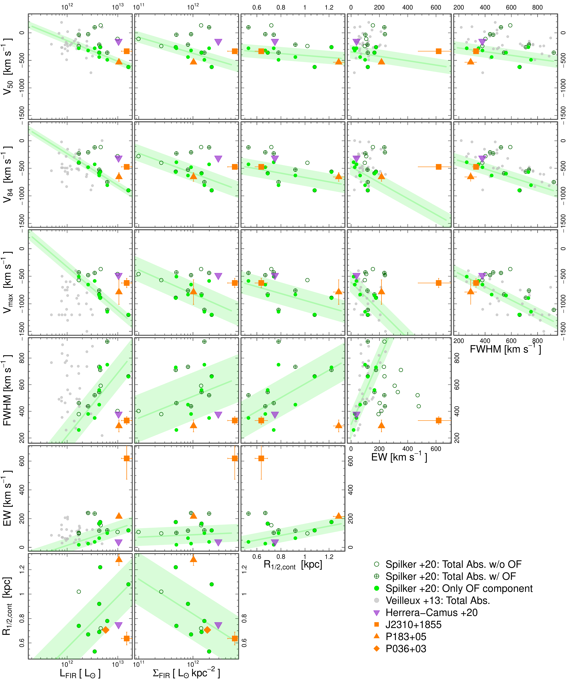
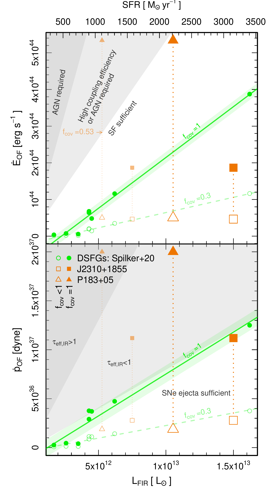

$\newcommand{\ensuremath}{}$
$\newcommand{\xspace}{}$
$\newcommand{\object}[1]{\texttt{#1}}$
$\newcommand{\farcs}{{.}''}$
$\newcommand{\farcm}{{.}'}$
$\newcommand{\arcsec}{''}$
$\newcommand{\arcmin}{'}$
$\newcommand{\ion}[2]{#1#2}$
$\newcommand{\textsc}[1]{\textrm{#1}}$
$\newcommand{\hl}[1]{\textrm{#1}}$
$\newcommand{\vdag}{(v)^\dagger}$
$\newcommand$
$\newcommand$
$\newcommand{\kms}{\ifmmode \mbox{\rm km s}^{-1}$
$	\else{\rm km s}^{-1}\ignorespaces$
$	\fi}$
$\newcommand{\mum}{\ifmmode \mu\mbox{\rm m}$
$	\else \mu{\rm m}$
$	\fi}$
$\newcommand{\Htwo}{\ifmmode \mbox{\rm H}$
$	\else{\rm H}_2$
$	\fi}$
$\newcommand{\OHp}{\ifmmode \mbox{\rm OH}$
$	\else{\rm OH^+}$
$	\fi}$
$\newcommand{\H2Op}{\ifmmode \mbox{\rm H}_2{\rm O}$
$	\else{\rm H}_2{\rm O}^+$
$	\fi}$
$\newcommand{\CHp}{\ifmmode \mbox{\rm CH}$
$	\else{\rm CH}^+$
$	\fi}$
$\newcommand{\Hp}{\ifmmode \mbox{\rm H}$
$	\else{\rm H}^+$
$	\fi}$
$\newcommand{\Hthreep}{\ifmmode \mbox{\rm H}$
$	\else{\rm H}^+_3$
$	\fi}$
$\newcommand{\}{mHI}$

$\newcommand{$\ensuremath$}{}$
$\newcommand{$\xspace$}{}$
$\newcommand{$\object$}[1]{\texttt{#1}}$
$\newcommand{$\farcs$}{{.}''}$
$\newcommand{$\farcm$}{{.}'}$
$\newcommand{$\arcsec$}{''}$
$\newcommand{$\arcmin$}{'}$
$\newcommand{$\ion$}[2]{#1#2}$
$\newcommand{$\textsc$}[1]{\textrm{#1}}$
$\newcommand{$\hl$}[1]{\textrm{#1}}$
$\newcommand{$\vdag$}{(v)^\dagger}$
$\newcommand$
$\newcommand$
$\newcommand{\kms}{\ifmmode \mbox{\rm km s}^{-1}$
$	\else{\rm km s}^{-1}\ignorespaces$
$	\fi}$
$\newcommand{\mum}{\ifmmode \mu\mbox{\rm m}$
$	\else \mu{\rm m}$
$	\fi}$
$\newcommand{\Htwo}{\ifmmode \mbox{\rm H}$
$	\else{\rm H}_2$
$	\fi}$
$\newcommand{\OHp}{\ifmmode \mbox{\rm OH}$
$	\else{\rm OH^+}$
$	\fi}$
$\newcommand{\H2Op}{\ifmmode \mbox{\rm H}_2{\rm O}$
$	\else{\rm H}_2{\rm O}^+$
$	\fi}$
$\newcommand{\CHp}{\ifmmode \mbox{\rm CH}$
$	\else{\rm CH}^+$
$	\fi}$
$\newcommand{\Hp}{\ifmmode \mbox{\rm H}$
$	\else{\rm H}^+$
$	\fi}$
$\newcommand{\Hthreep}{\ifmmode \mbox{\rm H}$
$	\else{\rm H}^+_3$
$	\fi}$
$\newcommand{\}{mHI}$

#  Unobscured QSO Hosts Driven by Star Formation

<mark>Appeared on: 2022-12-20</mark> - _19 pages, 7 figures, 3 tables_

Kirsty M. Butler, et al. -- incl., <mark>Fabian Walter</mark>

**Abstract:** Feedback and outflows in galaxies that are associated with a quasar phase are expected to be pivotal in quenching the most massive galaxies. However, observations targeting the molecular outflow phase, which dominates both the mass and momentum and removes the immediate fuel for star formation, are limited in high--z QSO hosts. Massive quiescent galaxies found at$z\sim4$are predicted to have already quenched star formation by$z\sim5$and undergone their most intense growth at$z>6$. Here, we present two ALMA detections of molecular outflows, traced by blue--shifted absorption of the OH 119\mumdoublet, from a sample of three$z>6$infrared luminous QSO hosts: J2310+1855 and P183+05. OH 119\mumis also detected in emission in P183+05, and tentatively in the third source: P036+03. Using similar assumptions as for high--z Dusty Star--Forming Galaxy outflows, we find that our QSOs drive molecular outflows with comparable mass outflow rates, and that are comparably energetic except for J2310+1855's significantly lower outflow energy flux. We do not find evidence, nor require additional input from the central AGN to drive the molecular outflow in J2310+1855 but can not rule out an AGN contribution in P183+05 if a significant AGN contribution to$\rm L_{FIR}$is assumed and/or if the outflow covering fraction is high ($\geq53\%$), which evidence from the literature suggests is unlikely in these sources. Differences observed in the blue--shifted absorption spectral properties may instead be caused by the QSO hosts' more compact dust continuum, limiting observations to lower altitude and more central regions of the outflow.

**Figure 6. -** Grid of host galaxy and best fit OH 119 \mum absorption spectra properties. This includes: $\mathbf{v_{50}}$: mean velocity, $\mathbf{v_{84}}$: velocity above which 84\% of the absorption lies, $\mathbf{v_{max}}$: velocity above which 98\% of the absorption lies, \textbf{FWHM:} full width half maximum of the absorption, \textbf{EW:} equivalent width of the absorption, $\mathbf{L_{IR}}$: Far Infrared luminosity of the host galaxy, $\mathbf{\Sigma_{FIR}}$: Infrared surface brightness of the host galaxy given by $\rm L_{FIR}/(2\pi R_{1/2,cont}^2)$, $\mathbf{R_{cont}}$: Effective radius of the 119\mum continuum emission. We show low--z sources in grey, including both star forming and AGN host galaxies \citep{Veilleux2013}. The spectral properties are measurements of the total (systemic and blue shifted) absorption lines. In green we show the high--z DSFG sample studied by \cite{Spilker2020a,Spilker2020b}, further separating this sample into measurements of the total (systemic and blue shifted) absorption line (dark green crossed--circles), just the systemic components (dark green open circles) and just the outflowing components (light green filled). Sources with only an outflowing component will appear as a light green dot with a dark green outline. We display a fit to the outflow--only components in each panel (illustrative only) with a solid line and shade the $1\sigma$ scatter, both in light green. We include the tentative OH detection in the z = 6.13 QSO, ULAS J131911+095051 (\citealt{HerreraCamus2020}, purple triangle). J2310+1855 and P183+05 are shown by the filled orange square and triangle, respectively.). \label{fig:ParGrid} (*fig:ParGrid*)

**Figure 3. -** Energy (top) and momentum (bottom) flux as a function of $\rm L_{FIR}$(bottom axis) and SFR (top axis) derived for the comparison sample of high--z DSFGs \citep{Spilker2020a,Spilker2020b}(green) and J2310+1855 and P183+05 (orange squares and triangles, respectively). Filled symbols indicate upper limits, assuming an outflow covering fraction of 1. Hollow symbols indicate lower limits for J2310+1855 and P183+05, assuming a covering fraction equal to the fractional OH absorption depth (25\% and 9.4\%, respectively), and values derived assuming an average covering fraction of 0.3 \citep{GonzalezAlfonso2017}, for the DSFG sample. The smaller faint orange symbols indicate ranges for J2310+1855 and P183+05 assuming a 50\% AGN contribution to $\rm L_{FIR}$(see text). We indicate regions in the top panel where the energy injected via star formation, assuming a maximum coupling fraction to the ISM of 40\%\citep{Sharma2014,Fielding2018}, is equal to the energy flux of the outflow (white), where an unusually high coupling fraction or AGN contribution is required (light grey), and where an AGN is definitely required (darker grey). We indicate regions in the bottom panel where SNe ejecta provide sufficient momentum (white) and where radiation pressure on dust grains in an optically thin (light grey) or thick (darker grey) outflow is needed. \label{fig:FIRvsE} (*fig:FIRvsE*)

**Figure 4. -** Idealised schematic of two equally luminous disky galaxies (left and right) seen at four different inclinations (from the top: $0^\circ$, $30^\circ$, $60^\circ$ and $90^\circ$). We consider a clumpy outflow ejected from the center of the galaxy, travelling radially in five angles covering the left hand side of the disk, and vertically through a galactic fountain trajectory. On the right we show this trajectory as a solid black arrow. Orange circles indicate clumps that intervene the observer's line of site and the background continuum, and thus contribute to the absorption signature of the outflow. Grey circles indicate when clumps do not intervene and are invisible to the observer via absorption.  \label{fig:cartoon} (*fig:cartoon*)

