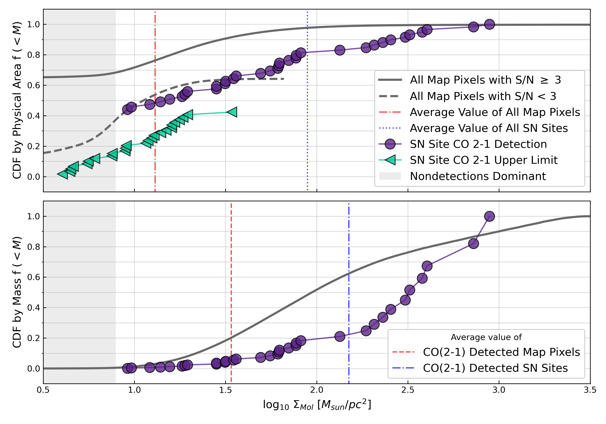
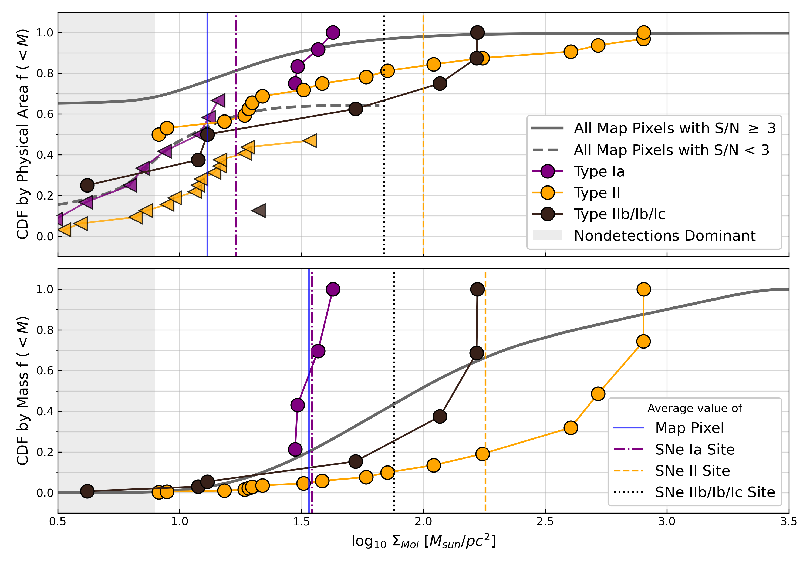
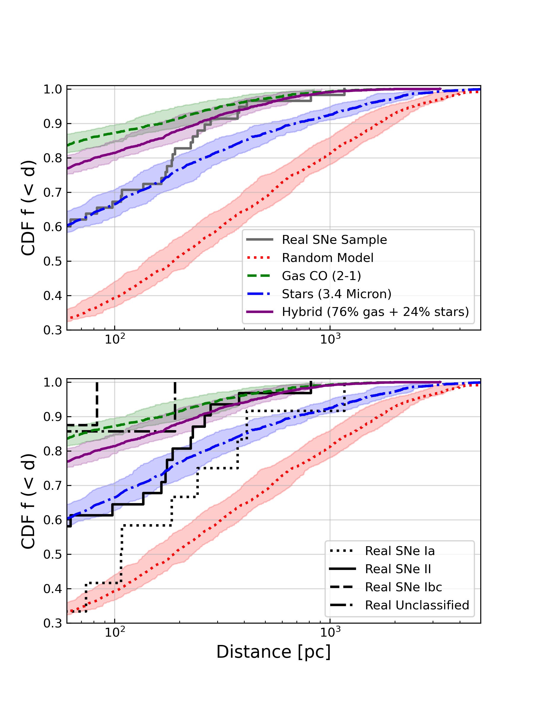

$\newcommand{\ensuremath}{}$
$\newcommand{\xspace}{}$
$\newcommand{\object}[1]{\texttt{#1}}$
$\newcommand{\farcs}{{.}''}$
$\newcommand{\farcm}{{.}'}$
$\newcommand{\arcsec}{''}$
$\newcommand{\arcmin}{'}$
$\newcommand{\ion}[2]{#1#2}$
$\newcommand{\textsc}[1]{\textrm{#1}}$
$\newcommand{\hl}[1]{\textrm{#1}}$
$\newcommand{\cotwo}{\mbox{\rm CO(2\text{--}1)}}$
$\newcommand{\halpha}{\mbox{\rm H\alpha}}$
$\newcommand{\xco}{\mbox{X_{\rm CO}}}$
$\newcommand{\xcounits}{\mbox{cm^{-2} (K~km~s^{-1})^{-1}}}$
$\newcommand{\acounits}{\mbox{M_\odot~pc^{-2} (K~km~s^{-1})^{-1}}}$
$\newcommand{\sigsfr}{\mbox{\Sigma_{\rm SFR}}}$
$\newcommand{\ANU}{\affiliation{Research School of Astronomy and Astrophysics, Australian National University, Canberra, ACT 2611, Australia}}$
$\newcommand{\ARI}{\affil{Astronomisches Rechen-Institut, Zentrum für Astronomie der Universität Heidelberg, Mönchhofstra\ss e 12-14, D-69120 Heidelberg, Germany}}$
$\newcommand{\ASTROThreeD}{\affiliation{ARC Centre of Excellence for All Sky Astrophysics in 3 Dimensions (ASTRO 3D), Australia}}$
$\newcommand{\Bonn}{\affiliation{Argelander-Institut für Astronomie, Universität Bonn, Auf dem Hügel 71, 53121 Bonn, Germany}}$
$\newcommand{\Carnegie}{\affiliation{Observatories of the Carnegie Institution for Science, 813 Santa Barbara Street, Pasadena, CA 91101, USA}}$
$\newcommand{ÇAPP}{\affil{Center for Cosmology and Astroparticle Physics, 191 West Woodruff Avenue, Columbus, OH 43210, USA}}$
$\newcommand{\CITA}{\affiliation{Canadian Institute for Theoretical Astrophysics (CITA), University of Toronto, 60 St George Street, Toronto, ON M5S 3H8, Canada}}$
$\newcommand{\CNRS}{\affil{CNRS, IRAP, 9 Av. du Colonel Roche, BP 44346, F-31028 Toulouse cedex 4, France}}$
$\newcommand{\COOL}{\affil{Cosmic Origins Of Life (COOL) Research DAO, coolresearch.io}}$
$\newcommand{\ITA}{\affil{Institüt für Theoretische Astrophysik, Zentrum für Astronomie der Universität Heidelberg, Albert-Ueberle-Strasse 2, 69120 Heidelberg, Germany}}$
$\newcommand{\McMaster}{\affiliation{Department of Physics and Astronomy, McMaster University, 1280 Main Street West, Hamilton, ON L8S 4M1, Canada}}$
$\newcommand{\MPIA}{\affil{Max Planck Institut für Astronomie, Königstuhl 17, 69117 Heidelberg, Germany}}$
$\newcommand{\NRAO}{\affil{National Radio Astronomy Observatory, 520 Edgemont Road, Charlottesville, VA 22903-2475, USA}}$
$\newcommand{\OSU}{\affil{Department of Astronomy, The Ohio State University, 140 West 18th Avenue, Columbus, Ohio 43210, USA}}$
$\newcommand{\OSUPhysics}{\affil{Department of Physics, 191 West Woodruff Avenue, Columbus, OH 43210, USA}}$
$\newcommand{\Toulouse}{\affil{Université de Toulouse, UPS-OMP, IRAP, F-31028 Toulouse cedex 4, France}}$
$\newcommand{\UChile}{\affiliation{Departamento de Astronomía, Universidad de Chile, Camino del Observatorio 1515, Las Condes, Santiago, Chile}}$
$\newcommand{\uwyo}{\affil{Department of Physics \& Astronomy, University of Wyoming, Laramie, WY 82071 USA}}$
$\newcommand{\thefigure}{A\arabic{figure}}$
$\newcommand{\thetable}{A\arabic{table}}$
$\newcommand{\theequation}{A\arabic{equation}}$

$\newcommand{\ensuremath}{}$
$\newcommand{\xspace}{}$
$\newcommand{\object}[1]{\texttt{#1}}$
$\newcommand{\farcs}{{.}''}$
$\newcommand{\farcm}{{.}'}$
$\newcommand{\arcsec}{''}$
$\newcommand{\arcmin}{'}$
$\newcommand{\ion}[2]{#1#2}$
$\newcommand{\textsc}[1]{\textrm{#1}}$
$\newcommand{\hl}[1]{\textrm{#1}}$
$\newcommand{\cotwo}{\mbox{\rm CO(2\text{--}1)}}$
$\newcommand{\halpha}{\mbox{\rm H\alpha}}$
$\newcommand{\xco}{\mbox{X_{\rm CO}}}$
$\newcommand{\xcounits}{\mbox{cm^{-2} (K~km~s^{-1})^{-1}}}$
$\newcommand{\acounits}{\mbox{M_\odot~pc^{-2} (K~km~s^{-1})^{-1}}}$
$\newcommand{\sigsfr}{\mbox{\Sigma_{\rm SFR}}}$
$\newcommand{\ANU}{\affiliation{Research School of Astronomy and Astrophysics, Australian National University, Canberra, ACT 2611, Australia}}$
$\newcommand{\ARI}{\affil{Astronomisches Rechen-Institut, Zentrum für Astronomie der Universität Heidelberg, Mönchhofstra\ss e 12-14, D-69120 Heidelberg, Germany}}$
$\newcommand{\ASTROThreeD}{\affiliation{ARC Centre of Excellence for All Sky Astrophysics in 3 Dimensions (ASTRO 3D), Australia}}$
$\newcommand{\Bonn}{\affiliation{Argelander-Institut für Astronomie, Universität Bonn, Auf dem Hügel 71, 53121 Bonn, Germany}}$
$\newcommand{\Carnegie}{\affiliation{Observatories of the Carnegie Institution for Science, 813 Santa Barbara Street, Pasadena, CA 91101, USA}}$
$\newcommand{ÇAPP}{\affil{Center for Cosmology and Astroparticle Physics, 191 West Woodruff Avenue, Columbus, OH 43210, USA}}$
$\newcommand{\CITA}{\affiliation{Canadian Institute for Theoretical Astrophysics (CITA), University of Toronto, 60 St George Street, Toronto, ON M5S 3H8, Canada}}$
$\newcommand{\CNRS}{\affil{CNRS, IRAP, 9 Av. du Colonel Roche, BP 44346, F-31028 Toulouse cedex 4, France}}$
$\newcommand{\COOL}{\affil{Cosmic Origins Of Life (COOL) Research DAO, coolresearch.io}}$
$\newcommand{\ITA}{\affil{Institüt für Theoretische Astrophysik, Zentrum für Astronomie der Universität Heidelberg, Albert-Ueberle-Strasse 2, 69120 Heidelberg, Germany}}$
$\newcommand{\McMaster}{\affiliation{Department of Physics and Astronomy, McMaster University, 1280 Main Street West, Hamilton, ON L8S 4M1, Canada}}$
$\newcommand{\MPIA}{\affil{Max Planck Institut für Astronomie, Königstuhl 17, 69117 Heidelberg, Germany}}$
$\newcommand{\NRAO}{\affil{National Radio Astronomy Observatory, 520 Edgemont Road, Charlottesville, VA 22903-2475, USA}}$
$\newcommand{\OSU}{\affil{Department of Astronomy, The Ohio State University, 140 West 18th Avenue, Columbus, Ohio 43210, USA}}$
$\newcommand{\OSUPhysics}{\affil{Department of Physics, 191 West Woodruff Avenue, Columbus, OH 43210, USA}}$
$\newcommand{\Toulouse}{\affil{Université de Toulouse, UPS-OMP, IRAP, F-31028 Toulouse cedex 4, France}}$
$\newcommand{\UChile}{\affiliation{Departamento de Astronomía, Universidad de Chile, Camino del Observatorio 1515, Las Condes, Santiago, Chile}}$
$\newcommand{\uwyo}{\affil{Department of Physics \& Astronomy, University of Wyoming, Laramie, WY 82071 USA}}$
$\newcommand{\thefigure}{A\arabic{figure}}$
$\newcommand{\thetable}{A\arabic{table}}$
$\newcommand{\theequation}{A\arabic{equation}}$

# Comparing the Locations of Supernovae to CO (2-1) Emission in their Host Galaxies

<mark>Appeared on: 2022-12-19</mark> - _Accepted to ApJ; 38 pages, 12 figures, 7 tables in two-column AASTEX63 format_

Ness~Mayker~Chen, et al. -- incl., <mark>Annie~Hughes</mark>, <mark>Kathryn~Kreckel</mark>, <mark>Frank Bigiel</mark>, <mark>Eva Schinnerer</mark>

**Abstract:** We measure the molecular gas environment near recent ( $< 100$ yr old) supernovae (SNe) using $\sim1"$ or $\leq 150$ pc resolution CO (2-1) maps from the PHANGS-ALMA survey of nearby star-forming galaxies. This is arguably the first such study to approach the scales of individual massive molecular clouds ( $M_{\rm mol} \gtrsim 10^{5.3}$ M $_{\odot}$ ). Using the Open Supernova Catalog (OSC), we identify 63 SNe within the PHANGS--ALMA footprint. We detect CO (2-1) emission near $\sim60\%$ of the sample at 150 pc resolution, compared to $\sim35\%$ of map pixels with CO (2-1) emission,  and up to $\sim95\%$ of the SNe at 1 kpc resolution compared to $\sim80\%$ of map pixels with CO (2-1) emission. We expect the $\sim60\%$ of SNe within the same 150 pc beam as a GMC will likely interact with these clouds in the future, consistent with the observation of widespread SN-molecular gas interaction in the Milky Way, while the other $\sim40\%$ of SNe without strong CO (2-1) detections will deposit their energy in the diffuse interstellar medium (ISM), perhaps helping drive large-scale turbulence or galactic outflows. Broken down by type, we detect CO (2-1) emission at the sites of $\sim85\%$ of our 9 stripped-envelope SNe (SESNe), $\sim40\%$ of our 34 Type II SNe, and $\sim35\%$ of our 13 Type Ia SNe, indicating that SESNe are most closely associated with the brightest CO (2-1) emitting regions in our sample. Our results confirm that SN explosions are not restricted to only the densest gas, and instead exert feedback across a wide range of molecular gas densities.

**Figure 9. -** _CDFs of physical area (top panel) and molecular gas mass (bottom panel) as a function of projected molecular gas surface density at the locations of our SN sample at 150 pc resolution._ We classify the measurements into detections with signal-to-noise $\geq$ 3 (purple circles) and non-detections plotted at the upper-limit of three times the noise value of the measurement (turquoise triangles). The top panel weights each pixel by its physical area in $pc^2$ in the plane of the galaxy, while the bottom panel weights each pixel by the molecular mass within the pixel. In the top panel we generate the CDF using both non-detections and detections. When calculating the CDF, we assume that the non-detections all have lower $\Sigma_{\rm mol}$ than the lowest detection value. The bottom panel omits non-detections, assuming the pixels to have negligible molecular gas. For comparison, we also plot the CDF of all of the pixels in all the CO (2-1) maps in our sample, classifying them by signal-to-noise with dark-grey, solid (detections) and dark-grey, dashed (upper-limits) lines. Finally, we plot the average value of the map pixels with a red, vertical line and the average value of the SN sites with a blue, vertical line. Both panels show that SNe consistently explode in regions of brighter CO (2-1) emission and molecular gas surface density compared to a pixel drawn randomly from the map. (*fig:CDF_ALLSNe*)

**Figure 10. -** _CDFs of physical area (top) and molecular gas mass (bottom) at the locations of SNe as a function of molecular gas surface density, now sorted by type._ As Figure \ref{fig:CDF_ALLSNe} but now separating the SNe by type. Upper-limit values are marked with triangles, and detections are marked with circles. SNe Ia have purple markers, SNe II have orange markers and SESNe (SNe IIb, Ib, and Ic) have black markers. In the top panel, the CDFs of all the pixels in the galaxy maps are also plotted, with detections marked by a solid, dark-grey curve and non-detections (with upper-limit values) with a dashed, dark-grey curve. We plot the average surface density value of map pixels with a solid, blue, vertical line; and the average surface densities at the sites of SNe Ia, SNe II, \& SESNe (IIb/Ib/Ic) with purple-dot-dashed, black-dotted, and orange-dashed vertical lines respectively. In the bottom panel, we plot the fraction of _molecular gas mass_ instead of the fraction of physical area. The average surface density of map pixels with detected CO (2-1) emission is plotted with a solid, blue, vertical line and the average surface density of Type Ia, II, and IIb/Ib/Ic sites with detected CO (2-1) emission are plotted with purple-dash-dotted, orange-dashed, and black-dotted vertical lines respectively. The figure shows that SESNe and Type II SNe tend to occur in regions of higher $\Sigma_{\rm mol}$  than Type Ia SNe. We also note that $\sim35\%$ of our SNe Ia occur in regions with detectable molecular gas, while $\sim65\%$ of our SNe Ia occur with no detectable CO (2-1) emission. (*fig:CDFByType*)

**Figure 3. -** _CDFs of distances to the nearest pixel with molecular gas surface density of each galaxy's individual median $3\sigma$ $\Sigma_{\rm mol_$ or higher}. Our real SNe sample is drawn with a dark-grey line. The randomly generated SNe sample is drawn with a dotted red line, gas distribution as dashed green line, stellar as dash-dotted blue line, and the hybrid model as solid purple line. The transparent shading represents the 16th-84th percentile values from 1000 random pulls each the size of our observed SN sample from each model distribution. In the bottom panel, we separate our observed SN sample by SN type. SNe Ia are marked with a dotted-black line, SNe II with a solid line, SNe Ibc with a dashed line and unclassified SNe with a dashed-dotted line. The models are plotted with the same color scheme as the top panel. (*fig:modelCDFs*)

