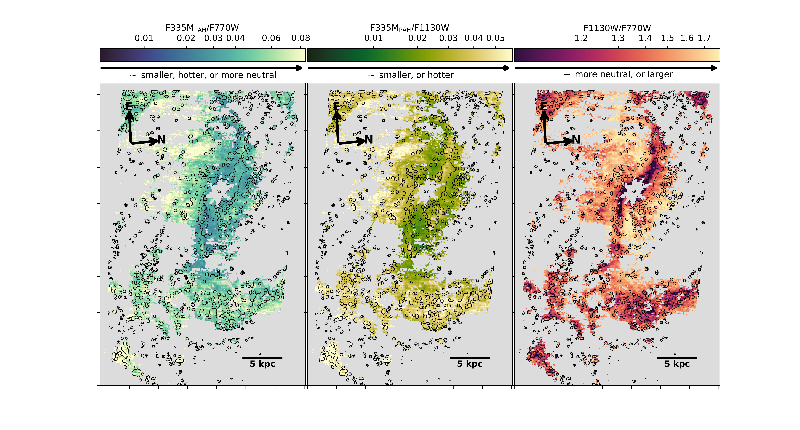

$\newcommand{\ensuremath}{}$
$\newcommand{\xspace}{}$
$\newcommand{\object}[1]{\texttt{#1}}$
$\newcommand{\farcs}{{.}''}$
$\newcommand{\farcm}{{.}'}$
$\newcommand{\arcsec}{''}$
$\newcommand{\arcmin}{'}$
$\newcommand{\ion}[2]{#1#2}$
$\newcommand{\textsc}[1]{\textrm{#1}}$
$\newcommand{\hl}[1]{\textrm{#1}}$
$\newcommand{\XX}{\textbf{Flag!}\xspace}$
$\newcommand{\coto}{^{12}{\rm CO}~(2\to1)\xspace}$
$\newcommand{\halpha}{H\alpha\xspace}$
$\newcommand{\hii}{\ion{H}{2}\xspace}$
$\newcommand{\hone}{H{\sc i}\xspace}$
$\newcommand{\ration}{F1130W/F770W\xspace}$
$\newcommand{\ratioss}{F335M_{\rm PAH}/F770W\xspace}$
$\newcommand{\ratiose}{F335M_{\rm PAH}/F1130W\xspace}$
$\newcommand{\hagasratio}{I_{\rm H{\alpha}}/\Sigma_{\rm H{\sc I}+H_2}\xspace}$
$\newcommand{\rpah}{R_{\rm PAH}\xspace}$
$\newcommand{\mjysr}{MJy~sr^{-1}\xspace}$

$\newcommand{$\ensuremath$}{}$
$\newcommand{$\xspace$}{}$
$\newcommand{$\object$}[1]{\texttt{#1}}$
$\newcommand{$\farcs$}{{.}''}$
$\newcommand{$\farcm$}{{.}'}$
$\newcommand{$\arcsec$}{''}$
$\newcommand{$\arcmin$}{'}$
$\newcommand{$\ion$}[2]{#1#2}$
$\newcommand{$\textsc$}[1]{\textrm{#1}}$
$\newcommand{$\hl$}[1]{\textrm{#1}}$
$\newcommand{$\XX$}{\textbf{Flag!}$\xspace$}$
$\newcommand{$\coto$}{^{12}{\rm CO}~(2\to1)$\xspace$}$
$\newcommand{$\halpha$}{H\alpha$\xspace$}$
$\newcommand{$\hii$}{$\ion${H}{2}$\xspace$}$
$\newcommand{$\hone$}{H{\sc i}$\xspace$}$
$\newcommand{$\ration$}{F1130W/F770W$\xspace$}$
$\newcommand{$\ratioss$}{F335M_{\rm PAH}/F770W$\xspace$}$
$\newcommand{$\ratiose$}{F335M_{\rm PAH}/F1130W$\xspace$}$
$\newcommand{$\hagasratio$}{I_{\rm H{\alpha}}/\Sigma_{\rm H{\sc I}+H_2}$\xspace$}$
$\newcommand{$\rpah$}{R_{\rm PAH}$\xspace$}$
$\newcommand{$\mjysr$}{MJy~sr^{-1}$\xspace$}$

# PHANGS-JWST First Results: Measuring PAH Properties across the multiphase ISM

<mark>Appeared on: 2022-12-21</mark> - _12 pages, 6 figures. Accepted as part of a PHANGS-JWST Focus Issue to appear in ApJ_

J\'er\'emy Chastenet, et al. -- incl., <mark>Daizhong Liu</mark>, <mark>Annie~Hughes</mark>, <mark>Kathryn Kreckel</mark>, <mark>Eva Schinnerer</mark>

**Abstract:** Ratios of polycyclic aromatic hydrocarbon (PAH) vibrational bands are a promising tool for measuring the properties of the PAH population and their effect on star formation.  The photometric bands of the MIRI and NIRCam instruments on JWST provide the opportunity to measure PAH emission features across entire galaxy disks at unprecedented resolution and sensitivity.Here we present the first results of this analysis in a sample of three nearby galaxies: NGC 628, NGC 1365, and NGC 7496.  Based on the variations observed in the 3.3, 7.7, and 11.3$\mu$m features, we infer changes to the average PAH size and ionization state across the different galaxy environments.  High values of$\ratiose$and low values of$\ration$are measured in$\hii$regions in all three galaxies.This suggests that these regions are populated by hotter PAHs, and/or that the PAH ionization fraction is larger.We see additional evidence of heating and/or changes in PAH size in regions with higher molecular gas content as well as increased ionization in regions with higher$\halpha$intensity.

**Figure 2. -** PAH band ratios in NGC 628. The maps show all pixels passing ${\rm S/N \geq 3}$ in all bands (see Section \ref{SecNoise}).
    The F335M$_{\rm PAH}$ refers to the 3.3 $\mu$m maps developed by \citet[][]{SANDSTROM2_PHANGSJWST}.
    The contour show the $\hii$ regions from the nebula catalog by \citet[][]{GROVES_HIICAT, PHANGSMUSE2022HII}.
    (The maps were arbitrarily rotated from north-up to allow for better visualization.)
     (*FigRatioNGC628*)

**Figure 5. -** Running medians of the $\ratioss$(top), $\ratioss$(middle), and $\ration$(bottom), in bins of $\hagasratio$(left), fraction of molecular gas, $f_{\rm H_2}$(right), and the abundance ratio $\rpah$ = (F700W+F1130W)/F2100W. (*FigPanel*)

**Figure 3. -** Same as Figure \ref{FigRatioNGC628} for NGC 1365. The central pixels are masked due to saturation, using the PSF at F1130W. The visible stripes are due to $1/f$ noise in the NIRCam bands.
    (The maps were arbitrarily rotated from north-up to allow for better visualization.) (*FigRatioNGC1365*)

