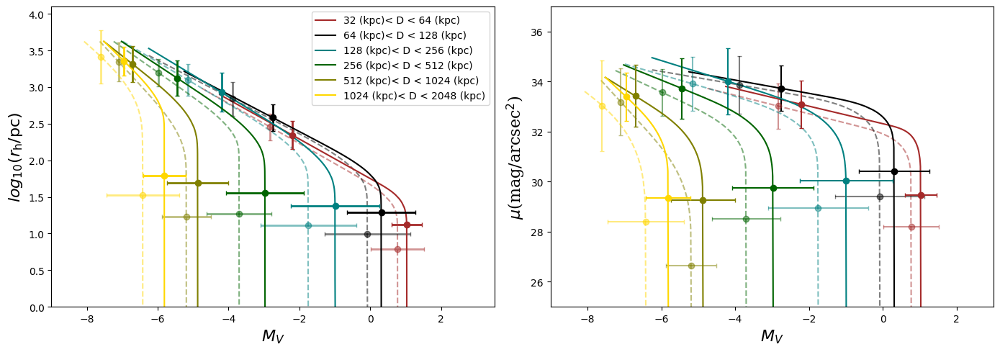
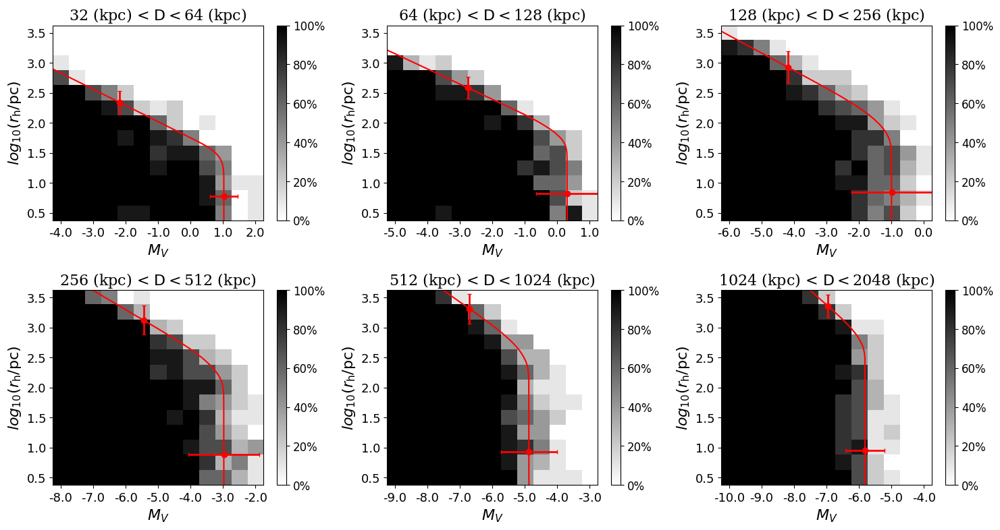
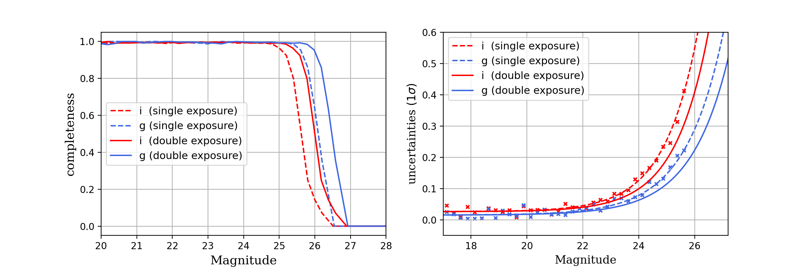

$\newcommand{\ensuremath}{}$
$\newcommand{\xspace}{}$
$\newcommand{\object}[1]{\texttt{#1}}$
$\newcommand{\farcs}{{.}''}$
$\newcommand{\farcm}{{.}'}$
$\newcommand{\arcsec}{''}$
$\newcommand{\arcmin}{'}$
$\newcommand{\ion}[2]{#1#2}$
$\newcommand{\textsc}[1]{\textrm{#1}}$
$\newcommand{\hl}[1]{\textrm{#1}}$
$\newcommand{\gkai}[1]{\begin{CJK*}{UTF8}{gkai}\raisebox{.1em}{(}#1\raisebox{.1em}{)}\end{CJK*}}$
$\newcommand{\thebibliography}{\DeclareRobustCommand{\VAN}[3]{##3}\VANthebibliography}$
$\newcommand{\eg}{{ e.g., }}$
$\newcommand{\ie}{{ i.e., }}$
$\newcommand{\deg}{^\circ}$
$\newcommand{\degg}{\hbox{\null^\circ\hskip-3pt .}}$
$\newcommand{\kpc}{{\rm kpc}}$
$\newcommand{\Mpc}{{\rm Mpc}}$
$\newcommand{\pc}{{\rm pc}}$
$\newcommand{\degx}{{\rm deg}}$
$\newcommand{\msun}{{\rm M_{\odot}}}$
$\newcommand{\FeH}{{\rm[Fe/H]}}$
$\newcommand{\}{zy}$
$\newcommand{\}{NFM}$
$\newcommand{\}{Han}$

$\newcommand{$\ensuremath$}{}$
$\newcommand{$\xspace$}{}$
$\newcommand{$\object$}[1]{\texttt{#1}}$
$\newcommand{$\farcs$}{{.}''}$
$\newcommand{$\farcm$}{{.}'}$
$\newcommand{$\arcsec$}{''}$
$\newcommand{$\arcmin$}{'}$
$\newcommand{$\ion$}[2]{#1#2}$
$\newcommand{$\textsc$}[1]{\textrm{#1}}$
$\newcommand{$\hl$}[1]{\textrm{#1}}$
$\newcommand{$\gkai$}[1]{\begin{CJK*}{UTF8}{gkai}\raisebox{.1em}{(}#1\raisebox{.1em}{)}\end{CJK*}}$
$\newcommand{$\thebibliography$}{\DeclareRobustCommand{\VAN}[3]{##3}\VANthebibliography}$
$\newcommand{$\eg$}{{ e.g., }}$
$\newcommand{$\ie$}{{ i.e., }}$
$\newcommand{$\deg$}{^\circ}$
$\newcommand{$\deg$g}{\hbox{\null^\circ\hskip-3pt .}}$
$\newcommand{$\kpc$}{{\rm kpc}}$
$\newcommand{$\Mpc$}{{\rm Mpc}}$
$\newcommand{$\pc$}{{\rm pc}}$
$\newcommand{$\deg$x}{{\rm deg}}$
$\newcommand{$\msun$}{{\rm M_{\odot}}}$
$\newcommand{$\FeH$}{{\rm[Fe/H]}}$
$\newcommand{\}{zy}$
$\newcommand{\}{NFM}$
$\newcommand{\}{Han}$

# Local Group Dwarf Galaxy Detection Limit in the CSST survey

<mark>Appeared on: 2022-12-22</mark> - _submitted to MNRAS. 11 pages, 10 figures_

Han Qu, et al. -- incl., <mark><mark>Guoliang Li</mark></mark>

**Abstract:** We predict the dwarf galaxy detection limits for the upcoming Chinese Space Station Telescope (CSST) survey that will cover 17,500$\degx^{2}$of the sky with a wide field of view of 1.1 deg$^2$. The point-source depth reaches 26.3 mag in the$g$band and 25.9 mag in the$i$band. Constructing mock survey data based on the designed photometric bands, we estimate the recovery rate of artificial dwarf galaxies from mock point-source photometric catalogues. The detection of these artificial dwarf galaxies is strongly dependent on their distance, magnitude and size, in agreement with searches in current surveys. We expect CSST to enable the detection of dwarf galaxies with$M_V = -3.0$and$\mu_{250} = 32.0$mag/arcsec$^2$(surface-brightness limit for a system of half-light radius$r_{\rm h}$= 250$\pc$) at$400 $\kpc$$,  and$M_V = -4.9$and$\mu_{250} = 30.5$mag/arcsec$^2$around the Andromeda galaxy. Beyond the Local Group, the CSST survey will achieve$M_V = -5.8$, and$\mu_{250}$= 29.7 mag/arcsec$^2$in the distance range of 1--2 Mpc, opening up an exciting discovery space for faint field dwarf galaxies. With its optical bands, wide survey footprint, and space resolution, CSST will undoubtedly expand our knowledge of low-mass dwarf galaxies to an unprecedented volume.

**Figure 6. -** Comparisons of detection limit as a function of $M_V$ and $r_{\rm h}$ in different distance bins for a M field. Same as Fig. \ref{detect_m}, the error bars represent $\sigma_{M}$ and $\sigma_{r}$ respectively in the left panel, based on that the error bar of $\mu$ is derived and shown in the right panel. The dashed and solid lines represent the results with single and double exposures respectively.
    (*detect limit*)

**Figure 5. -** Detection fraction map as a function of luminosity and size in different distance bins for M field, where the black pixels indicates 100\% detection fraction, and the white ones indicates 0\%. The red curve corresponds to the modeled  50\% recovery fraction and the error bars represent $\sigma_{M}$ and $\sigma_{r}$ as the widths of the transition regions.
    (*detect_m*)

**Figure 2. -** \emph{Left:} Completeness model for point-source detections as a function of $g$(blue) and $i$(red) magnitude estimates for the CSST. The solid and dashed lines represent the single- and double-exposure modes respectively. \emph{Right:} Expected photometric uncertainties in the two bands for the one-exposure model (crosses) and fitted model (dashed lines). The two-exposure uncertainty model (full lines) corresponds to a shift of these models by 0.38 magnitudes to account for the increased exposure time.
     (*fig:comp_uncert*)

