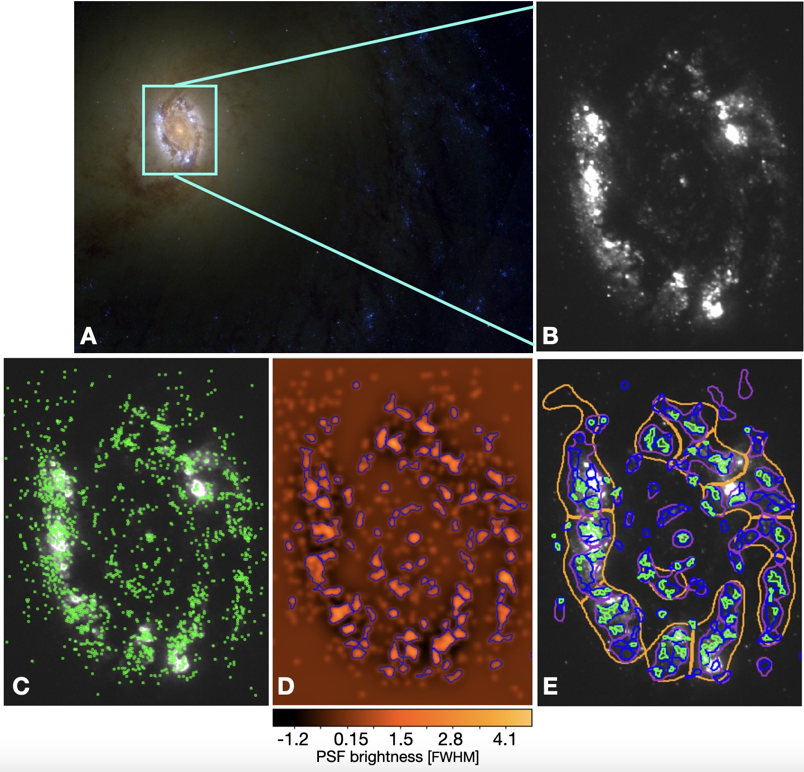
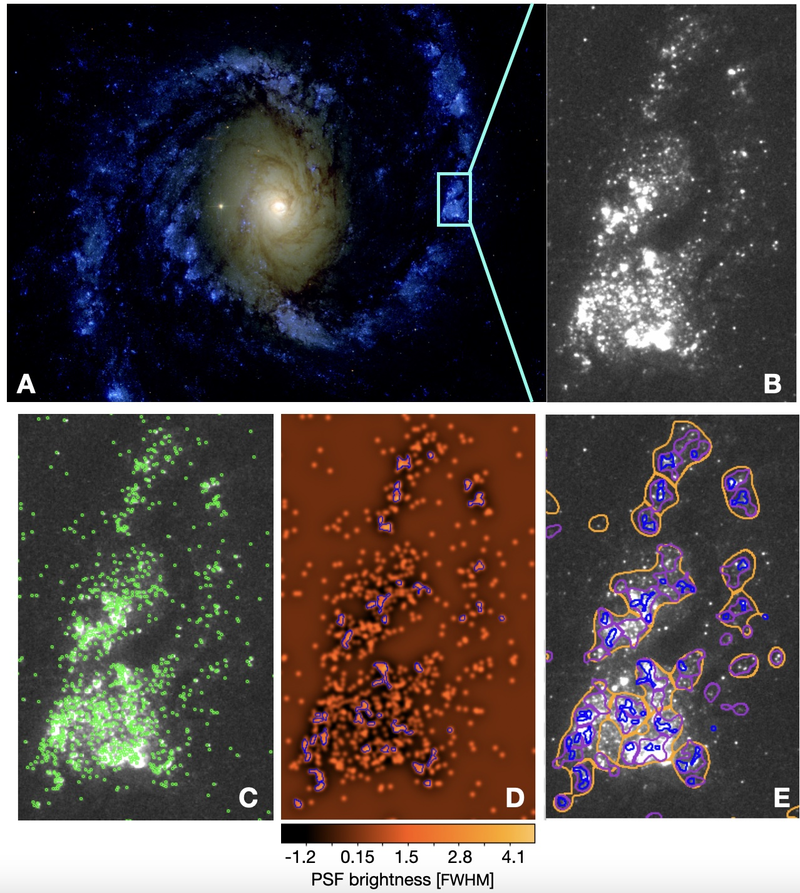

$\newcommand{\ensuremath}{}$
$\newcommand{\xspace}{}$
$\newcommand{\object}[1]{\texttt{#1}}$
$\newcommand{\farcs}{{.}''}$
$\newcommand{\farcm}{{.}'}$
$\newcommand{\arcsec}{''}$
$\newcommand{\arcmin}{'}$
$\newcommand{\ion}[2]{#1#2}$
$\newcommand{\textsc}[1]{\textrm{#1}}$
$\newcommand{\hl}[1]{\textrm{#1}}$
$\newcommand{\kms}{ km s^{-1}}$
$\newcommand{\bibtex}{\textsc{Bib}\!\TeX}$

$\newcommand{$\ensuremath$}{}$
$\newcommand{$\xspace$}{}$
$\newcommand{$\object$}[1]{\texttt{#1}}$
$\newcommand{$\farcs$}{{.}''}$
$\newcommand{$\farcm$}{{.}'}$
$\newcommand{$\arcsec$}{''}$
$\newcommand{$\arcmin$}{'}$
$\newcommand{$\ion$}[2]{#1#2}$
$\newcommand{$\textsc$}[1]{\textrm{#1}}$
$\newcommand{$\hl$}[1]{\textrm{#1}}$
$\newcommand{$\kms$}{ km s^{-1}}$
$\newcommand{$\bibtex$}{$\textsc${Bib}\!\TeX}$

# Multi-Scale Stellar Associations across the Star Formation Hierarchy in PHANGS--HST Nearby Galaxies: Methodology and Properties

<mark>Appeared on: 2022-12-23</mark> - _Submitted to MNRAS. Referee report received with minor comments, and "request to clarify if the smaller associations are always included in the larger ones and how this may affect the photometric fitting of the larger association if the groups have different ages." Revision in progress_

Kirsten L. Larson, et al. -- incl., <mark><mark>Janice C. Lee</mark></mark>, <mark><mark>James Lilly</mark></mark>, <mark><mark>Frank Bigiel</mark></mark>, <mark><mark>Kathryn Kreckel</mark></mark>, <mark><mark>Eva Schinnerer</mark></mark>

**Abstract:** We develop a method to identify and determine the physical properties of stellar associations using\textit{Hubble Space Telescope}(\textit{HST})\textit{NUV-U-B-V-I}imaging of nearby galaxies from the PHANGS--HST survey.We apply a watershed algorithm to density maps constructed from point source catalogues Gaussian smoothed to multiple physical scales from 8 to 64 pc.We develop our method on two galaxies that span the distance range in the PHANGS--HST sample: NGC 3351 (10 Mpc), NGC 1566 (18 Mpc).We test our algorithm with different parameters such as the choice of detection band for the point source catalogue (\textit{NUV}or\textit{V}), source density image filtering methods, and absolute magnitude limits.We characterise the properties of the resulting multi-scale associations, including sizes, number of tracer stars, number of associations, photometry, as well as ages, masses, and reddening from Spectral Energy Distribution fitting.  Our method successfully identifies structures that occupy loci in the\textit{UBVI}colour--colour diagram consistent with previously published catalogues of clusters and associations. The median ages of the associations increases  from$\log (\mathrm{age/yr}) = 6.6$to$\log (\mathrm{age/yr}) = 6.9$as the spatial scale increases from 8 pc to 64 pc for both galaxies. We find that the youngest stellar associations, with ages$<3$Myr, indeed closely trace$\textsc${H ii}regions in H$\alpha$imaging, and that older associations are increasingly anti-correlated with the H$\alpha$emission.  Owing to our new method, the PHANGS--HST multi-scale associations provide a far more complete census of recent star formation activity than found with previous cluster and compact association catalogues.The method presented here will be applied to the full sample of 38 PHANGS--HST galaxies.

**Figure 14. -** An illustration of our watershed procedure for identifying stellar associations over multiple scales.  \textit{(Panel A)} An \textit{HST} three-colour image of NGC 3351 (Red: WFC3/UVIS F814W, Green: WFC3/UVIS F555W, Blue: WFC3/UVIS F438W+F336W+F275W).  \textit{(Panel B)} The \textit{NUV} image of the center of NGC 3351.
    \textit{(Panel C)}The \textit{NUV} image of the center of NGC 3351 with the position of all \textit{NUV} tracer stars shown as green points
    \textit{(Panel D)} The \mbox{16-pc} smoothed, filtered image of the \textit{NUV} tracer stars for the center of NGC 3351. The image scale is in units of the FWHM of the PSF brightness. The cutoff threshold is set to 1 FWHM and the \mbox{16-pc} watershed regions are shown in blue.
    \textit{(Panel E)}\textit{NUV} image of the center of NGC 3351 with 8, 16, 32, and \mbox{64-pc} levels overplotted as corresponding green, blue, purple, and orange regions. At $0.0396$ arcsec pixel$^{-1}$, one WFC3 pixel maps to $1.9$ pc pixel$^{-1}$ at a distance of $10$ Mpc for NGC 3351. (*FIG:ngc3351tracers*)

**Figure 4. -** Left: NGC 3351 UBVI colour--colour diagrams for stellar associations selected in the \textit{NUV}-band (left) and \textit{V}-band (right)for four scale levels (8, 16, 32, and 64 pc). The associations are coloured according to their absolute \textit{V}-band magnitude ($M_\mathrm{V}$). The Padova stellar models  are shown as grey points and the solar metallicity, $f_\mathrm{cov} = 0$ evolutionary tracks of synthetic stellar populations from BC03 are overplotted on the associations. The red line traces the path of a single-aged stellar population, while the yellow and blue lines trace composite stellar populations with $\tau = 2$ and $\tau = 4$, respectively.
     (*FIG:NGC3351_NUV_V_cc*)

**Figure 15. -** Same as Figure \ref{FIG:ngc3351tracers}, except for NGC 1566. At $0.0396$ arcsec pixel$^{-1}$, one WFC3 pixel maps to $3.5$ pc pixel$^{-1}$ at a distance of $18$ Mpc for NGC 1566  \textit{(Panel A)} The \textit{HST} three-colour image for NGC 1566 (Red: WFC3/UVIS F814W, Green: WFC3/UVIS F555W, Blue: WFC3/UVIS F438W+F336W+F275W).
    \textit{(Panel B)} For illustration, we show a zoom-in of the \textit{NUV} image on a portion of the spiral arm with a bright star-forming region in NGC 1566.
    \textit{(Panel C)}The \textit{NUV} image of the star-forming region in NGC 1566 with the position of all \textit{NUV} tracer stars shown as green points.
    \textit{(Panel D)} The \mbox{16-pc} smoothed, filtered image of the \textit{NUV} tracer stars for the zoom in region of NGC 1566. The image scale is in units of the FWHM of the PSF brightness. The cutoff threshold is set to 1 FWHM and the \mbox{16-pc} watershed regions are shown in blue.
    \textit{(Panel E)}\textit{NUV} image of NGC 1566 with 16, 32, and \mbox{64-pc} levels overplotted as corresponding blue, purple, and orange regions. (*FIG:ngc1566tracers*)

