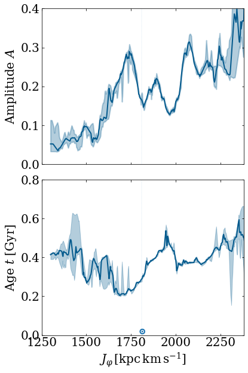
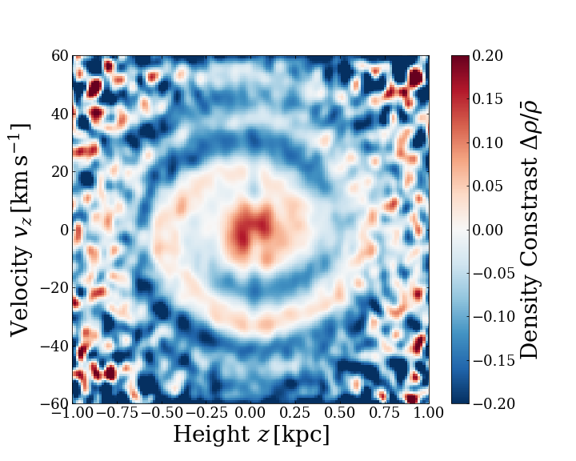
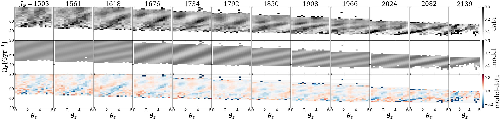

$\newcommand{\ensuremath}{}$
$\newcommand{\xspace}{}$
$\newcommand{\object}[1]{\texttt{#1}}$
$\newcommand{\farcs}{{.}''}$
$\newcommand{\farcm}{{.}'}$
$\newcommand{\arcsec}{''}$
$\newcommand{\arcmin}{'}$
$\newcommand{\ion}[2]{#1#2}$
$\newcommand{\textsc}[1]{\textrm{#1}}$
$\newcommand{\hl}[1]{\textrm{#1}}$
$\newcommand{\rhalf}{\ensuremath{R_h}}$
$\newcommand{\rff}{\ensuremath{R_\mathrm{eff}}}$
$\newcommand{\rifu}{\ensuremath{R_\mathrm{IFU}}}$
$\newcommand{\Amax}{\ensuremath{A_\mathrm{2max}}}$
$\newcommand{\omegaP}{\ensuremath{\Omega_P}}$
$\newcommand{\feh}{\ensuremath{\mathrm{[Fe/H]}}}$
$\newcommand{\half}{\tfrac{1}{2}}$
$\newcommand{\amp}{\ensuremath{A}}$
$\newcommand{\Comment}[2]{ [{\color{red}\sc #1 :} {{\color{orange} \it #2}}]}$
$\newcommand{\com}[1]{ {\textcolor{cyan}{ #1}}}$
$\newcommand{\update}[1]{ {\textbf{\textcolor{mybrown}{ #1}}}}$
$\newcommand{\updateap}[1]{ {\textbf{\textcolor{cyan}{ #1}}}}$
$\newcommand{\updatescott}[1]{ {\textbf{\textcolor{magenta}{ #1}}}}$
$\newcommand{\apn}[1]{ {\textcolor{magenta}{ #1}}}$
$\newcommand{\jo}[1]{ \textbf{{\textcolor{myblue}{Jo asks/comments: #1}}}}$

$\newcommand{$\ensuremath$}{}$
$\newcommand{$\xspace$}{}$
$\newcommand{$\object$}[1]{\texttt{#1}}$
$\newcommand{$\farcs$}{{.}''}$
$\newcommand{$\farcm$}{{.}'}$
$\newcommand{$\arcsec$}{''}$
$\newcommand{$\arcmin$}{'}$
$\newcommand{$\ion$}[2]{#1#2}$
$\newcommand{$\textsc$}[1]{\textrm{#1}}$
$\newcommand{$\hl$}[1]{\textrm{#1}}$
$\newcommand{$\rhalf$}{$\ensuremath${R_h}}$
$\newcommand{$\rff$}{$\ensuremath${R_\mathrm{eff}}}$
$\newcommand{$\rifu$}{$\ensuremath${R_\mathrm{IFU}}}$
$\newcommand{$\Amax$}{$\ensuremath${A_\mathrm{2max}}}$
$\newcommand{$\omegaP$}{$\ensuremath${\Omega_P}}$
$\newcommand{$\feh$}{$\ensuremath${\mathrm{[Fe/H]}}}$
$\newcommand{$\half$}{\tfrac{1}{2}}$
$\newcommand{$\amp$}{$\ensuremath${A}}$
$\newcommand{$\Comment$}[2]{ [{\color{red}\sc #1 :} {{\color{orange} \it #2}}]}$
$\newcommand{$\com$}[1]{ {\textcolor{cyan}{ #1}}}$
$\newcommand{$\update$}[1]{ {\textbf{\textcolor{mybrown}{ #1}}}}$
$\newcommand{$\update$ap}[1]{ {\textbf{\textcolor{cyan}{ #1}}}}$
$\newcommand{$\update$scott}[1]{ {\textbf{\textcolor{magenta}{ #1}}}}$
$\newcommand{$\apn$}[1]{ {\textcolor{magenta}{ #1}}}$
$\newcommand{$\jo$}[1]{ \textbf{{\textcolor{myblue}{Jo asks/comments: #1}}}}$

#  Vertical motion in the Galactic disc: unwinding the Snail

<mark>Appeared on: 2022-12-26</mark> - _9 pages, 8 figures. Submitted to MNRAS (constructive comments are welcome)_

<mark><mark>Neige Frankel</mark></mark>, Jo Bovy, Scott Tremaine, David W. Hogg

**Abstract:** \noindentThe distribution of stars in the Milky Way disc shows a spiral structure--the Snail--in the space of velocity and position normal to the Galactic mid-plane. The Snail appears as straight lines in the vertical frequency--vertical phase plane when effects from sample selection are removed. Their slope has the dimension of inverse time, with the simplest interpretation being the inverse age of the Snail. Here, we devise and fit a simple model in which the spiral starts as a lopsided perturbation from steady state, that winds up into the present-day morphology. The winding occurs because the vertical frequency decreases with vertical action. We use data from stars in\textsl{Gaia}EDR3 that have measured radial velocities, pruned by simple distance and photometric selection functions. We divide the data into boxels of dynamical invariants (radial action, angular momentum); our model fits the data well in many of the boxels. The model parameters have physical interpretations: one,$\amp$, is a perturbation amplitude, and one,$t$, is interpretable in the simplest models as the time since the event that caused the Snail. We find trends relating the strength and age to angular momentum: (i) the amplitude$\amp$is small at low angular momentum ($<1 600\mbox{ kpc km s}^{-1}$or guiding-centre radius$< 7.3 $kpc), and over a factor of three larger, with strong variations, in the outer disc; (ii) there is no single well-defined perturbation time, with$t$varying between 0.2 and 0.6 Gyr. Residuals between the data and the model display systematic trends, implying that the data call for more complex models.

**Figure 1. -** Maximum-likelihood estimates of two of the parameters in Eq. (\ref{eq:logl}): the strength of the perturbation, $\amp$(top panel) and the time of the perturbation, $t$(bottom). Each solid line corresponds to the median of many different fitting experiments, as specified in the text, in which we varied the initial guess for the optimizer, the binning in $J_\varphi$ and the random subset bootstrapped from the data. The shaded areas enclose the 25$^\mathrm{th}$ and the 75$^\mathrm{th}$ percentiles, as determined from these experiments. The $\odot$ symbol marks the angular momentum of a circular orbit at the solar radius. (*fig:best_fit_trends*)

**Figure 3. -** Fractional density contrast in the $z$--$v_z$ plane, revealing the \textsl{Gaia} phase-space Snail. The vertical band near $z=0$ is due to dust extinction. The details of how this figure was constructed are given in \S\ref{section:data_selection}. (*fig:snail*)

**Figure 6. -** A row-normalized histogram of the number of stars as a function of angle $\theta_z$ at given vertical frequency $\Omega_z$ for 12 bins in angular momentum $J_\varphi$($\mathrm{kpc km s^{-1}}$), i.e., $p(\theta_z|\Omega_z)$. The lines of panels show the data (top), the best fit from the model of Eq. (\ref{eq:logl}) (middle), and the residuals between the data and this model (bottom). (*fig:best_fit_trends_res*)

