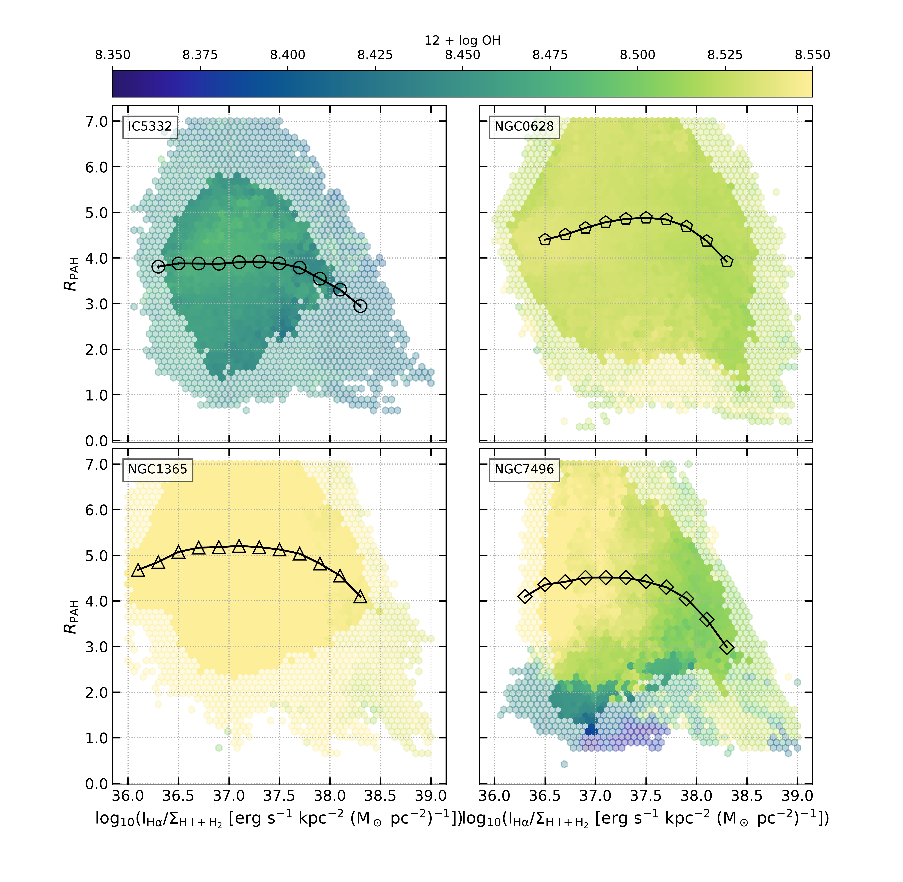

$\newcommand{\ensuremath}{}$
$\newcommand{\xspace}{}$
$\newcommand{\object}[1]{\texttt{#1}}$
$\newcommand{\farcs}{{.}''}$
$\newcommand{\farcm}{{.}'}$
$\newcommand{\arcsec}{''}$
$\newcommand{\arcmin}{'}$
$\newcommand{\ion}[2]{#1#2}$
$\newcommand{\textsc}[1]{\textrm{#1}}$
$\newcommand{\hl}[1]{\textrm{#1}}$
$\newcommand{\XX}{\textbf{Flag!}\xspace}$
$\newcommand{\coto}{^{12}{\rm CO}~(2-1)\xspace}$
$\newcommand{\halpha}{H\alpha\xspace}$
$\newcommand{\hii}{\ion{H}{2}\xspace}$
$\newcommand{\hone}{H{\sc i}\xspace}$
$\newcommand{\hagasratio}{I_{\rm H{\alpha}}/\Sigma_{\rm H{\sc I}+H_2}\xspace}$
$\newcommand{\ratio}{(F770W+F1130W)/F2100W\xspace}$
$\newcommand{\rpah}{R_{\rm PAH}\xspace}$
$\newcommand{\mjysr}{MJy~sr^{-1}\xspace}$
$\newcommand{\JS}[1]{\textcolor{violet}{#1}}$

$\newcommand{$\ensuremath$}{}$
$\newcommand{$\xspace$}{}$
$\newcommand{$\object$}[1]{\texttt{#1}}$
$\newcommand{$\farcs$}{{.}''}$
$\newcommand{$\farcm$}{{.}'}$
$\newcommand{$\arcsec$}{''}$
$\newcommand{$\arcmin$}{'}$
$\newcommand{$\ion$}[2]{#1#2}$
$\newcommand{$\textsc$}[1]{\textrm{#1}}$
$\newcommand{$\hl$}[1]{\textrm{#1}}$
$\newcommand{$\XX$}{\textbf{Flag!}$\xspace$}$
$\newcommand{$\coto$}{^{12}{\rm CO}~(2-1)$\xspace$}$
$\newcommand{$\halpha$}{H\alpha$\xspace$}$
$\newcommand{$\hii$}{$\ion${H}{2}$\xspace$}$
$\newcommand{$\hone$}{H{\sc i}$\xspace$}$
$\newcommand{$\hagasratio$}{I_{\rm H{\alpha}}/\Sigma_{\rm H{\sc I}+H_2}$\xspace$}$
$\newcommand{$\ratio$}{(F770W+F1130W)/F2100W$\xspace$}$
$\newcommand{$\rpah$}{R_{\rm PAH}$\xspace$}$
$\newcommand{$\mjysr$}{MJy~sr^{-1}$\xspace$}$
$\newcommand{$\JS$}[1]{\textcolor{violet}{#1}}$

# PHANGS-JWST First Results: Variations in PAH Fraction as a Function of ISM Phase and Metallicity

<mark>Appeared on: 2023-01-03</mark> - _13 pages, 4 figures. Accepted as part of a PHANGS-JWST Focus Issue to appear in ApJ_

J\'er\'emy Chastenet, et al. -- incl., <mark>Daizhong Liu</mark>, <mark>Frank Bigiel</mark>, <mark>Annie~Hughes</mark>, <mark>Kathryn Kreckel</mark>, <mark>Eva Schinnerer</mark>

**Abstract:** We present maps tracing the fraction of dust in the form of polycyclic aromatic hydrocarbons (PAHs) in IC 5332, NGC 628, NGC 1365, and NGC 7496 from JWST/MIRI observations.We trace the PAH fraction by combining the F770W ($7.7 \mu$m) and F1130W ($11.3 \mu$m) filters to track ionized and neutral PAH emission, respectively, and comparing the PAH emission to F2100W which traces small, hot dust grains. We find average$R{\rm_{PAH} = (F770W+F1130W)/F2100W}$values of 3.3, 4.7, 5.1, and 3.6 in IC 5332, NGC 628, NGC 1365, and NGC 7496, respectively.We find that$\hii$regions traced by MUSE$\halpha$show a systematically low PAH fraction. The PAH fraction remains relatively constant across other galactic environments, with slight variations. We use CO+$\hone$+$\halpha$to trace the interstellar gas phase and find that the PAH fraction decreases above a value of${\rm I_{H\alpha}/\Sigma_{H{\sc I}+H_2}} \sim 10^{37.5} {\rm erg s^{-1} kpc^{-2} (M_\odot pc^{-2}})^{-1}$, in all four galaxies.  Radial profiles also show a decreasing PAH fraction with increasing radius, correlated with lower metallicity, in line with previous results showing a strong metallicity dependence to the PAH fraction. Our results suggest that the process of PAH destruction in ionized gas operates similarly across the four targets.

**Figure 2. -** Running medians of $\rpah$, as a function of
    (\textit{top left:}) $r/{\rm r_{25}}$;
    (\textit{top right:}) ${\rm 12+log(O/H)}$ using metallicity maps from \citet[][]{Williams2022};
    (\textit{middle left:}) $\hagasratio$ in units of ${\rm  erg s^{-1} kpc^{-2} (M_\odot pc^{-2}})^{-1}$;
    (\textit{middle right:}) the fraction of molecular gas;
    (\textit{bottom left:}) the environmental masks from \citet[][]{Querejeta2021}, with a black star symbol showing the median for all pixels within each category.
    The error-bars show $3 \times$ standard error of the mean in each bin (except for the bottom left panel, only 1 SEM).
    Note that the middle panels involve the flat $\hone$ distribution assumption in IC 5332 and NGC 1365, which may shift the curves horizontally. (*FigMediansPanel*)

**Figure 1. -** Maps of $\rpah$ in IC 5332 (top left), NGC 628 (top right), NGC 1365 (bottom left), and NGC 7496 (bottom right). We mask the pixels with a ${\rm S/N < 3}$ in all bands (gray uniform background).
    We also mask the central pixels in NGC 1365 and NGC 7496 which are saturated, using instrument PSFs, and perform a by-hand additional masking to remove conspicuous saturation artifacts (shown in gray scale, not included in the analysis).
    We plot contours for a few of the brightest $\hii$ regions. They are clearly visible as depressions (darker colors) in $\rpah$, especially in NGC 628 and NGC 7496. (*FigAllMaps*)

**Figure 3. -** 2D histograms of the $\hagasratio$ and the $\rpah$, color-coded by metallicity, using the gradient from PHANGS-MUSE.
    The more transparent colors indicate bins with at least 10 hits, while the solid colors with at least 100 hits per bin. (*FigHaGas_Ratio2D*)

