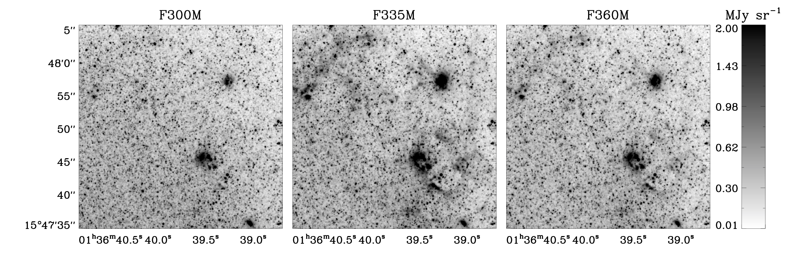
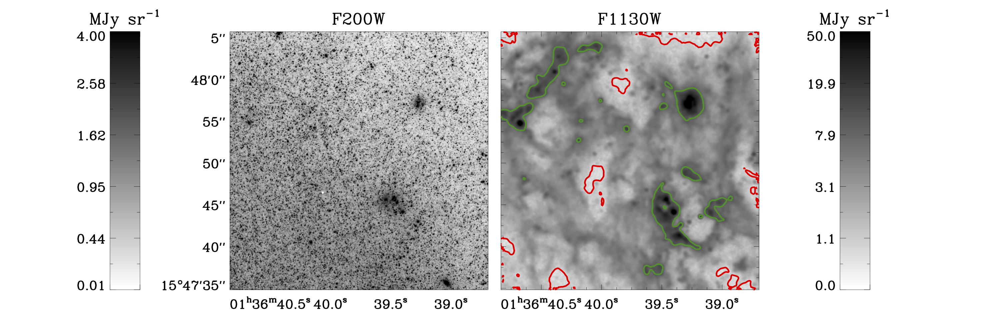
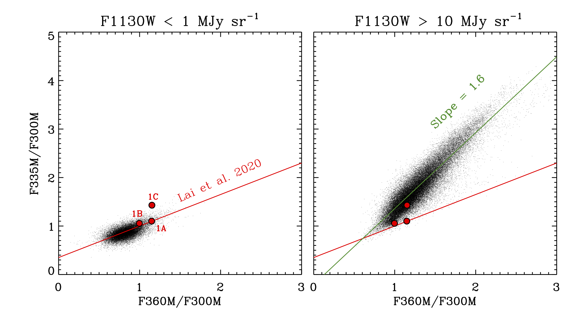
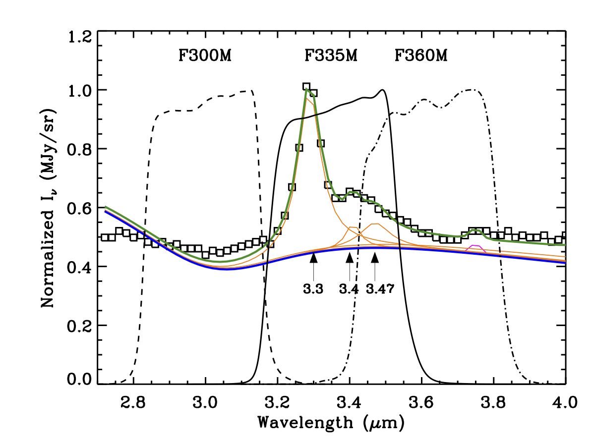

$\newcommand{\ensuremath}{}$
$\newcommand{\xspace}{}$
$\newcommand{\object}[1]{\texttt{#1}}$
$\newcommand{\farcs}{{.}''}$
$\newcommand{\farcm}{{.}'}$
$\newcommand{\arcsec}{''}$
$\newcommand{\arcmin}{'}$
$\newcommand{\ion}[2]{#1#2}$
$\newcommand{\textsc}[1]{\textrm{#1}}$
$\newcommand{\hl}[1]{\textrm{#1}}$
$\newcommand{\vdag}{(v)^\dagger}$
$\newcommand$
$\newcommand$
$\newcommand{\obsdateone}{July 6, 2022}$
$\newcommand{\obsdatetwo}{July 15, 2022}$
$\newcommand{\mjysr}{MJy sr^{-1}}$

$\newcommand{$\ensuremath$}{}$
$\newcommand{$\xspace$}{}$
$\newcommand{$\object$}[1]{\texttt{#1}}$
$\newcommand{$\farcs$}{{.}''}$
$\newcommand{$\farcm$}{{.}'}$
$\newcommand{$\arcsec$}{''}$
$\newcommand{$\arcmin$}{'}$
$\newcommand{$\ion$}[2]{#1#2}$
$\newcommand{$\textsc$}[1]{\textrm{#1}}$
$\newcommand{$\hl$}[1]{\textrm{#1}}$
$\newcommand{$\vdag$}{(v)^\dagger}$
$\newcommand$
$\newcommand$
$\newcommand{$\obsdateone$}{July 6, 2022}$
$\newcommand{$\obsdatetwo$}{July 15, 2022}$
$\newcommand{$\mjysr$}{MJy sr^{-1}}$

#  Polycyclic Aromatic Hydrocarbon Vibrational Band in Nearby Galaxies with NIRCam Medium Bands

<mark>Appeared on: 2023-01-04</mark> - _submitted to AAS journals and revised according to referee comments, part of a PHANGS-JWST Focus Issue to appear in ApJ_

Karin Sandstrom, et al. -- incl., <mark><mark>Janice C. Lee</mark></mark>, <mark><mark>Eva Schinnerer</mark></mark>, <mark><mark>Annie Hughes</mark></mark>, <mark><mark>Daizhong Liu</mark></mark>

**Abstract:** We present maps of the 3.3\micronpolycyclic aromatic hydrocarbon (PAH) emission feature in NGC 628, NGC 1365, and NGC 7496 as observed with the Near-Infrared Camera (NIRCam) imager on JWST from the PHANGS-JWST Cycle 1 Treasury project. We create maps that isolate the 3.3\micronPAH feature in the F335M filter (F335M$_{\rm PAH}$) using combinations of the F300M and F360M filters for removal of starlight continuum. This continuum removal is complicated by contamination of the F360M by PAH emission and variations in the stellar spectral energy distribution slopes between 3.0 and 3.6\micron. We modify the empirical prescription from\citet{Lai2020}to remove the starlight continuum in our highly resolved galaxies, which have a range of starlight- and PAH-dominated lines-of-sight.  Analyzing radially binned profiles of the F335M$_{\rm PAH}$emission, we find that between$5-65$\%of the F335M intensity comes from the 3.3\micronfeature within the inner 0.5$r_{25}$of our targets. This percentage systematically varies from galaxy to galaxy, and shows radial trends within the galaxies related to each galaxy's distribution of stellar mass, interstellar medium, and star formation. The 3.3\micronemission is well correlated with the 11.3\micronPAH feature traced with the MIRI F1130W filter, as is expected, since both features arise from C-H vibrational modes. The average F335M$_{\rm PAH}$/F1130W ratio agrees with the predictions of recent models by\citet{Draine2021}for PAHs with size and charge distributions shifted towards larger grains with normal or higher ionization.

**Figure 3. -** A representative $1.5\times 1.5$ kpc region of NGC 628 shown in the F200W, F300M, F335M, F360M, and F1130W bands with an {\em asinh} color table at each filter's native resolution. The F1130W filter traces primarily PAH emission from the 11.3 \micron feature. The F200W filter traces primarily stellar continuum.  The F335M filter is centered on the 3.3 \micron PAH feature and includes both stellar continuum and PAH emission.  Diffuse emission is visible in the F335M and F360M bands. In the F1130W panel, we highlight faint PAH emission with F1130W $<1$\mjysr with a red contour and bright PAH emission with F1130W $>10$\mjysr with a green contour.  These faint and bright selections are used in Figure \ref{fig:colorvs113}. (*fig:ngc628zoom*)

**Figure 4. -** F335M/F300M versus F360M/F300M color in our representative region of NGC 628 selected by F1130W surface brightness. On the left, the PAH emission at F1130W is faint (F1130W $<1$\mjysr), so the 3.0-3.6 \micron colors should be dominated by stars. This region is highlighted with a red contour in Figure \ref{fig:ngc628zoom}. On the right, we select bright regions in F1130W ($>10$\mjysr), for which we expect the colors to be dominated by PAH emission. The PAH-bright region is highlighted with a green contour in Figure \ref{fig:ngc628zoom}. The red line in each panel shows the \citet{Lai2020} prescription for the stellar continuum. In starlight dominated regions, this prescription does well at predicting the continuum at F335M.  However, in regions dominated by PAHs, the F360M/F300M color is also responding to the PAH emission, leading to overestimates of the F335M continuum. We include synthetic photometry for the 1A, 1B, and 1C template spectra from \citet{Lai2020} with red symbols, illustrating that our observed colors span a much wider range than the spectra used to create the continuum subtraction prescription. (*fig:colorvs113*)

**Figure 1. -** The NIRCam F300M, F335M, and F360M wavelength coverage overlaid on the 1C template spectrum from \citet{Lai2020}(square points) with their PAHFIT-based decomposition \citep{smith2007}. The continuum (including starlight, hot dust, and the effects of attenuation) is shown in blue. Orange lines show the individual dust features, including the 3.3 \micron PAH feature, the 3.4 \micron "aliphatic" emission feature and the 3.47 \micron plateau, which are labeled with arrows. The 3.74 \micron Pfund $\gamma$ emission line is shown in magenta.  The combined fit too all components is shown in green. PAH (or aliphatic) dust emission features contribute both to F335M and F360M, as well as longer wavelength dust emission in the F360M filter.  These contributions complicate continuum subtraction in our highly resolved galaxies, where individual lines of sight may be dominated by PAH emission in all three filters. (*fig:spec33*)

