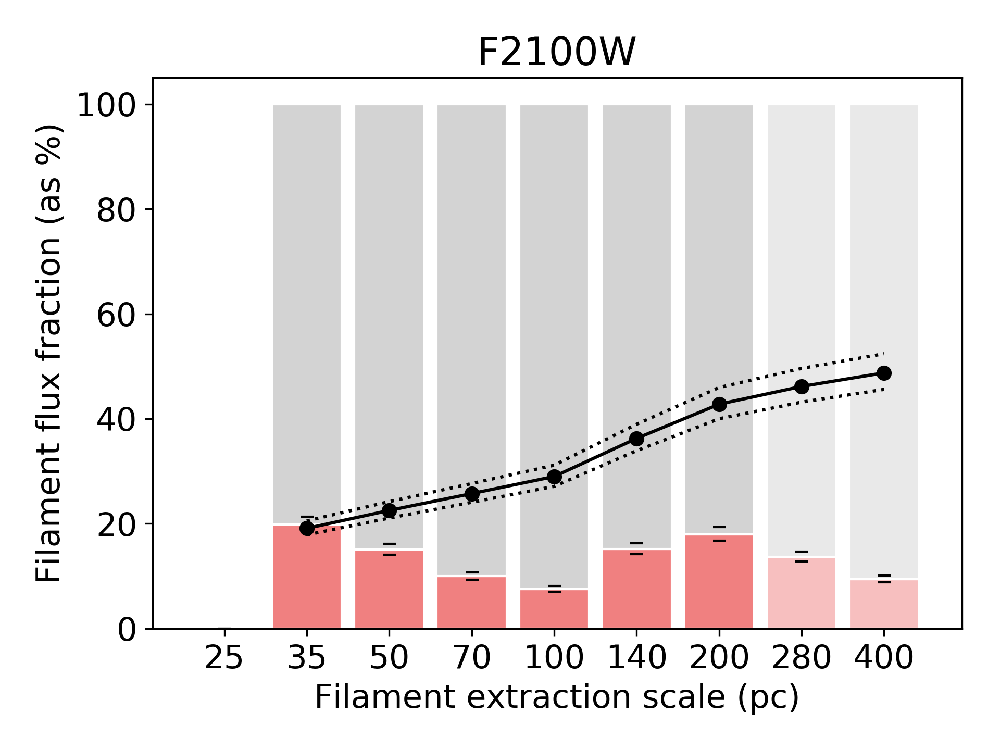

$\newcommand{\ensuremath}{}$
$\newcommand{\xspace}{}$
$\newcommand{\object}[1]{\texttt{#1}}$
$\newcommand{\farcs}{{.}''}$
$\newcommand{\farcm}{{.}'}$
$\newcommand{\arcsec}{''}$
$\newcommand{\arcmin}{'}$
$\newcommand{\ion}[2]{#1#2}$
$\newcommand{\textsc}[1]{\textrm{#1}}$
$\newcommand{\hl}[1]{\textrm{#1}}$
$\newcommand{\vdag}{(v)^\dagger}$
$\newcommand$
$\newcommand$
$\newcommand{\Caltech}{\affil{California Institute of Technology, 1200 E. California Blvd., MC 249-17, Pasadena, CA 91125, USA}}$
$\newcommand{\Tamkang}{\affil{Department of Physics, Tamkang University, No.151, Yingzhuan Rd., Tamsui Dist., New Taipei City 251301, Taiwan}}$
$\newcommand{\GEMINI}{\affil{Gemini Observatory/NSF’s NOIRLab, 950 N. Cherry Avenue, Tucson, AZ, 85719, USA$
$}}$
$\newcommand{\ASCL}{\affil{Astrophysics Source Code Librar$
$y, Michigan Technological University, 1400 Townsend Drive, Houghton, MI 49931}}$
$\newcommand{\OSU}{\affil{Department of Astronomy, The Ohio State University, 140 West 18th Avenue, Columbus, Ohio 43210, USA}}$
$\newcommand{\Alberta}{\affil{Department of Physics, University of Alberta, Edmonton, AB T6G 2E1, Canada}}$
$\newcommand{\ANU}{\affil{Research School of Astronomy and Astrophysics, Australian National University, Canberra, ACT 2611, Australia}}$
$\newcommand{\IPARCOS}{\affil{Instituto de Física de Partículas y del Cosmos, Universidad Complutense de Madrid, E-28040 Madrid, Spain}}$
$\newcommand{\IPAC}{\affil{Caltech-IPAC, 1200 E. California Blvd. Pasadena, CA 91125, USA}}$
$\newcommand{\Carnegie}{\affil{Observatories of the Carnegie Institution for Science, 813 Santa Barbara Street, Pasadena, CA 91101, USA}}$
$\newcommand{ÇAPP}{\affil{Center for Cosmology and AstroParticle Physics, 191 West Woodruff Avenue, Columbus, OH 43210, USA}}$
$\newcommand{\CfA}{\affil{Harvard-Smithsonian Center for Astrophysics, 60 Garden Street, Cambridge, MA 02138, USA}}$
$\newcommand{\CITEVA}{\affil{Centro de Astronomía (CITEVA), Universidad de Antofagasta, Avenida Angamos 601, Antofagasta, Chile}}$
$\newcommand{\CNRS}{\affil{CNRS, IRAP, 9 Av. du Colonel Roche, BP 44346, F-31028 Toulouse cedex 4, France}}$
$\newcommand{\ESO}{\affil{European Southern Observatory, Karl-Schwarzschild Stra{\ss}e 2, D-85748 Garching bei München, Germany}}$
$\newcommand{\Heidelberg}{\affil{Astronomisches Rechen-Institut, Zentrum für Astronomie der Universität Heidelberg, Mönchhofstra\ss e 12-14, D-69120 Heidelberg, Germany}}$
$\newcommand{\COOL}{\affil{Cosmic Origins Of Life (COOL) Research DAO, coolresearch.io}}$
$\newcommand{\ICRAR}{\affil{International Centre for Radio Astronomy Research, University of Western Australia, 35 Stirling Highway, Crawley, WA 6009, Australia}}$
$\newcommand{\IRAM}{\affil{Institut de Radioastronomie Millimétrique (IRAM), 300 Rue de la Piscine, F-38406 Saint Martin d'Hères, France}}$
$\newcommand{\IRAP}{\affil{CNRS, IRAP, 9 Av. du Colonel Roche, BP 44346, F-31028 Toulouse cedex 4, France}}$
$\newcommand{\UPS}{\affil{Université de Toulouse, UPS-OMP, IRAP, F-31028 Toulouse cedex 4, France}}$
$\newcommand{\ITA}{\affil{Universität Heidelberg, Zentrum für Astronomie, Institut für Theoretische Astrophysik, Albert-Ueberle-Str 2, D-69120 Heidelberg, Germany}}$
$\newcommand{\IWR}{\affil{Universität Heidelberg, Interdisziplinäres Zentrum für Wissenschaftliches Rechnen, Im Neuenheimer Feld 205, D-69120 Heidelberg, Germany}}$
$\newcommand{\JHU}{\affil{Department of Physics and Astronomy, The Johns Hopkins University, Baltimore, MD 21218, USA}}$
$\newcommand{\Leiden}{\affil{Leiden Observatory, Leiden University, P.O. Box 9513, 2300 RA Leiden, The Netherlands}}$
$\newcommand{\Maryland}{\affil{Department of Astronomy, University of Maryland, College Park, MD 20742, USA}}$
$\newcommand{\MPE}{\affil{Max-Planck-Institut für extraterrestrische Physik, Giessenbachstra{\ss}e 1, D-85748 Garching, Germany}}$
$\newcommand{\MPIA}{\affil{Max-Planck-Institut für Astronomie, Königstuhl 17, D-69117, Heidelberg, Germany}}$
$\newcommand{\Nagoya}{\affil{Department of Physics, Nagoya University, Furo-cho, Chikusa-ku, Nagoya, Aichi 464-8602, Japan}}$
$\newcommand{\NRAO}{\affil{National Radio Astronomy Observatory, 520 Edgemont Road, Charlottesville, VA 22903-2475, USA}}$
$\newcommand{\OAN}{\affil{Observatorio Astronómico Nacional (IGN), C/Alfonso XII, 3, E-28014 Madrid, Spain}}$
$\newcommand{\ObsParis}{\affil{Sorbonne Université, Observatoire de Paris, Université PSL, CNRS, LERMA, F-75014, Paris, France}}$
$\newcommand{\Princeton}{\affil{Department of Astrophysical Sciences, Princeton University, Princeton, NJ 08544 USA}}$
$\newcommand{\UToledo}{\affil{University of Toledo, 2801 W. Bancroft St., Mail Stop 111, Toledo, OH, 43606}}$
$\newcommand{\Toulouse}{\affil{Université de Toulouse, UPS-OMP, IRAP, F-31028 Toulouse cedex 4, France}}$
$\newcommand{\UBonn}{\affil{Argelander-Institut für Astronomie, Universität Bonn, Auf dem Hügel 71, 53121 Bonn, Germany}}$
$\newcommand{\UChile}{\affil{Departamento de Astronomía, Universidad de Chile, Camino del Observatorio 1515, Las Condes, Santiago, Chile}}$
$\newcommand{\UCM}{\affil{Departamento de Física de la Tierra y Astrofísica, Universidad Complutense de Madrid, E-28040 Madrid, Spain}}$
$\newcommand{\UCSD}{\affil{Center for Astrophysics and Space Sciences, Department of Physics,  University of California,\San Diego, 9500 Gilman Drive, La Jolla, CA 92093, USA}}$
$\newcommand{\ULyon}{\affil{Univ Lyon, Univ Lyon 1, ENS de Lyon, CNRS, Centre de Recherche Astrophysique de Lyon UMR5574,\F-69230 Saint-Genis-Laval, France}}$
$\newcommand{\UMass}{\affil{University of Massachusetts—Amherst, 710 N. Pleasant Street, Amherst, MA 01003, USA}}$
$\newcommand{\UWyoming}{\affil{Department of Physics and Astronomy, University of Wyoming, Laramie, WY 82071, USA}}$
$\newcommand{\LAM}{\affil{$
$Aix Marseille Univ, CNRS, CNES, LAM (Laboratoire d’Astrophysique de Marseille),  F-13388 Marseille,$
$France}}$
$\newcommand{\UHawaii}{\affil{Institute for Astronomy, University of Hawaii, 2680 Woodlawn Drive, Honolulu, HI 96822, USA}}$
$\newcommand{\UGent}{\affil{Sterrenkundig Observatorium, Universiteit Gent, Krijgslaan 281 S9, B-9000 Gent, Belgium}}$
$\newcommand{\IPARC}{\affil{Instituto de Física de Partículas y del Cosmos IPARCOS, Facultad de Ciencias Físicas, Universidad Complutense de Madrid, E-28040, Spain}}$
$\newcommand{\STScI}{\affil{Space Telescope Science Institute, 3700 San Martin Drive, Baltimore, MD 21218, USA}}$
$\newcommand{\STScIESA}{\affiliation{AURA for the European Space Agency (ESA), Space Telescope Science Institute, 3700 San Martin Drive, Baltimore, MD 21218, USA}}$
$\newcommand{\McMaster}{\affil{Department of Physics and Astronomy, McMaster University, Hamilton, ON L8S 4M1, Canada}}$
$\newcommand{\INAF}{\affil{INAF -- Osservatorio Astrofisico di Arcetri, Largo E. Fermi 5, I-50157, Firenze, Italy}}$
$\newcommand{\Sydney}{\affil{Sydney Institute for Astronomy, School of Physics A28, The University of Sydney, NSW 2006, Australia}}$
$\newcommand{\UA}{\affil{Centro de Astronomía (CITEVA), Universidad de Antofagasta, Avenida Angamos 601, Antofagasta, Chile}}$
$\newcommand{\LERMA}{\affil{Observatoire de Paris, PSL Research University, CNRS, Sorbonne Universités, 75014 Paris}}$
$\newcommand{\SAIMSU}{\affil{Sternberg Astronomical Institute, Lomonosov Moscow State University, Universitetsky pr. 13, 119234 Moscow, Russia}}$
$\newcommand{\StockholmOKC}{\affil{The Oskar Klein Centre for Cosmoparticle Physics, Department of Physics, Stockholm University, AlbaNova, Stockholm, SE-106 91, Sweden}}$
$\newcommand$
$\newcommand$
$\newcommand$
$\newcommand$
$\newcommand$
$\newcommand$
$\newcommand$
$\newcommand$
$\newcommand$
$\newcommand$
$\newcommand$
$\newcommand$
$\newcommand$
$\newcommand$
$\newcommand$
$\newcommand$
$\newcommand$
$\newcommand$
$\newcommand$
$\newcommand$
$\newcommand$
$\newcommand$
$\newcommand$
$\newcommand{\msun}{M_{\odot}}$
$\newcommand{\HST}{\textit{HST} }$
$\newcommand{\JWST}{\textit{JWST} }$
$\newcommand{\Gaia}{\textit{Gaia} }$

$\newcommand{\ensuremath}{}$
$\newcommand{\xspace}{}$
$\newcommand{\object}[1]{\texttt{#1}}$
$\newcommand{\farcs}{{.}''}$
$\newcommand{\farcm}{{.}'}$
$\newcommand{\arcsec}{''}$
$\newcommand{\arcmin}{'}$
$\newcommand{\ion}[2]{#1#2}$
$\newcommand{\textsc}[1]{\textrm{#1}}$
$\newcommand{\hl}[1]{\textrm{#1}}$
$\newcommand{\vdag}{(v)^\dagger}$
$\newcommand$
$\newcommand$
$\newcommand{\Caltech}{\affil{California Institute of Technology, 1200 E. California Blvd., MC 249-17, Pasadena, CA 91125, USA}}$
$\newcommand{\Tamkang}{\affil{Department of Physics, Tamkang University, No.151, Yingzhuan Rd., Tamsui Dist., New Taipei City 251301, Taiwan}}$
$\newcommand{\GEMINI}{\affil{Gemini Observatory/NSF’s NOIRLab, 950 N. Cherry Avenue, Tucson, AZ, 85719, USA$
$}}$
$\newcommand{\ASCL}{\affil{Astrophysics Source Code Librar$
$y, Michigan Technological University, 1400 Townsend Drive, Houghton, MI 49931}}$
$\newcommand{\OSU}{\affil{Department of Astronomy, The Ohio State University, 140 West 18th Avenue, Columbus, Ohio 43210, USA}}$
$\newcommand{\Alberta}{\affil{Department of Physics, University of Alberta, Edmonton, AB T6G 2E1, Canada}}$
$\newcommand{\ANU}{\affil{Research School of Astronomy and Astrophysics, Australian National University, Canberra, ACT 2611, Australia}}$
$\newcommand{\IPARCOS}{\affil{Instituto de Física de Partículas y del Cosmos, Universidad Complutense de Madrid, E-28040 Madrid, Spain}}$
$\newcommand{\IPAC}{\affil{Caltech-IPAC, 1200 E. California Blvd. Pasadena, CA 91125, USA}}$
$\newcommand{\Carnegie}{\affil{Observatories of the Carnegie Institution for Science, 813 Santa Barbara Street, Pasadena, CA 91101, USA}}$
$\newcommand{ÇAPP}{\affil{Center for Cosmology and AstroParticle Physics, 191 West Woodruff Avenue, Columbus, OH 43210, USA}}$
$\newcommand{\CfA}{\affil{Harvard-Smithsonian Center for Astrophysics, 60 Garden Street, Cambridge, MA 02138, USA}}$
$\newcommand{\CITEVA}{\affil{Centro de Astronomía (CITEVA), Universidad de Antofagasta, Avenida Angamos 601, Antofagasta, Chile}}$
$\newcommand{\CNRS}{\affil{CNRS, IRAP, 9 Av. du Colonel Roche, BP 44346, F-31028 Toulouse cedex 4, France}}$
$\newcommand{\ESO}{\affil{European Southern Observatory, Karl-Schwarzschild Stra{\ss}e 2, D-85748 Garching bei München, Germany}}$
$\newcommand{\Heidelberg}{\affil{Astronomisches Rechen-Institut, Zentrum für Astronomie der Universität Heidelberg, Mönchhofstra\ss e 12-14, D-69120 Heidelberg, Germany}}$
$\newcommand{\COOL}{\affil{Cosmic Origins Of Life (COOL) Research DAO, coolresearch.io}}$
$\newcommand{\ICRAR}{\affil{International Centre for Radio Astronomy Research, University of Western Australia, 35 Stirling Highway, Crawley, WA 6009, Australia}}$
$\newcommand{\IRAM}{\affil{Institut de Radioastronomie Millimétrique (IRAM), 300 Rue de la Piscine, F-38406 Saint Martin d'Hères, France}}$
$\newcommand{\IRAP}{\affil{CNRS, IRAP, 9 Av. du Colonel Roche, BP 44346, F-31028 Toulouse cedex 4, France}}$
$\newcommand{\UPS}{\affil{Université de Toulouse, UPS-OMP, IRAP, F-31028 Toulouse cedex 4, France}}$
$\newcommand{\ITA}{\affil{Universität Heidelberg, Zentrum für Astronomie, Institut für Theoretische Astrophysik, Albert-Ueberle-Str 2, D-69120 Heidelberg, Germany}}$
$\newcommand{\IWR}{\affil{Universität Heidelberg, Interdisziplinäres Zentrum für Wissenschaftliches Rechnen, Im Neuenheimer Feld 205, D-69120 Heidelberg, Germany}}$
$\newcommand{\JHU}{\affil{Department of Physics and Astronomy, The Johns Hopkins University, Baltimore, MD 21218, USA}}$
$\newcommand{\Leiden}{\affil{Leiden Observatory, Leiden University, P.O. Box 9513, 2300 RA Leiden, The Netherlands}}$
$\newcommand{\Maryland}{\affil{Department of Astronomy, University of Maryland, College Park, MD 20742, USA}}$
$\newcommand{\MPE}{\affil{Max-Planck-Institut für extraterrestrische Physik, Giessenbachstra{\ss}e 1, D-85748 Garching, Germany}}$
$\newcommand{\MPIA}{\affil{Max-Planck-Institut für Astronomie, Königstuhl 17, D-69117, Heidelberg, Germany}}$
$\newcommand{\Nagoya}{\affil{Department of Physics, Nagoya University, Furo-cho, Chikusa-ku, Nagoya, Aichi 464-8602, Japan}}$
$\newcommand{\NRAO}{\affil{National Radio Astronomy Observatory, 520 Edgemont Road, Charlottesville, VA 22903-2475, USA}}$
$\newcommand{\OAN}{\affil{Observatorio Astronómico Nacional (IGN), C/Alfonso XII, 3, E-28014 Madrid, Spain}}$
$\newcommand{\ObsParis}{\affil{Sorbonne Université, Observatoire de Paris, Université PSL, CNRS, LERMA, F-75014, Paris, France}}$
$\newcommand{\Princeton}{\affil{Department of Astrophysical Sciences, Princeton University, Princeton, NJ 08544 USA}}$
$\newcommand{\UToledo}{\affil{University of Toledo, 2801 W. Bancroft St., Mail Stop 111, Toledo, OH, 43606}}$
$\newcommand{\Toulouse}{\affil{Université de Toulouse, UPS-OMP, IRAP, F-31028 Toulouse cedex 4, France}}$
$\newcommand{\UBonn}{\affil{Argelander-Institut für Astronomie, Universität Bonn, Auf dem Hügel 71, 53121 Bonn, Germany}}$
$\newcommand{\UChile}{\affil{Departamento de Astronomía, Universidad de Chile, Camino del Observatorio 1515, Las Condes, Santiago, Chile}}$
$\newcommand{\UCM}{\affil{Departamento de Física de la Tierra y Astrofísica, Universidad Complutense de Madrid, E-28040 Madrid, Spain}}$
$\newcommand{\UCSD}{\affil{Center for Astrophysics and Space Sciences, Department of Physics,  University of California,\San Diego, 9500 Gilman Drive, La Jolla, CA 92093, USA}}$
$\newcommand{\ULyon}{\affil{Univ Lyon, Univ Lyon 1, ENS de Lyon, CNRS, Centre de Recherche Astrophysique de Lyon UMR5574,\F-69230 Saint-Genis-Laval, France}}$
$\newcommand{\UMass}{\affil{University of Massachusetts—Amherst, 710 N. Pleasant Street, Amherst, MA 01003, USA}}$
$\newcommand{\UWyoming}{\affil{Department of Physics and Astronomy, University of Wyoming, Laramie, WY 82071, USA}}$
$\newcommand{\LAM}{\affil{$
$Aix Marseille Univ, CNRS, CNES, LAM (Laboratoire d’Astrophysique de Marseille),  F-13388 Marseille,$
$France}}$
$\newcommand{\UHawaii}{\affil{Institute for Astronomy, University of Hawaii, 2680 Woodlawn Drive, Honolulu, HI 96822, USA}}$
$\newcommand{\UGent}{\affil{Sterrenkundig Observatorium, Universiteit Gent, Krijgslaan 281 S9, B-9000 Gent, Belgium}}$
$\newcommand{\IPARC}{\affil{Instituto de Física de Partículas y del Cosmos IPARCOS, Facultad de Ciencias Físicas, Universidad Complutense de Madrid, E-28040, Spain}}$
$\newcommand{\STScI}{\affil{Space Telescope Science Institute, 3700 San Martin Drive, Baltimore, MD 21218, USA}}$
$\newcommand{\STScIESA}{\affiliation{AURA for the European Space Agency (ESA), Space Telescope Science Institute, 3700 San Martin Drive, Baltimore, MD 21218, USA}}$
$\newcommand{\McMaster}{\affil{Department of Physics and Astronomy, McMaster University, Hamilton, ON L8S 4M1, Canada}}$
$\newcommand{\INAF}{\affil{INAF -- Osservatorio Astrofisico di Arcetri, Largo E. Fermi 5, I-50157, Firenze, Italy}}$
$\newcommand{\Sydney}{\affil{Sydney Institute for Astronomy, School of Physics A28, The University of Sydney, NSW 2006, Australia}}$
$\newcommand{\UA}{\affil{Centro de Astronomía (CITEVA), Universidad de Antofagasta, Avenida Angamos 601, Antofagasta, Chile}}$
$\newcommand{\LERMA}{\affil{Observatoire de Paris, PSL Research University, CNRS, Sorbonne Universités, 75014 Paris}}$
$\newcommand{\SAIMSU}{\affil{Sternberg Astronomical Institute, Lomonosov Moscow State University, Universitetsky pr. 13, 119234 Moscow, Russia}}$
$\newcommand{\StockholmOKC}{\affil{The Oskar Klein Centre for Cosmoparticle Physics, Department of Physics, Stockholm University, AlbaNova, Stockholm, SE-106 91, Sweden}}$
$\newcommand$
$\newcommand$
$\newcommand$
$\newcommand$
$\newcommand$
$\newcommand$
$\newcommand$
$\newcommand$
$\newcommand$
$\newcommand$
$\newcommand$
$\newcommand$
$\newcommand$
$\newcommand$
$\newcommand$
$\newcommand$
$\newcommand$
$\newcommand$
$\newcommand$
$\newcommand$
$\newcommand$
$\newcommand$
$\newcommand$
$\newcommand{\msun}{M_{\odot}}$
$\newcommand{\HST}{\textit{HST} }$
$\newcommand{\JWST}{\textit{JWST} }$
$\newcommand{\Gaia}{\textit{Gaia} }$

# PHANGS-JWST First Results:  The Dust Filament Network of NGC 628 and its Relation to Star Formation Activity

<mark>Appeared on: 2023-01-02</mark> - _21 pages, 14 figures, accepted for publication as part of PHANGS-JWST ApJL Focus Issue_

David A. Thilker, et al. -- incl., <mark>Janice C. Lee</mark>, <mark>Frank Bigiel</mark>, <mark>Francesca~Pinna</mark>, <mark>Eva Schinnerer</mark>, <mark>Rowan J. Smith</mark>, <mark>Kathryn Kreckel</mark>

**Abstract:** PHANGS-JWST mid-infrared (MIR) imaging of nearby spiral galaxies has revealed ubiquitous filaments of dust emission in intricate detail.  We present a pilot study to systematically map the dust filament network (DFN) at multiple scales between 25--400 pc in NGC 628.  MIRI images at 7.7, 10, 11.3 and 21 $\micron$ of NGC 628 are used to generate maps of the filaments in emission, while PHANGS-HST B-band imaging yields maps of dust attenuation features.  We quantify the correspondence between filaments traced by MIR thermal continuum / polycyclic aromatic hydrocarbon (PAH) emission and filaments detected via extinction / scattering of visible light; the fraction of MIR flux contained in the DFN; and the fraction of HII regions, young star clusters and associations within the DFN.  We examine the dependence of these quantities with the physical scale at which the DFN is extracted.  With our highest resolution DFN maps (25 pc filament width), we find that filaments in emission and attenuation are co-spatial in 40 \% of sight lines, often exhibiting detailed morphological agreement; that $\sim$ 30 \% of the MIR flux is associated with the DFN; and that 75--80 \% of HII regions and 60 \% of star clusters younger than 5 Myr are contained within the DFN.  However, the DFN at this scale is anti-correlated with looser associations of stars \edit 1 {younger than 5 Myr} identified using PHANGS-HST near-UV imaging.  We discuss the impact of these findings for studies of star formation and the ISM, and the broad range of new investigations enabled with multi-scale maps of the DFN.

**Figure 7. -** \edit1{Dust motes and point-source MIR contamination from extremely dusty stars.}_Left:_ Subsection of our pre-processed B-band image, overlaid with contours corresponding to the filament masks generated at 25 pc resolution in emission, red, and absorption, blue. _Center:_ Unprocessed B-band image _Right:_$\JWST$ F1000W image, also with the filament mask contours shown.  Yellow circles surround three example dust motes.  There are many more in the field shown, left unmarked. Green circles surround three example candidate dusty stars, others are not marked. Circles are $1$\arcsec$$ in diameter, equivalent to 48 pc at the distance of NGC 628\edit1{, and the images are oriented with North up and East left.} (*fig:dustmotes*)

**Figure 8. -** \edit1{Testing the link of the dust filament network to current star formation.}_Top:_ Filament inclusion fractions for various star formation event tracers (\HII regions, young clusters, young multi-scale associations) versus the dust emission filament extraction scale. Bars indicate results for each individual extraction scale, whereas lines and points indicate the cumulative filament mask measurements. Inclusion fractions for randomly distributed points are shown with inset bars and dotted lines. _Bottom:_ SFR-weighted inclusion fractions.    (*fig:piegraph_InclFrac_vs_scale*)

**Figure 4. -** \edit1{Measurements of the fraction of total flux contained within the dust filament network}_Top:_ Filament flux fraction in F770W expressed as percentage, with individual filament extraction scales plotted as pink bars, and cumulative multi-scale results as solid lines and points.  The faded region is shown for completeness, although we adopt a maximum cumulative scale of 200 pc. Horizontal dashes on each bar indicate the one-sigma uncertainty of the flux fraction measurements, obtained by perturbing the sky level in accord with the post-pipeline calibration described by \citet{LEROY1_PHANGSJWST}, \citet{LEE_PHANGSJWST}. Dotted lines show the one-sigma range due to uncertainty of cumulative flux fractions. _Bottom:_ Same, but for F2100W. (*fig:fluxfrac*)

