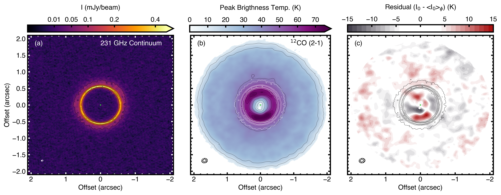
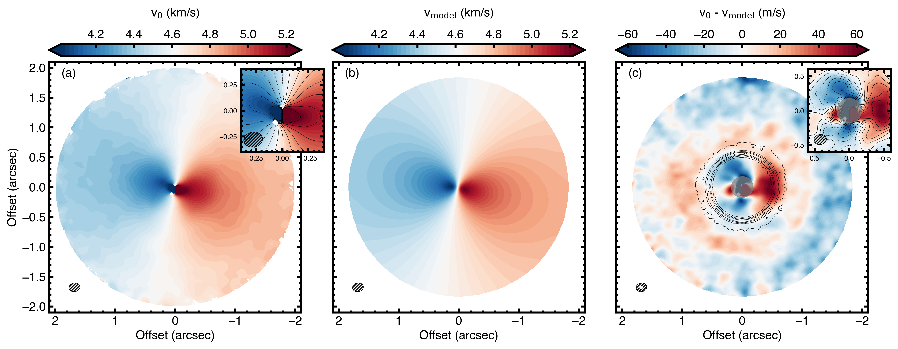
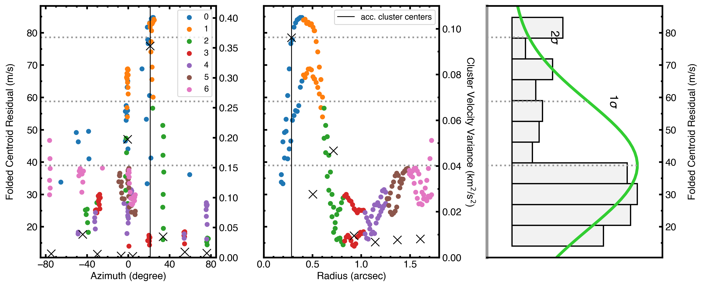

$\newcommand{\ensuremath}{}$
$\newcommand{\xspace}{}$
$\newcommand{\object}[1]{\texttt{#1}}$
$\newcommand{\farcs}{{.}''}$
$\newcommand{\farcm}{{.}'}$
$\newcommand{\arcsec}{''}$
$\newcommand{\arcmin}{'}$
$\newcommand{\ion}[2]{#1#2}$
$\newcommand{\textsc}[1]{\textrm{#1}}$
$\newcommand{\hl}[1]{\textrm{#1}}$
$\newcommand{\joe}[1]{\textcolor{blue}{\textbf{Joe:} #1}}$
$\newcommand{\mb}[1]{\textcolor{purple}{\textbf{Myriam:} #1}}$
$\newcommand{\andres}[1]{\textcolor{pink}{\textbf{Andrés:} #1}}$
$\newcommand{\todo}[1]{\textcolor{red}{ #1}}$
$\newcommand{\arraystretch}{1}$
$\newcommand{\arraystretch}{2}$

$\newcommand{$\ensuremath$}{}$
$\newcommand{$\xspace$}{}$
$\newcommand{$\object$}[1]{\texttt{#1}}$
$\newcommand{$\farcs$}{{.}''}$
$\newcommand{$\farcm$}{{.}'}$
$\newcommand{$\arcsec$}{''}$
$\newcommand{$\arcmin$}{'}$
$\newcommand{$\ion$}[2]{#1#2}$
$\newcommand{$\textsc$}[1]{\textrm{#1}}$
$\newcommand{$\hl$}[1]{\textrm{#1}}$
$\newcommand{$\joe$}[1]{\textcolor{blue}{\textbf{Joe:} #1}}$
$\newcommand{$\mb$}[1]{\textcolor{purple}{\textbf{Myriam:} #1}}$
$\newcommand{$\andres$}[1]{\textcolor{pink}{\textbf{Andrés:} #1}}$
$\newcommand{$\todo$}[1]{\textcolor{red}{ #1}}$
$\newcommand{$\arraystretch$}{1}$
$\newcommand{$\arraystretch$}{2}$

# A kinematically-detected planet candidate in a transition disk

<mark>Appeared on: 2023-01-05</mark> - _13 pages, 14 figures. To be published in Astronomy & Astrophysics Letters_

<mark>J. Stadler</mark>, et al. -- incl., <mark>N. Kurtovic</mark>

**Abstract:** Transition disks are protoplanetary disks with inner cavities possibly cleared by massive companions. They are prime targets to observe at high resolution to map their velocity structure and probe companion-disk interactions.We present Atacama Large (sub-)Millimeter Array (ALMA) Band 6 dust and gas observations of the transition disk around RXJ1604.3–2130 A, known to feature nearly symmetric shadows in scattered light, and aim to search for non-Keplerian features.We study the$^{12}$CO line channel maps and moment maps of the line of sight velocity and peak intensity. We fit a Keplerian model of the channel-by-channel emission to study line profile differences, and produce deprojected radial profiles for all velocity components.The$^{12}$CO emission is detected out to$R=\sim$1.8$\arcsec$(265 au). It shows a cavity inwards of 0.39$\arcsec$($\sim$56 au) and within the  dust continuum ring (at$\sim$0.56$\arcsec$, i.e., 81 au).   Azimuthal brightness variations in the$^{12}$CO line and dust continuum are broadly aligned with the shadows detected in scattered light observations. We find a strong localized non-Keplerian feature towards the west within the continuum ring (at${R=41\pm10}$au and${PA=280\pm2^\circ}$). It accounts for$\Delta v_\phi/v_\mathrm{kep}\sim0.4$, or$\Delta v_z/v_\mathrm{kep}\sim0.04$, if the perturbation is in the rotational or vertical direction.   A tightly wound spiral is also detected and extending over$300^\circ$in azimuth, possibly connected to the localized non-Keplerian  feature. Finally, a bending of the iso-velocity contours within the gas cavity indicates a highly perturbed inner region, possibly related to the presence of a misaligned inner disk.While broadly aligned with the scattered light shadows, the localized non-Keplerian feature cannot be solely due to changes in temperature. Instead, we interpret the kinematical feature as tracing a massive companion located at the edge of the dust continuum ring. We speculate that the spiral is caused by buoyancy resonances driven by planet-disk-interactions.   However, this potential planet at$\sim$41 au cannot explain the gas-depleted cavity, the low accretion rate and the misaligned inner disk, suggesting the presence of another companion closer-in.

**Figure 10. -** ALMA observations of J1604. Panel \textbf{(a)} 231 GHz dust continuum, black solid contours drawn at [5, 15, 25, 35, 45]$\sigma$, the image is plotted with a power-law scaling of $\gamma=0.6$. \textbf{(b)}$^{12}$CO peak brightness temperature map computed from $I_\mathrm{0}$ using the Planck law with black solid contours drawn at [5, 10, 20, 40, 60, 65, 70]$\sigma$, pixel below $5\sigma$ are masked. \textbf{(c)} Peak intensity residuals after subtracting an azimuthally-averaged radial profile from the data, where we adjusted the colour scale such that residuals smaller than $1\sigma$ are white. The beam sizes are shown in the lower left corner and the position of the star is marked by a green cross. In (b) \&(c), we overlaid the continuum contours in white and black, respectively. (*fig:intensities*)

**Figure 11. -** Line of sight velocity maps for data $v_\mathrm{0}$\textbf{(a)} and \texttt{discminer} model $v_\mathrm{mod}$\textbf{(b)}. \textbf{(c)} Velocity residual map after subtracting  $v_\mathrm{0}$-$v_\mathrm{mod}$, where the dust continuum is overlaid in solid contours with equal levels as in Fig. \ref{fig:intensities}. The innermost region was masked during the fit by one beam size in radius, shown as the grey shaded ellipse. The insets in subplots \textbf{(a)}\&\textbf{(c)} zoom into the innermost region of the disk to highlight the non-Keplerian velocities. Contours are drawn at v$_\mathrm{sys}=(4.62 $± 0.60) \kmsec in steps of 0.1 \kmsec and from -60 to 60 \msec in steps of 10 \msec, respectively. All maps show the synthesized beam for CO (black) and the continuum (white) in the lower left corner and are masked where the CO peak intensity falls below a 5$\sigma$ level for panel (a) and where $R>R_\mathrm{out}$ for the rest. (*fig:centroid*)

**Figure 8. -** Location of the folded peak velocity residuals. The detected points are shown in azimuth (left) and radius (middle) obtained with the Peak Variance method. Colours indicate the 7 different radial clusters specified, where blue peak residual points are within detected significant radial cluster. The black crosses are the velocity variances of the clusters plotted at the ($R,\phi$)-location of each cluster center. The centers of the accepted clusters (those with peak velocity residuals larger then three times the variance in other clusters) in radius and azimuth are marked with black vertical lines in both panels. The right hand plot shows the normal distribution of the peak residual points in a histogram. Note that outliers of the distribution are related to the localized perturbation. The maximum value of all peak folded centroid residuals is at 0.39$\arcsec$(57 au), its mean value is 39 m/s and $1\sigma_v=20$ m/s (not to be mistaken with the cluster variances). (*fig:app_cluster_r_phi*)

