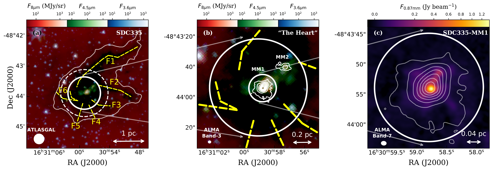

$\newcommand{\ensuremath}{}$
$\newcommand{\xspace}{}$
$\newcommand{\object}[1]{\texttt{#1}}$
$\newcommand{\farcs}{{.}''}$
$\newcommand{\farcm}{{.}'}$
$\newcommand{\arcsec}{''}$
$\newcommand{\arcmin}{'}$
$\newcommand{\ion}[2]{#1#2}$
$\newcommand{\textsc}[1]{\textrm{#1}}$
$\newcommand{\hl}[1]{\textrm{#1}}$
$\newcommand{\casa}{\textsc{\large casa}}$
$\newcommand{\getsf}{\textsc{\large getsf}}$
$\newcommand{\getsources}{\textsc{\large getsources}}$
$\newcommand{\scousepy}{\textsc{\large scousepy}}$
$\newcommand{\astrodendro}{\textsc{\large astrodendro}}$
$\newcommand{\acorns}{\textsc{\large acorns}}$
$\newcommand{\tablenotemarknew}[1]{^{#1}}$
$\newcommand{\majchange}[1]{{\color{red}#1}}$
$\newcommand{\minchange}[1]{\textbf{#1}}$
$\newcommand{\massrate}{M_{\odot} yr^{-1}}$
$\newcommand{\hi}{H\textsc{i}~}$
$\newcommand{\hii}{H\textsc{ii}~}$
$\newcommand{\msun}{ M_\odot}$
$\newcommand{\lsun}{ L_\odot}$
$\newcommand{\kms}{km s^{-1}}$
$\newcommand{\jybeam}{Jy beam^{-1}}$
$\newcommand{\mjybeam}{mJy beam^{-1}}$
$\newcommand{\hmole}{H_2}$
$\newcommand{\degree}{^{\circ}}$
$\newcommand{\parcsec}{\mbox{.\!\!\arcsec}}$
$\newcommand{\ssstyle}{\scriptscriptstyle}$
$\newcommand{\htcop}{H^{13}CO^+}$
$\newcommand{\hcop}{HCO^+}$
$\newcommand{\hcn}{HCN}$
$\newcommand{\htcn}{H^{13}CN}$
$\newcommand{\sio}{SiO}$
$\newcommand{çh}{CCH}$
$\newcommand{\chtoh}{CH_3OH}$
$\newcommand{\hctn}{HC_3N}$
$\newcommand{\cs}{CS}$
$\newcommand{\so}{SO}$
$\newcommand{\htcs}{H_2CS}$
$\newcommand{\nthp}{N_2H^+}$
$\newcommand$
$\newcommand$
$\newcommand$
$\newcommand{\thebibliography}{\DeclareRobustCommand{\VAN}[3]{##3}\VANthebibliography}$

$\newcommand{\ensuremath}{}$
$\newcommand{\xspace}{}$
$\newcommand{\object}[1]{\texttt{#1}}$
$\newcommand{\farcs}{{.}''}$
$\newcommand{\farcm}{{.}'}$
$\newcommand{\arcsec}{''}$
$\newcommand{\arcmin}{'}$
$\newcommand{\ion}[2]{#1#2}$
$\newcommand{\textsc}[1]{\textrm{#1}}$
$\newcommand{\hl}[1]{\textrm{#1}}$
$\newcommand{\casa}{\textsc{\large casa}}$
$\newcommand{\getsf}{\textsc{\large getsf}}$
$\newcommand{\getsources}{\textsc{\large getsources}}$
$\newcommand{\scousepy}{\textsc{\large scousepy}}$
$\newcommand{\astrodendro}{\textsc{\large astrodendro}}$
$\newcommand{\acorns}{\textsc{\large acorns}}$
$\newcommand{\tablenotemarknew}[1]{^{#1}}$
$\newcommand{\majchange}[1]{{\color{red}#1}}$
$\newcommand{\minchange}[1]{\textbf{#1}}$
$\newcommand{\massrate}{M_{\odot} yr^{-1}}$
$\newcommand{\hi}{H\textsc{i}~}$
$\newcommand{\hii}{H\textsc{ii}~}$
$\newcommand{\msun}{ M_\odot}$
$\newcommand{\lsun}{ L_\odot}$
$\newcommand{\kms}{km s^{-1}}$
$\newcommand{\jybeam}{Jy beam^{-1}}$
$\newcommand{\mjybeam}{mJy beam^{-1}}$
$\newcommand{\hmole}{H_2}$
$\newcommand{\degree}{^{\circ}}$
$\newcommand{\parcsec}{\mbox{.\!\!\arcsec}}$
$\newcommand{\ssstyle}{\scriptscriptstyle}$
$\newcommand{\htcop}{H^{13}CO^+}$
$\newcommand{\hcop}{HCO^+}$
$\newcommand{\hcn}{HCN}$
$\newcommand{\htcn}{H^{13}CN}$
$\newcommand{\sio}{SiO}$
$\newcommand{çh}{CCH}$
$\newcommand{\chtoh}{CH_3OH}$
$\newcommand{\hctn}{HC_3N}$
$\newcommand{\cs}{CS}$
$\newcommand{\so}{SO}$
$\newcommand{\htcs}{H_2CS}$
$\newcommand{\nthp}{N_2H^+}$
$\newcommand$
$\newcommand$
$\newcommand$
$\newcommand{\thebibliography}{\DeclareRobustCommand{\VAN}[3]{##3}\VANthebibliography}$

# ATOMS: ALMA Three-millimeter Observations of Massive Star-forming regions -- XV. Steady Accretion from Global Collapse to Core Feeding in Massive Hub-filament System SDC335

<mark>Appeared on: 2023-01-05</mark> - _29 pages, 7 figures, Accepted for publication in MNRAS_

Feng-Wei Xu, et al. -- incl., <mark><mark>Qizhou Zhang</mark></mark>, <mark><mark>Hong-Li Liu</mark></mark>, <mark><mark>Sheng-Li Qin</mark></mark>, <mark><mark>Guang-Xing Li</mark></mark>, <mark><mark>Shanghuo Li</mark></mark>, <mark><mark>Enrique Vázquez-Semadeni</mark></mark>, <mark><mark>Yong Zhang</mark></mark>, <mark><mark>Siju Zhang</mark></mark>, <mark><mark>Chao Zhang</mark></mark>, <mark><mark>Chang Won Lee</mark></mark>, <mark><mark>Jinjin Xie</mark></mark>, <mark><mark>Wenyu Jiao</mark></mark>

**Abstract:** We present ALMA Band-3/7 observations towards "the Heart" of a massive hub-filament system (HFS) SDC335, to investigate its fragmentation and accretion. At a resolution of $\sim0.03$ pc, 3 mm continuum emission resolves two massive dense cores MM1 and MM2, with $383(^{\ssstyle+234}_{\ssstyle-120})$ \msun (10--24 \% mass of "the Heart") and $74(^{\ssstyle+47}_{\ssstyle-24})$ \msun , respectively. With a resolution down to $0.01$ pc, 0.87 mm continuum emission shows MM1 further fragments into six condensations and multi-transition lines of \htcs provide temperature estimation. The relation between separation and mass of condensations at a scale of 0.01 pc favors turbulent Jeans fragmentation where the turbulence seems to be scale-free rather than scale-dependent. We use the \htcop $J=1-0$ emission line to resolve the complex gas motion inside "the Heart" in position-position-velocity space. We identify four major gas streams connected to large-scale filaments, inheriting the anti-clockwise spiral pattern. Along these streams, gas feed the central massive core MM1. Assuming an inclination angle of $45(\pm15)^{\circ}$ and a \htcop abundance of $5(\pm3)\times10^{-11}$ , the total mass infall rate is estimated to be $2.40(\pm0.78)\times10^{-3}$ \massrate , numerically consistent with the accretion rates derived from the clump-scale spherical infall model and the core-scale outflows. The consistency suggests a continuous, near steady-state, and efficient accretion from global collapse, therefore ensuring core feeding. Our comprehensive study of SDC335 showcases the detailed gas kinematics in a prototypical massive infalling clump, and calls for further systematic and statistical studies in a large sample.

**Figure 13. -** The "$\Delta$ Dec vs. Velocity" plot of four major streams are shown with scattering points. Each point represents one Gaussian component of the decomposed $\htcop$$J=1-0$ emission, with its color normalized by the $\Delta$ RA. The location of massive dense core MM1 is marked by the cyan color. Two major streams A and B are marked by orange contours. The three contour levels represent the $1\sigma$(solid line), $2\sigma$(dashed line), and $3\sigma$(dotted line) probability distribution of scatter-points. Similarly, minor streams C1 and D1 are marked by the orange contours and minor streams C2 and D2 are marked by the pink colors. In each panel, "F1--F6" marks the end of the large-scale filaments which are assumed to be responsible for the streams. The RA, DEC location as well as velocity of filament ends are measured from $\nthp$ data from \citet{2013A&A...555A.112P}. In the upper two panels, the stream A and B are respectively fitted by free-fall models (a central mass of 383 $\msun$) with inclination angles of $\theta=30^{\circ}$(solid black line; best fitting), $\theta=40^{\circ}$(dash-dotted black line), and $\theta=20^{\circ}$(dash-dotted gray line). The central circle marks how we visualize the 3D data cube: blue axis is the collapsing axis, where the data points are projected on the plane spanned by two black axes.  (*fig:PyV*)

**Figure 14. -** The "$\Delta$ RA vs. Velocity" plot of four major streams are shown with scattering points. Each point represents one Gaussian component of the decomposed $\htcop$$J=1-0$ emission, with its color normalized by the centroid velocity on a linear span from -50 to -42 $\kms$. The location of massive dense core MM1 is marked by the purple color. Two major streams A and B are marked by orange contours. The three contour levels represent the $1\sigma$(solid line), $2\sigma$(dashed line), and $3\sigma$(dotted line) probability distribution of scatter-points. Similarly, minor streams C1 and D1 are marked by the orange contours and minor streams C2 and D2 are marked by the pink colors. In each panel, "F1--F6" marks the end of the large-scale filaments which are assumed to be responsible for the streams. The RA, DEC location as well as velocity of filament ends are measured from $\nthp$ data from \citet{2013A&A...555A.112P}. The central circle marks how we visualize the 3D data cube: blue axis is the collapsing axis, where the data points are projected on the plane spanned by two black axes.  (*fig:PxV*)

**Figure 9. -** Successive zoom-ins from (a) SDC335, to (b) "the Heart", and to (c) the massive dense core SDC335-MM1.
(a) The background color map is the composite (Red/Green/Blue: Spitzer 8/4.5/3.6 $\mu$m) images of SDC335, with Red/Green/Blue in logarithmic stretch. The ATLASGAL 870 $\mu$m continuum emission is overlaid as a single contour level of $5\sigma=0.75$\jybeam with the APEX beam of 21$\arcsec$. Six converging filaments F1--F6, identified from the Spitzer extinction and dense gas N$_2$H$^+$\citep{2013A&A...555A.112P}, are marked with yellow dashed lines. Two white circles show the ALMA Band-3 primary beam response of 12m+ACA combined data: the dashed one is 32$\arcsec$ for 20\% and the solid one is 46.5$\arcsec$ for 50\%. (b) The zoom-in version of the left panel towards "the Heart", with the same background color map. Two white circles show the ALMA primary beam responses respectively at 50\% for Band-3 (outer) and Band-7 (inner). The white contours of 3 mm continuum emission follows the power-law levels of [1.0, 3.3, 7.6, 14.2, 23.4, 35.1, 49.6, 67.0]$\mjybeam$. (c) The zoom-in version of the middle panel, towards SDC335-MM1. The white contours and the white circle are the same as those in the middle panel. The background color map shows the ALMA 0.87 mm continuum emission, in a square-root stretch to highlight the weak emission. The beams for ATLASGAL 870 $\mu$m, ALMA Band-3, or ALMA Band-7 are shown on the left bottom and the scale bars are shown on the right bottom.  (*fig:zoomin*)

