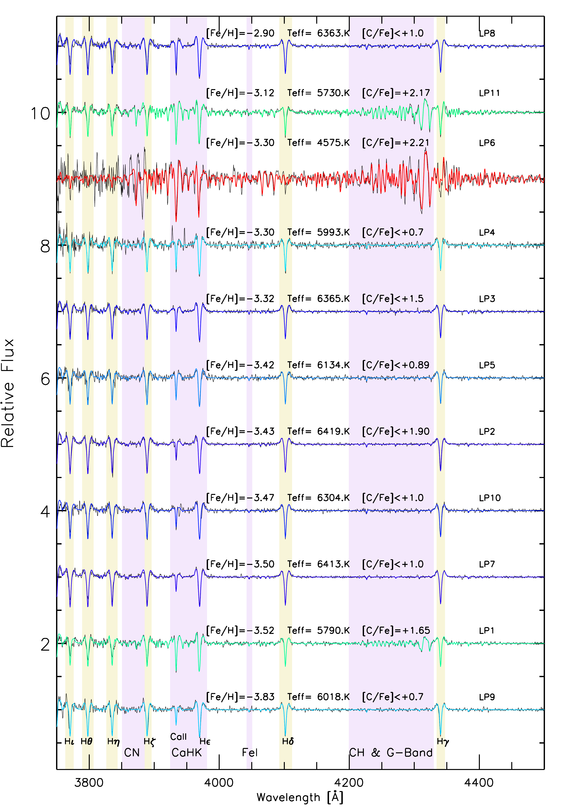
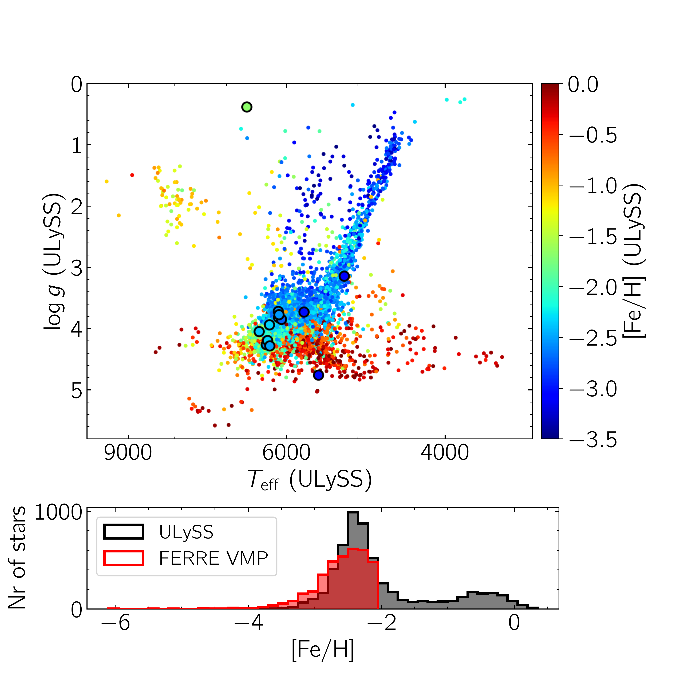
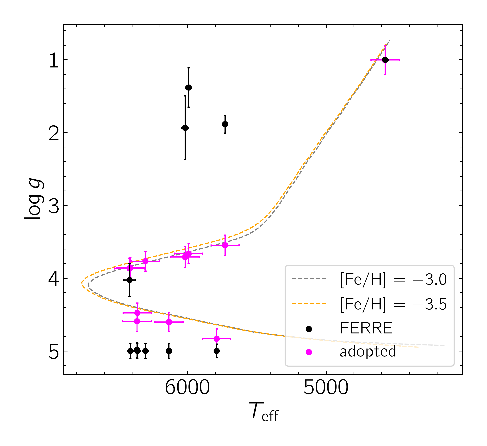

$\newcommand{\ensuremath}{}$
$\newcommand{\xspace}{}$
$\newcommand{\object}[1]{\texttt{#1}}$
$\newcommand{\farcs}{{.}''}$
$\newcommand{\farcm}{{.}'}$
$\newcommand{\arcsec}{''}$
$\newcommand{\arcmin}{'}$
$\newcommand{\ion}[2]{#1#2}$
$\newcommand{\textsc}[1]{\textrm{#1}}$
$\newcommand{\hl}[1]{\textrm{#1}}$
$\newcommand{\noteab}[1]{\hl{[AA: #1]}}$
$\newcommand{\rev}[1]{{\textbf{\color{magenta}#1}}}$
$\newcommand{\teff}{\ensuremath{T_{\mathrm{eff}}}\xspace}$
$\newcommand{\teffa}{\ensuremath{T_{\mathrm{eff,A}}}\xspace}$
$\newcommand{\kms}{\ensuremath{\rm{km} s^{-1}}\xspace}$
$\newcommand{\logg}{\ensuremath{\log g}\xspace}$
$\newcommand{\feh}{\rm{[Fe/H]}\xspace}$
$\newcommand{\cfe}{\rm{[C/Fe]}\xspace}$
$\newcommand{\nfe}{\rm{[N/Fe]}\xspace}$
$\newcommand{\ch}{\rm{[C/H]}\xspace}$
$\newcommand{\ac}{\rm{A(C)}\xspace}$
$\newcommand{\mgfe}{\rm{[Mg/Fe]}\xspace}$
$\newcommand{\alphafe}{\rm{[\ensuremath{\alpha}/Fe]}\xspace}$
$\newcommand{\Gaia}{\textit{Gaia}\xspace}$
$\newcommand{\CaHK}{\emph{CaHK}\xspace}$
$\newcommand{\Pristine}{\emph{Pristine}\xspace}$
$\newcommand{\FERRE}{{\tt FERRE}\xspace}$
$\newcommand{\ULySS}{{\tt ULySS}\xspace}$
$\newcommand{\AA}{\normalfont\r{A}\xspace}$
$\newcommand{\thebibliography}{\DeclareRobustCommand{\VAN}[3]{##3}\VANthebibliography}$
$\newcommand{\msun}{{\rm M_\odot}}$
$\newcommand{\eg}{{e.g., }}$
$\newcommand{\ie}{{i.e., }}$

$\newcommand{$\ensuremath$}{}$
$\newcommand{$\xspace$}{}$
$\newcommand{$\object$}[1]{\texttt{#1}}$
$\newcommand{$\farcs$}{{.}''}$
$\newcommand{$\farcm$}{{.}'}$
$\newcommand{$\arcsec$}{''}$
$\newcommand{$\arcmin$}{'}$
$\newcommand{$\ion$}[2]{#1#2}$
$\newcommand{$\textsc$}[1]{\textrm{#1}}$
$\newcommand{$\hl$}[1]{\textrm{#1}}$
$\newcommand{$\noteab$}[1]{$\hl${[AA: #1]}}$
$\newcommand{$\rev$}[1]{{\textbf{\color{magenta}#1}}}$
$\newcommand{$\teff$}{$\ensuremath${T_{\mathrm{eff}}}$\xspace$}$
$\newcommand{$\teff$a}{$\ensuremath${T_{\mathrm{eff,A}}}$\xspace$}$
$\newcommand{$\kms$}{$\ensuremath${\rm{km} s^{-1}}$\xspace$}$
$\newcommand{$\logg$}{$\ensuremath${\log g}$\xspace$}$
$\newcommand{$\feh$}{\rm{[Fe/H]}$\xspace$}$
$\newcommand{$\cfe$}{\rm{[C/Fe]}$\xspace$}$
$\newcommand{$\nfe$}{\rm{[N/Fe]}$\xspace$}$
$\newcommand{$\ch$}{\rm{[C/H]}$\xspace$}$
$\newcommand{$\ac$}{\rm{A(C)}$\xspace$}$
$\newcommand{$\mgfe$}{\rm{[Mg/Fe]}$\xspace$}$
$\newcommand{$\alphafe$}{\rm{[$\ensuremath${\alpha}/Fe]}$\xspace$}$
$\newcommand{$\Gaia$}{\textit{Gaia}$\xspace$}$
$\newcommand{$\CaHK$}{\emph{CaHK}$\xspace$}$
$\newcommand{$\Pristine$}{\emph{Pristine}$\xspace$}$
$\newcommand{$\FERRE$}{{\tt FERRE}$\xspace$}$
$\newcommand{$\ULySS$}{{\tt ULySS}$\xspace$}$
$\newcommand{$\AA$}{\normalfont\r{A}$\xspace$}$
$\newcommand{$\thebibliography$}{\DeclareRobustCommand{\VAN}[3]{##3}\VANthebibliography}$
$\newcommand{$\msun$}{{\rm M_\odot}}$
$\newcommand{$\eg$}{{e.g., }}$
$\newcommand{$\ie$}{{i.e., }}$

# The Pristine survey -- XX: GTC follow-up observations of extremely metal-poor stars identified from Pristine and LAMOST

<mark>Appeared on: 2023-01-09</mark> - _13 pages, accepted for publication in MNRAS_

Anke Arentsen, et al. -- incl., <mark><mark>Jonay I. González Hernández</mark></mark>

**Abstract:** Ultra metal-poor stars ($\feh < -4.0$) are very rare, and finding them is a challenging task. Both narrow-band photometry and low-resolution spectroscopy have been useful tools for identifying candidates, and in this work we combine both approaches.We cross-matched metallicity-sensitive photometry from the$\Pristine$survey with the low-resolution spectroscopic LAMOST database, and re-analysed all LAMOST spectra with$\feh_$\Pristine$<-2.5$. We find that$\sim$1/3rd of this sample (selected without$\feh_$\Pristine$$quality cuts) also have spectroscopic$\feh < -2.5$.From this sample, containing many low signal-to-noise (S/N) spectra, we selected eleven stars potentially having$\feh < -4.0$or$\feh < -3.0$with very high carbon abundances, and we performed higher S/N medium-resolution spectroscopic follow-up with OSIRIS on the 10.4m Gran Telescopio Canarias (GTC). We confirm their extremely low metallicities, with a mean of$\feh = -3.4$and the most metal-poor star having$\feh = -3.8$.Three of these are clearly carbon-enhanced metal-poor (CEMP) stars with$+1.65 < $\cfe$ < +2.45$.The two most carbon-rich stars are either among the most metal-poor CEMP-s stars or the most carbon-rich CEMP-no stars known, the third is likely a CEMP-no star.We derived orbital properties for the OSIRIS sample and find that only one of our targets can be confidently associated with known substructures/accretion events, and that three out of four inner halo stars have prograde orbits.Large spectroscopic surveys may contain many hidden extremely and ultra metal-poor stars, and adding additional information from e.g. photometry as in this work can uncover them more efficiently and confidently.

**Figure 5. -** OSIRIS/GTC spectra (3750 $\AA$-4500 $\AA$) of our stellar sample
(black line) and the best fits calculated with $\FERRE$, colour-coded by $\teff$(the bluer the hotter) and sorted by decreasing $\feh$. The Balmer lines (yellow) and main metallic absorption features (purple) are high-lighted. Above each spectrum the metallicity, effective temperature and carbonicity are displayed.  (*fig:osiris*)

**Figure 1. -** Top: Kiel diagram for all exposures of the 4900 unique $\Pristine$-selected stars in LAMOST analysed with $\ULySS$, colour-coded by metallicity. No quality cuts were applied to the photometric metallicities in the selection. The results for the eleven stars that were followed up with OSIRIS (see Section \ref{sec:osiris}) are highlighted with larger symbols (the two high and low $\logg$ outliers are CEMP stars). Bottom: $\ULySS$ metallicity histogram of the same sample in black, and $\FERRE$ metallicity histogram for the VMP sub-sample in red.  (*fig:ulyss*)

**Figure 2. -** Kiel diagram showing the pure FERRE stellar parameters (black) and the adopted stellar parameters and uncertainties (magenta). See the text for details. Also shown are Yonsei-Yale isochrones for two different metallicities (both with age = 12 Gyr, $\alphafe = +0.4$). (*fig:tefflogg*)

