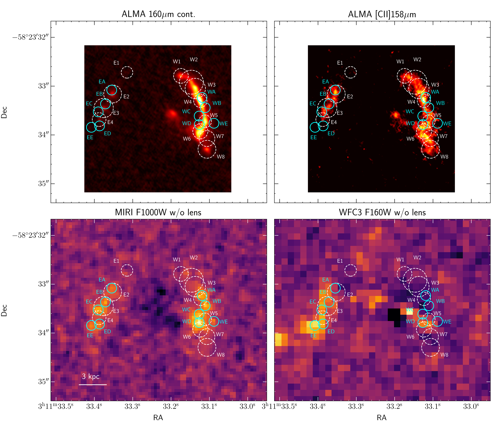
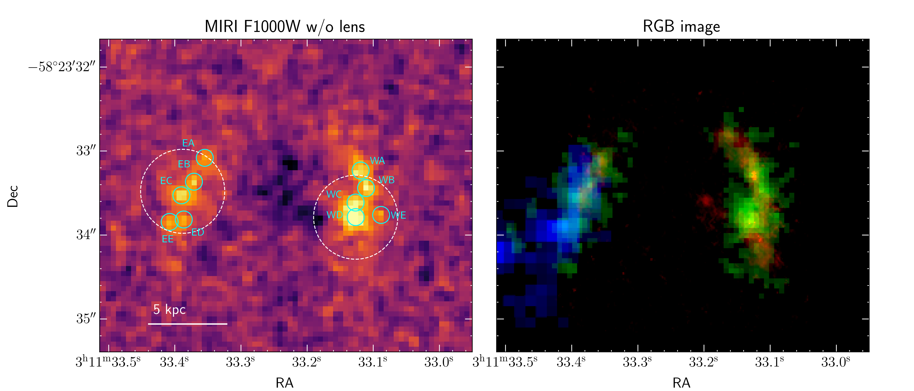
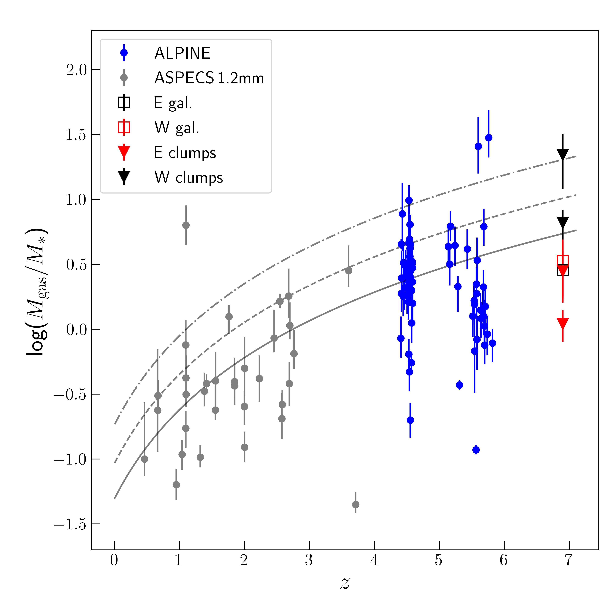

$\newcommand{\ensuremath}{}$
$\newcommand{\xspace}{}$
$\newcommand{\object}[1]{\texttt{#1}}$
$\newcommand{\farcs}{{.}''}$
$\newcommand{\farcm}{{.}'}$
$\newcommand{\arcsec}{''}$
$\newcommand{\arcmin}{'}$
$\newcommand{\ion}[2]{#1#2}$
$\newcommand{\textsc}[1]{\textrm{#1}}$
$\newcommand{\hl}[1]{\textrm{#1}}$
$\newcommand{\arcs}{\arcsec\xspace}$
$\newcommand{\CII}{[\ion{C}{II}]158\mum}$
$\newcommand{\oddpm}[2]{\raisebox{0.5ex}{\tiny\substack{+#1 \-#2}}}$

$\newcommand{\ensuremath}{}$
$\newcommand{\xspace}{}$
$\newcommand{\object}[1]{\texttt{#1}}$
$\newcommand{\farcs}{{.}''}$
$\newcommand{\farcm}{{.}'}$
$\newcommand{\arcsec}{''}$
$\newcommand{\arcmin}{'}$
$\newcommand{\ion}[2]{#1#2}$
$\newcommand{\textsc}[1]{\textrm{#1}}$
$\newcommand{\hl}[1]{\textrm{#1}}$
$\newcommand{\arcs}{\arcsec\xspace}$
$\newcommand{\CII}{[\ion{C}{II}]158\mum}$
$\newcommand{\oddpm}[2]{\raisebox{0.5ex}{\tiny\substack{+#1 \-#2}}}$

# MIRI/JWST observations reveal an extremely obscured starburst in the z=6.9 system SPT0311-58

<mark>Appeared on: 2023-01-05</mark> - _18 pages, 8 figures, final published version in A&A_

J. Álvarez-Márquez, et al. -- incl., <mark><mark>F. Walter</mark></mark>, <mark><mark>M. Güdel</mark></mark>

**Abstract:** Luminous infrared starbursts in the early Universe are thought to be the progenitors of massive quiescent galaxies identified at redshifts 2 to 4. Using the Mid-IRfrared Instrument (MIRI) on board the _James Webb Space Telescope_ (JWST), we present mid-infrared sub-arcsec imaging and spectroscopy of such a starburst: the slightly lensed hyper-luminous infrared system SPT0311-58 at $z$ =6.9. The MIRI IMager (MIRIM) and Medium Resolution Spectrometer (MRS) observations target the stellar (rest-frame 1.26 $\mu$ m emission) structure and ionised (Pa $\alpha$ and H $\alpha$ ) medium on kpc scales in the system. The MIRI observations are compared with existing ALMA far-infrared continuum and [ \ion{C}{II} ] 158 $\mu$ m imaging at a similar angular resolution. Even though the ALMA observations imply very high star formation rates (SFRs) in the eastern (E) and western (W) galaxies of the system, the H $\alpha$ line is, strikingly, not detected in our MRS observations. This fact, together with the detection of the ionised gas phase in Pa $\alpha$ , implies very high internal nebular extinction with lower limits ( $A_\mathrm{V}$ ) of 4.2 (E) and 3.9 mag (W) as well as even larger values (5.6 (E) and 10.0 (W)) by spectral energy distribution (SED) fitting analysis. The extinction-corrected Pa $\alpha$ lower limits of the SFRs are 383 and 230 M $_\mathrm{\odot}$ yr $^{-1}$ for the E and W galaxies, respectively. This represents 50 \% of the SFRs derived from the [ \ion{C}{II} ] 158 $\mu$ m line and infrared light for the E galaxy and as low as 6 \% for the W galaxy. The MIRIM observations reveal a clumpy stellar structure, with each clump having  3 to 5 $\times$ 10 $^{9}$ M $_\mathrm{\odot}$ mass in stars, leading to a total stellar mass of 2.0 and 1.5 $\times$ 10 $^{10}$ M $_\mathrm{\odot}$ for the E and W galaxies, respectively. The specific star formation (sSFR) in the stellar clumps ranges from 25 to 59 Gyr $^{-1},$ assuming a star formation with a 50-100 Myr constant rate. This sSFR is three to ten times larger than the values measured in galaxies of similar stellar mass at redshifts 6 to 8. Thus, SPT0311-58 clearly stands out as a starburst system when compared with typical massive star-forming galaxies at similar high redshifts. The overall gas mass fraction is $M_\mathrm{gas}$ / $M_*\sim 3$ , similar to that of $z$ $\sim$ 4.5-6 star-forming galaxies, suggesting a flattening of the gas mass fraction in massive starbursts up to redshift 7. The kinematics of the ionised gas in the E galaxy agrees with the known [ \ion{C}{II} ] gas kinematics, indicating a physical association between the ionised gas and the cold ionised or neutral gas clumps. The situation in the W galaxy is more complex, as it appears to be a velocity offset by about +700 km s $^{-1}$ in the Pa $\alpha$ relative to the [ \ion{C}{II} ] emitting gas. The nature of this offset and its reality are not fully established and require further investigation. The observed properties of SPT0311-58, such as the clumpy distribution at sub(kpc) scales and the very high average extinction, are similar to those observed in low- and intermediate- $z$ luminous (E galaxy) and ultra-luminous (W galaxy) infrared galaxies, even though SPT0311-58 is observed only $\sim$ 800 Myr after the Big Bang. Such massive, heavily obscured clumpy starburst systems as SPT0311-58 likely represent the early phases in the formation of a massive high-redshift bulge, spheroids and/or luminous quasars. This study demonstrates that MIRI and JWST are, for the first time, able to explore the rest-frame near-infrared stellar and ionised gas structure of these galaxies, even during the Epoch of Reionization.

**Figure 6. -** Spatial distribution of ALMA and MIRI clumps. From left to right, ALMA rest-frame 160$\mu$m continuum, ALMA [$\ion${C}{II}]158 $\mu$m, MIRI/F1000W, and WFC3/F160W images of SPT0311-58. The MIRI and HST images have been subtracted from the lensing galaxy (see $\S$\ref{sec:3.1.}). White dashed circles display the apertures used to extract the photometry centred on ALMA continuum clumps and defined by  ([Spilker, et. al (2022)](https://ui.adsabs.harvard.edu/abs/2022ApJ...929L...3S)) . Cyan circles mark the clumps derived in this work from the F1000W image. (*fig:im_and_apertures*)

**Figure 3. -** Imaging of the SPT0311-58 system. Left panel: MIRI F1000W image of SPT0311-58 system after removal of lensing galaxy. Cyan circles mark the position of the individual F1000W clumps, while white circles shows the MRS apertures used for the extraction of the Pa$\alpha$ spectra (see Sect. \ref{sec:3.3.}). Right panel: RGB image where red, green, and blue colours show the ALMA $\CII$ , MIRIM F1000W, and WPFC3 F160W lens-subtracted images representing the [$\ion${C}{II}], rest-frame 1.25$\mu$m, and rest-frame 200nm continuum, respectively (see Sect. \ref{sec:2.}). (*fig:MRS_app*)

**Figure 1. -** Gas fraction vs redshift. This figure shows the evolution of the gas mass fraction (i.e. $M_\mathrm{gas}/M_\mathrm{*}$) with the redshift. Black and red triangles represent the values derived for the E and W SPT0311-058 clumps, respectively, presented in Table \ref{tab:Mass_CII_reg}. Red and black empty squares display the $M_\mathrm{gas}/M_\mathrm{*}$ ratio obtained using the gas mass derived by  ([Marrone, et. al (2018)](https://ui.adsabs.harvard.edu/abs/2018Natur.553...51M))  and the stellar masses computed in this work via SED fitting (see Sec. \ref{sec:4.1.}) for the E and W galaxies, respectively. For comparison, galaxies at intermediate redshifts ($z\sim$1$-$3) from the ASPECS 1.2mm sample presented in  ([Aravena, et. al 2020](https://ui.adsabs.harvard.edu/abs/2020ApJ...901...79A))  are included. The higher redshift range ($z\sim$4.4$-$6) is covered with the ALPINE sample, for which we calculate the gas mass following the $L_\mathrm{CII}-M_\mathrm{gas}$ relation introduced by  ([Zanella, et. al (2018)](https://ui.adsabs.harvard.edu/abs/2018MNRAS.481.1976Z)) . The black continuum, dashed, and dashed–dotted lines show the gas fraction evolution following  ([Liu, et. al (2019)](https://ui.adsabs.harvard.edu/abs/2019ApJ...887..235L))  for a galaxy with a stellar mass of $M_*$=5$\times$10$^{10}$ M$_\odot$ and an SFR that is one, three, and ten times the one expected for the SFR main sequence, respectively. (*fig:frac_gas*)

