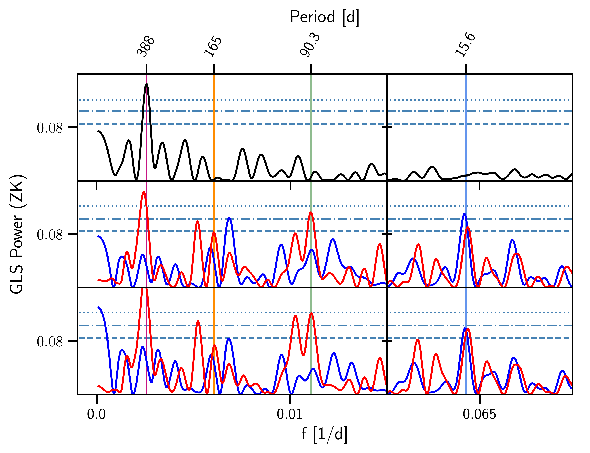

$\newcommand{\ensuremath}{}$
$\newcommand{\xspace}{}$
$\newcommand{\object}[1]{\texttt{#1}}$
$\newcommand{\farcs}{{.}''}$
$\newcommand{\farcm}{{.}'}$
$\newcommand{\arcsec}{''}$
$\newcommand{\arcmin}{'}$
$\newcommand{\ion}[2]{#1#2}$
$\newcommand{\textsc}[1]{\textrm{#1}}$
$\newcommand{\hl}[1]{\textrm{#1}}$
$\newcommand{\au}{au}$
$\newcommand{\juliet}{\texttt{juliet}}$
$\newcommand{\serval}{\texttt{serval}}$
$\newcommand{\raccoon}{\texttt{raccoon}}$
$\newcommand{\exostriker}{\texttt{Exo-Striker}}$
$\newcommand{\aliasfinder}{\texttt{AliasFinder}}$
$\newcommand{\tess}{TESS}$
$\newcommand{\gaia}{\textit{Gaia}}$
$\newcommand{\jwst}{JWST}$
$\newcommand{\wolf}{Wolf~1069}$
$\newcommand{\inst}[1]{\unskip^{\instrefs{#1}}}$
$\newcommand{\ms}{m s^{-1}}$
$\newcommand{\mearth}{M_\oplus}$
$\newcommand{\rearth}{R_\oplus}$
$\newcommand{\prot}{169.3^{+3.7}_{-3.6}}$
$\newcommand{\scsep}{\newcommand{\}{scsep}{,}}$
$\newcommand{\}{scsep}$

$\newcommand{$\ensuremath$}{}$
$\newcommand{$\xspace$}{}$
$\newcommand{$\object$}[1]{\texttt{#1}}$
$\newcommand{$\farcs$}{{.}''}$
$\newcommand{$\farcm$}{{.}'}$
$\newcommand{$\arcsec$}{''}$
$\newcommand{$\arcmin$}{'}$
$\newcommand{$\ion$}[2]{#1#2}$
$\newcommand{$\textsc$}[1]{\textrm{#1}}$
$\newcommand{$\hl$}[1]{\textrm{#1}}$
$\newcommand{$\au$}{au}$
$\newcommand{$\juliet$}{\texttt{juliet}}$
$\newcommand{$\serval$}{\texttt{serval}}$
$\newcommand{$\raccoon$}{\texttt{raccoon}}$
$\newcommand{$\exostriker$}{\texttt{Exo-Striker}}$
$\newcommand{$\aliasfinder$}{\texttt{AliasFinder}}$
$\newcommand{$\tess$}{TESS}$
$\newcommand{$\gaia$}{\textit{Gaia}}$
$\newcommand{$\jwst$}{JWST}$
$\newcommand{$\wolf$}{Wolf~1069}$
$\newcommand{$\inst$}[1]{\unskip^{$\inst$refs{#1}}}$
$\newcommand{$\ms$}{m s^{-1}}$
$\newcommand{$\mearth$}{M_\oplus}$
$\newcommand{$\rearth$}{R_\oplus}$
$\newcommand{$\prot$}{169.3^{+3.7}_{-3.6}}$
$\newcommand{\scsep}{\newcommand{\}{scsep}{,}}$
$\newcommand{\}{scsep}$

# The CARMENES search for exoplanets around M dwarfs

<mark>Appeared on: 2023-01-09</mark> - _26 pages, 15 figures_

<mark><mark>D. Kossakowski</mark></mark>, et al. -- incl., <mark><mark>M. Kürster</mark></mark>, <mark><mark>T. Trifonov</mark></mark>, <mark><mark>Th. Henning</mark></mark>, <mark><mark>R. Burn</mark></mark>, <mark><mark>E. Herrero</mark></mark>, <mark><mark>A. Pavlov</mark></mark>, <mark><mark>M. Pérez-Torres</mark></mark>

**Abstract:** We present the discovery of an Earth-mass planet ($M_\textnormal{b}\sin i = 1.36\pm0.21 M_\oplus$) on a\num{15.6}d orbit of a relatively nearby ($d \sim$9.6 pc) and low-mass ($0.167 \pm 0.011 M_\odot$) M5.0 V star,$\wolf$. Sitting at a separation of$0.0672\pm0.0014$\auaway from the host star puts$\wolf$b in the habitable zone (HZ), receiving an incident flux of$S = 0.652\pm 0.029 S_\oplus$.The planetary signal was detected using telluric-corrected radial-velocity (RV) data from the CARMENES spectrograph, amounting to a total of 262 spectroscopic observations covering almost four years. There are additional long-period signals in the RVs, one of which we attribute to the stellar rotation period. This is possible thanks to our photometric analysis including new, well-sampled monitoring campaigns undergone with the OSN and TJO facilities that supplement archival photometry (i.e., from MEarth and SuperWASP), and this yielded an updated rotational period range of$P_\textnormal{rot} = 150-170$d, with a likely value at$\prot$d. The stellar activity indicators provided by the CARMENES spectra likewise demonstrate evidence for the slow rotation period, though not as accurately due to possible factors such as signal aliasing or spot evolution.Our detectability limits indicate that additional planets more massive than one Earth mass with orbital periods of less than 10 days can be ruled out, suggesting that perhaps$\wolf$b had a violent formation history. This planet is also the sixth closest Earth-mass planet situated in the conservative HZ, after$\object${Proxima Centauri}b,$\object${GJ 1061}d,$\object${Teegarden's Star}c, and$\object${GJ 1002}b and c. Despite not transiting,$\wolf$b is nonetheless a very promising target for future three-dimensional climate models to investigate various habitability cases as well as for sub-$\ms$RV campaigns to search for potential inner sub-Earth-mass planets in order to test planet formation theories.

**Figure 10. -** GLS periodograms for the RVs of $\wolf$ after sequentially subtracting out the most prominent signals. The horizontal dashed, dot-dashed, and dotted lines represent the 10 \%, 1 \%, and 0.1 \% FAP levels (from bottom to top). There were no significant signals with periods shorter than 10 d other than the aliases due to the daily sampling. The right panel is a closer zoom-in of the left panel to highlight the longer-period signals.
    The 15.6 d planetary signal is illustrated with a vertical blue solid line, and the 90.3 d signal and its alias due to the 270-d sampling with a green solid and dashed line, respectively. The range for the photometric rotation period is shaded in orange, where the stellar rotation period within the RVs is marked with an orange solid line.
    The component of residual telluric contamination at 388 d and its alias due to the 365-d sampling period are also represented with a vertical magenta solid and dashed line, respectively.
    Panel (a): the window function of the data set. Panel (b): no signal fitted, solely the original RVs with an offset and jitter term. Panel (c): residuals after subtracting the 15.6 d signal. Panel (d): residuals after subtracting a simultaneous model fit of two sinusoids at 15.6 d and 90.3 d. Panel (e): residuals after subtracting a simultaneous model fit of three sinusoids at 15.6 d, 90.3 d, and 165 d. Panel (f): residuals after subtracting the final model choice including 1 Keplerian at 15.6 d (further described in Sect. \ref{sec:modelcomparison}).
     (*fig:rvperiodogram*)

**Figure 1. -** GLS periodograms of the telluric-only (nonTC subtracted from TC; \textit{top}), nonTC (\textit{middle}) and TC (\textit{bottom}) RVs. The red and blue colors represent the "blue" and "red" subsets within the VIS channel of the CARMENES instrument (Sect. \ref{sec:90dsignal}). The vertical lines match those in Fig. \ref{fig:rvperiodogram} for consistency and the horizontal lines are identical in the bottom panels but differ slightly from the top panel.
     (*fig:redblue*)

**Figure 7. -** RV time series for and phase-folded RVs for $\wolf$ b
RV time series and phase-folded plots for $\wolf$ b.
\textit{Top panel:} CARMENES VIS RV measurements for $\wolf$  along with the best-fit model (dark gray line) and the stellar rotation period modeled by a dSHO-GP (orange). The light gray band indicates the 68\% confidence interval of the model. \textit{Bottom panel:} RVs phase-folded to the period of $\wolf$ b at 15.6 d ($K_{\rm b} = 1.07\pm0.17$\ms) and with the GP component subtracted out. The black circles represent the data points binned to 0.1 in phase space for visualization purposes. The bottom panel for each plot represents the residuals after subtracting out the model. There are two data points that did not fit within the boundary for visual reasons. (*fig:rv*)

