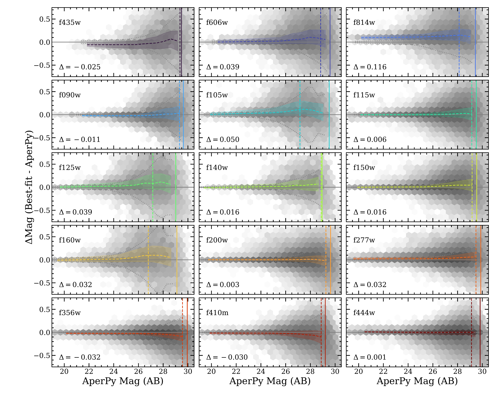
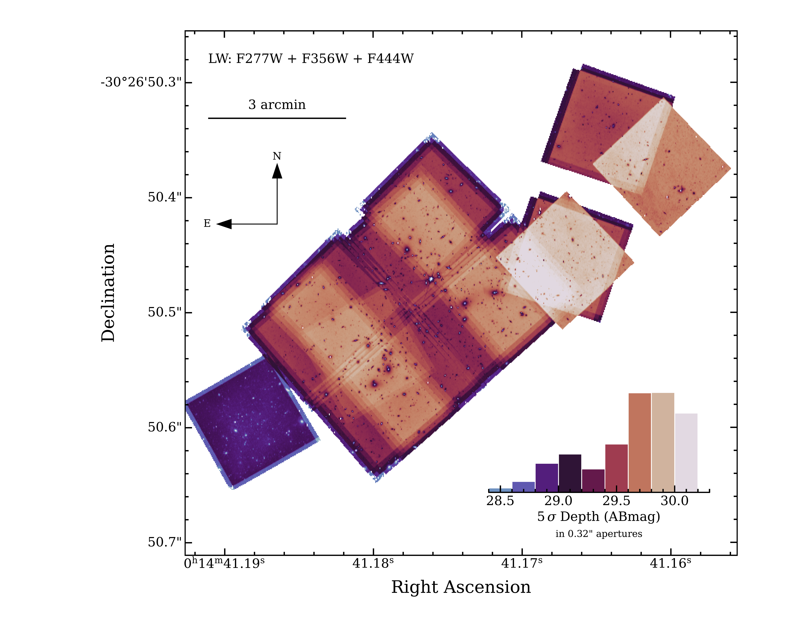
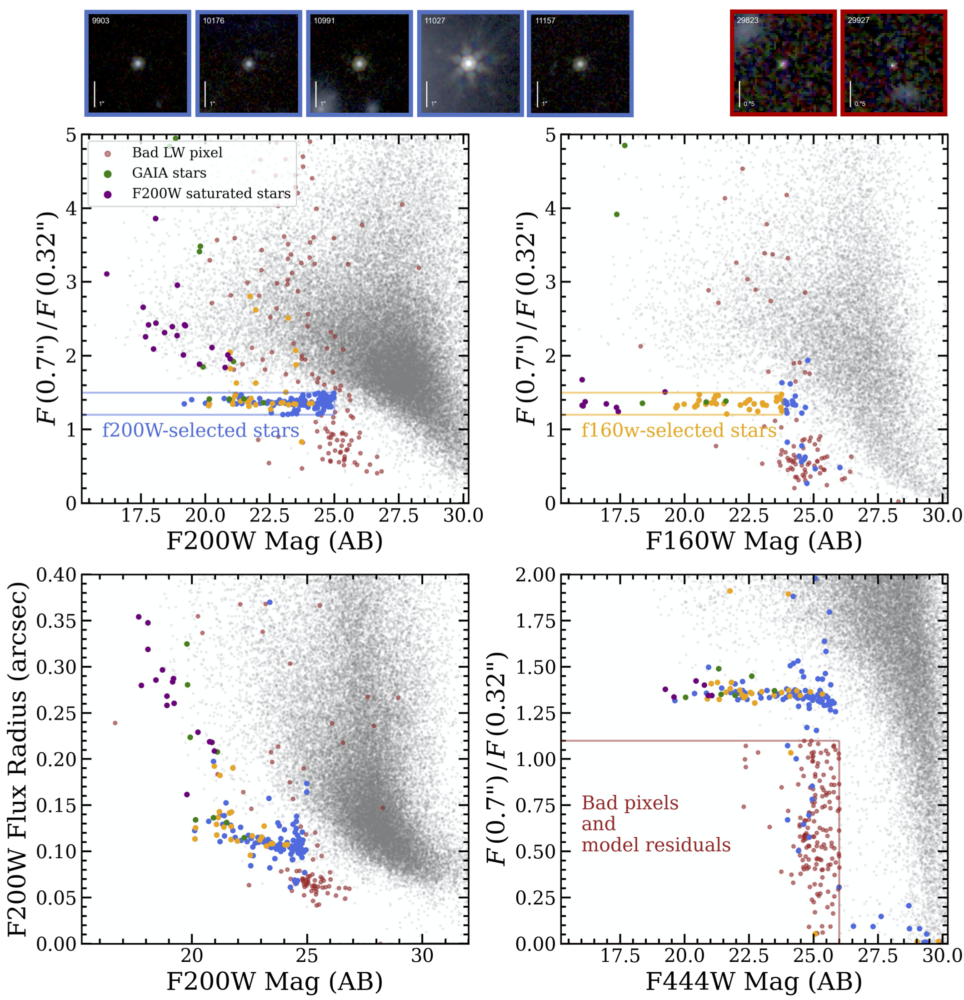

$\newcommand{\ensuremath}{}$
$\newcommand{\xspace}{}$
$\newcommand{\object}[1]{\texttt{#1}}$
$\newcommand{\farcs}{{.}''}$
$\newcommand{\farcm}{{.}'}$
$\newcommand{\arcsec}{''}$
$\newcommand{\arcmin}{'}$
$\newcommand{\ion}[2]{#1#2}$
$\newcommand{\textsc}[1]{\textrm{#1}}$
$\newcommand{\hl}[1]{\textrm{#1}}$
$\newcommand{\vdag}{(v)^\dagger}$
$\newcommand$
$\newcommand$
$\newcommand$
$\newcommand$
$\newcommand$
$\newcommand$
$\newcommand$
$\newcommand{\arraystretch}{1.2}$
$\newcommand{\arraystretch}{1}$
$\newcommand{\arraystretch}{0.9}$

$\newcommand{$\ensuremath$}{}$
$\newcommand{$\xspace$}{}$
$\newcommand{$\object$}[1]{\texttt{#1}}$
$\newcommand{$\farcs$}{{.}''}$
$\newcommand{$\farcm$}{{.}'}$
$\newcommand{$\arcsec$}{''}$
$\newcommand{$\arcmin$}{'}$
$\newcommand{$\ion$}[2]{#1#2}$
$\newcommand{$\textsc$}[1]{\textrm{#1}}$
$\newcommand{$\hl$}[1]{\textrm{#1}}$
$\newcommand{$\vdag$}{(v)^\dagger}$
$\newcommand$
$\newcommand$
$\newcommand$
$\newcommand$
$\newcommand$
$\newcommand$
$\newcommand$
$\newcommand{$\arraystretch$}{1.2}$
$\newcommand{$\arraystretch$}{1}$
$\newcommand{$\arraystretch$}{0.9}$

# 

<mark>Appeared on: 2023-01-10</mark> - _27 pages, 19 figures, submitted to ApJS. Comments welcome!_

John R. Weaver, et al. -- incl., <mark>Natascha Förster Schreiber</mark>, <mark>Anna de Graaff</mark>, <mark>Jenny E. Greene</mark>

**Abstract:** In November 2022, the\textit{James Webb Space Telescope}(\JWST) returned deep near-infrared images of Abell 2744 -- a powerful lensing cluster capable of magnifying distant, incipient galaxies beyond it. Together with the existing\textit{Hubble Space Telescope}(\HST) imaging, this publicly available dataset opens a fundamentally new discovery space to understand the remaining mysteries of the formation and evolution of galaxies across cosmic time. In this work, we detect and measure some 50,000 objects across the 45 arcmin$^2$\JWSTfootprint down to a$5 \sigma$limiting magnitude of$\sim$29.9 mag in 0.32$\arcsec$apertures. Photometry is performed using circular apertures on images matched to the point spread function of the reddest NIRCam band, F444W, and cleaned of bright cluster galaxies and the related intra-cluster light. To give an impression of the photometric performance, we measure photometric redshifts and achieve a$\sigma_{\rm NMAD}\approx0.03$based on known, but relatively small, spectroscopic samples. With this paper, we publicly release\HSTand\JWSTPSF-matched photometric catalogs optimized for bright and extended sources (0.7$\arcsec$apertures) and compact and faint sources (0.32$\arcsec$apertures) along with basic photometric redshifts, rest-frame colors, and individual magnification estimates.These catalogs will set the stage for efficient and deep spectroscopic follow-up of the first\JWST-selected samples in Summer 2023.

**Figure 13. -** Photometry measured by AperPy in this work compared against predicted fluxes from the best-fit SED  from \eazy  in all 15 available bands. In each panel, the difference in AB magnitude  ($\Delta$ Mag) as a function of magnitude measured by AperPy is summarized by the log$_{10}$-scaled 2D grey density histogram. Colored curves indicate binned medians with two-sided envelopes enclosing 68\% of sources per bin. The overall median offset is labeled on each panel computed on all magnitudes up to the magnitude limit of the deepest 10\% of the corresponding image indicated by the colored solid vertical line; that of the median depth is indicated by the colored dashed vertical line. The typical photometric error derived by AperPy is indicated by the dotted grey curves.
     (*fig:dmag_model*)

**Figure 9. -** Schematic of depth variation across the noise-equalized LW coadd detection image aggregated from the DDT, GLASS, and UNCOVER programs. Combining F277W, F356W, and F444W, the 5 $\sigma$ depths in our LW detection band measured in 0.32$\arcsec$ apertures span $27-29$ mag. Poisson contributions of the brightest objects feature prominently in our \JWST weight maps. (*fig:detection_depths*)

**Figure 11. -** The selection of stars and spurious objects (bad pixels or model residuals) are determined from the flux ratio in large to small apertures above a limiting magnitude threshold. Stars that are unsaturated in \JWST are selected from the native resolution F200W image (blue), and co-added with \HST/F160W selected stars (yellow) and known GAIA stars (green). The LW images suffer from additional bad pixels and sources with contaminated photometry due to bad model residuals that are flagged (red).  Together, the bottom left panel shows that these flagged sources are well separated from the general galaxy population, with smaller values of F200W flux radius for a given magnitude.  Examples of point source postage stamps and bad pixels are shown at the top (left and right, respectively).  (*fig:badflag*)

