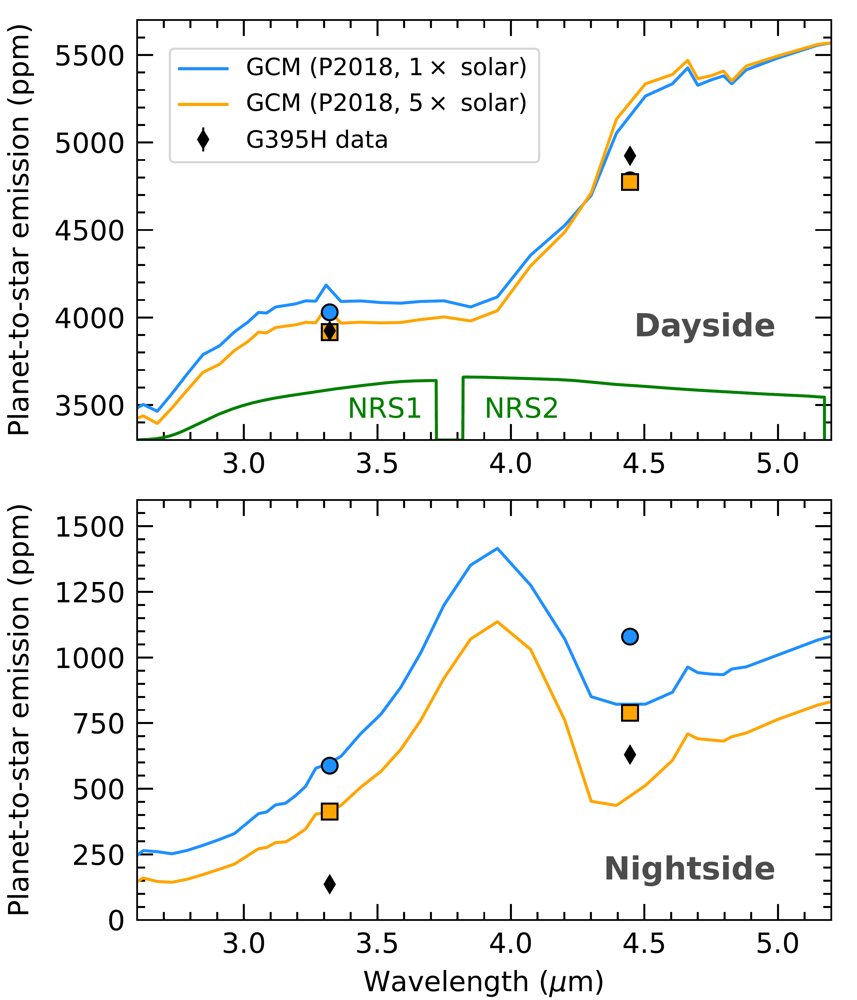
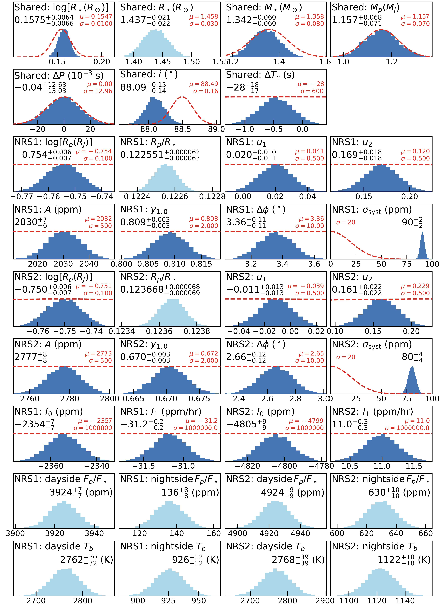
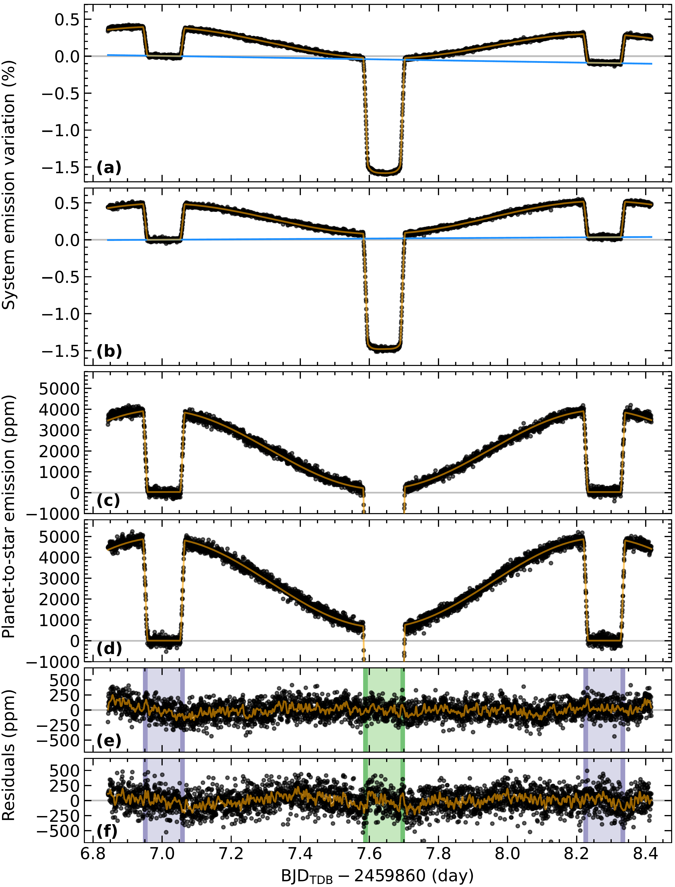

$\newcommand{\ensuremath}{}$
$\newcommand{\xspace}{}$
$\newcommand{\object}[1]{\texttt{#1}}$
$\newcommand{\farcs}{{.}''}$
$\newcommand{\farcm}{{.}'}$
$\newcommand{\arcsec}{''}$
$\newcommand{\arcmin}{'}$
$\newcommand{\ion}[2]{#1#2}$
$\newcommand{\textsc}[1]{\textrm{#1}}$
$\newcommand{\hl}[1]{\textrm{#1}}$
$\newcommand{\vdag}{(v)^\dagger}$
$\newcommand$
$\newcommand$
$\newcommand{\um}{\mu\textnormal{m}}$

$\newcommand{\ensuremath}{}$
$\newcommand{\xspace}{}$
$\newcommand{\object}[1]{\texttt{#1}}$
$\newcommand{\farcs}{{.}''}$
$\newcommand{\farcm}{{.}'}$
$\newcommand{\arcsec}{''}$
$\newcommand{\arcmin}{'}$
$\newcommand{\ion}[2]{#1#2}$
$\newcommand{\textsc}[1]{\textrm{#1}}$
$\newcommand{\hl}[1]{\textrm{#1}}$
$\newcommand{\vdag}{(v)^\dagger}$
$\newcommand$
$\newcommand$
$\newcommand{\um}{\mu\textnormal{m}}$

# A _JWST_ NIRSpec Phase Curve for WASP-121b: Dayside Emission Strongest Eastward of the Substellar Point and Nightside Conditions Conducive to Cloud Formation

<mark>Appeared on: 2023-01-09</mark> - _Accepted for publication in Astrophysical Journal Letters on December 29, 2022_

<mark>Thomas Mikal-Evans</mark>, et al. -- incl., <mark>Jayesh M. Goyal</mark>, <mark>Nikole K. Lewis</mark>, <mark>Duncan A. Christie</mark>

**Abstract:** We present the first exoplanet phase curve measurement made with the _JWST_ NIRSpec instrument, highlighting the exceptional stability of this newly commissioned observatory for exoplanet climate studies. The target, WASP-121b, is an ultrahot Jupiter with an orbital period of 30.6 hr. We analyze two broadband light curves generated for the NRS1 and NRS2 detectors, covering wavelength ranges of 2.70-3.72 $ \um$ and 3.82-5.15 $ \um$ , respectively. Both light curves exhibit minimal systematics, with approximately linear drifts in the baseline flux level of 30 ppm/hr (NRS1) and 10 ppm/hr (NRS2). Assuming a simple brightness map for the planet described by a low-order spherical harmonic dipole, our light curve fits suggest that the phase curve peaks coincide with orbital phases $3.36 \pm 0.11 ^\circ$ (NRS1) and $2.66 \pm 0.12 ^\circ$ (NRS2) prior to mid-eclipse. This is consistent with the strongest dayside emission emanating from eastward of the substellar point. We measure planet-to-star emission ratios of $3,924 \pm 7  $ ppm (NRS1) and $4,924 \pm 9  $ ppm (NRS2) for the dayside hemisphere, and $136 \pm 8  $ ppm (NRS1) and $630 \pm 10  $ ppm (NRS2) for the nightside hemisphere. The latter nightside emission ratios translate to planetary brightness temperatures of $926 \pm 12  $ K (NRS1) and $1,122 \pm 10  $ K (NRS2), which are low enough for a wide range of refractory condensates to form, including enstatite and forsterite. A nightside cloud deck may be blocking emission from deeper, hotter layers of the atmosphere, potentially helping to explain why cloud-free 3D general circulation model simulations systematically overpredict the nightside emission for WASP-121b.

**Figure 2. -** Black diamonds show the measured dayside (top panel) and nightside (bottom panel) planet-to-star emission levels. _Note that the measurement uncertainties are smaller than the diamond symbols._ Predictions from the cloud-free 3D GCM simulations of \citet{2018A&A...617A.110P} are also shown for heavy element enrichments of $1\times$ solar (blue lines) and $5\times$ solar (orange lines). Circle and square symbols show, respectively, the $1\times$ and $5\times$ solar GCM predictions binned to the light curve passbands, which are shown as green lines in the top panel.  (*fig:emission*)

**Figure 4. -** Dark blue histograms show posterior distributions for model parameters that were varied in the light curve fitting. Light blue histograms show corresponding distributions for other parameters that were subsequently derived. Posterior medians and $\pm 34$\% credible intervals are listed in black font. Red dashed lines show the priors. For the normal priors, the mean $\mu$ and standard deviation $\sigma$ are listed in red font. Half-normal priors were adopted for the $\sigma_{\rm{syst}}$ parameters, allowing only positive values and with scale $\sigma$ listed in red font. Vertical axes are not labeled, as arbitrary normalizations have been applied to all plotted distributions.  (*fig:pars*)

**Figure 3. -** _Panels (a) and (b):_ Raw broadband light curves for the NRS1 and NRS2 detectors, respectively. Orange lines show the best-fit light curve models. Blue lines show the corresponding instrument baseline trends. Gray horizontal lines are calibrated to the bottom of the first eclipse, to highlight the instrumental drift over the course of the observation. _Panels (c) and (d):_ The same light curves focusing on the planetary emission signal and after correcting for the instrument baseline trends shown by the blue lines in panels (a) and (b). _Panels (e) and (f):_ Black points show the residuals between the data and best-fit models for the NRS1 and NRS2 detectors, respectively. Orange lines show the residuals after applying a Gaussian filter to smooth the random noise. Green and purple shading show the times of transit and eclipse, respectively, with darker ranges corresponding to ingress and egress times.  (*fig:lc*)

