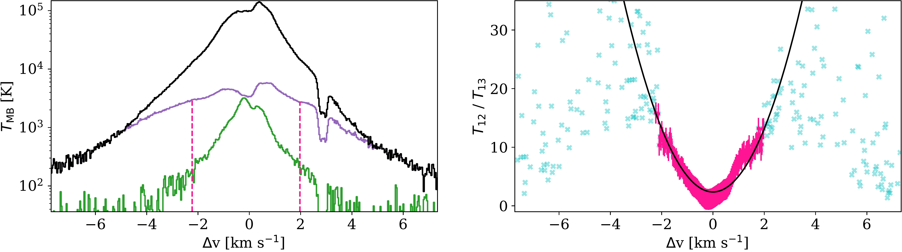
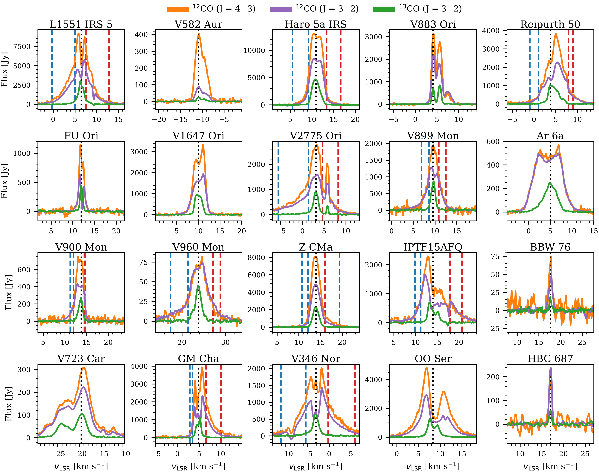
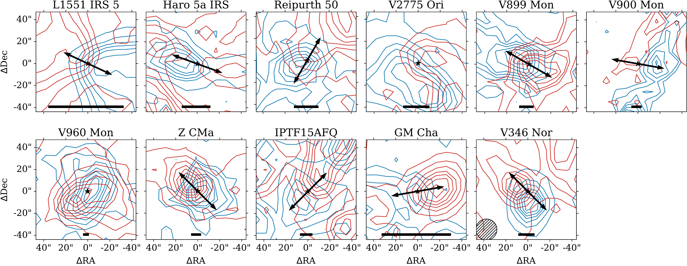

$\newcommand{\ensuremath}{}$
$\newcommand{\xspace}{}$
$\newcommand{\object}[1]{\texttt{#1}}$
$\newcommand{\farcs}{{.}''}$
$\newcommand{\farcm}{{.}'}$
$\newcommand{\arcsec}{''}$
$\newcommand{\arcmin}{'}$
$\newcommand{\ion}[2]{#1#2}$
$\newcommand{\textsc}[1]{\textrm{#1}}$
$\newcommand{\hl}[1]{\textrm{#1}}$
$\newcommand{\kms}[1]{\SI[mode=text]{#1}{\kilo\meter\per\second}}$
$\newcommand{\ghz}[1]{\SI{#1}{\giga\hertz}}$
$\newcommand{\au}{\si{\astronomicalunit}}$
$\newcommand{\sci}[2]{\ensuremath{#1\times10^{#2}}}$
$\newcommand{\sectionautorefname}{Section}$

$\newcommand{$\ensuremath$}{}$
$\newcommand{$\xspace$}{}$
$\newcommand{$\object$}[1]{\texttt{#1}}$
$\newcommand{$\farcs$}{{.}''}$
$\newcommand{$\farcm$}{{.}'}$
$\newcommand{$\arcsec$}{''}$
$\newcommand{$\arcmin$}{'}$
$\newcommand{$\ion$}[2]{#1#2}$
$\newcommand{$\textsc$}[1]{\textrm{#1}}$
$\newcommand{$\hl$}[1]{\textrm{#1}}$
$\newcommand{$\kms$}[1]{\SI[mode=text]{#1}{\kilo\meter\per\second}}$
$\newcommand{$\ghz$}[1]{\SI{#1}{\giga\hertz}}$
$\newcommand{$\au$}{\si{\astronomicalunit}}$
$\newcommand{$\sci$}[2]{$\ensuremath${#1\times10^{#2}}}$
$\newcommand{$\sectionautorefname$}{Section}$

# An APEX study of molecular outflows in FUor-type stars

<mark>Appeared on: 2023-01-10</mark> - _Accepted for publication in ApJ. 29 pages, 8 tables, 10 figures, 2 figuresets_

Fernando Cruz-S\'aenz de Miera, et al. -- incl., <mark>Thomas Henning</mark>

**Abstract:** FU Orionis-type objects (FUors) are low-mass pre-main-sequence objects which go through a short-lived phase ($\sim$100 years) of increased mass accretion rate (from 10$^{-8}$to 10$^{-4}$M$_\odot$yr$^{-1}$).These eruptive young stars are in the early stages of stellar evolution and, thus, still deeply embedded in a massive envelope that feeds material to the circumstellar disk that is then accreted onto the star.Some FUors drive molecular outflows, i.e. low-velocity wide-angle magneto-hydrodynamical winds, that inject energy and momentum back to the surrounding envelopes, and help clear the material surrounding the young star.Here we present a$^{12}$CO (3--2),$^{13}$CO (3--2) and$^{12}$CO (4--3) survey of 20 FUor-type eruptive young stars observed with APEX\@.We use our$^{13}$CO (3--2) observations to measure the masses of the envelopes surrounding each FUor and find an agreement with the FUor evolutionary trend found from the\SI{10}{\micro\meter}silicate feature.We find outflows in 11 FUors, calculate their masses and other kinematic properties, and compare these with those of outflows found around quiescent young stellar objects gathered from the literature.This comparison indicates that outflows in FUors are more massive than outflows in quiescent sources, and that FUor outflows have a higher ratio outflow mass with respect to the envelope than the quiescent sample, indicating that the eruptive young stars have lower star-forming efficiencies.Finally, we found that the outflow forces in FUors are similar to those of quiescent young stellar objects, indicating that their accretion histories are similar or that the FUor outflows have lower velocities.

**Figure 12. -** Optical depth correction for L1551 IRS 5.
  In the left panel we show the line profiles, where the green, purple and black colors represent the $^{13}$CO, the observed $^{12}$CO and the corrected $^{12}$CO, respectively, and the vertical dashed lines indicate the rage of velocities used in the parabola fit.
  The right panel shows the ratio of main beam temperatures (T$_\mathrm{MB}$), where the light blue crosses are all the values of the ratio for each velocity channel, in pink dots with errorbars are the points used in the parabolic fitting, and the black line is the resulting best-fitted parabola. The complete figure set (10 images) is available in the online journal.\label{fig:correction_l1551irs5} (*fig:correction_l1551irs5*)

**Figure 6. -** CO line profiles of our targets observed with APEX\@. The vertical dotted line is the systemic velocity. The vertical dashed lines are the range of velocities of the CO (3--2) outflows. The line profiles have been smoothed for presentation purposes.\label{fig:spectra} (*fig:spectra*)

**Figure 7. -** The red and blue contours show redshifted and blueshifted CO (J=3--2) emission integrated in the velocity ranges indicated in $\au$toref{fig:spectra}.
The star symbols mark the stellar position as given in $\au$toref{tab:values}.
The hatched circle in the bottom right frame is the APEX beam size and the arrows indicate the orientation of the outflow.
In the cases of V2775 Ori and V960 Mon, the outflow appears to be expanding in the direction of the line of sight.
For L1551 IRS 5, the blueshifted contours are 3, 13, 24, 35, 45, 56, 67 and 78$\upsigma$ for $\upsigma$=\SI{0.38}{\kelvin\kilo\meter\per\second} while the redshifted contours are 3, 18, 33, 48, 63, 78, 93 and 109$\upsigma$ for $\upsigma$=\SI{0.33}{\kelvin\kilo\meter\per\second}.
For Haro 5a IRS, the blueshifted contours are 3, 7, 12, 16, 21, 25, 30 and 35$\upsigma$ for $\upsigma$=\SI{0.61}{\kelvin\kilo\meter\per\second} while the redshifted contours are 3, 6, 10, 14, 18, 22, 26 and 30$\upsigma$ for $\upsigma$=\SI{0.48}{\kelvin\kilo\meter\per\second}.
For Reipurth 50, the blueshifted contours are 3, 5, 7, 9, 11, 13, 15 and 17$\upsigma$ for $\upsigma$=\SI{0.48}{\kelvin\kilo\meter\per\second} while the redshifted contours are 3, 6, 10, 14, 17, 21, 25 and 29$\upsigma$ for $\upsigma$=\SI{0.43}{\kelvin\kilo\meter\per\second}.
For V2775 Ori, the blueshifted contours are 3, 12, 22, 31, 41, 50, 60 and 70$\upsigma$ for $\upsigma$=\SI{0.73}{\kelvin\kilo\meter\per\second} while the redshifted contours are 3, 7, 12, 17, 21, 26, 31 and 36$\upsigma$ for $\upsigma$=\SI{0.68}{\kelvin\kilo\meter\per\second}.
For V899 Mon, the blueshifted contours are 3, 5, 7, 9, 11, 13, 15 and 17$\upsigma$ for $\upsigma$=\SI{0.52}{\kelvin\kilo\meter\per\second} while the redshifted contours are 3, 4, 6, 8, 9, 11, 13 and 15$\upsigma$ for $\upsigma$=\SI{0.43}{\kelvin\kilo\meter\per\second}.
For V900 Mon, the blueshifted contours are 3, 4, 5, 6, 7, 8, 9 and 10$\upsigma$ for $\upsigma$=\SI{0.62}{\kelvin\kilo\meter\per\second} while the redshifted contours are 3, 4, 5, 6, 7 and 8$\upsigma$ for $\upsigma$=\SI{0.47}{\kelvin\kilo\meter\per\second}.
For V960 Mon, the blueshifted contours are 3, 6, 9, 13, 16, 20, 23 and 27$\upsigma$ for $\upsigma$=\SI{0.44}{\kelvin\kilo\meter\per\second} while the redshifted contours are 3, 7, 11, 15, 19, 23, 27 and 32$\upsigma$ for $\upsigma$=\SI{0.25}{\kelvin\kilo\meter\per\second}.
For Z CMa, the blueshifted contours are 3, 4, 6, 8, 9, 11, 13 and 15$\upsigma$ for $\upsigma$=\SI{0.52}{\kelvin\kilo\meter\per\second} while the redshifted contours are 3, 8, 13, 19, 24, 30, 35 and 41$\upsigma$ for $\upsigma$=\SI{0.39}{\kelvin\kilo\meter\per\second}.
For iPTF 15afq, the blueshifted contours are 3, 5, 7, 9, 11, 13, 15 and 17$\upsigma$ for $\upsigma$=\SI{0.44}{\kelvin\kilo\meter\per\second} while the redshifted contours are 3, 6, 10, 13, 17, 20, 24 and 28$\upsigma$ for $\upsigma$=\SI{0.32}{\kelvin\kilo\meter\per\second}.
For GM Cha, the blueshifted contours are 3, 5, 7, 9, 11, 13, 15 and 18$\upsigma$ for $\upsigma$=\SI{0.43}{\kelvin\kilo\meter\per\second} while the redshifted contours are 3, 9, 16, 23, 29, 36, 43 and 50$\upsigma$ for $\upsigma$=\SI{0.39}{\kelvin\kilo\meter\per\second}.
For V346 Nor, the blueshifted contours are 3, 12, 22, 32, 41, 51, 61 and 71$\upsigma$ for $\upsigma$=\SI{0.52}{\kelvin\kilo\meter\per\second} while the redshifted contours are 3, 11, 20, 29, 38, 47, 56 and 65$\upsigma$ for $\upsigma$=\SI{0.56}{\kelvin\kilo\meter\per\second}.
\label{fig:outflows} (*fig:outflows*)

