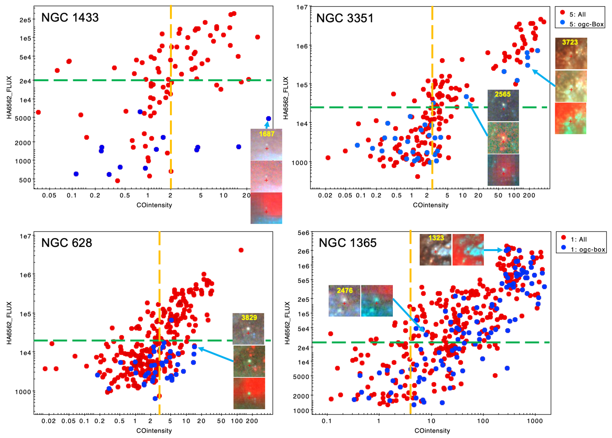
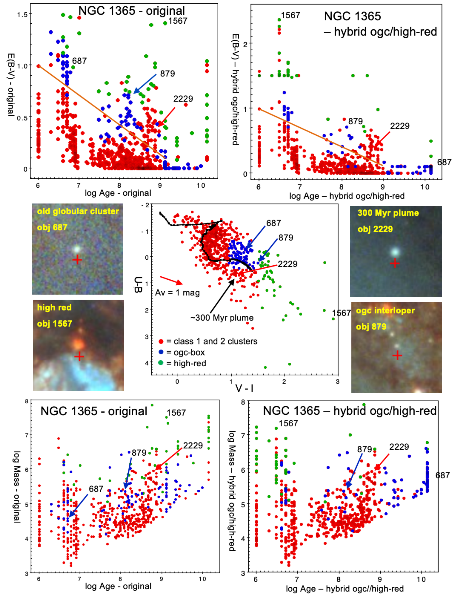
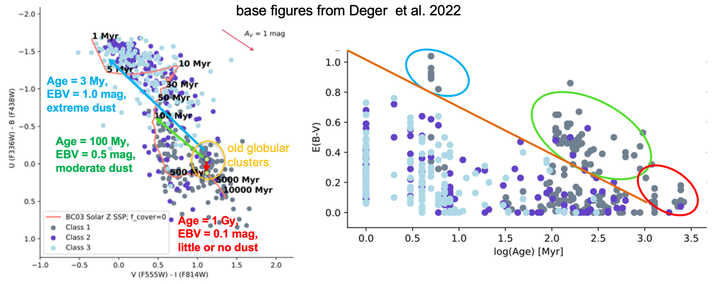

$\newcommand{\ensuremath}{}$
$\newcommand{\xspace}{}$
$\newcommand{\object}[1]{\texttt{#1}}$
$\newcommand{\farcs}{{.}''}$
$\newcommand{\farcm}{{.}'}$
$\newcommand{\arcsec}{''}$
$\newcommand{\arcmin}{'}$
$\newcommand{\ion}[2]{#1#2}$
$\newcommand{\textsc}[1]{\textrm{#1}}$
$\newcommand{\hl}[1]{\textrm{#1}}$
$\newcommand{\kms}{ km s^{-1}}$
$\newcommand{\bibtex}{\textsc{Bib}\!\TeX}$
$\newcommand{\ngal}{ 17 }$
$\newcommand{\lea}{\mathrel{<\kern-1.0em\lower0.9ex\hbox{\sim}}}$
$\newcommand{\gea}{\mathrel{>\kern-1.0em\lower0.9ex\hbox{\sim}}}$

$\newcommand{\ensuremath}{}$
$\newcommand{\xspace}{}$
$\newcommand{\object}[1]{\texttt{#1}}$
$\newcommand{\farcs}{{.}''}$
$\newcommand{\farcm}{{.}'}$
$\newcommand{\arcsec}{''}$
$\newcommand{\arcmin}{'}$
$\newcommand{\ion}[2]{#1#2}$
$\newcommand{\textsc}[1]{\textrm{#1}}$
$\newcommand{\hl}[1]{\textrm{#1}}$
$\newcommand{\kms}{ km s^{-1}}$
$\newcommand{\bibtex}{\textsc{Bib}\!\TeX}$
$\newcommand{\ngal}{ 17 }$
$\newcommand{\lea}{\mathrel{<\kern-1.0em\lower0.9ex\hbox{\sim}}}$
$\newcommand{\gea}{\mathrel{>\kern-1.0em\lower0.9ex\hbox{\sim}}}$

# Improving Star Cluster Age Estimates in PHANGS-HST Galaxies andthe Impact on Cluster Demographics in NGC 628

<mark>Appeared on: 2023-01-09</mark> - _27 pages, 17 figures (NOTE: 1, 5, 9, 12, 14 are lower resolution than in the journal)_

Bradley C. Whitmore, et al. -- incl., <mark><mark>Janice C. Lee</mark></mark>, <mark><mark>Frank Bigiel</mark></mark>, <mark><mark>Stephen Hannon</mark></mark>, <mark><mark>Kathryn Kreckel</mark></mark>, <mark><mark>Francesca Pinna</mark></mark>, <mark><mark>Eva Schinnerer</mark></mark>

**Abstract:** A long-standing problem when deriving the physical properties of stellar populationsis the degeneracy between age, reddening, and metallicity.When a single metallicity is usedfor all star clusters in a galaxy, this degeneracy can result in "catastrophic" errors for old globular clusters.Typically, approximately 10 -- 20 \% of all clusters detected in spiral galaxies can have ages that are incorrect by a factor of ten or more.In this paper we presenta pilot study for four galaxies (NGC 628, NGC 1433, NGC 1365, and NGC 3351) from the PHANGS-HST survey. We describemethods to correct the age-dating for old globular clusters, by first identifying candidatesusing their colors, and then reassigning ages and reddening  based on a lower metallicity  solution.We find that young `Interlopers' can be identified from their  H $\alpha$ flux. CO (2-1) intensity or the presence of dust can also be used, but our tests show that they do not work as well. Improvements in the success fraction are possible at the $\approx15$ \% level (reducing the fraction of catastrophic age-estimates from  between 13 - 21 \% to 3 - 8 \% ).A large fraction of the incorrectly age-dated globular clusters are systematically given ages around 100 Myr, polluting the  younger populations as well.Incorrectly age-dated globular clusters significantly impact the observed cluster age distribution in NGC 628, which affects the physical interpretation of cluster disruption in this galaxy.For NGC 1365, we also demonstrate how to fix a second major age-dating problem,where very dusty young clusters with $E(B-V)>1.5$ mag are assigned old, globular-cluster like ages.Finally, we note the discovery of a dense population of $\approx300$ Myr clusters around the central region of NGC 1365.and discuss how this results naturally from the dynamics in a barred galaxy.

**Figure 14. -** 
Measured   H$\alpha$ flux vs. CO intensity for the clusters in our four sample galaxies. In each panel, the green line shows where objects appear to be associated with  the faintest HII regions and the yellow lines shows the corresponding line for the CO flux of the same HII regions. These lines provide estimates of where the line should be set to determine whether an objects is an interloper, i.e., a young objects with enough dust that it has colors appropriate for an old globular cluster. Snapshots of various objects are included to illustrate various points in the text. The three snapshots are Hubble images using B-V-I  (top), B-V-H$\alpha$(middle) and B-V-CO (bottom) images. The units for  H$\alpha$ flux are  10$^{-18}$ erg/s/cm$^2$/pixel and for CO intensity are K km s$^{-1}$. (*fig:co_halpha_4plot*)

**Figure 12. -** Similar to Figure \ref{fig:7plot-n1433} for NGC 1365. The primary difference is that the hybrid OGC/high-red solution is shown rather than the OGC-box and VI-limit solutions. In addition, the OGC-box is smaller, and green points are used to show  the high-red clusters. See text for details.  (*fig:7plot-n1365*)

**Figure 6. -** Illustration of how the age/reddening/metallicity degeneracy (left panel) can lead to the incorrect age-dating of old globular clusters, resulting in positions above a diagonal line in the log Age - $E(B-V)$ diagram (right panel). Using figures from \citet{deger22} for 17 PHANGS galaxies as the base, the figure  shows how the mismatch between the location of the observations of old globular clusters (which have low metallicity)  and the pink SED track used for the prediction (solar metallicity) results in three different regions of poor fits, (i.e., $\approx$ 3 Myr shown by the blue arrow and oval, $\approx$ 100 Myr shown by the green arrow and oval, and $\approx$ 1 Gyr shown by the  red arrow and  oval), rather than the correct solution at the end of the SED track at around 10 Gyr (i.e., log Age = 4).   (*fig:degen*)

