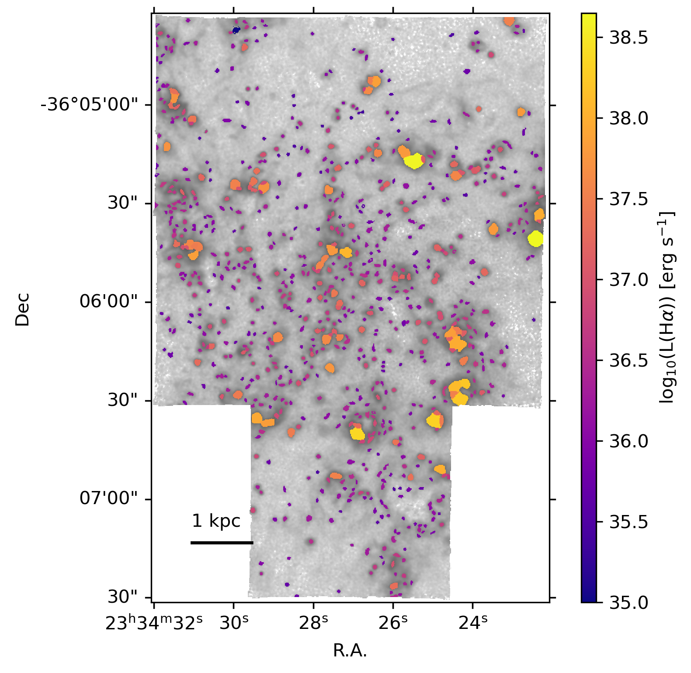

$\newcommand{\ensuremath}{}$
$\newcommand{\xspace}{}$
$\newcommand{\object}[1]{\texttt{#1}}$
$\newcommand{\farcs}{{.}''}$
$\newcommand{\farcm}{{.}'}$
$\newcommand{\arcsec}{''}$
$\newcommand{\arcmin}{'}$
$\newcommand{\ion}[2]{#1#2}$
$\newcommand{\textsc}[1]{\textrm{#1}}$
$\newcommand{\hl}[1]{\textrm{#1}}$
$\newcommand{\change}[1]{{\color{red}#1}}$
$\newcommand{\oiii}{[O \textsc{iii}]}$
$\newcommand{\nii}{[N \textsc{ii}]}$
$\newcommand{\sii}{[S \textsc{ii}]}$
$\newcommand{\oi}{[O \textsc{i}]}$
$\newcommand{\niion}{[N \textsc{i}]}$
$\newcommand{\hei}{[He \textsc{i}]}$
$\newcommand{\siii}{[S \textsc{iii}]}$
$\newcommand{\oii}{[O \textsc{ii}]}$
$\newcommand{\Mgb}{Mg\textit{b}}$
$\newcommand{\NaI}{Na \textsc{I}}$
$\newcommand{\hii}{H \textsc{ii}}$
$\newcommand{\ha}{\mbox{\rmn{H}\alpha}}$
$\newcommand{\hb}{\mbox{\rmn{H}\beta}}$
$\newcommand{\Rtwofive}{\mbox{R_25}}$
$\newcommand{\kms}{\mathrm{km s}^{-1}}$
$\newcommand{\re}{R_\mathrm{e}}$
$\newcommand{\Msun}{\mathrm{M}_{\sun}}$
$\newcommand{\Lsun}{\mathrm{L}_{\sun}}$
$\newcommand{\reff}{r_{\rm eff}}$
$\newcommand{\DAP}{{\tt DAP}}$
$\newcommand{\MAPS}{{\tt MAPS}}$
$\newcommand{\thebibliography}{\DeclareRobustCommand{\VAN}[3]{##3}\VANthebibliography}$

$\newcommand{$\ensuremath$}{}$
$\newcommand{$\xspace$}{}$
$\newcommand{$\object$}[1]{\texttt{#1}}$
$\newcommand{$\farcs$}{{.}''}$
$\newcommand{$\farcm$}{{.}'}$
$\newcommand{$\arcsec$}{''}$
$\newcommand{$\arcmin$}{'}$
$\newcommand{$\ion$}[2]{#1#2}$
$\newcommand{$\textsc$}[1]{\textrm{#1}}$
$\newcommand{$\hl$}[1]{\textrm{#1}}$
$\newcommand{$\change$}[1]{{\color{red}#1}}$
$\newcommand{$\oiii$}{[O $\textsc${iii}]}$
$\newcommand{$\nii$}{[N $\textsc${ii}]}$
$\newcommand{$\sii$}{[S $\textsc${ii}]}$
$\newcommand{$\oi$}{[O $\textsc${i}]}$
$\newcommand{$\nii$on}{[N $\textsc${i}]}$
$\newcommand{$\hei$}{[He $\textsc${i}]}$
$\newcommand{$\sii$i}{[S $\textsc${iii}]}$
$\newcommand{$\oi$i}{[O $\textsc${ii}]}$
$\newcommand{$\Mgb$}{Mg\textit{b}}$
$\newcommand{$\NaI$}{Na $\textsc${I}}$
$\newcommand{$\hii$}{H $\textsc${ii}}$
$\newcommand{$\ha$}{\mbox{\rmn{H}\alpha}}$
$\newcommand{$\hb$}{\mbox{\rmn{H}\beta}}$
$\newcommand{$\Rtwofive$}{\mbox{R_25}}$
$\newcommand{$\kms$}{\mathrm{km s}^{-1}}$
$\newcommand{$\re$}{R_\mathrm{e}}$
$\newcommand{$\Msun$}{\mathrm{M}_{\sun}}$
$\newcommand{$\Lsun$}{\mathrm{L}_{\sun}}$
$\newcommand{$\re$ff}{r_{\rm eff}}$
$\newcommand{$\DAP$}{{\tt DAP}}$
$\newcommand{$\MAPS$}{{\tt MAPS}}$
$\newcommand{$\thebibliography$}{\DeclareRobustCommand{\VAN}[3]{##3}\VANthebibliography}$

# The PHANGS--MUSE Nebular Catalogue

<mark>Appeared on: 2023-01-11</mark> - _27 pages, accepted by MNRAS_

B. Groves, et al. -- incl., <mark><mark>K. Kreckel</mark></mark>, <mark><mark>E. Schinnerer</mark></mark>

**Abstract:** Ionized nebulae provide critical insights into the conditions of the interstellar medium (ISM). Their bright emission lines enable the measurement of physical properties, such as the gas-phase metallicity, across galaxy disks and in distant galaxies. The PHANGS--MUSE survey has produced optical spectroscopic coverage of the central star-forming discs of 19 nearby main-sequence galaxies. Here, we use the$\ha$morphology from this data to identify 30,790 distinct nebulae, finding thousands of nebulae per galaxy. For each nebula, we extract emission line fluxes and, using diagnostic line ratios, identify the dominant excitation mechanism. A total of23,244 nebulae (75\%) are classified as$\hii$regions. The dust attenuation of every nebulae is characterised via the Balmer decrement and we use existing environmental masks to identify their large scale galactic environment (centre, bar, arm, interarm and disc). Using strong-line prescriptions, we measure the gas-phase oxygen abundances (metallicity) and ionization parameter for all$\hii$regions.  With this new catalogue, we measure the radial metallicity gradients and explore second order metallicity variations within each galaxy. By quantifying the global scatter in metallicity per galaxy, we find a weak negative correlation with global star formation rate and stronger negative correlation with global gas velocity dispersion (in both ionized and molecular gas). With this paper we release the full catalogue of strong line fluxes and derived properties, providing a rich database for a broad variety of ISM studies.

**Figure 12. -** The spatial distribution of nebulae in the galaxy IC5332. The background greyscale image shows the $\ha$ emission in log scale, and the colour of the nebulae indicates their intrinsic (dust corrected) $\ha$ luminosity. (*fig:atlas_IC5332*)

**Figure 8. -** Correlations between the global scatter in metallicity ($\sigma$(O/H)), after removing the first order radial gradient, as a function of galaxy integrated properties. In the top right of each plot we show the Pearson correlation coefficient of those quantities, $r$. The total stellar mass (M$_*$), total star formation rate (SFR), and gas fraction show weak or absent trends. More pronounced  correlations are seen with the ionized gas velocity dispersion, as measured across the full disc ($\sigma_{\rm H\alpha, disc}$) or just the $\hii$ regions ($\sigma_{\rm H\alpha, HII}$), as well as with the molecular gas velocity dispersion ($\sigma_{\rm CO}$).   (*fig:global_scatter*)

**Figure 3. -** A nebula spectrum from IC5332 (region ID 38, $L_{$\ha$}=10^{36.8}$ erg s$^{-1}$), showing a typical integrated spectrum (gold), including the underlying stellar (and weak nebula) continuum with clear strong emission and absorption lines (with the strong lines labelled) and visible residuals from the sky background subtraction. Overlaid is the resulting analysis pipeline fit from pPXF (blue dashed line), from which we extract the emission line fluxes and kinematics. The lower panel shows the relative residual of the spectral fit in indigo and relative spectral error in cyan ((Nebula-Fit)/Fit and error/fit, respectively). In the insert we show a zoom in of the $\ha$ and $\nii$ region, where the spectral lines can be seen more clearly. We also show the underlying continuum fit (dotted green line) revealing the underlying $\ha$$_{\rm abs}$ feature. (*fig:specfit*)

