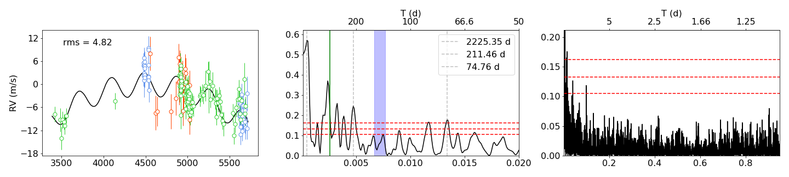
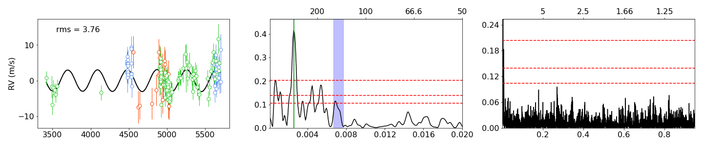
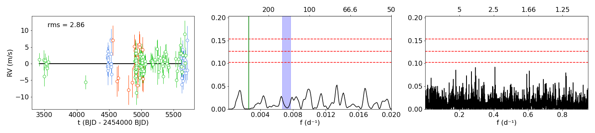
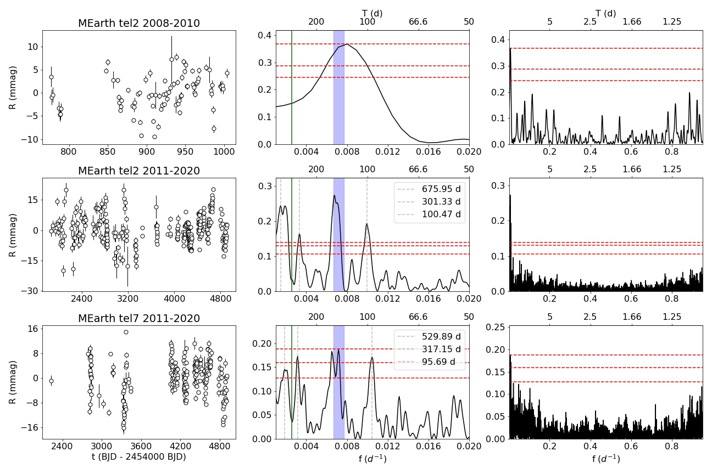
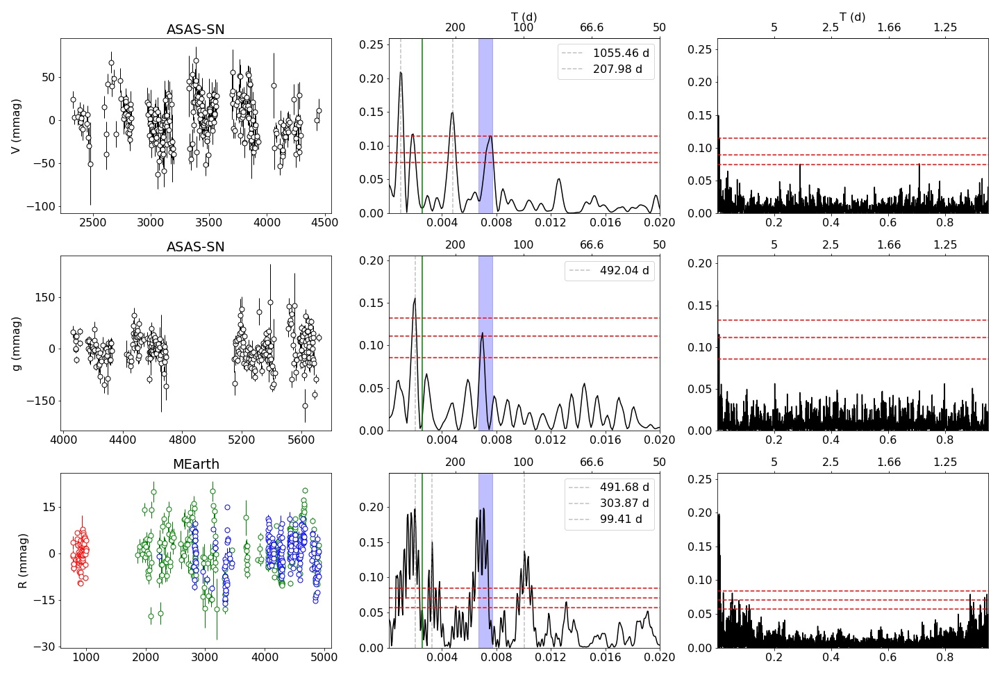
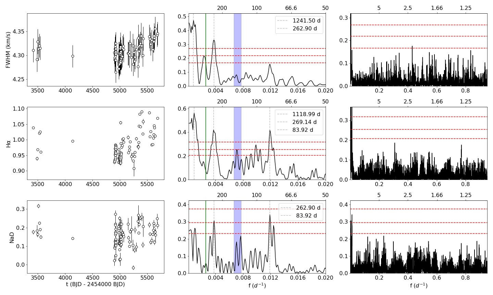

$\newcommand{\ensuremath}{}$
$\newcommand{\xspace}{}$
$\newcommand{\object}[1]{\texttt{#1}}$
$\newcommand{\farcs}{{.}''}$
$\newcommand{\farcm}{{.}'}$
$\newcommand{\arcsec}{''}$
$\newcommand{\arcmin}{'}$
$\newcommand{\ion}[2]{#1#2}$
$\newcommand{\textsc}[1]{\textrm{#1}}$
$\newcommand{\hl}[1]{\textrm{#1}}$
$\newcommand{\arraystretch}{1.0}$

$\newcommand{\ensuremath}{}$
$\newcommand{\xspace}{}$
$\newcommand{\object}[1]{\texttt{#1}}$
$\newcommand{\farcs}{{.}''}$
$\newcommand{\farcm}{{.}'}$
$\newcommand{\arcsec}{''}$
$\newcommand{\arcmin}{'}$
$\newcommand{\ion}[2]{#1#2}$
$\newcommand{\textsc}[1]{\textrm{#1}}$
$\newcommand{\hl}[1]{\textrm{#1}}$
$\newcommand{\arraystretch}{1.0}$

# The CARMENES search for exoplanets around M dwarfs

<mark>Appeared on: 2023-01-11</mark> - _18 pages, 11 figures. Accepted version, A&A (2023)_

J. Blanco-Pozo, et al. -- incl., <mark><mark>M. Pérez-Torres</mark></mark>, <mark><mark>E. L. Brown</mark></mark>, <mark><mark>M. Kürster</mark></mark>

**Abstract:** Detecting a planetary companion in a short-period orbit through radio emission from the interaction with its host star is a new prospect in exoplanet science. Recently, a tantalising signal was found  close to the low-mass stellar system GJ 1151 using LOFAR observations. We studied spectroscopic time-series data of GJ 1151 in order to search for planetary companions, investigate possible signatures of stellar magnetic activity, and to find possible explanations for the radio signal. We used the combined radial velocities measured from spectra acquired with the CARMENES, HARPS-N, and HPF instruments, extracted activity indices from those spectra in order to mitigate the impact of stellar magnetic activity on the data, and performed a detailed analysis of _ Gaia_ astrometry and all available photometric time series coming from the MEarth and ASAS-SN surveys. We found a M $>$ 10.6 M $_{\oplus}$ companion to GJ 1151 in a 390d orbit at a separation of 0.57 au. Evidence for a second modulation is also present; this could be due to long-term magnetic variability or a second (substellar) companion. The star shows episodes of elevated magnetic activity, one of which could be linked to the observed LOFAR radio emission. We show that it is highly unlikely that the detected GJ 1151 b, or any additional outer companion is the source of the detected signal. We cannot firmly rule out the suggested explanation of an undetected short-period planet that could be relatedto the radio emission,  as we establish an upper limit of 1.2 M $_{\oplus}$ for the minimum mass.

**Figure 7. -** RV time-series data (left panels) and periodograms (red dashed lines as the 0.1, 1, and 10\% FAP levels) of the best-fitting model consisting of a sinusoid and a parabola. The middle panels show the low-frequency portion of the periodograms ($P>50$ d) and we mark the rotational period at 140,  including its uncertainty of $\pm$10 d, with the blue vertical area, and the planetary period at 390 d with the green vertical line. In the right panel, the full periodogram is shown. In the top panels, we show the data as observed (green: CARMENES, red: HPF, blue: HARPS-N) and indicate the best-fitting model by the black curve. The middle row shows the RV residuals after the subtraction of the parabola. The bottom row shows the residuals of the best fit and we provide the RV rms. (*fig:best_models1*)

**Figure 8. -** Individual MEarth datasets separated according to observational season and telescope (left panels). We also show  their periodograms for longer periods ($>$50 days, middle panels) and the full periodograms (right panels). We mark the significant signals in grey, the period of our planet in green, and the rotational period of the star in blue, within the errors. The FAP levels of 10, 1, and 0.1\% are shown by the red dashed lines. (*prewhit1*)

**Figure 6. -** Photometric and spectral index time series. Significant signals are marked. We show the full dataset (left panels) and their periodograms for longer periods ($>$50 d, middle panels) and for all periods (right panels). The grey vertical dashed lines mark the significant peaks. We show the period of the planet  in green and the rotational period of the star at 140$\pm$10 d  in blue. For the combined MEarth data, we show the different individual sets in colours. The red dashed horizontal lines show the FAP levels of 10, 1, and 0.1\%. (*LS_indices*)

