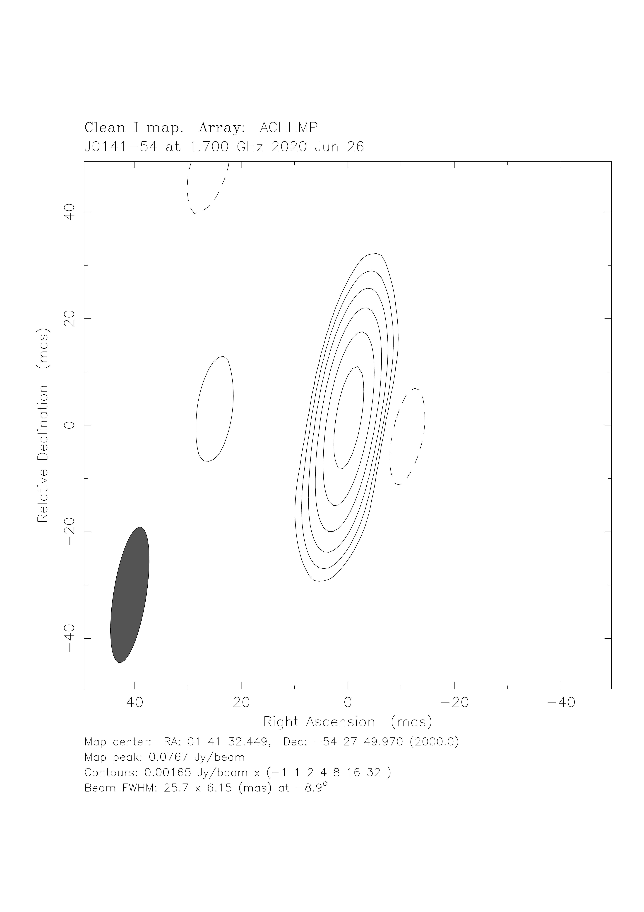
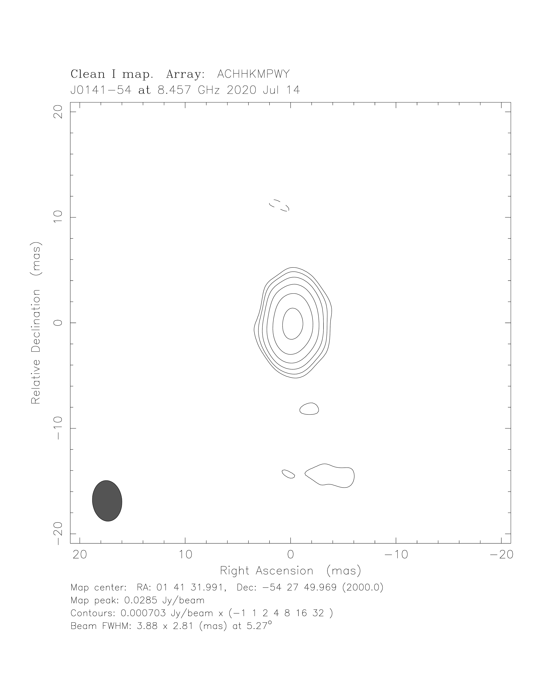
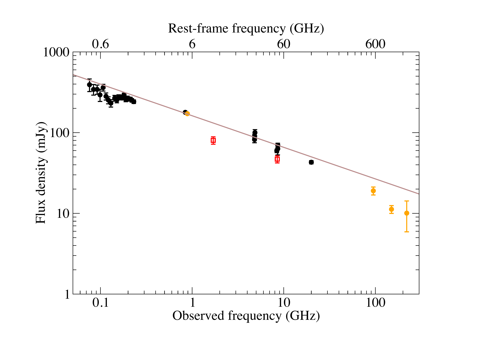

$\newcommand{\ensuremath}{}$
$\newcommand{\xspace}{}$
$\newcommand{\object}[1]{\texttt{#1}}$
$\newcommand{\farcs}{{.}''}$
$\newcommand{\farcm}{{.}'}$
$\newcommand{\arcsec}{''}$
$\newcommand{\arcmin}{'}$
$\newcommand{\ion}[2]{#1#2}$
$\newcommand{\textsc}[1]{\textrm{#1}}$
$\newcommand{\hl}[1]{\textrm{#1}}$
$\newcommand{\footnote}[1]{}$
$\newcommand{\}{natexlab}$

$\newcommand{\ensuremath}{}$
$\newcommand{\xspace}{}$
$\newcommand{\object}[1]{\texttt{#1}}$
$\newcommand{\farcs}{{.}''}$
$\newcommand{\farcm}{{.}'}$
$\newcommand{\arcsec}{''}$
$\newcommand{\arcmin}{'}$
$\newcommand{\ion}[2]{#1#2}$
$\newcommand{\textsc}[1]{\textrm{#1}}$
$\newcommand{\hl}[1]{\textrm{#1}}$
$\newcommand{\footnote}[1]{}$
$\newcommand{\}{natexlab}$

# Very long baseline interferometry observations of the high-redshift blazar candidate J0141$-$5427

<mark>Appeared on: 2023-01-11</mark> - _8 pages, 4 figures, accepted for publication in PASA_

K. É.~Gabányi, et al. -- incl., <mark>S.~Belladitta</mark>

**Abstract:** Active galactic nuclei (AGN) have been observed as far as redshift $z\sim7$ . They are crucial in investigating the early Universe as well as the growth of supermassive black holes at their centres. Radio-loud AGN with their jets seen at a small viewing angle are called blazars and show relativistic boosting of their emission. Thus, their apparently brighter jets are easier to detect in the high-redshift Universe.DES J014132.4 $-$ 542749.9 is a radio-luminous but X-ray weak blazar candidate at $z=5$ . We conducted high-resolution radio interferometric observations of this source with the Australian Long Baseline Array at $1.7$ and $8.5$ GHz. A single, compact radio emitting feature was detected at both frequencies with a flat radio spectrum. We derived the milliarcsecond-level accurate position of the object. The frequency dependence of its brightness temperature is similar to that of blazar sources observed at lower redshifts. Based on our observations, we can confirm its blazar nature. We compared its radio properties with those of two other similarly X-ray-weak and radio-bright AGN, and found that they show very different relativistic boosting characteristics.

**Figure 1. -** $1.7$-GHz naturally-weighted LBA map of the fringe-fitted data of J0141$-$5427. The peak intensity is $76.7\mathrm{ mJy beam}^{-1}$. The lowest contours are at $\pm1.7\mathrm{ mJy beam}^{-1}$, corresponding to $4\sigma$ image noise level. Further positive contours increase by a factor of $2$. The elliptical Gaussian restoring beam size is $25.7\mathrm{ mas}\times6.2\mathrm{ mas}$ at a major axis position angle of $-8.9^\circ$, and it is shown in the lower left corner of the image. (*fig:LBA_L*)

**Figure 2. -** $8.5$-GHz naturally-weighted phase-referenced LBA map of J0141$-$5427. The peak intensity is $28.5\mathrm{ mJy beam}^{-1}$. The lowest contours are at $\pm0.7\mathrm{ mJy beam}^{-1}$, corresponding to $4\sigma$ image noise level. Further positive contours increase by a factor of $2$. The elliptical Gaussian restoring beam size is $3.9\mathrm{ mas}\times2.8\mathrm{ mas}$ at a major axis position angle of $5.3^\circ$, and it is shown in the lower left corner of the image. (*fig:LBA_X*)

**Figure 3. -** Radio spectrum of J0141$-$5427. Black circles are low-resolution archival measurements \citep[for references, see][]{Belladitta_2019}. Orange circles are from the RACS DR1 \citep{racs1,racs2}, and from the SPT-SZ survey \citep{sptsz-cat}. Red squares are our LBA flux densities. The brown line represents a power-law fit to the low-resolution data (black and orange symbols). (*fig:spectrum*)

