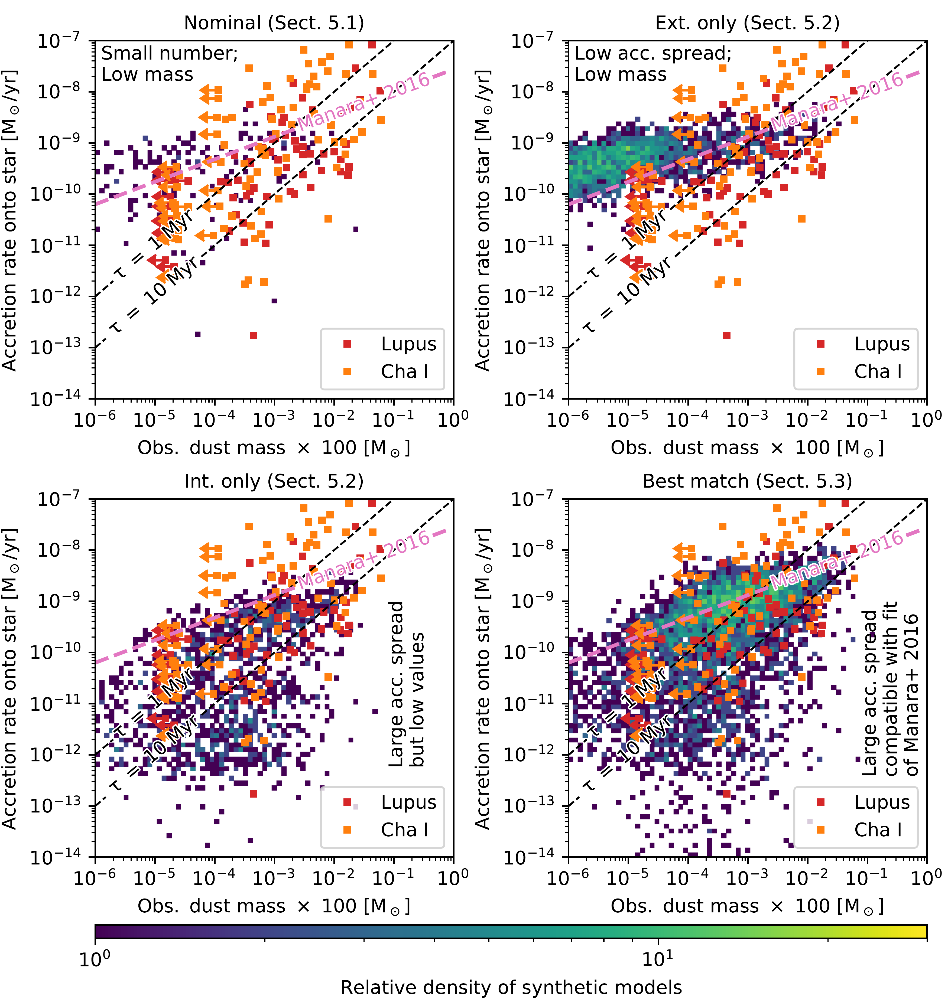
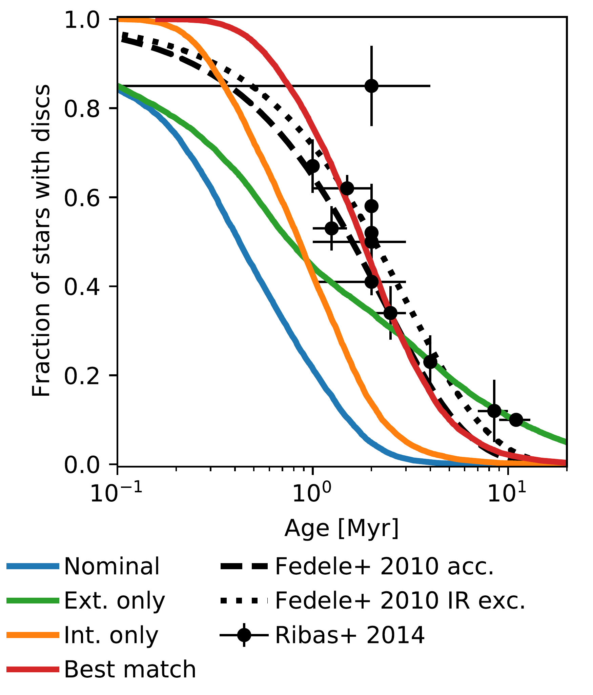
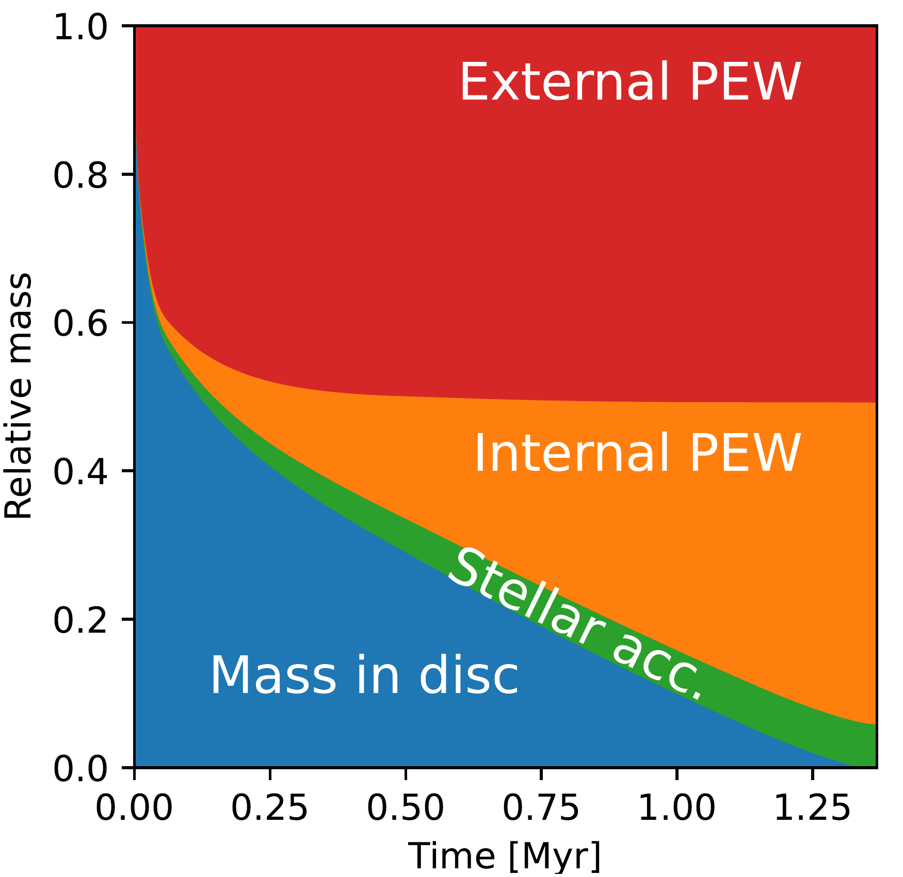

$\newcommand{\ensuremath}{}$
$\newcommand{\xspace}{}$
$\newcommand{\object}[1]{\texttt{#1}}$
$\newcommand{\farcs}{{.}''}$
$\newcommand{\farcm}{{.}'}$
$\newcommand{\arcsec}{''}$
$\newcommand{\arcmin}{'}$
$\newcommand{\ion}[2]{#1#2}$
$\newcommand{\textsc}[1]{\textrm{#1}}$
$\newcommand{\hl}[1]{\textrm{#1}}$
$\newcommand{\paperone}{\citetalias{2022AABurnA}}$
$\newcommand{\paperthree}{\citetalias{Disk3}}$
$\newcommand{\tabletv}{Table~3}$
$\newcommand{\tablets}{Table~4}$

$\newcommand{\ensuremath}{}$
$\newcommand{\xspace}{}$
$\newcommand{\object}[1]{\texttt{#1}}$
$\newcommand{\farcs}{{.}''}$
$\newcommand{\farcm}{{.}'}$
$\newcommand{\arcsec}{''}$
$\newcommand{\arcmin}{'}$
$\newcommand{\ion}[2]{#1#2}$
$\newcommand{\textsc}[1]{\textrm{#1}}$
$\newcommand{\hl}[1]{\textrm{#1}}$
$\newcommand{\paperone}{\citetalias{2022AABurnA}}$
$\newcommand{\paperthree}{\citetalias{Disk3}}$
$\newcommand{\tabletv}{Table~3}$
$\newcommand{\tablets}{Table~4}$

# Towards a population synthesis of discs and planets

<mark>Appeared on: 2023-01-11</mark> - _Accepted for publication in A&A; minor changes in the reference list_

Alexandre Emsenhuber, et al. -- incl., <mark>Remo Burn</mark>

**Abstract:** Aims. We want to find the distribution of initial conditions that bestreproduces disc observations at the population level. Methods. We first ran aparameter study using a 1D model that includes the viscous evolution of a gasdisc, dust, and pebbles, coupled with an emission model to compute themillimetre flux observable with ALMA. This was used to train a machine learningsurrogate model that can compute the relevant quantity for comparison withobservations in seconds. This surrogate model was used to perform parameterstudies and synthetic disc populations. Results. Performing a parameter study,we find that internal photoevaporation leads to a lower dependency of disclifetime on stellar mass than external photoevaporation. This dependence shouldbe investigated in the future. Performing population synthesis, we find thatunder the combined losses of internal and external photoevaporation, discs aretoo short lived. Conclusions. To match observational constraints, future modelsof disc evolution need to include one or a combination of the followingprocesses: infall of material to replenish the discs, shielding of the discfrom internal photoevaporation due to magnetically driven disc winds, andextinction of external high-energy radiation. Nevertheless, disc properties inlow-external-photoevaporation regions can be reproduced by having more massiveand compact discs. Here, the optimum values of the $\alpha$ viscosity parameterlie between $3\times10^{-4}$ and $10^{-3}$ and with internal photoevaporationbeing the main mode of disc dispersal.

**Figure 4. -** Histogram for stellar accretion rate vs. disc mass at \SI{2}{\mega\year} and the same synthetic disc populations shown in Fig. \ref{fig:dlt-pop-canon}. The observed data from the Lupus (in red) and Chamaeleon I (orange) star forming regions from \citet{2019AAManara} are shown for comparison. Two disc dispersal timescales $\tau=\dot{M}_\mathrm{G}/M_\mathrm{G}$ of \SI{1}{\mega\year} and \SI{10}{\mega\year}(assuming that the gas disc mass $M_\mathrm{G}$ is \num{100} times the observed dust mass) and the best fit to the data from \citet{2016AAManaraB} are shown as well. (*fig:mar-pop-canon*)

**Figure 1. -** Cumulative distribution of disc lifetimes for a population with canonical parameter distribution (see text). Two exponential decays following \citet{2010AAFedele} with a characteristic time of \SI{2.3}{\mega\year}(accretion) and \SI{3}{\mega\year}(infrared excess) and the results of \citet{2014AARibas} are shown as well. (*fig:dlt-pop-canon*)

**Figure 3. -** Evolution of the relative gas mass: in the disc (blue), accreted onto the star (green), and lost by internal (orange) or external (red) photoevaporation until disc dispersal at \SI{1.38}{\mega\year}. This represents a typical disc, with $M_\star=\SI{0.5}{\msol}$, $M_\mathrm{G}/M_\star=\num{0.1}$, $\beta=0.9$, $R_\mathrm{in}=\SI{0.1}{\au}$, $r_1=\SI{87.8}{\au}$, $\alpha=\num{1e-3}$, $L_\mathrm{X}=\SI{7.02e29}{\erg\per\second}$, and $F=\SI{10}{G_0}$. The parameters for the solid disc are irrelevant, as this shows only the gas component, except that we used $f_\mathrm{D/G}=\num{0.0149}$ to compute the solid mass needed to set the characteristic radius $r_1$. (*fig:typical*)

